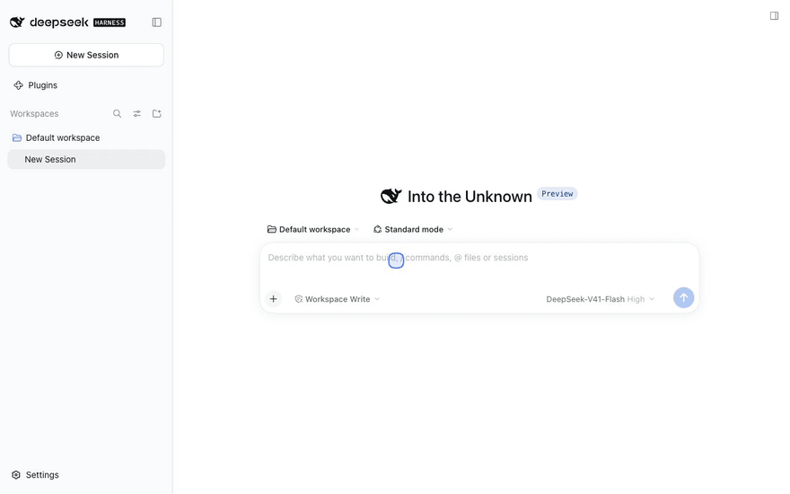
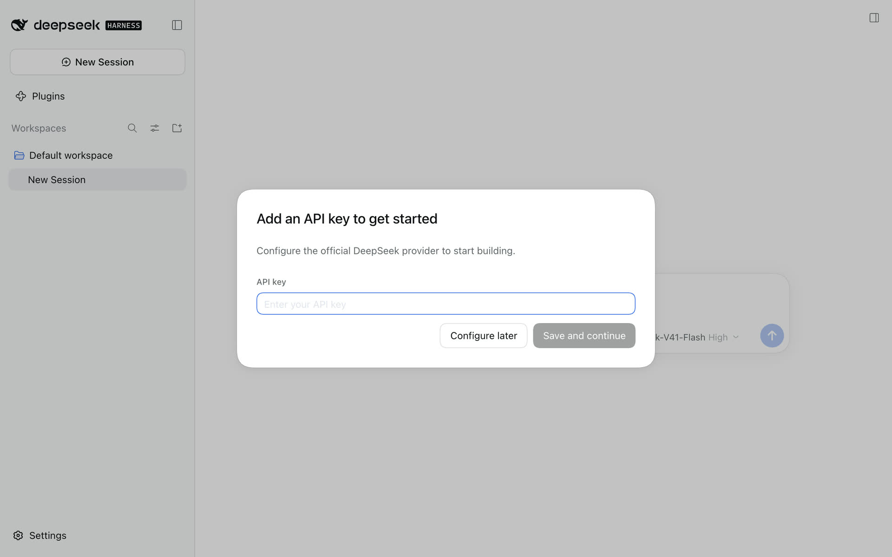
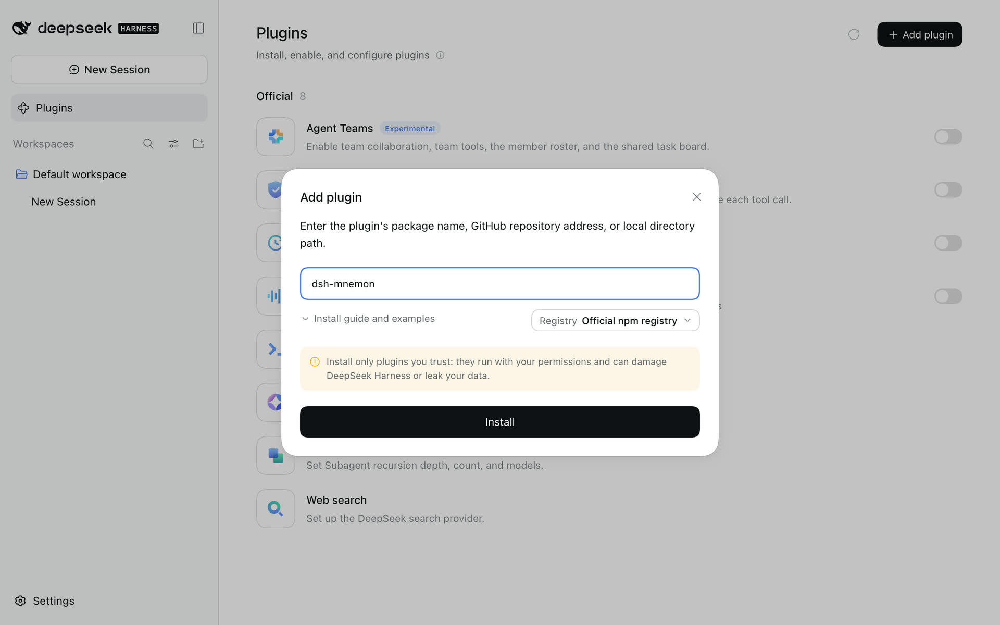
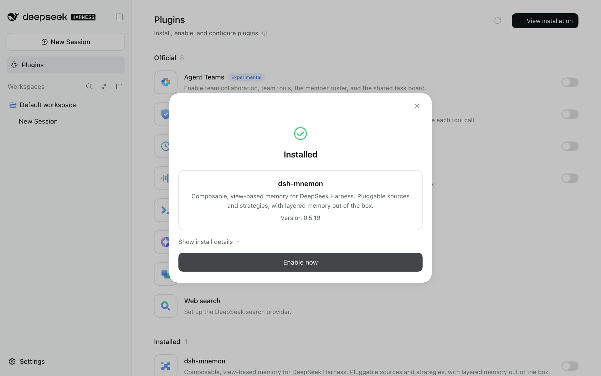
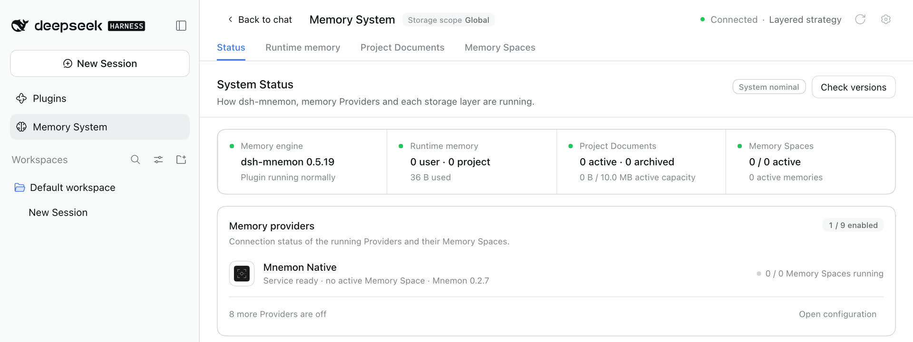
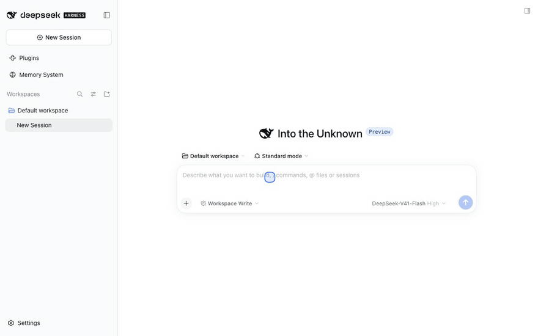
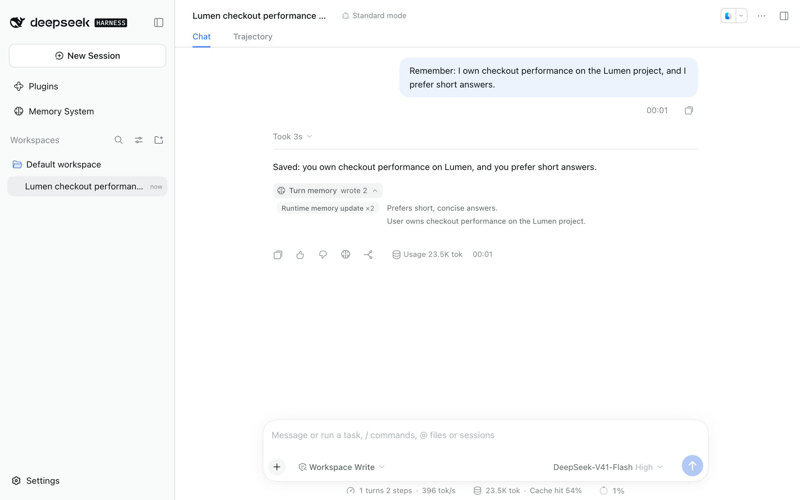
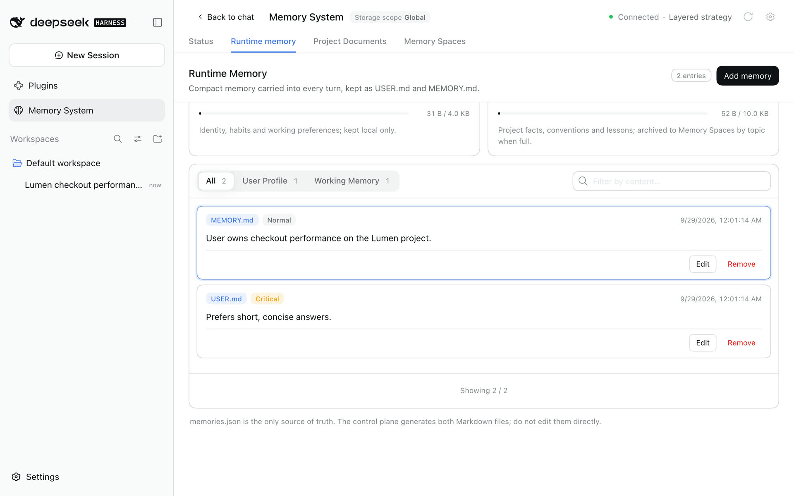
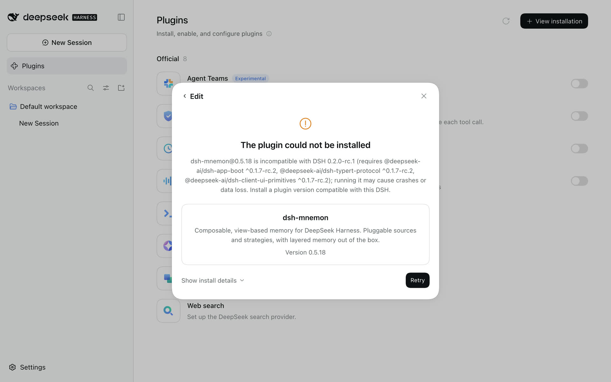
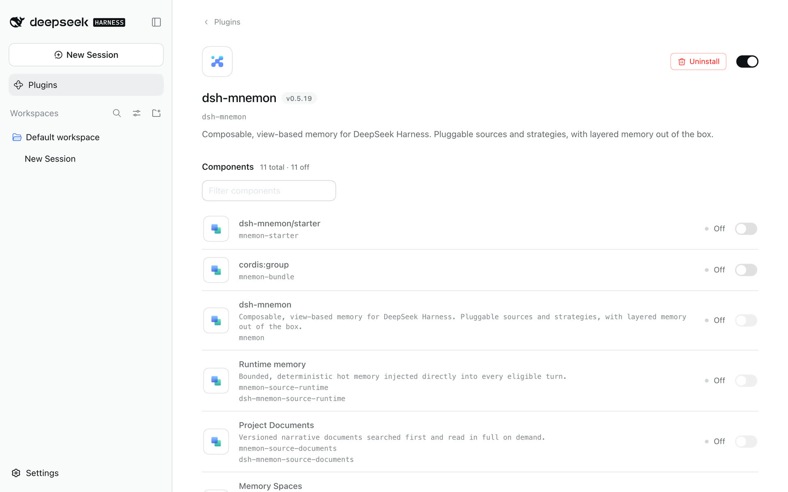

# Install and start

[简体中文](../../zh-CN/guides/installation.md) | **English** | [Documentation hub](../README.md)

This page is for your first time: it starts from a computer that has never run DeepSeek Harness (DSH), installs dsh-mnemon, and ends with a conversation that uses your first memory. It takes about ten minutes. Already using DSH? Skip to [step 3](#3-install-and-enable-dsh-mnemon).



The screenshots and recordings come from real DSH 0.2.0-rc.1 and dsh-mnemon 0.5.19; the [installation gallery](../../assets/install-v0.5.19/README.md) describes how they were captured.

## Choose how you use DSH

| Way | Suits | Where to install dsh-mnemon |
|---|---|---|
| **Web (recommended)** | Using DSH in a browser; the easiest start | **Plugins → Add plugin** in the web sidebar |
| **Desktop app** | You already have the DeepSeek Harness desktop app | **Plugins → Add plugin** in the app's sidebar; see [Desktop app](#6-desktop-app) |
| **Command line and Headless** | Servers, scripts and one-shot jobs | `dsh plugin --profile <name> add dsh-mnemon`; see [Command line and Headless](#7-command-line-and-headless) |

All three install the same dsh-mnemon. By default your memory lives in `~/.mnemon` on the computer, and the web page and the desktop app share it.

## 1. Get Node.js, pnpm and the Mnemon CLI

| Tool | What it is for | Needed |
|---|---|---|
| [Node.js](https://nodejs.org/) 22.19 or later (22 or 24 LTS recommended) | Runs DSH | Yes |
| pnpm | DSH calls it to install plugins; without it the Plugins page says pnpm was not found | Yes |
| Mnemon CLI | Mnemon Native, the default local storage for Memory Spaces, needs it; runtime memory and Project Documents do not | Recommended; you can add it later |

With Node.js installed, run these in a terminal (PowerShell on Windows):

```sh
node --version
npm install --global pnpm
npm install --global @mnemon-dev/mnemon@latest
mnemon --version
```

Both `--version` commands should print a version. Homebrew, Go and a manual Windows installation are covered in [Other ways to install the Mnemon CLI](#other-ways-to-install-the-mnemon-cli).

## 2. Start DSH

```sh
npx @deepseek-ai/dsh web
```

DSH starts at `http://127.0.0.1:3080` and opens a one-time link in your browser; the terminal prints the same link. Keep the terminal open while you use DSH, and press `Ctrl+C` to stop it.

- This runs the DSH release tagged `latest` on npm (0.1.7-rc.2 at the time of writing). For the DSH 0.2 preview, run `npx @deepseek-ai/dsh@next web` instead. dsh-mnemon supports both from 0.5.19.
- If you use DSH often, install it globally with `npm install --global @deepseek-ai/dsh` and then run `dsh web`; the [command line](#7-command-line-and-headless) needs the global `dsh` too.

The first time you open it:

1. DSH 0.2 shows a **Preview Notice** first. Click **Continue**.
2. In **Add an API key to get started**, paste an API key you created on the [DeepSeek Platform](https://platform.deepseek.com/) and click **Save and continue**. You can also click **Configure later** and add it in **Settings** afterwards; installing plugins needs no key, conversations do.

<p align="center"></p>

## 3. Install and enable dsh-mnemon

1. Click **Plugins** in the sidebar, then **Add plugin** in the top right corner.
2. Type `dsh-mnemon` and click **Install**. DSH picks the **Registry** on the right of the dialog: usually the **Official npm registry**, or the **Mainland China mirror** in mainland China. You rarely need to change it.
3. After a few seconds the dialog says **Installed** with the version. Click **Enable now**; DSH does not need a restart.
4. **Memory System** appears in the sidebar. That is it.

| Type the package name and install | Installed; enable it now |
|---|---|
|  |  |

If you prefer the command line, you can install with the command below and then start DSH as in step 2; if DSH is already running, restart it after installing:

```sh
npx @deepseek-ai/dsh plugin --profile web add dsh-mnemon
```

## 4. Check the installation

Click **Memory System**. It opens on **Status**:

- the header says **Connected · Layered strategy**;
- the **Memory engine** card shows `dsh-mnemon 0.5.19` or later;
- with the Mnemon CLI installed, Mnemon Native under **Memory Providers** reads "Service ready" with the CLI version. Without it, it reads "Mnemon CLI not found", and runtime memory and Project Documents work as usual.



## 5. Save your first memory

1. Click **New Session** and type something you want remembered, for example: `Remember: I own checkout performance on the Lumen project, and I prefer short answers.`
2. Under the reply, **Turn memory · wrote** appears; expand it to see the runtime memory this turn wrote.
3. Click an entry: the Memory System opens **Runtime memory** with that entry highlighted. Every later turn carries it.



| What this turn wrote | Where it lives |
|---|---|
|  |  |

The model decides the wording and where to write it, so your text may differ. Continue with [Getting started](./getting-started.md): Project Documents, Memory Spaces, and saving a reply with **Save to memory**.

## 6. Desktop app

The **Plugins** page of the DeepSeek Harness desktop app works like the web page: **Plugins → Add plugin → type `dsh-mnemon` → Install → Enable now**.

- The desktop app uses its own `desktop` profile. From DSH 0.2 the command line no longer manages that profile, so install and manage plugins on the app's Plugins page.
- Desktop windows load from the app's own `dsh-app://app/` address. dsh-mnemon 0.5.18 and earlier treated them as remote pages, which made the Memory System and the plugin settings read only ([#310](https://github.com/omdsh-dev/dsh-mnemon/issues/310)). 0.5.19 fixes this; update dsh-mnemon, with no configuration change.
- After updating dsh-mnemon in the desktop app, quit the app completely and open it again (`Cmd+Q` on macOS) so the new version loads. If an error appears after an update, see [Common problems](#common-problems).

## 7. Command line and Headless

With DSH installed globally, you can manage each profile's plugins from the command line:

```sh
npm install --global @deepseek-ai/dsh
dsh plugin --profile web add dsh-mnemon
dsh web
```

Profiles keep separate plugin lists. To give one-shot jobs memory too, install it into the Headless profile as well:

```sh
dsh plugin --profile headless add dsh-mnemon
dsh --profile headless "Check persistent project context before answering."
```

Upgrade and uninstall:

```sh
dsh plugin --profile web update dsh-mnemon
dsh plugin --profile web remove dsh-mnemon
```

Restart DSH after upgrading. For 24 hours after a release, pnpm 11 keeps `update` on the installed version; add the new version by name instead, for example `dsh plugin --profile web add dsh-mnemon@0.5.20`. Uninstalling removes the plugin, never your memory data. Development checkouts, cloud access and Headless details are in [Getting started](./getting-started.md#1-install-and-upgrade-from-the-command-line).

## Other ways to install the Mnemon CLI

Only Mnemon Native uses the Mnemon CLI. Install it on the machine that runs DSH. The npm command from step 1 is recommended on macOS, Linux and Windows (Node.js 22+); update it later with `mnemon update`, or use **Status → Check versions** when the page recognizes the owning npm installation. If migrating from Homebrew, Go, or a downloaded binary, put npm's global bin directory before the old command on PATH and update any `MNEMON_CLI_PATH` / `mnemon.cliPath` override. Restart DSH after changing its environment, then recheck the executable path on Status.

Homebrew Cask remains an alternative on macOS:

```sh
brew install --cask mnemon-dev/tap/mnemon
```

Go works on macOS and Linux:

```sh
go install github.com/mnemon-dev/mnemon@latest
```

For a manual installation on Windows, the official release provides ZIP archives for AMD64 and ARM64. The following PowerShell installs v0.2.9 under the auto-discovered per-user Programs directory and verifies it against the published checksum:

```powershell
$version = '0.2.9'
$arch = if ([System.Runtime.InteropServices.RuntimeInformation]::OSArchitecture -eq 'Arm64') { 'arm64' } else { 'amd64' }
$archiveName = "mnemon_${version}_windows_${arch}.zip"
$releaseBase = "https://github.com/mnemon-dev/mnemon/releases/download/v${version}"
$archive = Join-Path $env:TEMP $archiveName
$checksumFile = Join-Path $env:TEMP "mnemon_${version}_checksums.txt"
Invoke-WebRequest "${releaseBase}/${archiveName}" -OutFile $archive
Invoke-WebRequest "${releaseBase}/checksums.txt" -OutFile $checksumFile
$line = Get-Content $checksumFile | Where-Object { $_.EndsWith("  $archiveName") } | Select-Object -First 1
if (-not $line) { throw "Checksum entry not found for $archiveName" }
$expected = (($line -split '\s+')[0]).ToLowerInvariant()
$actual = (Get-FileHash -Path $archive -Algorithm SHA256).Hash.ToLowerInvariant()
if ($actual -ne $expected) { throw "Checksum mismatch for $archiveName" }
$installDir = Join-Path $env:LOCALAPPDATA 'Programs\mnemon'
New-Item -ItemType Directory -Force -Path $installDir | Out-Null
Expand-Archive -Path $archive -DestinationPath $installDir -Force
$mnemon = Join-Path $installDir 'mnemon.exe'
& $mnemon --version
```

Go remains an alternative on Windows when a Go toolchain is already available:

```powershell
go install github.com/mnemon-dev/mnemon@latest
$mnemonBin = go env GOBIN
if (-not $mnemonBin) {
  $mnemonBin = Join-Path (((go env GOPATH) -split ';')[0]) 'bin'
}
$mnemon = Join-Path $mnemonBin 'mnemon.exe'
& $mnemon --version
```

On Windows, dsh-mnemon discovers native `mnemon.exe` from `PATH`, an exported `GOBIN` or `GOPATH`, the default `%USERPROFILE%\go\bin`, `%LOCALAPPDATA%\Programs\mnemon`, and Program Files. The official npm `mnemon.cmd` launcher is also supported: dsh-mnemon validates its package and invokes its JavaScript entry with Node, without a shell. Other `.cmd` and `.bat` wrappers remain unsupported.

When DSH runs inside an Electron desktop main process, verified npm launchers run with `ELECTRON_RUN_AS_NODE=1` in the child process. This covers memory commands, version checks, and npm updates, while preserving saved embedding settings. The desktop application's own environment is unchanged. If the shell disables Electron's `runAsNode` fuse, point `mnemon.cliPath` at the platform's native Mnemon binary instead; see [Troubleshooting](./operations.md#troubleshooting).

If DSH still cannot find the binary, set `MNEMON_CLI_PATH`, or set `mnemon.cliPath` as a user setting rather than replacing the plugin's profile patch (see [Configuration](../reference/configuration.md)):

```yaml
mnemon:
  cliPath: 'C:\Users\alice\AppData\Local\Programs\mnemon\mnemon.exe'
```

`mnemon status` opens the effective Store and may initialize data or run upstream migrations, so it is not a side-effect-free installation probe.

## Common problems

### Installing says "dsh-mnemon@… is incompatible with DSH 0.2.0-rc.1"



Before DSH installs a plugin, and each time it starts, it checks which DSH versions the plugin declares support for. dsh-mnemon releases before 0.5.19 declare DSH 0.1.7 only, so DSH 0.2 refuses them.

- Check that npm has 0.5.19 or later: `npm view dsh-mnemon version`.
- For 24 hours after a release, pnpm does not pick the new version by default and installs an earlier one instead, which leads to this message. After two releases within a day it falls back further, for example to 0.5.17. DSH 0.1.7 accepts such an earlier release without a message, so check the version on Status. Click **Edit**, type the version as well, for example `dsh-mnemon@0.5.20` (use the version `npm view` shows), and click **Install**; on the command line, run `dsh plugin --profile web add dsh-mnemon@0.5.20`. Or retry after 24 hours.
- A versioned install pins the profile to that version. To upgrade later, run `dsh plugin --profile web update --latest dsh-mnemon` once the next release is a day old; within that day, add the new version by name the same way.
- Do not accept the risk for an older release with `allow-version` or similar: it really has not been verified on DSH 0.2.

### The Plugins page says pnpm was not found

Run `npm install --global pnpm`, then start DSH again from a new terminal so that DSH finds pnpm on PATH. On the command line the message is `pnpm was not found; install pnpm and make it available on PATH.`

### The registry cannot be reached

Click **Registry** on the right of the dialog, switch between the Official npm registry and the Mainland China mirror, and retry; on a company network you can enter a custom address.

### Status says "Mnemon CLI not found"

Install the CLI as in [step 1](#1-get-nodejs-pnpm-and-the-mnemon-cli) and restart DSH. DSH looks for `mnemon` on PATH and in common install directories; if it still cannot find it, set `mnemon.cliPath` as described in [Other ways to install the Mnemon CLI](#other-ways-to-install-the-mnemon-cli).

### The Memory System is read only when opened from another device

When DSH is opened from another device (for example through an address set up with `--trusted-host`), the Memory System is read only by default and says why. If you do need remote management, set `remoteAccess: trusted-host` and restart DSH as the [operations guide](./operations.md#remote-management) describes. Desktop app windows and a browser on the same computer are not remote pages.

### ERR_PACKAGE_PATH_NOT_EXPORTED after an update

If dsh-mnemon was updated while DSH was running (for example on the desktop app's Plugins page), enabling a component can then show:

```text
Error [ERR_PACKAGE_PATH_NOT_EXPORTED]: Package subpath './starter' is not defined by "exports" in …/node_modules/dsh-mnemon/package.json
```

The new version is installed, but the running DSH still loads it with the old version's package information, which lacks an entry point the new version added: `./starter` after an update from 0.5.17 or earlier, `./bundle` after an update from 0.5.18 or 0.5.19. After an update from 0.5.18 or 0.5.19 the message can instead read `mnemon-bundle (dsh-mnemon/bundle): pending (waiting for service: mnemonStarterReady)`, because the running DSH keeps the old component group. Either way, quit DSH completely and start it again: `Cmd+Q` for the desktop app on macOS, or `Ctrl+C` and then `dsh web` again on the command line.

On 0.5.18 or 0.5.19, do not turn off `dsh-mnemon/starter` to make the message go away; that leads to the next problem.

### DSH says "waiting for service: mnemonStarterReady"



DSH prints this in the terminal when it starts, or shows it when you enable the plugin:

```text
dsh: warning: 1 entry did not activate
mnemon-bundle (cordis:group): pending (waiting for service: mnemonStarterReady)
```

The sidebar has no **Memory System**, and every dsh-mnemon component on the Plugins page reads Off. `dsh-mnemon/starter` has been turned off: in 0.5.18 and 0.5.19 this separate row prepares dependency resolution before the memory components load, and the others wait for it.

- Open **Plugins → dsh-mnemon** and turn on the `dsh-mnemon/starter` row. The Memory System appears right away; if it does not, restart DSH.
- The desktop app treats this as a failed start and shows its plugin recovery page. Click **Remove this plugin and continue** (your memory data stays), and once the app is up, add dsh-mnemon again as in [step 3](#3-install-and-enable-dsh-mnemon). Reinstalling 0.5.18 or 0.5.19 keeps the switch off, because the profile saves it, so then turn it on as above.
- From 0.5.20 there is no separate switch: the group prepares dependency resolution itself, and a leftover setting for it is ignored. If the message names `dsh-mnemon/bundle`, DSH was updated to 0.5.20 without a restart and still runs the old group; quit DSH completely and start it again.

### Moving DSH to 0.2

First run `dsh plugin --profile web update dsh-mnemon` on your current DSH to get dsh-mnemon 0.5.19 or later, then upgrade DSH. Otherwise DSH 0.2 turns the incompatible older release off when it starts; your memory is untouched and comes back once the plugin is updated. See [Compatibility and upgrades](../reference/compatibility.md) for details.
