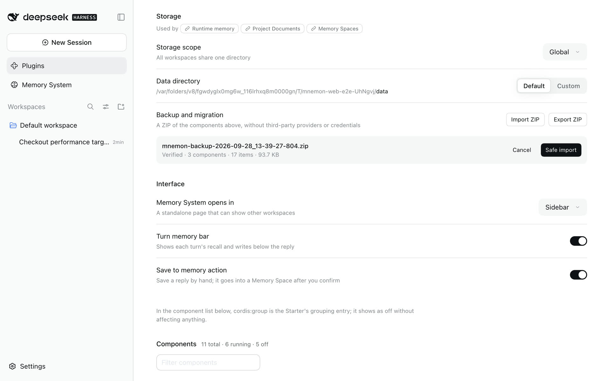

# Operations, security and troubleshooting

[简体中文](../../zh-CN/guides/operations.md) | **English** | [Documentation hub](../README.md)

## Health checks

Open **Status** in the Memory System. If you use Mnemon Native, also check its binary; the other Providers do not need it:

```sh
command -v mnemon
mnemon --version
```

Windows PowerShell:

```powershell
Get-Command mnemon -ErrorAction SilentlyContinue
Test-Path "$env:LOCALAPPDATA\Programs\mnemon\mnemon.exe"
```

```text
/mnemon status
```


Status shows the dsh-mnemon and Mnemon versions, one card per memory component, the Providers and the effective directories. `mnemon status` opens the effective Store and may initialize data or run upstream migrations, so it is not a completely side-effect-free probe.

If OpenViking reports `/api/v1/admin/*` access restrictions, configure **User key owner (skip admin)** (`discoveryUser`), the account identifier, endpoint and user API key on Memory Spaces' page under **Plugins → dsh-mnemon**. This verifies access to the selected memory root using the data API; a denied or missing root keeps the previous configuration. It does not prove write permission or change the identity bound to the key. Leave the field empty for admin discovery. See [Provider boundaries and downgrade steps](./memory-providers.md#operational-boundaries).

## Version checks and updates

**Check versions** on Status opens the version panel:

- **dsh-mnemon**: installed from the running package; updates from npm `latest`. An installed beta/alpha/rc also checks its own channel and can graduate to a newer stable version. Stable users never opt into prereleases automatically.
- **Mnemon CLI**: installed from `mnemon --version`; latest from the official `@mnemon-dev/mnemon` npm package. Only Mnemon Native needs it, so a missing CLI shows as optional with its install command.

Checking is read-only and never installs automatically. Update appears only when a newer version exists and the source is safely recognized. Mnemon supports the official npm launcher, Homebrew Cask / Formula, and `go install`; dsh-mnemon supports npm installations managed by pnpm in the owning DSH Profile. `link:` / `file:` development builds and unrecognized manual installs show guidance only.

npm updates require the active launcher to belong to the global root reported by the current npm. A different Node/npm installation or a broken launcher shows repair guidance instead. Use `npm install --global @mnemon-dev/mnemon@latest` to install or migrate, then `mnemon update` for later updates. The commands run on the DSH Host and need Node.js 22+. After changing PATH or a CLI override, recheck the executable path shown in the dialog.

On Windows desktop Hosts, memory operations and version checks use the native binary pinned by a recognized official Mnemon npm installation directly. This avoids the npm launcher's additional console window while retaining hidden subprocesses, timeouts, cancellation, and saved embedding settings. The displayed installation path and npm update ownership still refer to the original launcher. Unknown package layouts or missing native dependencies retain the launcher fallback and its repair diagnostics.

Expand dsh-mnemon's subpackage list to inspect Sources, Strategies, and Providers. Starter pins update with the Starter. Only independently installed packages in the owning Profile can update individually; source links are preserved. Package writes are serialized, and restart reminders survive subsequent checks and reopening the dialog. Read-only connections retain checks and command copying; page updates require management authority and `writeEnabled`.

Go updates additionally require the active executable to resolve to the current Go installation output (`GOBIN`, or the first `GOPATH` entry's `bin` directory), with no cross-compilation target. A downloaded binary is not a Go-managed installation merely because it contains Go build metadata. CLI updates must verify that the active executable actually reaches the checked release before reporting success.

The Host fixes update commands and arguments. The browser cannot supply either; shell is disabled and execution/output are bounded. A plugin update installs the exact checked version in its owning profile and verifies the installed package before reporting success; pinned beta versions cannot silently remain on an older release. After an update, the UI rechecks both components and refreshes Status automatically. Mnemon applies on the next CLI call. Restart `dsh web` after updating dsh-mnemon.

<a id="dsh-015-compatibility-and-legacy-session-recovery"></a>

## Legacy Session recovery

DSH `0.1.7-rc.2` and `0.2.0-rc.1` are the supported hosts; see the [compatibility matrix](../reference/compatibility.md). Restart the Web Profile after upgrading Mnemon: the Starter patch gives the owning `connection` entry both `webRuntime` and `webServer`. This restores all seven Mnemon RPC channels when **Memory System** or its configuration page previously returned HTTP 405. Custom profiles that install the Host without the Starter must apply the same dependency declaration to their connection entry, preserving any additional dependencies in their own composition. No DSH package source is changed; browser authentication and Mnemon grants still apply.

The separate error `source summary requires notice form; source v0 artifact remains unchanged` comes from older Mnemon messages in DSH Session logs. New recall/instruction messages omit that invalid summary. Updating the plugin does not rewrite an existing Session. To repair one affected log:

1. Stop the owning DSH process. Back up its entire Session storage root, including every generation, separately from a Mnemon Pack. Use the exact `raw log` path reported by DSH; do not search or rewrite unrelated sessions.
2. With the updated Mnemon package installed, preview the command below against a **backup copy**. Use Node `22.19+` or `24+` for `.jsonl.zstd`; plain `.jsonl` also works on Node 20.
3. Write to a new path outside the Session directory. Review `repairedMessages`, `repairedDescriptors`, `expandedToolChunkRows`, `expandedToolChunks`, the SHA-256 report and `blockers`. Preview counts describe candidate changes. Known unsupported shapes cause exit status 1; a requested copy has `mode: "refused"` and no output is published. Existing output files are rejected.
4. In a disposable copy of the Profile, replace only the affected `session.jsonl` or `session.jsonl.zstd` with the repaired copy, retaining the original backup. Let DSH load and resume it, then restart and verify the conversation. Repeat that explicit replacement in the stopped original Profile only after validating the copy. The command itself never replaces the input or a live Session.

```sh
dsh-mnemon-repair-session --input /backup/session.jsonl.zstd
dsh-mnemon-repair-session --input /backup/session.jsonl.zstd --output /backup/repaired-session.jsonl.zstd
```

The executable is installed with `dsh-mnemon`; a Profile-local installation can use `pnpm exec dsh-mnemon-repair-session` from that Profile. In a checkout use `node bin/repair-legacy-session.mjs`. The two stream normalizations below preserve IDs themselves; a proven identity recovery can also apply to the same log. The copy repair supports these audited historical shapes:

| Historical shape | Copy behavior |
|---|---|
| `dsh-mnemon` instructions summary `Optional memory recall and remember reminder`; recall summary `Memory View snapshot` or `Runtime memory snapshot` | Remove only that source's `summary` member. Other plugin messages and unfamiliar summaries remain untouched. |
| Exact historical subagent descriptor v2 with a composition accepted by the frozen v3 contract | Change only its version value to 3. Keep provider, model pair, persona, label and tool filters intact; add no defaults or reasoning effort. Extra fields, unpaired models and unsupported versions are refused. |
| Exact packed `tool-call-chunks` with string `id: ""` or `name: ""` | Expand to the original raw delta events, preserving IDs, name presence, argument strings, sequence numbers and timestamps. No chunk is dropped and provenance references need no renumbering. Already raw empty-string deltas remain byte-identical. |
| Exact raw or packed tool deltas with an own `name: null` member | Keep the member and change its value to `""`; expand packed rows with the same logical sequence and timing. IDs, arguments and durable messages remain intact. Both values leave assembly unchanged, and keeping the member preserves token timing. `normalizedToolChunkNames` counts affected logical deltas. |
| A completed `deepseek-official` stream recorded a unique nonempty provider ID before empty continuation IDs corrupted its durable tool chain | Restore that existing ID only after checking exact ordered chunk provenance, indexed block assembly, matching name/arguments and a unique call/result association. Preserve placeholders before the first candidate, message UUIDs, payloads and other plugin content. Independently proven multiple calls and text/reasoning blocks are supported. No ID is generated. |
| No recorded ID, conflicting identities, interruptions, unknown affected owner shapes or unaccounted approval/dispatch/plugin/copy references | Report blockers and refuse output. Arbitrary empty-ID histories and owner replay state need recovery by their original writer. |

The ID check uses the original stream's complete `sourceEventSeqs`, including packed logical members. Result provenance must select its exact call; if absent, only a unique single-call step with no other attempt qualifies. An explicit wrong reference never uses that fallback. Extra references through sequence numbers or message IDs are checked across step boundaries; ordinary compaction sequence references and unrelated plugins can remain unchanged. `recoveredToolIdentityChains` counts restored chains, `recoveredToolIdentityFields` counts logical identity slots, and `toolIdentityRecoveryRefusals` explains unsupported proofs with bounded location samples.

The tool accepts only v0, valid UTF-8 JSON records and complete ordinary Zstandard frames, with a 128 MiB limit on stored input, decoded input and expanded output. Malformed input, incomplete frames, ambiguous duplicate keys on transformed or identity-proof paths, and unsafe delta coordinates are refused without publishing output. Only the changed summary/version/name/identity members and expanded packed rows are rewritten; every other decoded byte is retained. Diagnostics count every known blocker and include at most ten line/event/path samples per class, without message bodies. `migrationValidated: false` is deliberate: this scanner does not recover unrelated corruption or guarantee that every Session can migrate. The installed official DSH loader and stream replay remain the final checks. See the [issue #251 contract audit and verification](../../pr-assets/issue-251-legacy-repair/README.md).

DSH migrates old Sessions to immutable v3 generations when opening for write. Mnemon Runtime, Documents and Memory Spaces retain their existing formats. To roll DSH back, restore the pre-upgrade Session backup in a separate old-version Profile; do not open v3 generations with an older DSH. See [verification and screenshots](../../pr-assets/issue-223-dsh-015/README.md).

## Backup and recovery

<a id="recommended-settings-zip"></a>

### Recommended: ZIP from the plugin page

**Storage → Backup and migration** on the `dsh-mnemon` page under **Plugins** operates on the **currently effective root**:

- **Export ZIP** includes Runtime, Documents, and every Mnemon Native Memory Space. Third-party connections, local external stores, and remote data are excluded.
- **Import ZIP** previews, validates, then merges into the effective root.
- Packs include `manifest.json`, SHA-256 inventory, and component summaries.
- Export/import hold component locks; a Memory Space with an uncheckpointed WAL is rejected.
- Import checks paths, counts, compressed/expanded limits, JSON schemas, Document hashes, registry consistency, and SQLite headers.
- Merge is staged before replacing component directories; commit failure restores pre-import directories.

The UI offers safe merge, not “overwrite everything”:

- Runtime deduplicates by target and content.
- Identical Document ID + hash is skipped; conflicting content receives a new ID.
- Identical Memory Space ID + database is skipped; conflicting content receives a new ID.

Import is governed by `writeEnabled` and is rejected in read-only deployments. A ZIP contains private memory—encrypt it, restrict access, and rehearse recovery. Provider credentials live in `state/memory-providers.json` with mode `0600`; they are excluded from ZIP. Saved credential values are not returned through management responses either. Protect the entire `state/` directory in the offline snapshot below if connections must be backed up.



### Recovery rehearsal

1. Under **Storage**, set **Data directory** to **Custom**, enter an isolated directory and apply.
2. Confirm the current read/write root on Status is that directory.
3. Select the backup under **Backup and migration**, review its preview, then import.
4. Check Runtime, Documents, Memory Spaces, and directories on Status.
5. Run one focused direct recall and read one Document.
6. Only after verification decide whether to switch a production scope.

Never restore directly into the only production root without another backup.

### Filesystem snapshot

To preserve reserved `state` or take an offline complete snapshot, stop every DSH / Mnemon process using the root and copy:

```text
<storageRoot>/runtime
<storageRoot>/documents
<storageRoot>/data
<storageRoot>/state    # when present; outside the built-in Pack's three data components
```

Generate an inventory or checksums and rehearse recovery in isolation. A normal directory copy while writers are running is not a consistent snapshot.

## Changing storage scope

Saving `global` / `workspace` / `custom` / `workspaces` initializes a new runtime graph before switching atomically. The page reloads automatically, but **data is not migrated**:

```text
old scope -- save --> new empty or existing root

no automatic copy
no automatic merge
no automatic delete
```

Recommended migration: export from the old scope → switch and confirm the new root → import → verify. In Workspace mode, confirm both inspection and execution targets.

With `workspaces`, back up the complete central directory for every workspace, or export a Pack for the selected workspace only. A renamed/moved workspace receives a new path hash; restoring its old data is an explicit operator action.


Existing turns and delegated child activations may still use the old runtime. Wait for them to finish or cancel them before moving or retiring its data. Parent completion alone does not release an asynchronous child's delegation; a newly created or cold-resumed activation captures its own authorized generation.

<a id="cloud-hosted-webui"></a>

## Cloud-hosted WebUI

DSH 0.1.7-rc.2 and 0.2.0-rc.1 are the supported registry targets. It authenticates the page, every RPC, and every stream through an authority-bound browser session created from the launch-token URL printed by the Host. `--trusted-host` remains a Host/Origin fence; it does not replace HTTPS or deployment access controls.

1. Terminate HTTPS at a reverse proxy or access gateway and protect the public entry for its intended users. Proxy the same-origin `/` and `/api` traffic, including streams, to `http://127.0.0.1:3080` while preserving the external `Host` authority.
2. Start the loopback service with the external authority. Use a bare `host[:port]`, not a URL:

   ```sh
   dsh web --trusted-host memory.example.com --no-open
   ```

   For a non-default public port, use the exact authority, for example `memory.example.com:8443`. DSH deliberately rejects `--host 0.0.0.0`; keep the service on loopback and let the proxy or an SSH tunnel reach it.
3. For a browser that does not already have a valid cookie for this public authority, use the launch-token URL printed as `dsh web: ...`. With a reverse proxy, replace only the printed loopback origin with the public HTTPS origin and preserve the `/` path and `?token=...` query. For example, transform `http://127.0.0.1:3080/?token=...` into `https://memory.example.com/?token=...`. Treat that URL as a credential and do not put it in logs, tickets, or chat. DSH exchanges it for an HttpOnly, SameSite cookie and redirects to a clean `/`; a still-valid authority-bound cookie can survive a Host restart.
4. Open the clean external URL and verify that **Status** and the `dsh-mnemon` page under **Plugins** both load and a page reload remains authenticated. Remote settings are read-only by default. If management is intended, apply the [explicit remote management grant](#remote-management), restart DSH, then verify one deliberate small save.

An HTTP 403 can indicate a Host/Origin mismatch or an old remote Client still using standalone channels: check `--trusted-host`, the public authority and proxy routing, then upgrade dsh-mnemon, restart DSH and reload the browser. Remote Mnemon calls use the authenticated API Gateway. An HTTP 401 requires restoring the Host's browser authentication or pairing. A response saying remote management requires `remoteAccess: trusted-host` is a separate Mnemon grant check; successful browser authentication alone does not authorize management.

### Disable the complete Starter

The legacy `mnemon` Entry remains the lifecycle switch for the complete Starter. To disable Mnemon without leaving its Source or Strategy Entries waiting on the missing Host service, add this profile patch and restart DSH:

```yaml
- id: mnemon
  disabled: true
```

This disables the Core/Host, all three bundled Sources, both main Strategies, and all three optional Strategy enhancements together. It does not remove installed packages or delete memory data. Remove the override, or change it to `false`, and restart DSH to enable the Starter again.

<a id="remote-management"></a>

### Remote management

For authenticated remote clients, `remoteAccess: trusted-host` grants management operations; remote reads and narrow activation do not need it. Without it, a remote page's Memory System and plugin settings say why they are read only. A browser on the same computer and DSH desktop windows are not remote clients and do not need it. Configure management only for the intended authenticated users. To run an older DSH, keep the Mnemon release verified with it and its pre-upgrade Session backup; see the [compatibility matrix](../reference/compatibility.md).

1. Open `~/.dsh/profiles/web/cordis.patch.yml`, or `$DSH_HOME/profiles/web/cordis.patch.yml` when `DSH_HOME` is set. Edit an existing top-level `- id: mnemon` entry instead of adding a duplicate. If the initialized file still ends in `[]`, replace that marker with the complete row below; otherwise append the row to the existing top-level YAML list:

   ```yaml
   - id: mnemon
     config:
       routingGuidance: true
       lifecycleEnabled: true
       recallMode: guided
       writebackMode: guided
       idleReviewMs: 30000
       tabEnabled: true
       writeEnabled: true
       remoteAccess: trusted-host
       timeoutMs: 10000
       defaultRecallLimit: 10
       embedding:
         enabled: false
         endpoint: http://localhost:11434
         model: nomic-embed-text
       recallQuality:
         policy: strict-v1
         lowScoreThreshold: 0.25
         highScoreThreshold: 0.6
         candidateMultiplier: 3
         maxMediumResults: 4
         maxUnknownResults: 2
   ```

   A profile patch replaces the targeted row's complete `config` instead of deep-merging one field. Preserve existing customizations, and compare it with `dsh web --dump-default-config` after a plugin upgrade so new bundled defaults are not masked.
2. Inspect the effective tree with `dsh web --dump-config`. Confirm that the final `mnemon` row contains `remoteAccess: trusted-host` and that stderr reports no unmatched `mnemon` target.
3. Start DSH with the same `--trusted-host` command, and restart after any `remoteAccess` change because Mnemon captures that policy at startup. Verify **Status**, settings loading, and one deliberate small save through the authenticated remote connection.

## Security boundaries

### Process

- CLI uses `spawn(command, args, { shell: false })`.
- stdout + stderr are capped at 2 MiB by default.
- Calls use `timeoutMs` and AbortSignal; cancellation sends `SIGTERM`, then `SIGKILL` after 1.5 seconds.
- One Runner serializes calls; separate DSH processes still rely on Mnemon / SQLite concurrency.

### Files

- Runtime, Documents, and Pack operations use in-process queues or component locks.
- Lock wait defaults to 5 seconds; stale threshold is 30 seconds.
- Writes use temporary files, staging, and rename.
- Runtime revisions block stale compaction; Document revisions block movement of updated originals.
- `sourcePaths` cannot escape the initiating workspace or point into managed Documents.

### Web and model

- DSH owns authentication or pairing for remote RPCs and streams. Mnemon's API Gateway projection additionally requires `remoteAccess: trusted-host` for management; local loopback clients and DSH desktop windows (`dsh-app://app/`) use their own channels.
- Provider catalogs and management responses are redacted; the UI receives configured field names, never saved credential values.
- The WebUI follows the Host's writable settings snapshot instead of inferring capability from transport locality; an unavailable settings channel renders an explicit diagnostic rather than an empty page.
- The WebUI neither reads SQLite, starts processes, calls remote providers, nor supplies arbitrary update commands; provider network access remains inside the Host.
- Workers use persona, tool allowlists, and `maxDepth: 1`. A stable result tool accepts only the current child's revocable request ID and validates each operation's result schema.
- Distillation and supervised writeback workers cannot call `mnemon_forget`. Idle review has only the create-only Documents tool for document writes, so it cannot replace user originals or archive documents to make room. These restrictions are enabled by default and do not require an enhancement plugin.
- Queries, candidates, Document bodies, and historical memory are treated as untrusted data.

These boundaries are not a secret scanner. There is no deterministic credential detection; never submit keys, tokens, private keys, or raw sensitive logs.

### Security reporting

Report vulnerabilities privately through [SECURITY.md](../../../SECURITY.md), not a public issue. Data loss, path traversal, lock/revision bypasses, subagent-isolation breaks, and injection through rendered memory are in scope.

## Troubleshooting

`mnemon.cliPath` accepts an explicit path or a command name resolved against the Host's PATH. If the binary is installed or restored into an existing search directory while DSH is running, choose **Refresh** in the Memory System header to update availability without restarting. Changes to the Host process's environment still require a restart. Status and version checks resolve the same configured command.

| Symptom | Check and resolution |
|---|---|
| Plugin details show the `mnemon-bundle` container row (named `dsh-mnemon/bundle` from 0.5.20, `cordis:group` before) as off, and its switch returns `unknown-plugin` | Known container-display issue in DSH `0.1.7-rc.2` (`0.2.0-rc.1` shows it as off too). Check **Memory System → Status** and the actual components; continue using Mnemon if they and memory operations work. Use the top-level bundle or `mnemon` core component switch for the composition; do not reset data or remove the group. See [cause, handling and fix boundaries](../reference/compatibility.md#dsh-017-bundle-component-list) and [upstream #649](https://github.com/dsh-external/issues/issues/649). |
| Terminal flashes when switching conversations on Windows | Update the Starter, or Runtime Source if independently installed, then restart the DSH Host. Runtime Git branch detection hides its console window; Git failures, timeouts and detached HEAD still fall back to an unfiltered Runtime view. |
| Mnemon unavailable | macOS/Linux: run `command -v mnemon`, `mnemon --version`. Windows PowerShell: run `Get-Command mnemon`, `Test-Path "$env:LOCALAPPDATA\Programs\mnemon\mnemon.exe"`. Set `MNEMON_CLI_PATH` or `mnemon.cliPath`, then restart |
| Electron desktop Host cannot run npm CLI scripts | Verified npm launchers use child-only `ELECTRON_RUN_AS_NODE=1`. If the desktop shell disables the [Electron `runAsNode` fuse](https://www.electronjs.org/docs/latest/tutorial/fuses#runasnode), this flag is ignored; set `mnemon.cliPath` to the official native binary (`mnemon.exe` on Windows). Automatic npm updates still require a Host that can run the JavaScript launcher |
| Headless Agent has no Mnemon tools | Plugins are profile-local. Run `dsh plugin --profile headless add dsh-mnemon`; a Web-profile installation does not carry over |
| Memory System entry missing | Check `tabEnabled=true`; `displayMode=sidebar` uses the sidebar, while `displayMode=builtin` uses the open conversation's tabs. For a local link run `pnpm run build`, then restart the profile |
| An old `buildin` preference opens a conversation tab | It is saved as `builtin`; choose **Sidebar** under **Interface** to keep the standalone entry. Memory scope and stored data are unchanged |
| Status healthy but recall empty | Check active spaces, storage scope, inspected root, effective session root, and query focus |
| Header reports misalignment | Confirm that the inspected workspace is intended. Workbench tasks execute there; conversation tools retain their own session scope |
| A setting appears unchanged | Switches and selectors apply at once; typed values need **Apply**. A failed write shows its reason beside the control and restores the saved value |
| Custom directory rejected | Use an absolute path, `~`, or `~/...` |
| `memoryBodyId is required...` | Active count is not exactly one; select a target explicitly |
| `memory space is not active for reading` | Activate it in Overview; inactive writes are allowed, reads are not |
| Provider error | Review needs guarded local child publication; use bounded `spawn` or opt-in `fork`. With DSH/Teams 0.1.7-rc.2, opt into `idleReview.agentTeams: scoped`; `pause` stays the default. Inspect partial-write receipts before retrying |
| Runtime replace exceeds capacity | Shorten it or organize first; automatic maintenance handles add overflow only |
| Document source path rejected | Keep it inside the session workspace and outside managed Documents |
| CLI timeout | Increase `timeoutMs`; large Stores may need more than 10 seconds for status or graph |
| Lock timeout | Check other writers; never delete a lock owned by a live process |
| ZIP export reports WAL busy | Wait for Memory Space writes to settle; do not bypass the uncheckpointed-WAL guard |
| ZIP import checksum/schema failure | The backup is damaged or incompatible; preserve the current root and never unzip over it manually |
| No Update button | Already current, remote check failed, or the source is link/manual; follow panel guidance |
| An authenticated remote page can read or activate a Memory Space but cannot save settings or perform other writes | Default management restriction; for intended remote management, preserve the current configuration, set `remoteAccess: trusted-host` locally, and restart DSH |
| In the DSH desktop app, runtime memory, Memory Spaces and the plugin settings are read only while agent tools still write | dsh-mnemon 0.5.18 and earlier treated desktop windows as remote pages ([#310](https://github.com/omdsh-dev/dsh-mnemon/issues/310)); update to 0.5.19 or later on the app's Plugins page, with no `remoteAccess` change |
| DSH 0.2 reports dsh-mnemon as incompatible when installing or starting | A release before 0.5.19 was installed; update dsh-mnemon, and within 24 hours of a release install the versioned package as [Install and start](./installation.md#common-problems) describes |
| After dsh-mnemon was updated while DSH ran, enabling a component reports `ERR_PACKAGE_PATH_NOT_EXPORTED` (`Package subpath './starter'` or `'./bundle'`) | The running process still loads with the old version's package information; quit DSH completely and start it again (`Cmd+Q` for the desktop app). On 0.5.18 or 0.5.19, do not turn off `dsh-mnemon/starter`; see [Install and start](./installation.md#err_package_path_not_exported-after-an-update) |
| `mnemon-bundle (cordis:group): pending (waiting for service: mnemonStarterReady)`, or the desktop app fails to start and shows its plugin recovery page | `dsh-mnemon/starter` of 0.5.18 or 0.5.19 is off; turn it on under **Plugins → dsh-mnemon**, or update to 0.5.20, which has no separate readiness switch. On the desktop app, remove the plugin from the recovery page and add dsh-mnemon again; see [Install and start](./installation.md#dsh-says-waiting-for-service-mnemonstarterready) |
| `mnemon-bundle (dsh-mnemon/bundle): pending (waiting for service: mnemonStarterReady)` right after an update | DSH was updated to 0.5.20 without a restart and still runs the old component group; quit DSH completely and start it again, as [Install and start](./installation.md#err_package_path_not_exported-after-an-update) describes |
| Mnemon RPC returns 401 after a DSH restart or authority change | Open the launch URL printed by `dsh web` so the one-time token can establish a fresh authority-bound browser cookie |

## Known limitations

### Feature read-only is not disk read-only

`writeEnabled=false` disables semantic mutation and Pack import, but startup may initialize/repair Runtime, Document search updates `lastAccessedAt`, and Mnemon reads may migrate a database.

### Shared Documents scope

`global` and `custom` can share one Document index across workspaces; records have no independent workspace-ownership field. `sourcePaths` are checked against the initiating cwd only when written.

### Cross-system transactions

Cold-index-first protects active content but is not a rollback-capable distributed transaction across Mnemon SQLite and the filesystem. A revision conflict after indexing may leave a duplicate reference; the system preserves data.

### Background watermark

Activity score, latest checkpoint, and retry state are not persisted. Host restart clears unprocessed activity. Failure backoff, circuit breaking, and manual retry are not implemented yet.

### Versions and internationalization

DSH 0.1.7-rc.2 and 0.2.0-rc.1 are supported; see the [compatibility matrix](../reference/compatibility.md). The Web interface is bilingual, while commands, tool cards, compatibility metadata and some errors remain partly untranslated.

## Document archive recovery

Document archive no longer asks the worker to number remember/recall receipts. If an older attempt left a cold index while the document stayed active, retrying can reuse an index whose exact path and content hash match the current revision. Updated documents need a matching new revision index. Providers with asynchronous extraction or no safe forget are rejected before indexing. A cleanup failure names the destination and newly created id; keep existing data until the outcome is established.

## Runtime archive recovery

Capacity archival requires an active Memory Space whose Provider supports exact writes and safe forget. Asynchronous extraction targets, including Hindsight, are excluded before any archive write. If no eligible target remains, activate a suitable space or increase `runtimeMemory.memoryLimitBytes`; the rejected mutation and existing hot entries stay unchanged. Direct Provider writes retain their existing asynchronous behavior.

Conversation archival uses the selected Source's write scope: known spaces activated during the turn and spaces created by that View can receive the archive. A space created elsewhere after the View was pinned requires a new turn. An empty scope never grants access to every space. Destination errors distinguish an empty directory, an empty or excluding View scope, and unsupported Provider capabilities, and report the catalog, authorized and writable counts. The pending add has not been saved on failure; retry the same tool input in a new turn after correcting the reported cause. Existing hot entries are preserved.

If an archive receipt or local commit fails, the Host attempts to forget only entries proven newly created by this attempt. Skipped or reused entries are preserved. A changed or unreadable Runtime revision after a commit error is treated as uncertain: archive entries are retained to avoid losing committed memory. Cleanup errors identify the remaining destination and item ids. A Provider request that fails without receipts may have an unknown remote outcome, so this is not a distributed transaction; inspect that Provider before retrying.
