# UI guide

[简体中文](../../zh-CN/guides/ui-guide.md) | **English** | [Documentation hub](../README.md)

You meet dsh-mnemon in three places. The conversation shows what each turn read and wrote, and lets you save a reply to memory. The **Memory System** is where you browse, search and edit what is stored. The `dsh-mnemon` page under **Plugins** is where you compose memory and change settings.

| Where | What you do there | How to open it |
|---|---|---|
| [In a conversation](#in-a-conversation) | See the memory a reply read and wrote, and open it in one click; save a reply to memory | Under each finished reply |
| [The Memory System](#the-memory-system) | Check status; browse, search and edit runtime memory, documents and memory spaces | **Memory System** in the sidebar, or a session tab |
| [On the Plugins page](#on-the-plugins-page) | Choose strategies and enhancements; set up components, storage and the interface | **Plugins → dsh-mnemon** (可组合记忆), or the gear in the Memory System header |

The recordings and screenshots come from the [v0.5.19 gallery](../../assets/webui-v0.5.19/README.md): a real WebUI in light appearance with a seeded, fictional project, Lumen. The live DeepSeek model wrote every answer, write and receipt; waits for the model play at 4x or 6x, marked in the lower right corner.

Two rules hold everywhere. **Switches and selectors apply as soon as you change them**; if a write fails, the control shows the saved value again next to the reason. **Typed values wait for their group's Apply**, which appears once something changed, together with a note on what applying will do.

## In a conversation

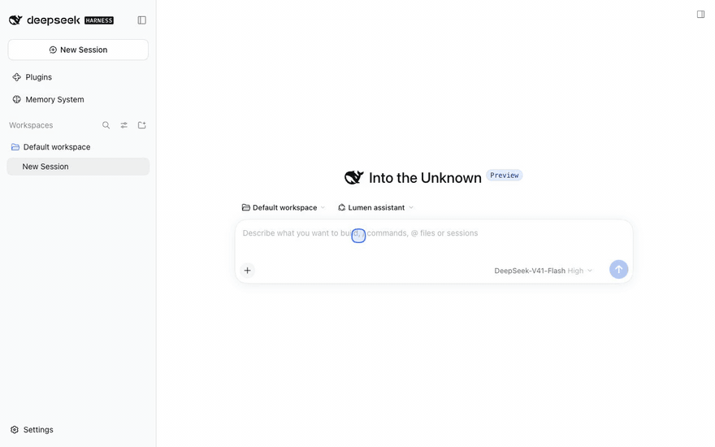

### Turn memory bar

A reply that used memory ends with a **Turn memory** line: the Memory System's brain mark, then how many recalls, document searches and writes the turn made. Expanded, it has one row per tool. On the left, the tool says in plain words what it did, such as **Document search** or **Memory Spaces recall ×2**; hover to see the tool's own name. On the right are the items it read or wrote.

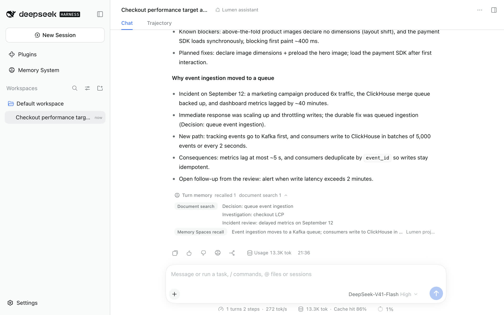

- Select a tool to open its page in the Memory System.
- Select an item to open it where it lives: a document is selected in **Project Documents**; a memory runs as a query on the **Recall** page; a runtime entry is highlighted and scrolled to in **Runtime memory**.
- Each tool lists up to three items and counts the rest; an item known only by its id stays out. On a phone, the items sit below their tool.
- Turns without memory activity show no bar.

When you correct a fact, the Agent replaces the runtime memory entry and the bar reports the write; select it to see the replaced entry. Here the Agent also brought the checkout investigation up to date, so the bar lists two writes. [Watch the correction](../../assets/webui-v0.5.19/en/correct.mp4).

| A correction and its writes | Its runtime item opens the entry, highlighted |
|---|---|
| 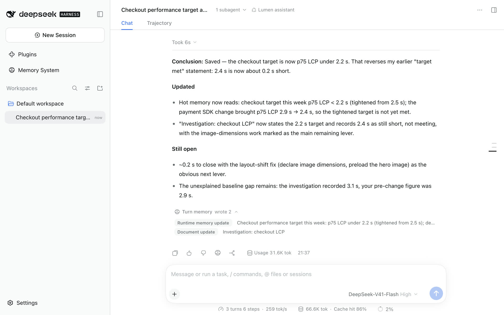 |  |

Temporary progress, guesses and secrets are not written.

### Save to memory

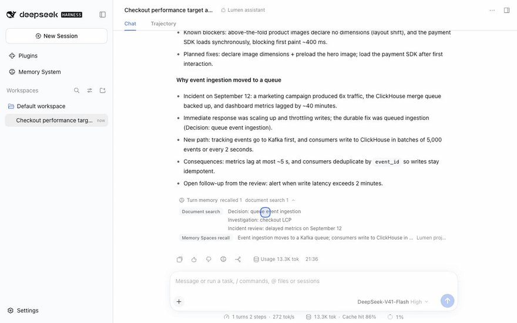

Each finished reply has a brain-shaped **Save to memory** in its action strip, the same mark as the Memory System; the database icon beside it is DSH's usage, not memory. Selecting it reads that reply and opens a dialog:

- The title is **Save to memory**, with one line on what the task Agent does. **Task Agent ready** means you can send.
- **Candidate (editable)** starts with the whole reply; usually you keep only the sentence worth remembering. **Cancel** changes nothing.
- **Send to task Agent** hands it to an independent task Agent, which decides whether it is worth keeping, picks the right Memory Space, removes duplicates, distils and writes, outside the conversation.
- A receipt follows: the outcome (**Saved**, **Updated**, **Submitted; the Provider confirms later**, **Skipped**, **Partly saved**, **Not finished** or **Failed**), the task Agent's summary of where it went, in the candidate's language, and **View in Memory Spaces**. **Cancel** becomes **Close**, and sending again needs an edit to the candidate.

| Edit the candidate | The task Agent's receipt |
|---|---|
| 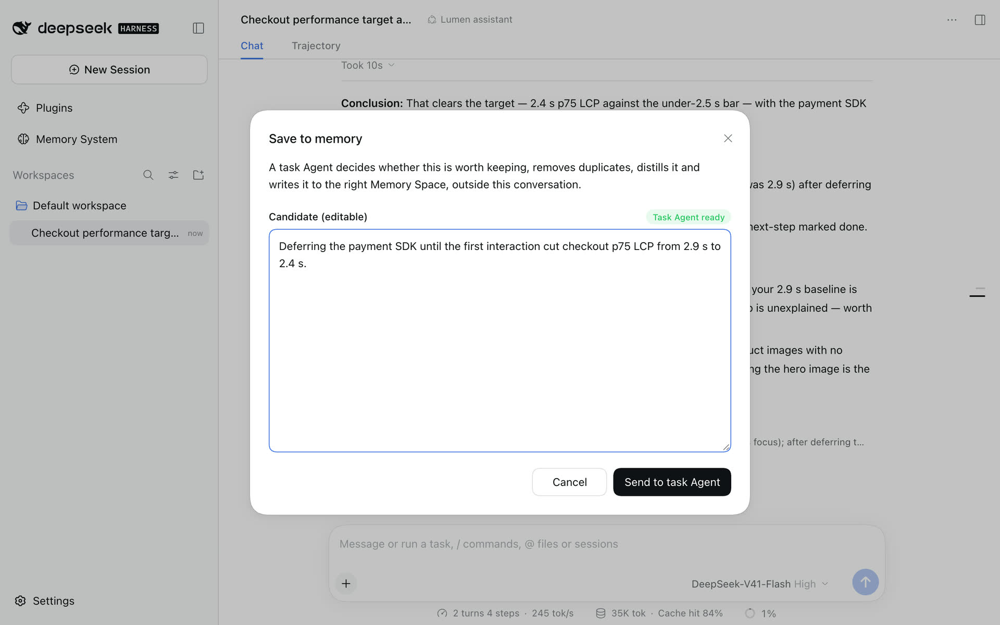 | 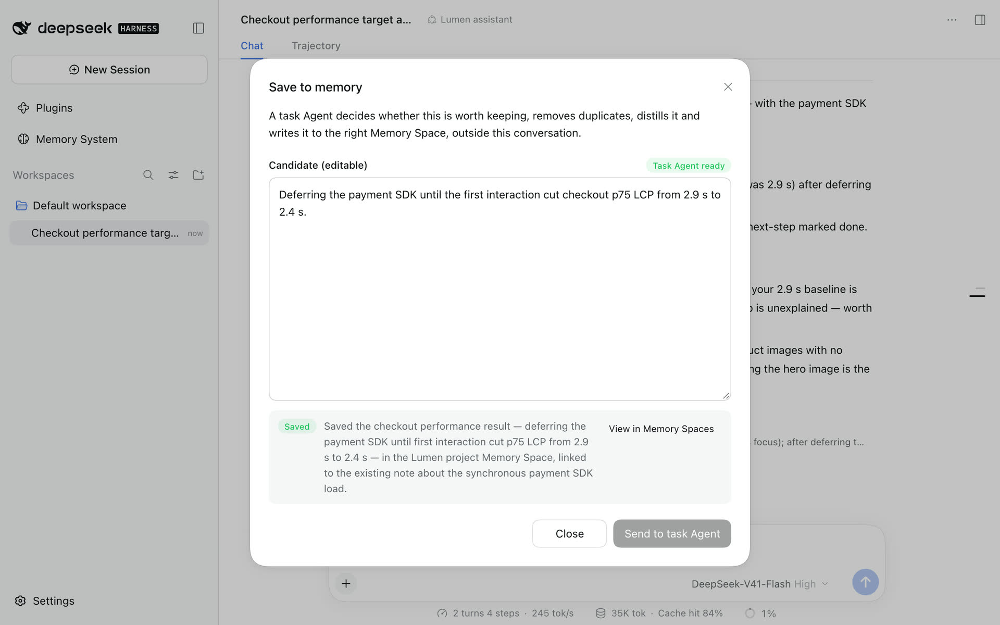 |

**Save to memory** at the top of Memory Spaces opens the same dialog. The turn memory bar and the Save to memory button are on by default and can be turned off under [Interface](#interface). In the conversation-tab placement, these entries open the Memory System tab of the conversation they came from; with several eligible tabs in split panes, open the intended one yourself.

## The Memory System

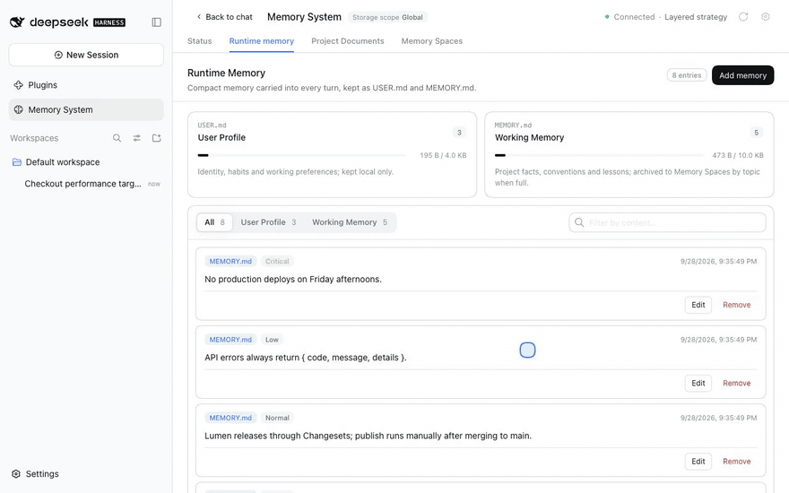

The Memory System has four pages, named by the components that provide them: **Status**, **Runtime memory**, **Project Documents** and **Memory Spaces**. An installed Source adds its own page the same way. The header shows the connection and the composing main strategy, for example *Connected · Layered strategy*, the storage scope, **Refresh** and a gear that opens the Plugins page. **Refresh** reloads the open page, so pages carry no refresh or sync buttons of their own.

By default the Memory System is a sidebar entry that keeps its page when you come back. Opened from a turn's item, a page lands on that item; a tab in the header opens the page fresh. Under **Interface → Memory System opens in**, choose **Conversation tab** to open it inside a conversation instead; the pages are the same. **Back to chat** and Escape return to the conversation.

### Status


The top row has one card per component: the engine with its version, then each Source with what it holds. **Memory providers** lists only the running Providers with their spaces' connection state and sums up the rest in one line, *N more Providers are off*, with **Open configuration** beside it; the storage areas follow. Regions load independently; one failure never hides the rest.

A notice with **Open configuration** appears only when memory needs attention:

- **Memory not in use**: no main strategy runs, so conversations continue without memory.
- **The selected main strategy is not running**: another strategy composes memory for now.
- **The latest component change did not take effect**: the previous composition keeps serving.

**Check versions** is read-only. It tells whether the Mnemon CLI is missing, current or out of date, with the npm command to copy, and lists each subpackage's installed, published and pinned version. Restart `dsh web` after updating packages.

### Runtime memory

Runtime memory is the compact context injected into every turn. **User profile** (`USER.md`) holds who you are, your preferences and collaboration rules. **Working memory** (`MEMORY.md`) holds project facts, environment, decisions and lessons. Each card shows its size against its limit. Opened from a turn, the entry that turn wrote carries a highlighted border; see [the correction above](#turn-memory-bar).

- Entries are newest first, with filters for target and text. Editing an older entry keeps its place. **Add memory** opens the dialog for a new runtime entry.
- Keep entries short, independent and repeatedly useful; temporary progress and raw logs do not belong here.
- A working-memory entry can be limited to git branches. It is then injected only while the session's workspace is on one of them; the page and the files on disk are unaffected.
- When working memory reaches its limit, the Host archives the oldest entries into a memory space before adding the new one.

<details>
<summary>Editing, capacity and branch details</summary>

Edit and Remove match an entry's full content within its target, so a short entry such as `X` can change without touching `EGO_LINUX_CHROME`. Identical entries in one target are ambiguous and are rejected without changing data.

Capacity archiving moves the exact original entries. If a routing batch fails or returns an invalid proposal, that batch goes to the eligible default memory space, or the first eligible one, and the summary records why. Spaces created or activated during the current turn can receive the archive once they are active and support it. If no destination works, existing entries stay intact and the pending add is not saved; retry it after fixing the cause.

When the Agent writes the user profile, `branches` must be omitted or empty. For working memory, `branches: []` on replace clears the scope; omitting it keeps the scope. The model-facing snapshot adds each entry's importance and age in days for the new turn; stored text is unchanged. See [projection format and limits](../reference/storage-model.md#source-of-truth-and-projections).

</details>

### Project Documents

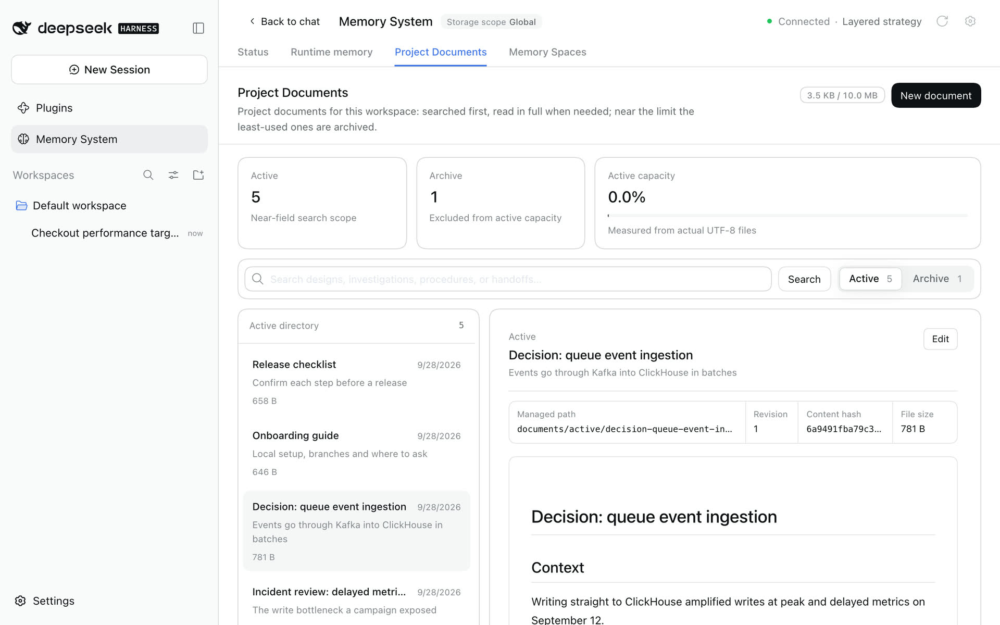

Documents hold complete narratives: designs, investigations, procedures and handoffs. Select a DSH workspace first; documents belong to a workspace even when storage is global.

- Switch between **Active** and **Archived**. The reader keeps the title, retrieval description, provenance, revision, hash, size and full Markdown.
- Search matches the title, description and body. Lists are newest first; updating an older document does not move it.
- Source files in your project are never modified; a document is a managed copy.
- Archiving indexes the document in a memory space before moving the original, so the cold copy stays findable. The destination must be active and support exact writes and safe forget.

<details>
<summary>Archiving and background review details</summary>

For an explicit archive or capacity maintenance, an independent task Agent without memory tools proposes a summary and one eligible memory space. The Host validates it, adds the exact cold path and content hash, writes the index and records lineage before moving the original. An invalid proposal changes nothing. If the move fails, the Host removes only the index it just created; existing verified indexes are reused and never deleted. If cleanup fails or the Provider outcome is uncertain, inspect the reported destination before retrying.

Background review never edits existing documents. It searches first, skips what is covered, and creates a separate supplementary document only for substantial new knowledge; with no capacity left, it skips creation. It reuses evidence already in the finished conversation and cannot reopen files.

</details>

### Memory Spaces

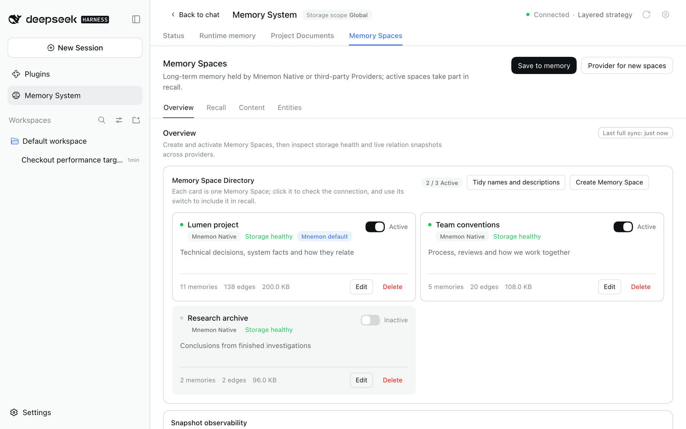

A memory space is one named scope of long-term evidence on one Provider. **Overview** lists the spaces as cards; the switch on a card decides whether dsh-mnemon reads it, and the tag names its Provider, such as Mnemon Native. Clicking a card reconnects only that space. **Save to memory** and **Provider for new spaces** sit at the top right, with **Recall**, **Content** and **Entities** beside Overview.

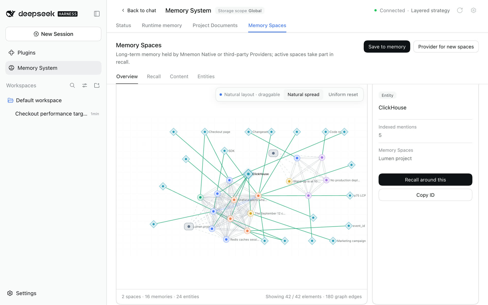

Below the cards, the graph merges what the active spaces can show: memories, entities, and the links between them. Select a space, entity or memory to see its context on the right, here the ClickHouse entity with **Recall around this**. Layout, dragging and reset only change the picture. The footer counts spaces, memories and entities, and how many elements are drawn.

Each space declares what its Provider can really supply. Mnemon Native gives typed relationships; Hindsight and Holographic give their own graphs; Providers without edges contribute content only; query-only Providers such as ByteRover wait for a question. Nothing unsupported is invented.

- **Create Memory Space** always lets you pick the Provider, with ready Providers first; turn more on from [Memory Spaces' page](#memory-spaces-page).
- **Provider for new spaces** matters only when a task Agent creates a space. **Fixed Provider** always creates it on the Provider you choose; **Smart selection rules** let the Host enforce data and capability rules first, then the task Agent chooses among the eligible Providers. Existing spaces are still chosen by name and description.
- **Tidy names and descriptions** samples each selected active space and gives it to an independent task Agent for a title and description. Each space runs on its own; a failure stays on its card.

#### Recall

| Direct search | Ask Agent |
|---|---|
|  | 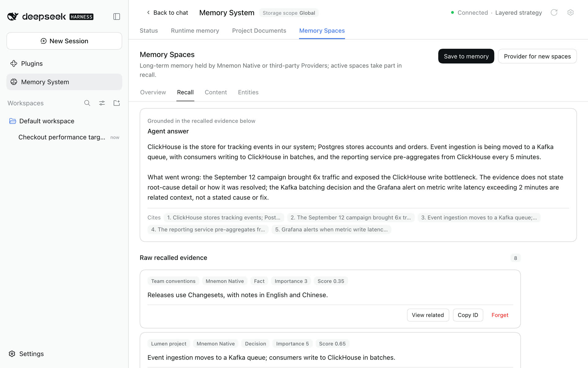 |

**Direct search** returns raw evidence from every active space without an Agent, with each Provider's own score, space and category. **Ask Agent** runs the same search, then gives the evidence to a read-only task Agent for an answer. The answer speaks in terms of the evidence, and **Cites** below lists the memories it used by their content, never by id. Providers answer concurrently, so one failure never hides the others. **View related** and **Forget** appear only where the Provider supports them. Opening Recall with a query, from a turn's item, **Recall around this** or **View related**, runs it right away. Focused questions work better than bare keywords.

#### Content and Entities

| Content | Entities |
|---|---|
| 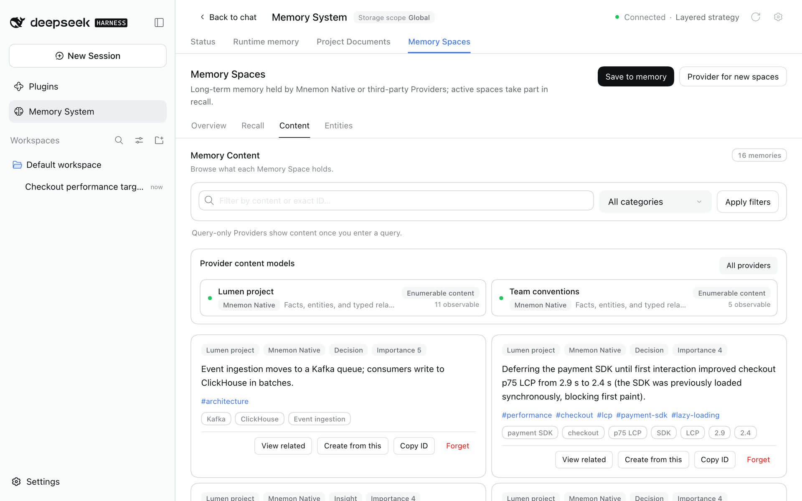 | 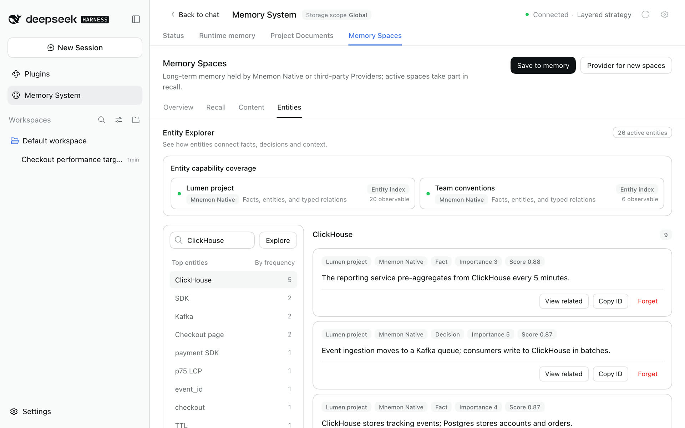 |

**Content** lists memories where the Provider can enumerate them; query-only Providers show content once you enter a query. **Entities** uses only real entity indexes, currently Mnemon Native, Hindsight and Holographic. Selecting an entity gathers the memories that mention it across spaces.

#### Save to memory

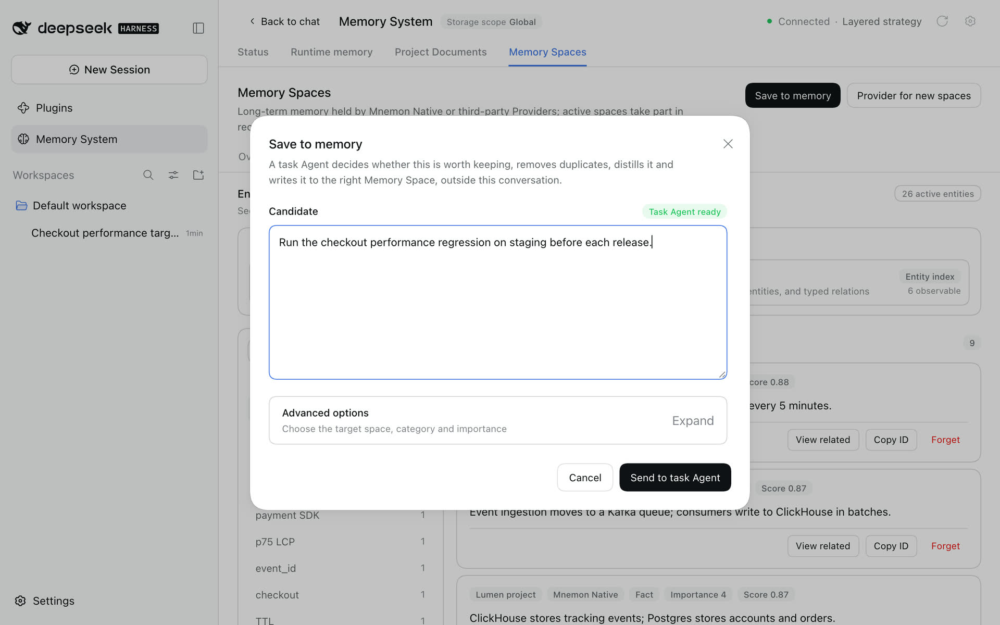

**Save to memory** here is the same dialog as in a conversation: write the candidate, send it to the task Agent, and view the result under **Content** from the receipt. Open **Advanced options** only when a target, category or importance is genuinely required.

### On a phone

| Conversation | Memory Spaces | Configuration |
|---|---|---|
| 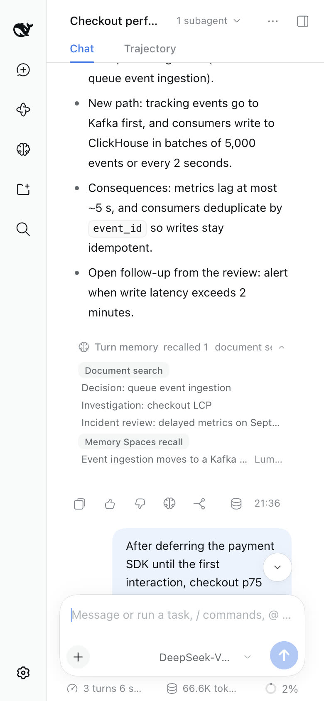 | 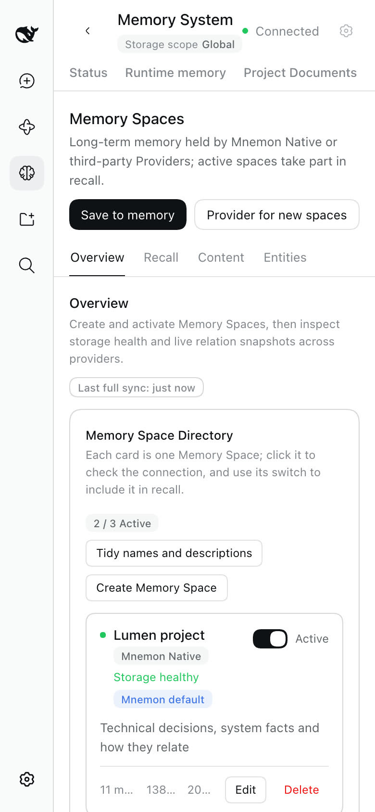 | 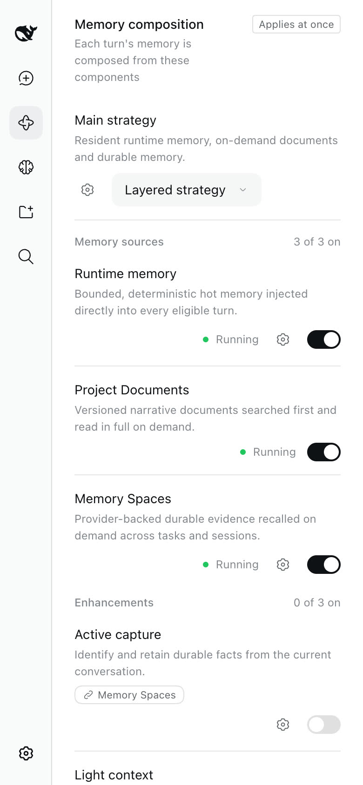 |

At 390 px the sidebar becomes DSH's icon rail and the pages stack. Long names truncate. These captures do not establish complete phone support; see [known limits](../reference/compatibility.md).

## On the Plugins page

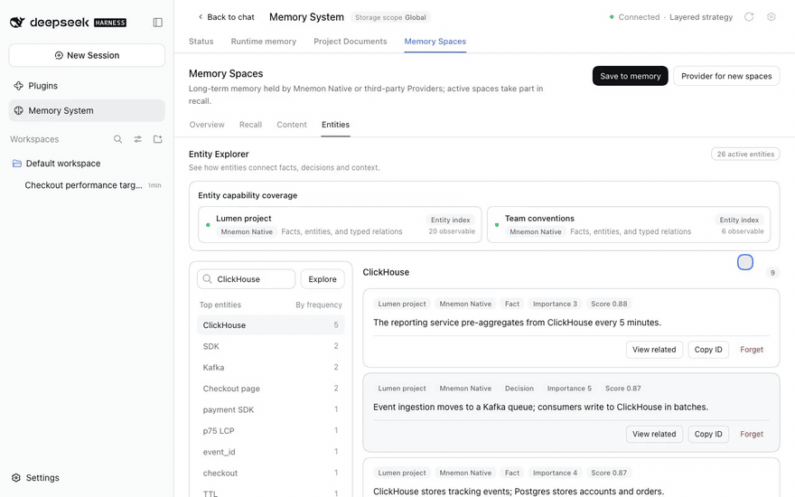


DSH 0.1.7 keeps a plugin's configuration on its own page under **Plugins**. The `dsh-mnemon` page (可组合记忆 in Chinese) has **Memory composition**, **Storage** and **Interface**, then DSH's list of the components the Starter includes. **Open Memory System** at the top leads back. Each component's own settings live on its own page.

| Where | Contains | Applies |
|---|---|---|
| Memory composition | Main strategy; one switch per memory source and enhancement | At once, to future turns |
| Storage | Storage scope, data directory, backup and migration | Scope and directory with their **Apply**; ZIP import and export at once |
| Interface | Memory System entry, turn memory bar, save to memory | At once |
| Runtime memory's page | User profile scope | At once |
| Memory Spaces' page | Memory providers and the Mnemon Native embedding | Switches at once; typed connections with **Apply** |
| Layered strategy's page | Task Agent model and idle review | Choices at once; review limits with **Apply** |

A change saved from another window, or an edit of the profile, shows up without a reload.

### Memory composition

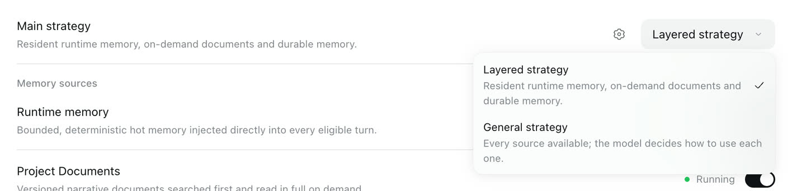

- **Main strategy** is one selector listing each installed main strategy with its description. The **Layered strategy** keeps runtime memory resident, reads Documents and Memory Spaces on demand and runs the background maintenance. The **General strategy** offers every available source in one budget and lets the model decide, without automatic review or capacity maintenance.
- **Memory sources** and **Enhancements** follow, one row per component with its state, a switch, and a gear when it has settings. Chips name the components a row needs or that depend on it; each opens that page.
- A problem line appears only while memory is not composed as chosen, with the one switch that fixes it.

Every switch applies to future turns; a turn that already started keeps its View. Turning a component on also turns on what it needs and turns off what cannot run beside it; turning one off also turns off what depends on it; choosing a main strategy turns the others off. The last running source stays on. When a switch moved other components or changed what composes memory, a toast says so with **Undo**.

### Component pages

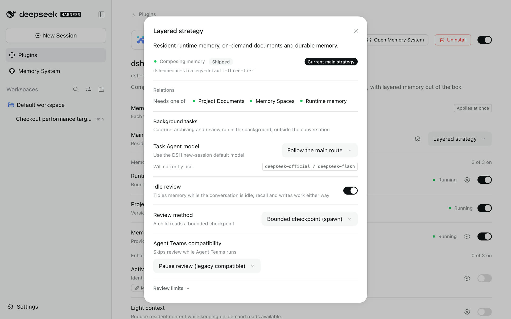

The gear on a row, the gear beside **Main strategy**, and a component's name anywhere open its page. It shows the component's state and switch, whether it ships with dsh-mnemon or came from an installed package, what it needs, what depends on it and what cannot run beside it, its declared options and its own settings. A related name opens in place with **Back**. Options are checked against the Host's limits; **Apply** appears once one changes, and **Reset to default** restores one.

<a id="memory-spaces-page"></a>

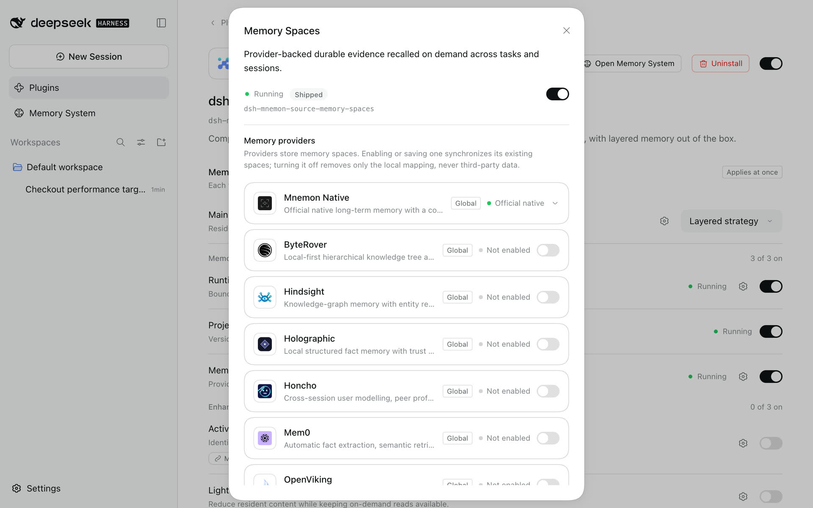

- **Runtime memory's page**: **User profile scope**. *Shared globally* combines a global `USER.md` with workspace or custom `MEMORY.md`, without moving either.
- **Memory Spaces' page**: the **Memory providers**. Mnemon Native comes first and, expanded, holds only its embedding settings. Every third-party Provider has its own switch and is off by default; its endpoint, key and fields appear once it is on. The Global or Workspace tag shows its effective scope. OpenViking's **User key owner (skip admin)** field selects one user namespace for keys without admin access; see [its limits](./memory-providers.md#operational-boundaries).
- **Layered strategy's page**: **Background tasks**. **Task Agent model** follows DSH's default route for new sessions, or **Choose a model** picks a complete Provider and model; it applies to Save to memory, Ask Agent, Tidy names and descriptions, smart selection for new spaces and document archiving, never to the main conversation. **Idle review**, **Write runtime memory**, its method and Agent Teams compatibility apply at once; **Review limits** apply with **Apply**. With **Write runtime memory** off, review only creates Documents. Review runs only after turns the Layered strategy composed; see [configuration](../reference/configuration.md#provider-requirements).

<details>
<summary>Mnemon Native embedding</summary>

Expand the Mnemon Native card. **Manage embedding settings in DSH** makes the saved endpoint, model, protocol and optional key authoritative for Mnemon child processes, including Desktop launches that do not read shell startup files. While it is on, those fields apply together with their **Apply**. Automatic protocol selection treats an endpoint ending in `/v1` as OpenAI-compatible; other endpoints need an explicit protocol. The URL rejects embedded credentials, queries and fragments. Memory and query text are sent to the configured service. **Test status** checks saved values, not an unsaved draft. See [embedding configuration](../reference/configuration.md) before turning it on.

</details>

### Storage

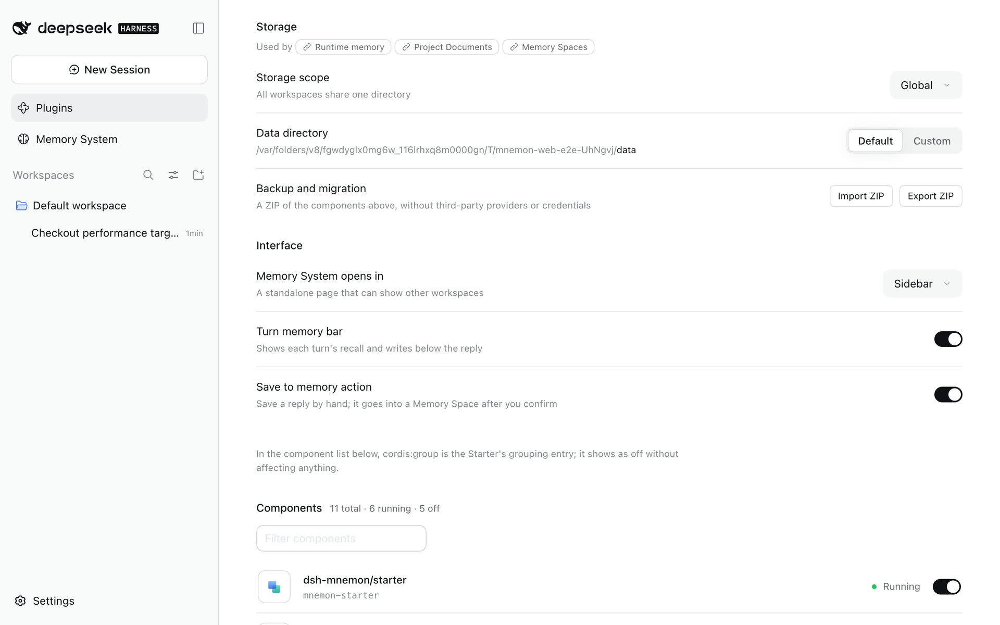

**Storage** names the components that keep their data in its directory; each name opens that component's page.

- **Storage scope**: **Global** shares one directory across workspaces; **Workspace** keeps each workspace's memory in its own `.mnemon`; **Centralized · isolated by workspace** keeps each workspace in `workspaces/<workspace-path-hash>/` under one root.
- **Data directory**: **Default** or **Custom**, and the row shows the one directory memory uses. Default is `MNEMON_DATA_DIR` or `~/.mnemon`. Custom opens a field for an absolute path or one starting with `~/`; under Centralized it sets the root. An empty field waits for a path; choosing **Default** is how you return to the default.
- Scope and directory apply together with **Apply**, which states the consequence: memory reads and writes the new location, and existing data is never moved, merged or deleted.


**Backup and migration** exports the current data directory as a ZIP, with the components Storage names, and never includes third-party Provider data or credentials. Importing first shows a verified preview of what the ZIP contains; **Safe import** merges it into the current directory. See [backup and recovery](./operations.md#backup-and-recovery).

### Interface

- **Memory System opens in**: **Sidebar** (default) or **Conversation tab**.
- **Turn memory bar** and **Save to memory action** turn the conversation controls on or off.

### DSH's component list

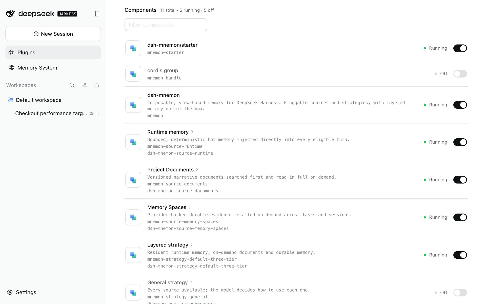

Below the configuration, DSH lists the components the Starter includes under the names and descriptions they declare. The `mnemon-bundle` row is the Starter's group entry (shown as `dsh-mnemon/bundle` from 0.5.20; the picture above is from 0.5.19, where it read `cordis:group` below the separate `dsh-mnemon/starter` readiness row); its "Off" state does not affect anything. A component's name opens DSH's page for it, which carries the same component page as the board.

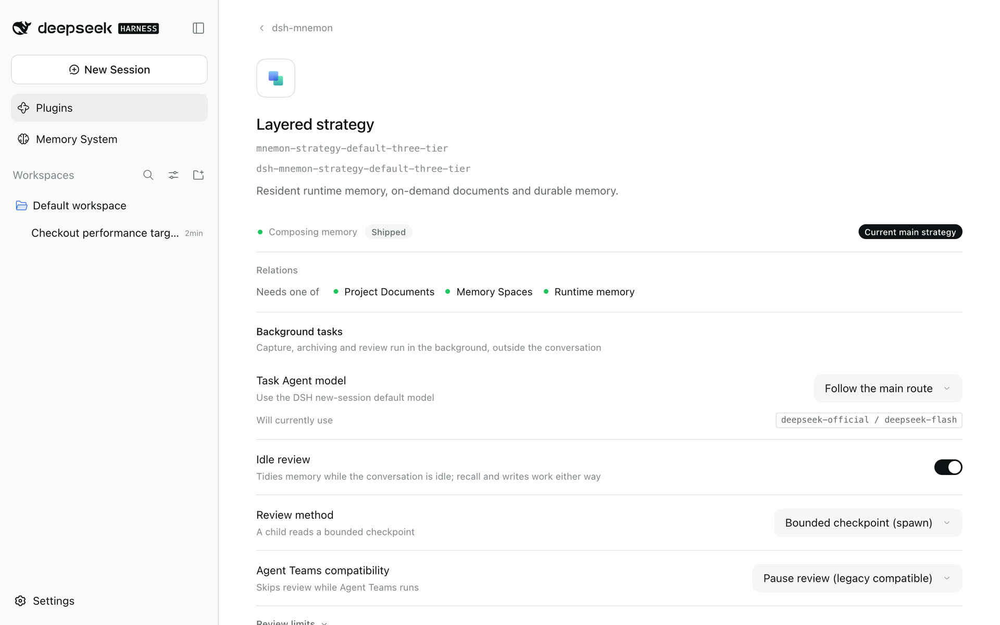

## Inspected and effective workspace

| Concept | Selected by | Affects |
|---|---|---|
| **Inspected workspace** | The Memory System header | Which `<workspace>/.mnemon` the pages show and edit |
| **Effective workspace** | The current conversation's working directory | Which root conversation tools, commands and lifecycle hooks use |

You can inspect project B while talking in project A. The conversation stays on A; Save to memory, Ask Agent, Tidy names and descriptions and document archiving started from the Memory System run as task Agents scoped to B. Remote Provider namespaces never change with the DSH workspace. Global and custom storage resolve to one root and need no alignment.

<a id="theme-skin-overrides"></a>

## Theme and skin overrides

Skin authors can start with [Skin development and Mnemon integration](../development/skin-integration.md) for an example, migration from generated classes and verification in a real WebUI. This section defines the supported contract.

The sidebar and the conversation tab expose one workspace root: `[data-dsh-plugin="dsh-mnemon"][data-dsh-part="mnemon-view"]`. Set these custom properties directly on that element; values on an ancestor are shadowed by the workspace defaults. Generated CSS-module class names are not public selectors.

| Property | Accepted value and purpose | Default |
|---|---|---|
| `--mn-bg` | CSS color for the base surface | `var(--dsw-alias-bg-base)` |
| `--mn-backdrop` | CSS color behind the base in the default layered surface | `var(--dsw-alias-bg-overlay, var(--mn-bg))` |
| `--mn-surface` | CSS `background` value for the workspace, header and canvas | Base gradient over backdrop gradient, backed by the base color |

The default surface is `linear-gradient(var(--mn-bg), var(--mn-bg)), linear-gradient(var(--mn-backdrop), var(--mn-backdrop)) var(--mn-bg)`. The layered backing keeps text readable when a skin makes the host base transparent; the official theme stays opaque. A skin can replace the composition, for example:

```css
[data-dsh-plugin="dsh-mnemon"][data-dsh-part="mnemon-view"] {
  --mn-bg: rgb(232 241 249 / 74%);
  --mn-backdrop: var(--mn-bg);
  --mn-surface: var(--mn-bg);
}
```

Use the paired selector in an unlayered stylesheet. Its specificity `(0,2,0)` beats the defaults `(0,1,0)` whether the skin loads before or after Mnemon. A lone `[data-dsh-part="mnemon-view"]` ties the defaults and depends on load order, and a declaration inside `@layer` ranks below them. Add your skin's own ancestor selector when it needs an activation scope. Dialogs portaled to the body and other plugins' roots are outside this scope. Replacing `--mn-surface` is the skin's choice of readability and transparency; it changes no settings, memory or Provider behavior.

## Interaction conventions

Memory surfaces follow one set of conventions everywhere:

- **One mark**: the turn memory bar, Save to memory and the Memory System in the sidebar share the brain mark; DSH's database icon means usage, not memory.
- **One name, one dialog**: writing to long-term memory is called **Save to memory** everywhere and opens the same dialog, which a task Agent completes with a receipt.
- **Names over identifiers**: memories are referred to by title, content and space name, never by raw id or path; **Copy ID** stays on the cards for when you need one.
- **The same controls**: search boxes, choices, switches and dialog buttons use DSH's input, selector, switch and outlined Cancel; menus and tooltips open above dialogs.
- **Refresh lives in the header**: **Refresh** reloads the open page; pages carry no refresh or sync buttons of their own.
- **Weight of an action**: primary actions use DSH's primary button and secondary ones such as Edit an outlined button; red is reserved for Delete, Disconnect, Archive and Forget.
- **One-line descriptions**: each page and group describes itself in one line; the details live in these guides.
- **Status shows what runs**: Status lists the running Providers and sums up the rest in one line with Open configuration.

Also: a memory space's switch controls only whether dsh-mnemon reads it, not the Mnemon CLI's default store; deleting a Mnemon Native space asks for confirmation, while external spaces use Disconnect and leave Provider data untouched; repeated clicks, including choosing the value already selected, never blank a page.

Next: [Capability map](./capabilities.md) · [Getting started](./getting-started.md) · [Providers](./memory-providers.md) · [Configuration](../reference/configuration.md)
