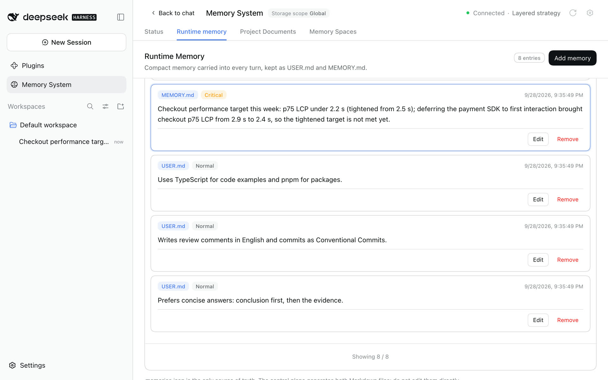
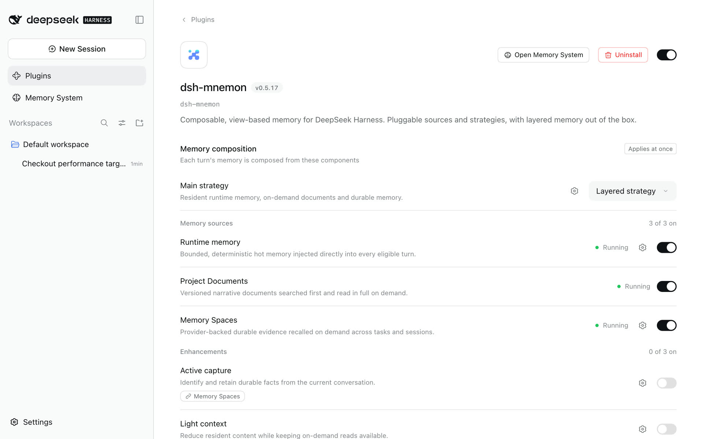

# Configuration Reference

[简体中文](../../zh-CN/reference/configuration.md) | **English** | [Documentation Center](../README.md)

## Configuration Location and Activation

The configuration is the `mnemon` entry of the DSH profile. DSH's settings service writes user values into the profile patch:

```text
$DSH_HOME/profiles/<profile>/cordis.patch.yml
```

The Web profile's patch is commonly `~/.dsh/profiles/web/cordis.patch.yml`. A `settings.yaml` left by an older host is imported into the profile once and kept as `settings.yaml.imported`; see [DSH 0.1.7 settings recovery](./compatibility.md#dsh-017-settings-recovery). All current settings are marked `live`; after a change is applied, the Host initializes a candidate runtime graph and then switches to it atomically.

As DSH 0.1.7 does for every plugin that carries its own configuration, the Web interface edits Mnemon's settings on its page under **Plugins**, not in Settings. The [UI guide](../guides/ui-guide.md#on-the-plugins-page) shows each part.

| Where in the UI | Settings | Saved as |
|---|---|---|
| Memory composition | Main strategy; one switch per memory source and enhancement; each component's declared options | `memoryView.strategyTypeId` and `memoryView.entries.<entry>.config`; each component's on/off is its Entry's `disabled` row, written by DSH's plugin manager |
| Storage | Storage scope, data directory, backup and migration | `storageScope`, `dataDir` |
| Interface | Memory System opens in, turn memory bar, save to memory | `displayMode`, `conversationInteraction.turnBar`, `conversationInteraction.saveAction` |
| Runtime memory's page | User profile scope | `runtimeUserScope` |
| Memory Spaces' page | Memory providers; Mnemon Native embedding (auto, Ollama or OpenAI-compatible) | The Provider registry in `state/memory-providers.json`; `embedding` |
| Layered strategy's page | Task Agent model; idle review | `taskAgentModel`; `idleReview` |

Switches and selectors apply at once; typed values such as the storage directory, the embedding connection, review limits and component options wait for **Apply**. A Provider's reusable service fields (endpoints, credentials, executables) live in the Provider registry, not in Mnemon's YAML; enabling or saving a Provider discovers its namespaces into **Memory Spaces → Overview**, and turning it off removes only those local mappings. Other advanced settings are edited in YAML.

OpenViking user keys without admin access can opt into one-owner discovery using the service field `discoveryUser` together with `endpoint`, `apiKey`, and `account`. Leave it empty to retain admin enumeration. These service fields stay in the Memory Spaces provider registry; they are not new top-level Mnemon YAML settings. See [OpenViking setup and compatibility](../guides/memory-providers.md#operational-boundaries).

## Complete Example

```yaml
mnemon:
  storageScope: global # global | workspace | custom | workspaces
  runtimeUserScope: storage # storage | global
  # dataDir: ~/mnemon-data       # required for custom
  # cliPath: /opt/homebrew/bin/mnemon
  # store: legacy-store          # compatibility discovery hint, not a regular routing target
  timeoutMs: 10000
  defaultRecallLimit: 10
  runtimeMemory:
    memoryLimitBytes: 10240
    userLimitBytes: 4096
    maintenanceMaxTokens: 8192
  embedding:
    enabled: false
    endpoint: http://localhost:11434
    model: nomic-embed-text
  memoryTopology:
    layers:
      runtime: { enabled: true }
      documents: { enabled: true }
      memory-spaces: { enabled: true }
  recallQuality:
    policy: strict-v1
    lowScoreThreshold: 0.25
    highScoreThreshold: 0.6
    candidateMultiplier: 3
    maxMediumResults: 4
    maxUnknownResults: 2
  routingGuidance: true
  lifecycleEnabled: true
  recallMode: guided
  writebackMode: guided
  idleReviewMs: 30000
  idleReview:
    enabled: true
    runtimeMemory: true # false: Documents only
    provider: spawn
    fallback: spawn
    agentTeams: pause # pause | scoped
    minIntervalMs: 300000
    maxPerSession: 20
    maxContextChars: 24000
    maxTokens: 4096
  tabEnabled: true
  writeEnabled: true
  taskAgentModel:
    mode: inherit # inherit | fixed
    # provider: deepseek # required for fixed
    # model: deepseek-chat # required for fixed
  remoteAccess: read-only # remote management: read-only | trusted-host
```

## Options

| Setting | Default | Range | Implementation Semantics |
|---|---:|---|---|
| `storageScope` | `global` | `global` / `workspace` / `custom` / `workspaces` | Controls the root for Runtime, Documents, Memory Spaces, and reserved state as one unit |
| `runtimeUserScope` | `storage` | `storage` / `global` | Keeps USER.md in the selected storage root, or overlays the global USER.md while project MEMORY.md and the other layers stay selected-scope |
| `dataDir` | unset | absolute path, `~`, or `~/...` | Required for `custom`; optional central root for `workspaces`; legacy configurations that set only this option automatically resolve to `custom` |
| `cliPath` | auto-discovered | executable path | Explicitly selects the Mnemon CLI |
| `store` | unset | `[A-Za-z0-9][A-Za-z0-9_-]*` | Compatibility discovery/preference hint for legacy Stores; semantic operations are routed through Memory Spaces |
| `timeoutMs` | `10000` | 100–120000 ms | Hard timeout for a single CLI call |
| `defaultRecallLimit` | `10` | 1–50 | Default recall count for the service and UI; individual entry points may impose a lower limit |
| `runtimeMemory.memoryLimitBytes` | `10240` | 1–1048576 bytes | UTF-8 byte limit for the complete `MEMORY.md` projection |
| `runtimeMemory.userLimitBytes` | `4096` | 1–1048576 bytes | UTF-8 byte limit for the complete `USER.md` projection |
| `runtimeMemory.maintenanceMaxTokens` | `8192` | 1–1000000 tokens | Completion-token budget for Runtime migration and compaction workers; does not change Document archive or metadata-maintenance budgets |
| `embedding` | `{ enabled: false, endpoint: http://localhost:11434, model: nomic-embed-text, apiKey: '', protocol: auto }` | enabled + HTTP(S) endpoint + model + optional apiKey + protocol (auto/ollama/openai) | When enabled, the Host injects the saved endpoint, model, API key, and protocol override into every Mnemon CLI child process; an endpoint ending in `/v1` makes Mnemon use the OpenAI-compatible protocol with the API key as a Bearer token, and `protocol: openai` forces it for non-`/v1` endpoints; when disabled, existing Host environment and Mnemon defaults remain untouched |
| `memoryTopology.layers.<id>.enabled` | `true` for the three defaults | boolean | Legacy layer flag. A Source's switch on the board turns its DSH Entry on or off and turns this flag back on with it; the flag is used when the components cannot be read. Turning a Source off never deletes or migrates data |
| `memoryTopology.layers.<id>.participation` | per layer | `off` / `manual` / `automatic` for `recall`, `write`, `projection`, `maintenance` | How a layer takes part in each kind of work under the Layered strategy |
| `memoryView.strategyTypeId` | unset | Strategy type id, for example `default-three-tier` or `general` | The selected main strategy, written by the **Main strategy** selector; overrides `memoryTopology.strategyId` |
| `memoryView.entries.<entry>.config` | `{}` | the options a component declares | Options saved from a component's page. On/off is not stored here: DSH's plugin manager writes it as the Entry's `disabled` row in the profile patch, and earlier saved choices are moved there once |
| `persistenceStrategy` | `{ mode: manual }` | `manual` / `automatic`, `providerId`, `prompt`, `rules` | Provider for new spaces: when a task Agent creates a Memory Space, one fixed Provider, or smart selection with allowed Providers, data boundary, required capabilities and preference; existing spaces are still chosen by name and description |
| `recallQuality.policy` | `strict-v1` | registered policy id | Deterministic policy applied before recall content is serialized to an Agent or client |
| `recallQuality.lowScoreThreshold` | `0.25` | 0–1, below high threshold | Normalized scores below this boundary are removed by `strict-v1` |
| `recallQuality.highScoreThreshold` | `0.6` | 0–1, above low threshold | Retained normalized scores at or above this boundary are labeled high relevance |
| `recallQuality.candidateMultiplier` | `3` | 1–5 | Expands each Provider request before filtering, capped by the service limit of 50 candidates |
| `recallQuality.maxMediumResults` | `4` | 0–50 | Maximum medium-relevance rows admitted by `strict-v1` after all high-relevance rows |
| `recallQuality.maxUnknownResults` | `2` | 0–50 | Maximum unscored or unknown-scale rows admitted by `strict-v1` after scored evidence |
| `routingGuidance` | `true` | boolean | Whether to register an additional tiered-routing system section |
| `lifecycleEnabled` | `true` | boolean | Whether to enable the pre-step cue and score-based background review |
| `recallMode` | `guided` | `guided` / `off` | Whether to inject one durable on-demand recall cue per session; does not remove explicit recall |
| `writebackMode` | `guided` | `guided` / `off` | Whether to inject one durable hot-memory cue per session and enable scored, dirty-admitted background review; does not remove explicit writes |
| `idleReviewMs` | `30000` | 5000–600000 ms | Required continuous idle time after the threshold is reached |
| `idleReview.enabled` | `true` | boolean | Independent automatic-review switch |
| `idleReview.runtimeMemory` | `true` | boolean | Lets review change runtime memory (USER.md and MEMORY.md); `false` limits it to creating Documents |
| `idleReview.provider` | `spawn` | `spawn` / `fork` | Bounded checkpoint or inherited parent context |
| `idleReview.fallback` | `spawn` | `spawn` / `skip` | Missing/incompatible fork handling before startup only |
| `idleReview.agentTeams` | `pause` | `pause` / `scoped` | Pause while Team tools are installed or explicitly allow guarded review; verified with DSH/Teams 0.1.7-rc.2 |
| `idleReview.minIntervalMs` | `300000` | 5000–86400000 ms | Minimum interval between attempts |
| `idleReview.maxPerSession` | `20` | 0–200 | Attempt cap per loaded parent Agent; includes failures/cancellations |
| `idleReview.maxContextChars` | `24000` | 1000–1000000 | Spawn checkpoint character limit |
| `idleReview.maxTokens` | `4096` | 128–131072 | Per-response model output limit |
| `displayMode` | `sidebar` | `sidebar` / `builtin`; legacy `buildin` accepted | Where the Memory System opens: standalone Sidebar or a conversation tab using the same workspace UI; legacy spelling is migrated to `builtin` |
| `tabEnabled` | `true` | boolean | Whether to mount the selected entry and workbench; Host RPC, commands, and Agent tools remain registered when off |
| `writeEnabled` | `true` | boolean | Whether to expose semantic write tools, write RPC, and write commands |
| `taskAgentModel` | `{ mode: inherit }` | `inherit` / `fixed` | Model route for independent task Agents used by Tidy names and descriptions, Ask Agent, Save to memory, and Document archiving, plus the idle-review worker; `fixed` requires both `provider` and `model` and also pins their bounded workers for write, answer, provider placement, migration, compaction, archive, and metadata maintenance. Conversation Recall and Related are direct Host reads and do not use this route |
| `remoteAccess` | `read-only` | `read-only` / `trusted-host` | Startup-only grant for non-loopback Mnemon management, enforced by the API Gateway projection |
| `conversationInteraction.turnBar` | `true` | boolean | The turn memory bar under replies; applies at once |
| `conversationInteraction.saveAction` | `true` | boolean | The **Save to memory** action and confirmation on finished replies; applies at once |

Every value is saved under the `mnemon` entry and applies live. The UI's `mnemon-ui` settings scope is stored as `conversationInteraction`, and its `mnemon-view` scope as `memoryView`. The storage root switches atomically only after the new runtime graph initializes successfully.

### Runtime Memory budgets

Long conversations can raise the two hot-memory byte limits and the bounded migration/compaction worker budget without patching generated package files:

```yaml
mnemon:
  runtimeMemory:
    memoryLimitBytes: 20480
    userLimitBytes: 10240
    maintenanceMaxTokens: 32768
```

The defaults preserve the released 10240 / 4096 / 8192 behavior. Saving the block builds a new runtime generation, so subsequent Runtime reads, writes, capacity maintenance, and Mnemon Pack validation use the same limits. Existing entries and the `memories.json` format are unchanged. Lowering a byte limit below current usage does not delete data; the Runtime view reports the over-capacity state and further writes require compaction or a higher limit. Rollback only requires removing the block or restoring the defaults.

Storage byte limits count entry content and delimiters. The model snapshot's importance and age annotations do not consume storage capacity; they do consume the Strategy's existing projection character budget. They add no ranking, relevance filter or separate configuration.

The Runtime memory page shows each file's size against its limit.



### Mnemon Native embeddings

Finder- and Dock-launched macOS applications do not normally inherit interactive shell startup files. Enable **Manage embedding settings in DSH** under Mnemon Native to make the saved values authoritative for every Mnemon child process instead:

```yaml
mnemon:
  embedding:
    enabled: true
    endpoint: http://127.0.0.1:11434
    model: qwen3-embedding:0.6b
```

For an OpenAI-compatible server, point the endpoint at its `/v1` base URL; Mnemon automatically switches from the Ollama protocol to the OpenAI protocol (`/v1/embeddings`). Fill in `apiKey` for services that require authentication; it is sent as a Bearer token. For compatible endpoints that do not end in `/v1`, set the protocol explicitly with `protocol: openai`:

```yaml
mnemon:
  embedding:
    enabled: true
    endpoint: http://127.0.0.1:8080/api
    model: bge-m3-mlx-8bit
    apiKey: sk-...
    protocol: openai
```

The Host copies its normal process environment and then overwrites `MNEMON_EMBED_ENDPOINT`, `MNEMON_EMBED_MODEL`, `MNEMON_EMBED_API_KEY`, and `MNEMON_EMBED_PROTOCOL` for the child only (`protocol: auto` injects no protocol variable and leaves Mnemon's `/v1` auto-detection in charge). It does not modify the desktop session, `launchctl`, shell files, or Mnemon's persisted data. Saving swaps to a new runtime graph, so later calls use the new values without restarting DSH. With `enabled: false` or an omitted `embedding` block, dsh-mnemon supplies no override: inherited variables and Mnemon's built-in defaults keep their previous behavior. `MNEMON_EMBED_DIMENSIONS` remains an advanced inherited environment setting.

The endpoint must be an absolute HTTP(S) URL without credentials, query parameters, or a fragment. Mnemon sends memory and query text to this service; the API key is stored in the DSH settings file like other settings, and a remote plain-HTTP endpoint exposes that text in transit, so use a trusted loopback endpoint or HTTPS. **Test status** runs the effective `mnemon embed --status` command for the current default Store and reports embedding-server reachability, model, the resolved protocol when Mnemon reports one, and embedding coverage without backfilling or changing memories. Save pending edits before testing so the check cannot claim an unsaved value is active.

### Memory Source switches

Each memory Source has one switch in **Memory composition**. It turns the Source's DSH Entry on or off through DSH's plugin manager, which saves the choice as the Entry's `disabled` row in the profile patch. On permits the main strategy to use the Source when needed; it does not force recall or writes on every turn. Off stops that Source's context injection, tools, background work and data-plane Web and RPC operations together.



Turning a Source off is reversible routing state, not deletion. Its Memory System page stays, marked **Not running**, and does not read the data plane; Status and the management directories stay observable. Turning it on again uses the original directories and data. The last running Source cannot be turned off. The legacy `memoryTopology.layers.<id>.enabled` flag is turned back on with the Source and is used only when the components cannot be read.

The WebUI reads Source instances from the live management catalog, so a new Source needs no frontend change. Source type ids select configuration; a Strategy selects exact instance keys. Settings update under a revision fence, and candidate compilation must succeed before replacement. Core and Source boundaries recheck capability, scope and current authority.

### Recall quality policies

`strict-v1` is the Agent-safe default: for Providers that explicitly declare a normalized 0–1 relevance score, non-positive and below-threshold rows are removed before their content reaches an Agent. It then returns every high-relevance row up to the requested limit, at most four medium-relevance rows, and at most two unscored or unknown-scale rows by default; it does not fill the result limit with weaker evidence. `balanced-v1` retains low-score rows only after primary evidence, and `exhaustive-v1` preserves finite scored rows for direct inspection. An out-of-range score is treated as unknown-scale instead of being fabricated into a confidence value. Cross-provider ordering continues to use reciprocal-rank fusion.

These pure recall-quality policies belong to the Memory Spaces Source. Configuration selects a policy ID shipped by that Source. Its internal registration function is not a public plugin API; custom retrieval belongs behind the public Source/Provider contracts. Invalid limits, decisions, or selections fall back to `strict-v1`; an unknown configured id rejects the candidate runtime graph. Filtering counts are returned as structured `source.quality` statistics and are not appended to Agent hints.

### Browser authentication

DSH owns browser authentication or pairing and Host/Origin validation. Remote pages use the namespaced API Gateway; local loopback clients and DSH desktop windows (`dsh-app://app/`) use their own channels, and an application page counts as remote only when DSH declares a transport for it that does not own the Host. Mnemon's Gateway projection separately enforces `remoteAccess`: `read-only` allows ordinary reads, narrow activation and settings inspection, but rejects writes, ZIP operations, View mutations and settings changes. Settings snapshots report `writable: false` without the `trusted-host` grant. Restart DSH after changing this startup-only policy. DSH `trustedHosts` does not replace HTTPS or deployment access controls. `writeEnabled=false` is a product-level read-only mode, not a substitute for transport authentication.

For the complete proxy, launch-token, trusted-authority, restart and verification workflow, see [Cloud-hosted WebUI](../guides/operations.md#cloud-hosted-webui).

## Storage Scopes

### `global`

```text
MNEMON_DATA_DIR when non-empty
  otherwise ~/.mnemon
```

Suitable for users who want Runtime, Documents, and Memory Spaces shared across multiple workspaces. Other Mnemon-enabled agents can also share the Mnemon Memory Spaces when they use the same root.

### `workspace`

```text
Agent / tool / lifecycle: resolve(currentSession.header.cwd, ".mnemon")
Web workbench inspection: resolve(workspaceRegistry.get(selectedWorkspaceId).path, ".mnemon")
```

Each DSH workspace owns an independent memory root for runtime memory, documents and memory spaces. Conversation Agents, model tools, commands, and lifecycle hooks route by the current session cwd. Independent task Agents launched from the Web workbench instead use the selected Host-registered workspace explicitly; the browser can never submit an arbitrary path. Tidy names and descriptions, Ask Agent, Save to memory, and document archiving therefore target the workspace selected in the Memory System header, even when no main session is selected.

Headless has no `workspaceRegistry`; its fresh session cwd is the directory from which `dsh --profile headless ...` was launched, so `workspace` resolves directly to `<invocation cwd>/.mnemon`.

### Global USER.md with workspace project memory

To share user-level collaboration requirements across repositories while keeping project facts isolated, set Storage scope to **Workspace** on the `dsh-mnemon` page and User profile scope to **Shared globally** on Runtime Memory's page, or configure:

```yaml
mnemon:
  storageScope: workspace
  runtimeUserScope: global
```

Each turn then projects `USER.md` from the global root (`MNEMON_DATA_DIR` when set, otherwise `~/.mnemon`) together with `MEMORY.md` from `<workspace>/.mnemon`. `target=user` mutations and local USER.md compaction go only to the global source; `target=memory`, Documents, Memory Spaces, and Provider state remain workspace-scoped. Global MEMORY.md and workspace USER.md entries stay intact on disk but are not projected in this mode.

Changing this setting never copies, merges, or deletes entries. Switching back to `runtimeUserScope: storage` reveals the selected root's original USER.md again. A Mnemon Pack still represents one selected storage root, so a workspace Pack does not silently include the separate global USER.md; back up the global root separately when that profile is important.

### `workspaces`

This built-in mode is available with the Starter; no additional plugin is required. Select **Centralized · isolated by workspace** as the Storage scope; to set a central root of your own, choose **Custom** under the same group's **Data directory**.

```yaml
mnemon:
  storageScope: workspaces
  dataDir: ~/central-memory # optional; otherwise MNEMON_DATA_DIR or ~/.mnemon
  runtimeUserScope: global # optional; share only USER.md
```

All four areas (`runtime`, `data`, `documents`, `state`) live under `<central-root>/workspaces/<sha256(canonical-workspace-path)>/`. Existing symlink aliases resolve to the same ID; different workspace paths remain isolated. A move or rename selects a new ID, with no automatic migration. Sidebar inspection follows the selected registered workspace; the conversation tab and Headless follow the owning session cwd. Global USER.md still uses `MNEMON_DATA_DIR` or `~/.mnemon`, even when the central root is customized.

Workspace identity resolution allows not-yet-created directory descendants, including Unicode names and descendants below a symlink alias. A path below an existing file is rejected with `ENOTDIR` on every platform, including Windows, before a storage ID is computed. This does not change valid IDs or move, rewrite or remove existing storage.

Changing scopes never migrates, merges or deletes an old root. A ZIP Pack still contains only the selected workspace root; back up the whole central directory to preserve all workspaces. Remote Provider namespaces retain their own sharing semantics.

### `custom`

```yaml
mnemon:
  storageScope: custom
  dataDir: /absolute/path/to/mnemon-data
```

`~` and `~/...` are also allowed. Relative paths are rejected.

### Choose a Cross-Agent Sharing Scope

| Goal | Recommended scope | Notes |
|---|---|---|
| Share durable memory among local agents | `global` | Every participant uses `~/.mnemon` or the same `MNEMON_DATA_DIR` |
| Share one explicit data root | `custom` | Every participant configures the same absolute directory for isolation and backup |
| Share only inside one project | `workspace` | Every participant aligns its Mnemon root to that project's `<workspace>/.mnemon` |

Mnemon Native interoperates with other Mnemon-enabled agents through `data/<store>/mnemon.db`; third-party engines interoperate through their configured provider scope. Runtime, Documents, DSH activation state, and UI metadata remain managed by dsh-mnemon. See [Long-term memory providers](../guides/memory-providers.md).

External service settings, Memory Space scope settings, and secrets are stored in `state/memory-providers.json` under the selected scope root, not in the profile patch. Multiple Memory Spaces reuse one provider service configuration; the Host merges both layers only at runtime. The Mnemon Native ZIP contains only Runtime, Documents, and native Memory Spaces; external service data, credentials, and local third-party stores are excluded.

## CLI Discovery Precedence

```text
config.cliPath
  -> executable MNEMON_CLI_PATH
  -> each PATH directory
  -> Windows: GOBIN/mnemon.exe
              first GOPATH/bin/mnemon.exe, or ~/go/bin/mnemon.exe
              %LOCALAPPDATA%/Programs/mnemon/mnemon.exe
              %ProgramFiles%/mnemon/mnemon.exe
  -> Unix: ~/.local/bin/mnemon
           /opt/homebrew/bin/mnemon
           /usr/local/bin/mnemon
           /usr/bin/mnemon
```

An explicit `cliPath` accepts either a path or a command name on PATH (for example, `mnemon`). Status checks and execution share the discovery rules and recognize CLI installation/removal on recheck without restarting DSH. If the explicitly configured command is unavailable, calls report a launch error rather than silently selecting another CLI. Windows discovery accepts regular `.exe` files and the verified official npm `mnemon.cmd` launcher. npm launchers are invoked through Node without a shell; arbitrary `.cmd` and `.bat` wrappers remain excluded. After migrating to npm, update any explicit CLI override to the npm launcher and verify the executable path in **Status → Check versions**.

## Compatibility Store Hint Precedence

```text
config.store
  -> MNEMON_STORE
  -> <storageRoot>/active
  -> default
```

After the Memory Space directory has been established, long-term semantic operations use explicit Memory Space IDs and do not rely on the global active Store for routing.

## Background Task Agent Model Route

Tidy names and descriptions, Ask Agent, Save to memory in the Memory System and in conversations, and document archiving create a clean independent top-level task Agent. It uses the selected workspace as its cwd, works even when no main Agent session is selected, and is disposed after the task finishes.

The default `inherit` mode first uses the DSH Provider / Model selected for new sessions, then falls back to a complete route from the current available main Agent. Choosing **Choose a model** under **Background tasks → Task Agent model** on the Layered strategy's page stores a complete Provider + Model and overrides only Mnemon background tasks; it does not change the conversation Agent. When semantic judgment requires a bounded worker inside that task Agent, the worker inherits the task Agent route.

```yaml
mnemon:
  taskAgentModel:
    mode: fixed
    provider: deepseek
    model: deepseek-chat
```

DSH's live catalog reports each model's input modalities, and the picker labels image-capable models **Image input**. Choosing one does not make Mnemon background jobs ingest images: Tidy names and descriptions, Ask Agent, Save to memory, smart selection and document archiving still submit text and bounded evidence. In the main conversation, DSH-owned image blocks keep their attachment references when dsh-mnemon adds lifecycle guidance, while activity thresholds count text blocks only. Raw image bytes are never copied into runtime memory, documents or memory spaces.

## Provider Requirements

Regular workers prefer `spawn`. If no provider has that name, another provider with all of the following capabilities can be selected:

```text
toolFilter   = true
persona      = true
depthLimit   = true
```

Background review defaults to a non-inheriting `spawn` provider and an explicit, bounded checkpoint from the parent's current public surface. It includes whole visible text messages and successful tool results; omitted or unavailable context is not reconstructed. `idleReview.provider: fork` retains full-parent-context review and requires `inheritsParentContext=true`. If fork is missing or incompatible, `idleReview.fallback` chooses `spawn` or `skip` before startup. A started run is never retried through another provider.

Review requires local child publication, `agents.isOwnedBy`, and `agent.ctx.tools.guard`; the guard also blocks unrelated own-scope plugin tools and Code Mode subcalls. `maxContextChars` bounds the spawn checkpoint, while `maxTokens` limits each model response, not the inherited fork input or total multi-step usage.

**What review writes.** Each piece of knowledge goes to one layer. Project records, such as a design, implementation details, paths, ports, scope agreements or a handoff, go to at most one Document. Working memory (MEMORY.md) takes only a compact rule the user stated, such as a convention, a correction, an environment fact or a tool quirk, that no Document or existing entry already covers; USER.md takes identity and preferences. The guard holds each pass to one layer: after a Document, working-memory changes are refused, and after a working-memory change, a Document is refused; USER.md changes stay independent. `idleReview.runtimeMemory: false` withholds `mnemon_runtime_memory` from review, so it only creates Documents. Review never writes Memory Spaces: working memory reaches them through capacity archiving and Documents through cold archiving, while **Save to memory** and `mnemon_remember` write them directly.

`idleReviewMs` remains the continuous-idle debounce. A separate `minIntervalMs` spaces attempts, including failures and cancellations. `maxPerSession` caps attempts for the loaded parent Agent; zero suspends review. Clearing or compacting the context (DSH replaces the Agent), restarting the Host, or unloading and reopening the Agent starts a new in-memory budget. Completed runs are disposed through DSH's public API. Persisted session history is retained: the published Host provides no plugin-scoped archive/TTL contract, and Mnemon never deletes session files or other plugins' agents.

**Agent Teams compatibility:** `idleReview.agentTeams: pause` remains the default for existing profiles. It pauses before child creation when both the public `agentTeams` service and parent-scoped `spawn_teammate` tool are present. TeamService alone does not pause review.

With DSH and all official Agent Teams components at **0.1.7-rc.2**, select **Scoped child review** under Idle review on the Layered strategy's page (**Plugins → dsh-mnemon**), or set `idleReview.agentTeams: scoped`. That published Team policy supports both bounded spawn and explicit fork. The opt-in retains parent ownership checks, local child publication, `maxDepth: 1`, and the monotonic review-tool allowlist, including Code Mode dispatch. Team tools and further delegation stay denied to the reviewer; the parent keeps Teams. No package-version guess or other plugin policy removal is used. Missing guard/ownership support or a policy error fails the run without fallback replay. Keep `pause` to leave review off while Team tools are installed, or use `idleReview.enabled: false` to disable only review while keeping Teams, recall and explicit writes.

Bounded spawn reads live-user evidence from the public flat `user/message` event payload. It includes only whole visible messages before the completed checkpoint; injected recall, summaries and messages without a live-user source are not promoted to user assertions. This preserves explicit decisions and no-write instructions within the configured character budget.

Failed reviews remain failures. The workspace shows the child run id and committed mutation receipt metadata when writes happened before failure, including a committed inner tool followed by a failed Code Mode wrapper. No rollback or automatic replay occurs. Inspect the run and the listed document ids or Runtime revisions before any manual retry. A later review still respects the cooldown and session budget. To disable only this maintenance pass, turn off **Idle review** on the Layered strategy's page, or set `idleReview.enabled: false`.


## Read-Only Configuration

```yaml
mnemon:
  writeEnabled: false
```

Effects:

- Model write tools are not registered;
- write and activation RPCs remain registered, with memory mutations rejected at the Host boundary;
- `/mnemon remember` and `/mnemon forget` are rejected;
- Source management and model actions cannot bypass the Host write restriction.

This is feature-level read-only behavior, not a read-only filesystem mode: the Runtime controller may still initialize or repair projections, Document search updates LRU access times, and Mnemon read commands may trigger upstream database migrations. Do not treat `writeEnabled=false` as a safety guarantee for read-only mounts.

## Switch Interactions

```text
writeEnabled=false
  -> overrides all explicit semantic writes

writebackMode=off
  -> no write cue, no scored review
  -> explicit writes remain when writeEnabled=true

recallMode=off
  -> no recall cue
  -> explicit recall remains

lifecycleEnabled=false
  -> no lifecycle cues or review
  -> UI, commands, and explicit tools remain

routingGuidance=false
  -> removes only mnemon:routing
  -> runtime-memory context remains
```

## Entry Placement: `displayMode` and `tabEnabled`

Memory System defaults to Sidebar, opening a dedicated center-column workbench with a minimal, logo-free skin aligned with official DSH panels. Set `displayMode: builtin`, or choose **Conversation tab** under **Interface → Memory System opens in**, to put that same workspace in the current conversation's `conversation.view` tab instead. Pages, navigation, dialogs, and styling remain shared; there is no separate builtin UI. Theme authors can use the [supported surface selectors and custom properties](../guides/ui-guide.md#theme-skin-overrides) in either placement.

The sidebar entry follows DSH's native Plugins row for styling, collapsed icons and selection. Clicking it again keeps the workspace open; **Back to chat** or Escape returns to the current conversation. Selecting Plugins, another native panel or New Session switches the main panel. Switching to the task board or SSH synchronizes both visibility and entry state, so a missed peer activation notification cannot prevent reopening Memory System.

The conversation tab omits the header's storage-mode badge, workspace picker and alignment controls. Every read, write, and independent task request follows its owning session through the existing Host routing:

| `storageScope` | Conversation-tab read/write root |
|---|---|
| `global` | Shared `MNEMON_DATA_DIR` or `~/.mnemon`, regardless of the session workspace |
| `workspace` | The current session's `<cwd>/.mnemon`; switching conversations follows their respective workspaces |
| `custom` | Configured `dataDir`, regardless of the session workspace |
| `workspaces` | The current session’s subtree under `<central-root>/workspaces/<workspace-path-hash>/` |

The existing `runtimeUserScope: global` exception still keeps USER.md global. Changing placement does not change scope, migrate memory data, or revive the old builtin navigation. A placement change applies when selected.

The canonical spelling is **`builtin`**. Historical `displayMode: buildin` preferences are accepted, and runtime and UI state normalize them to `builtin`. On startup and external settings changes, the Host rewrites that one field through DSH's revision-fenced settings writer. Old-client RPC writes also persist `builtin` directly. Other fields and document comments are preserved; an explicit newer Sidebar choice wins a concurrent migration.

Saving on the `dsh-mnemon` page under Plugins updates the current UI immediately. On loopback pages the Client also follows DSH's settings document: a save from another window, or a profile edit the Host reloads, shows up without a browser reload. Remote pages do not receive DSH's settings mirror; reload them to observe changes made elsewhere.

If the old value comes only from a composition profile, migration saves a canonical user-setting override instead of rewriting the profile file. A read-only settings provider still recognizes the alias but is not written; a persistence failure is reported in the Host log without disabling the normalized entry.

`tabEnabled=false` removes the selected entry and workbench live; enabling it again restores the configured placement. The two entries are mutually exclusive. Host RPC, commands, and tools remain registered, so an Agent or command already in progress stays valid. The turn memory bar and Save to memory stay controlled by their own Interface switches and navigate to the selected placement.

## Profile Patch Overrides

The bundled `cordis.patch.yml` provides the default config row. A DSH profile configuration with the same ID may replace that row as a whole. Do not add only `cliPath` to a final profile patch: use `MNEMON_CLI_PATH` or the `mnemon.cliPath` user setting instead. When a profile patch must be customized for another reason, retain every key that must remain enabled instead of assuming a deep merge.

A `remoteAccess` override for authenticated Gateway management is one such whole-row customization. Use the complete, upgrade-aware example in the [remote management procedure](../guides/operations.md#remote-management), preserving the rest of the current configuration; a standalone `config: { remoteAccess: trusted-host }` fragment replaces those other fields.

## Common Configurations

Workspace isolation:

```yaml
mnemon:
  storageScope: workspace
```

The same workspace isolation inside each conversation:

```yaml
mnemon:
  storageScope: workspace
  displayMode: builtin
```

An explicit Windows CLI path:

```yaml
mnemon:
  cliPath: 'C:\Users\alice\AppData\Local\Programs\mnemon\mnemon.exe'
```

A custom data volume and a longer CLI timeout:

```yaml
mnemon:
  storageScope: custom
  dataDir: /Volumes/AgentData/mnemon
  timeoutMs: 30000
```

Keep explicit tools while disabling lifecycle behavior:

```yaml
mnemon:
  lifecycleEnabled: false
```

Disable only background writeback decisions:

```yaml
mnemon:
  writebackMode: off
```
