# 组件页与统一的交互规则

[English](./README.md)

实测实现：配置页为 `41fced12`，记忆系统为 `7fde5ecb`，DSH 列表与行页面为 `8869ae6f` 与 `73fc8344`，叠加在记忆组合面板记录之上（[记录](../composition-board-20260927/README.zh-CN.md)）。macOS 15.6、Node 25.1.0、已发布的 DSH 0.1.7-rc.2、headless Chrome 1280 × 860（以及 420 × 900）。每次运行都从 Starter 默认配置与其测试模型的隔离 WebUI fixture 开始，未使用个人记忆或凭据。

## 配置页只保留不属于任何组件的内容

有自己设置的组件显示齿轮，点击打开它的页面；主策略的齿轮打开当前主策略。“存储”列出数据保存在其目录中的组件，并显示当前所在位置。“界面”的选择立即生效。

| 面板 | 存储与界面 |
|---|---|
| 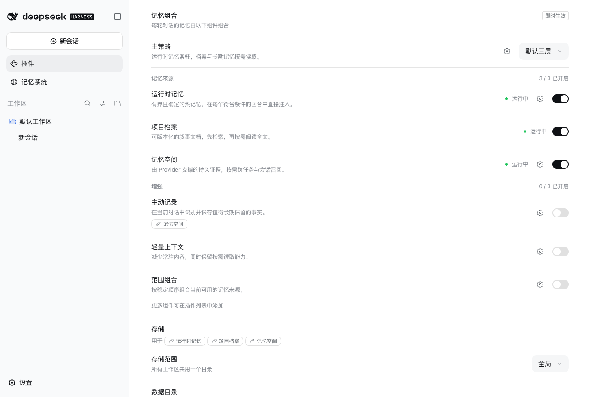 | 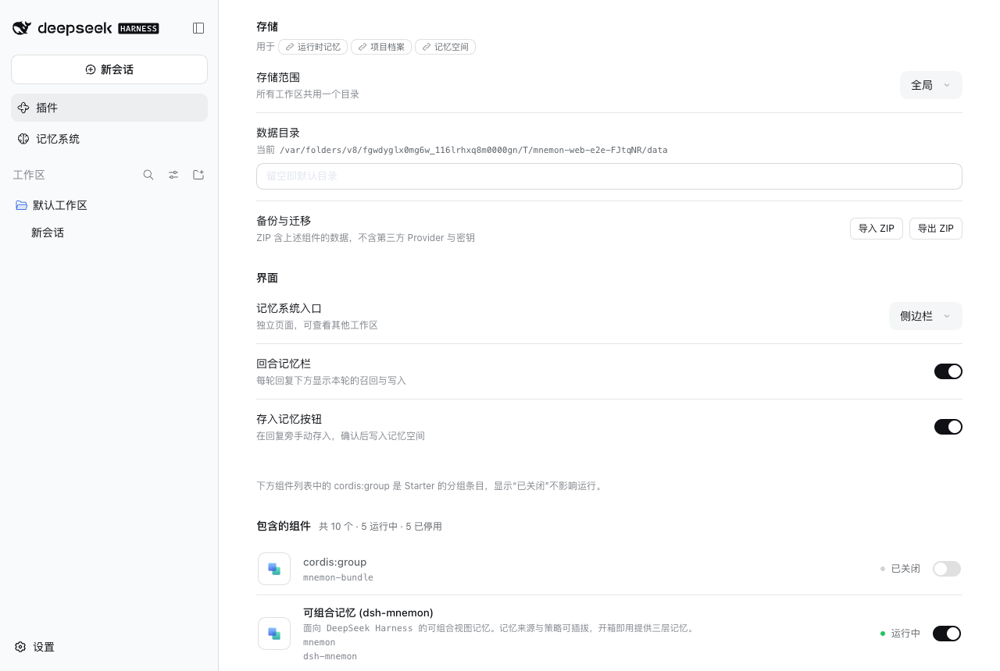 |

改动存储位置需要点击其“应用”，应用行说明后果：

## 设置位于各自组件的页面

| 运行时记忆：USER.md 的位置 | 记忆空间：Provider 与嵌入 |
|---|---|
| 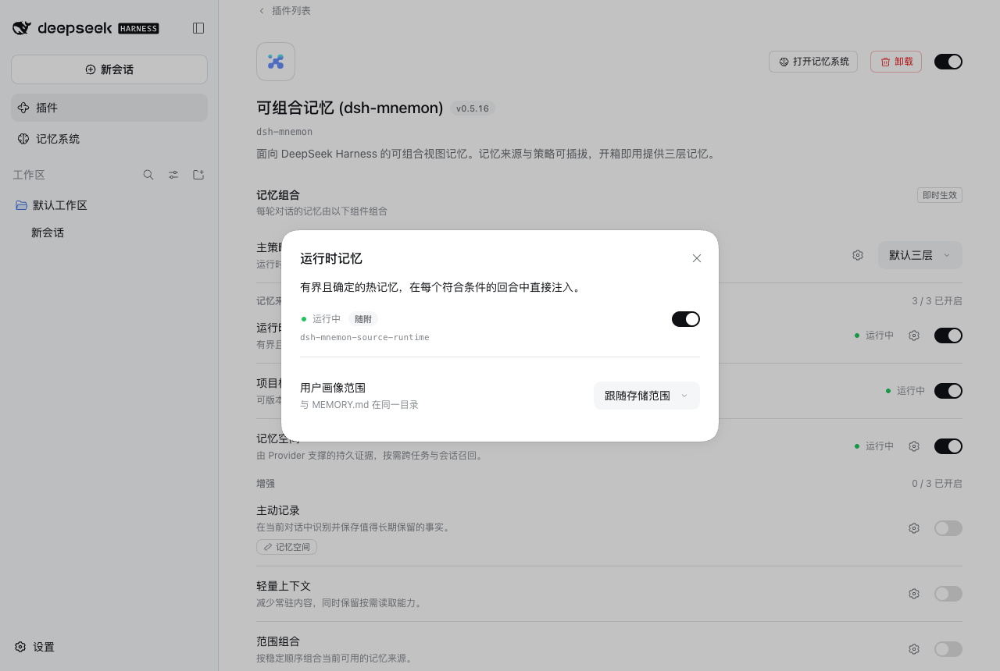 |  |

| 默认三层：后台任务 | 审查参数等待其“应用” |
|---|---|
|  |  |

## 名称即入口

| 行内的关联标签 | 关联名称在原处打开，并可返回 |
|---|---|
|  |  |

声明的选项改动后才出现“应用”：

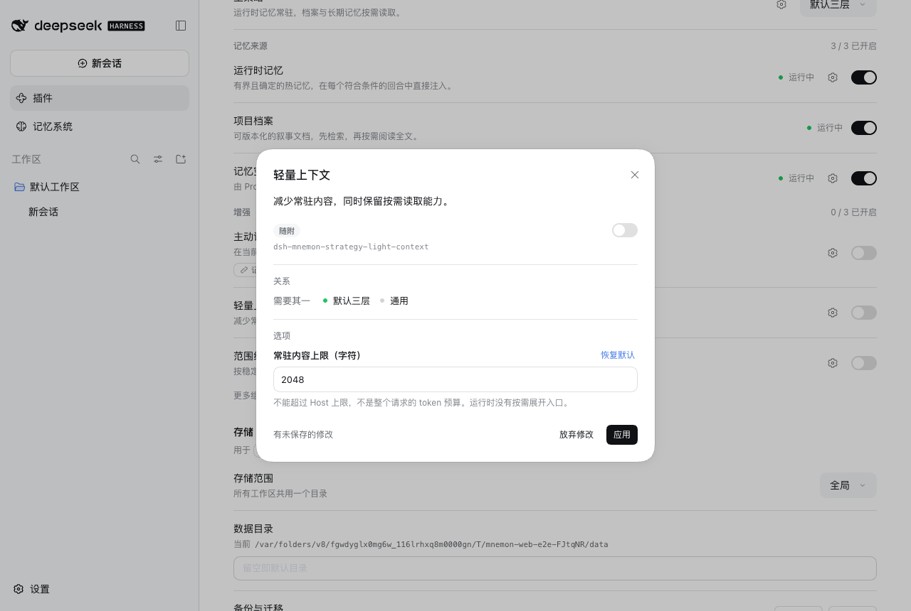

## 记忆系统使用组件声明的名称

标签页、页头的主策略，以及每个 Source 组件的状态卡片都使用组件声明的名称，与配置页一致；每张卡片显示其组件提供的内容。

| 浅色 | 深色 |
|---|---|
| 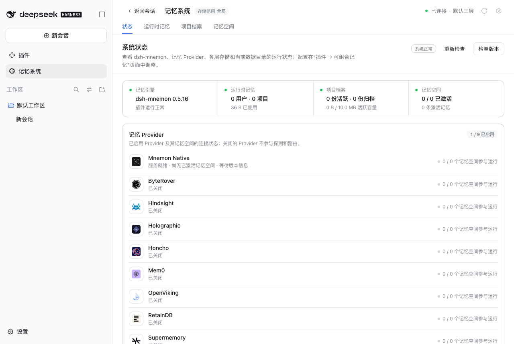 | 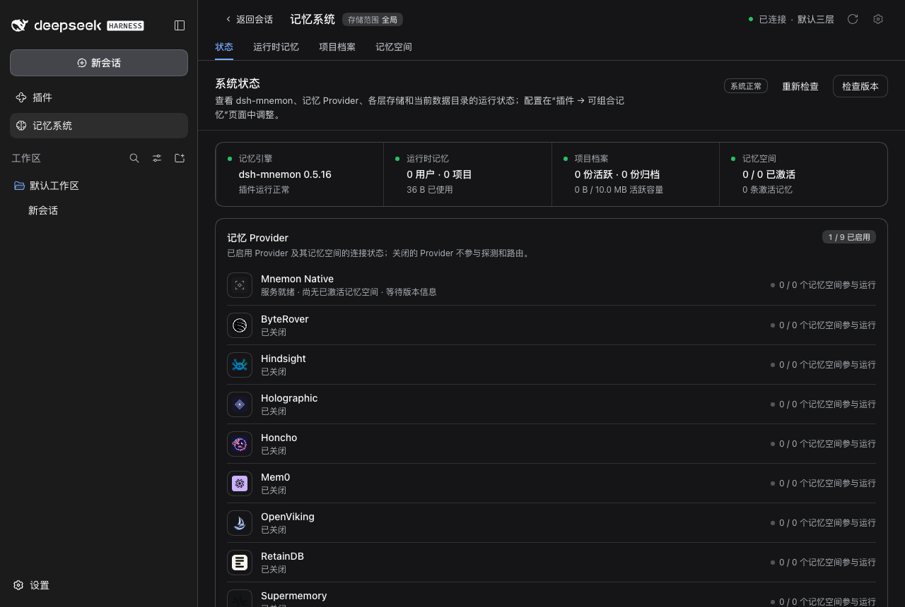 |

## DSH 组件列表打开相同的页面

每个组件包现在向 DSH 提供其声明的名称与说明，配置下方 DSH 自己的列表因此与面板一致；点击列表中的组件名称会打开 DSH 为它提供的页面，其中是相同的组件页，关联组件在其上以弹窗打开。

| 之前的 DSH 列表（包名） | 现在的 DSH 列表 |
|---|---|
| 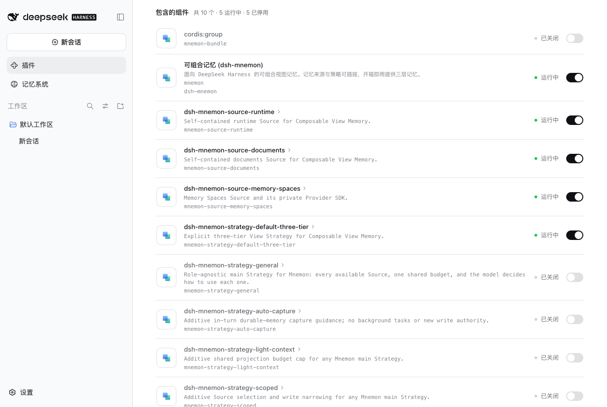 | 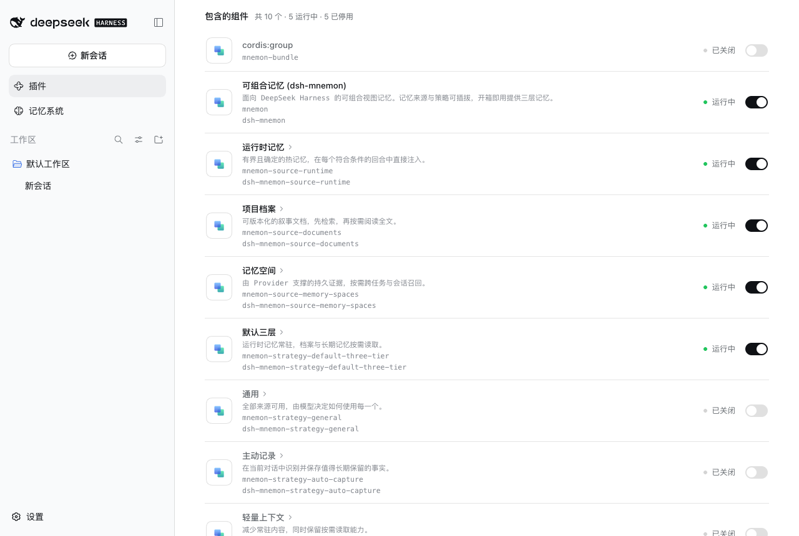 |

| DSH 行页面中的“默认三层” | 关联组件在其上打开 |
|---|---|
| 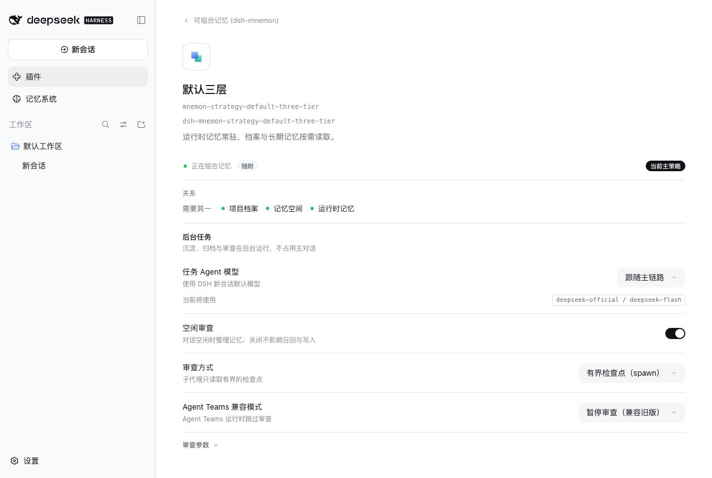 | 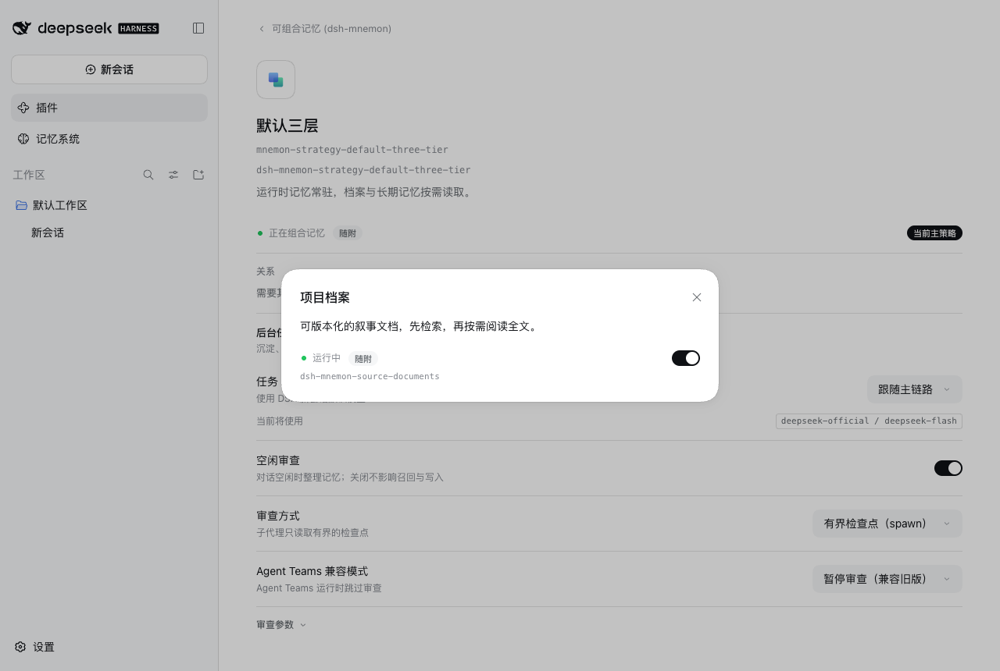 |

## 深色主题与窄列

| 面板 | 存储与界面 | 审查参数 |
|---|---|---|
|  |  | 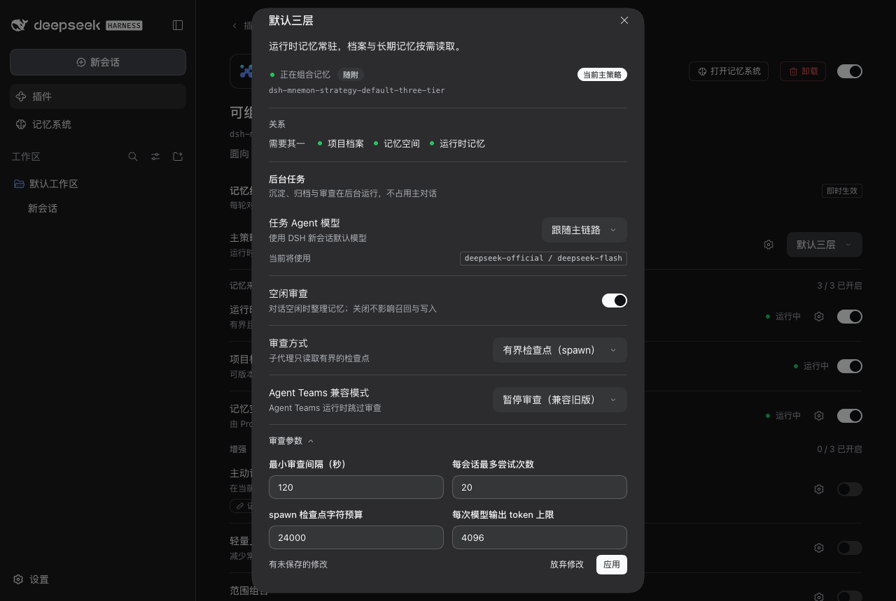 |

| 面板，420 px | 存储应用行，420 px | 审查参数，420 px |
|---|---|---|
|  |  | 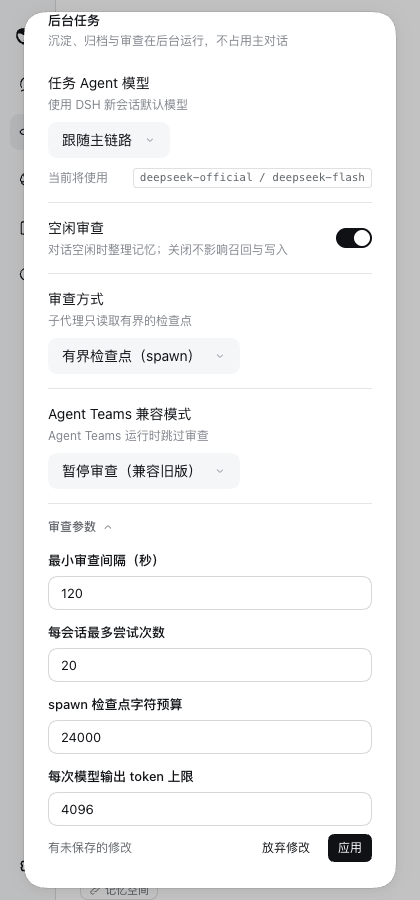 |

## 验证

- 单元测试覆盖设置区域（注册、释放、目录）、随附面板（运行时记忆的用户画像范围，记忆空间的托管开关与连接信息，默认三层的路由、审查选择与参数）、存储的应用与旧键清理、界面选择即时生效且写入被拒时回退并说明、面板上的齿轮、名称、关联标签与返回、声明选项的应用，以及弹窗的盒模型。
- 完整的 `pnpm run verify` 与 `pnpm run release:intent` 通过；包体积预算记录了实测增长。
- 单元测试还覆盖状态卡片区域与随附 Source 的卡片，以及标签页、卡片（包括已关闭的 Source 与未提供内容的 Source）和页头都按组件命名的工作台。
- 单元测试还覆盖面板的单组件页面模式（单个组件、关联页面在其上打开）、8 个行注册，以及各组件包的 DSH 元数据与其声明、Starter 补丁的一致性；`pnpm run verify:plugins` 在真实 DSH 中打包并激活了带元数据的 Starter。
- WebUI：脚本化走查采集 14 个浅色、4 个深色与 3 个窄列状态，无控制台错误；同样的流程也在应用内浏览器中手动完成，包括向真实 Host 写入空闲审查选项，以及修复前捕获到的嵌套路径写入被拒。

## 限制

状态页中的 Provider 列表与存储区仍是 Host 自己的区块，而非组件贡献。行页面只为 Starter 自己的行提供；已安装的包的行仍使用 DSH 默认页面，其组件在面板中仍有组件页。
