# Memory composition drawn from component declarations

[简体中文](./README.zh-CN.md)

Tested implementation: `b348fffa`, stacked on the component linkage record ([record](../plugin-linkage-20260927/README.md)). macOS 15.6, Node 25.1.0, published DSH 0.1.7-rc.2, headless Chrome at 1280 × 860 (and 420 × 900). Each run starts from a fresh isolated WebUI fixture with the Starter's defaults and its test model. No personal memory or credentials were used.

## The board

Groups come from the roles components declare; names and descriptions come from each component's own declaration. Nothing is said while memory is composed as chosen.

| Default | Rows name what they relate to |
|---|---|
| 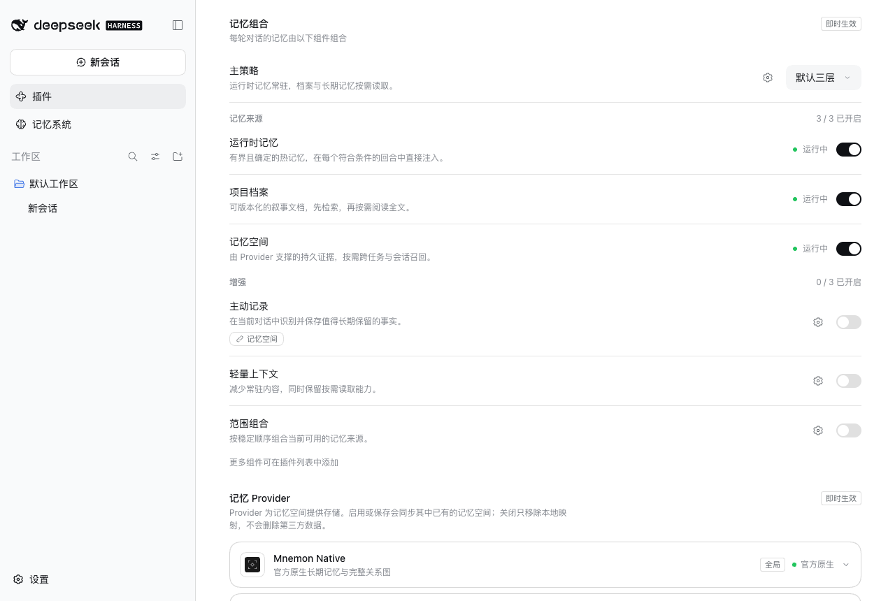 | 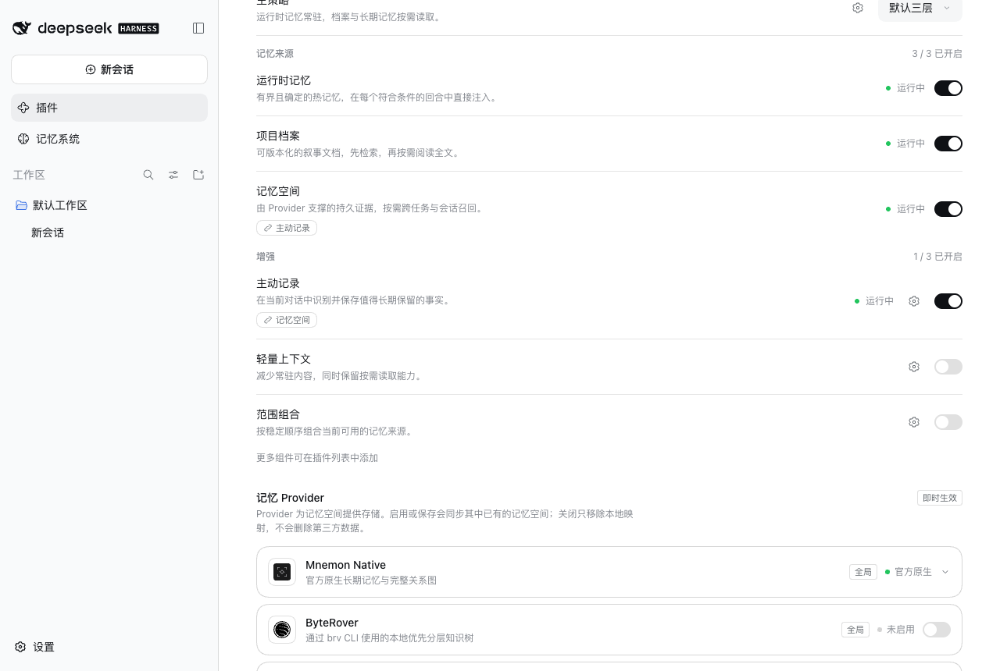 |

## A component's page

Selecting a row opens its page: state and switch, origin and package, relations, and what its switch would also move. The gear opens the same page at its declared options.

| Relations | Declared options |
|---|---|
| 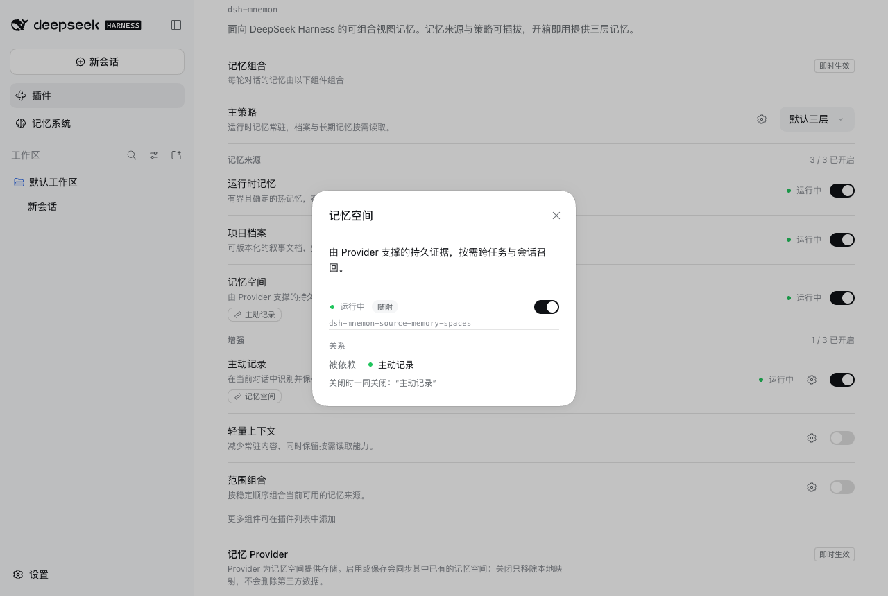 | 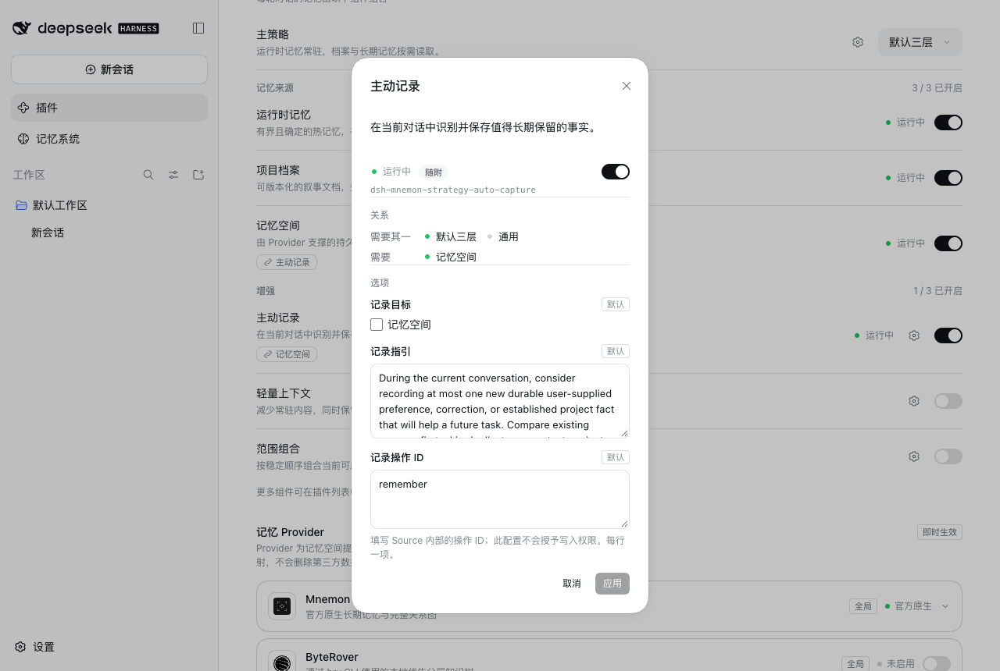 |

## Switches that move others, and problems

| Turning off Memory Spaces takes Active capture along | Memory not in use: the one fix |
|---|---|
| 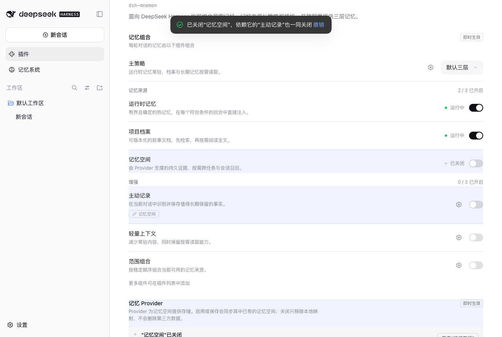 | 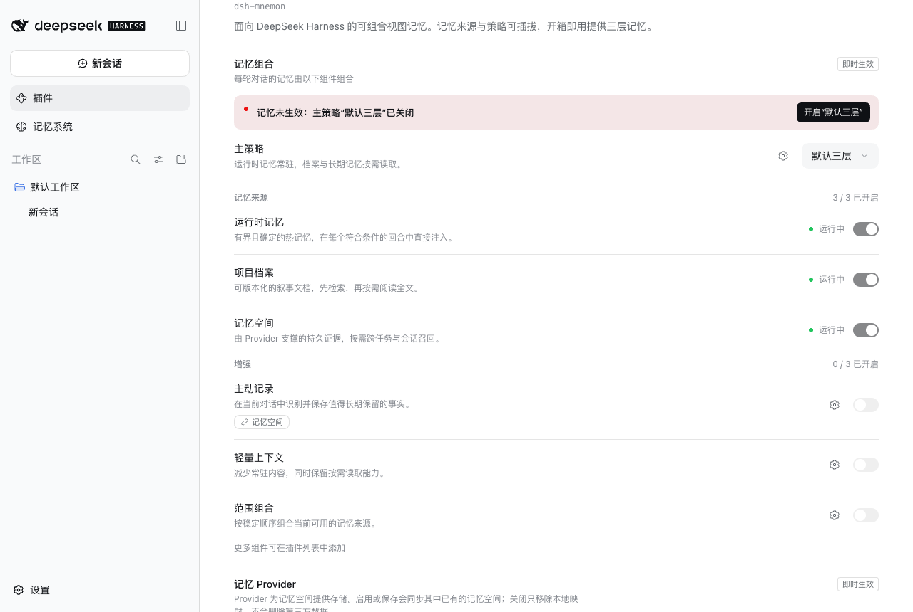 |

The Memory System shows a layer whose Source component is off as off:

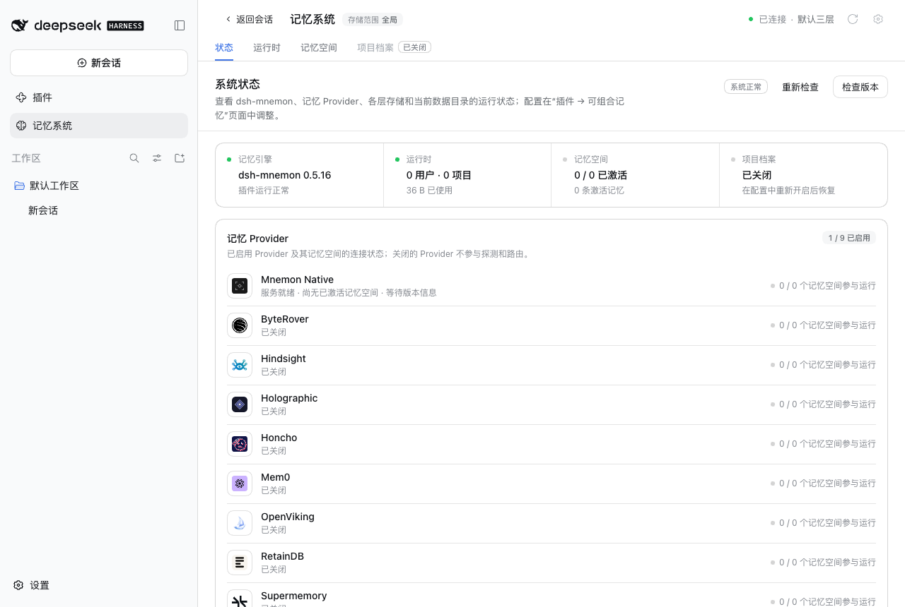

## Dark theme and narrow column

| Board | Page | Cascade |
|---|---|---|
| 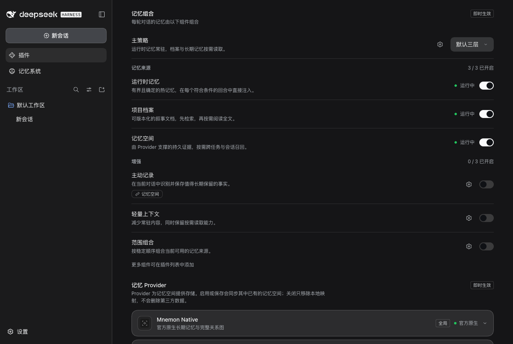 | 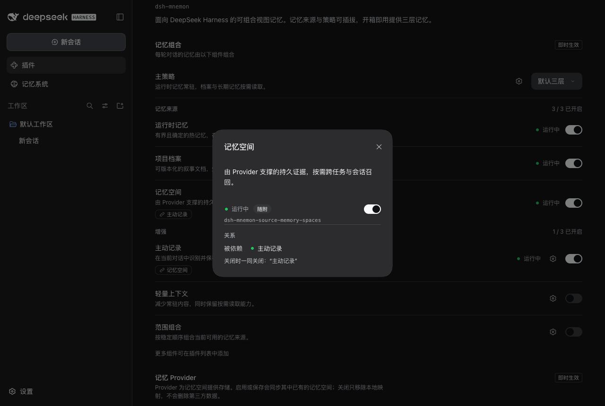 | 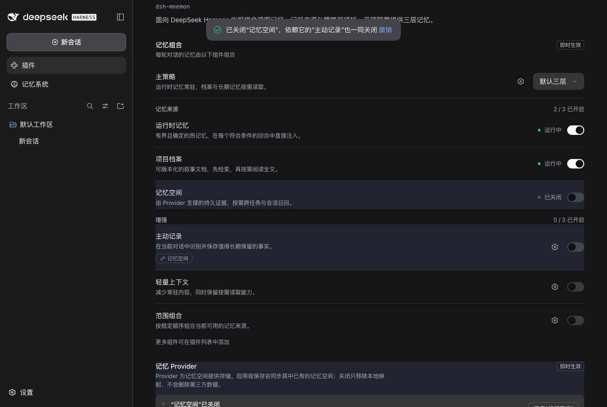 |

| Board, 420 px | Page, 420 px |
|---|---|
| 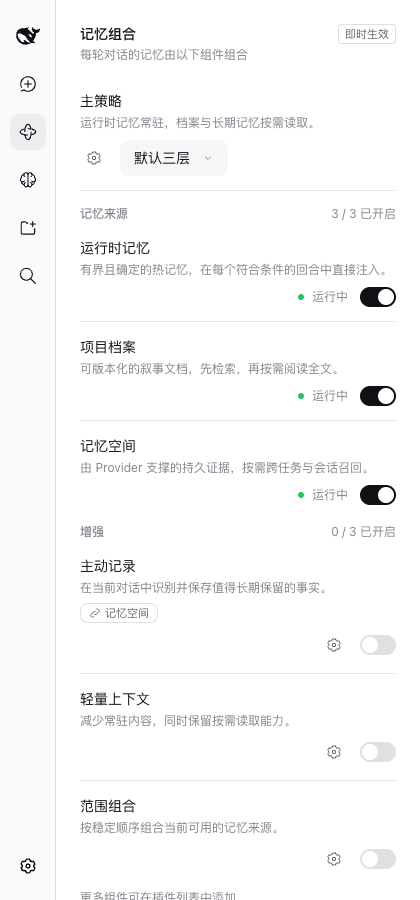 | 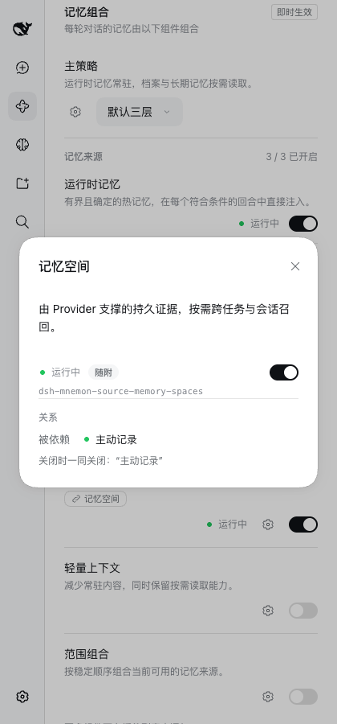 |

## Verification

- Unit tests cover switch planning (dependencies, exclusive claims, extension slots, main Strategy switches, unmanaged Sources), relations, option writes with Undo, the board (selector, groups by role, unknown roles, search, relation chips, pages, options, problem line) and the Memory System's off layers.
- WebUI: 7 light, 3 dark and 2 narrow states captured by a scripted walk on a fresh fixture, with no console errors; the same states were driven by hand in the in-app browser, including an option write and reset on the real Host.

## Limits

Component-owned settings still sit in page-level groups: Memory providers and embedding belong to Memory Spaces, Background tasks to Default three-tier. Moving them into their components' pages through a contribution slot is the next change. The fixture's shipped enhancements all fit any main Strategy, so the closed group for other Strategies and the search are covered by unit tests only.
