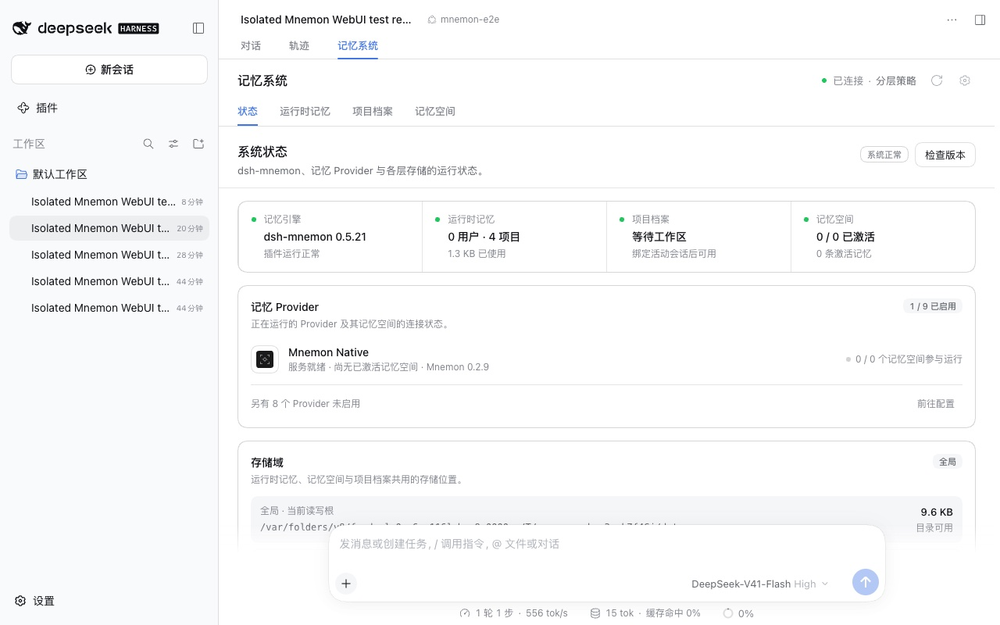
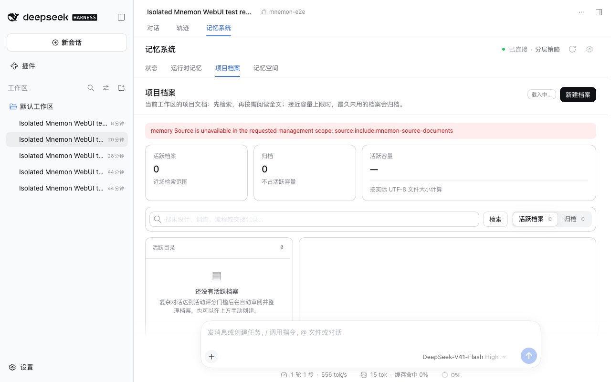
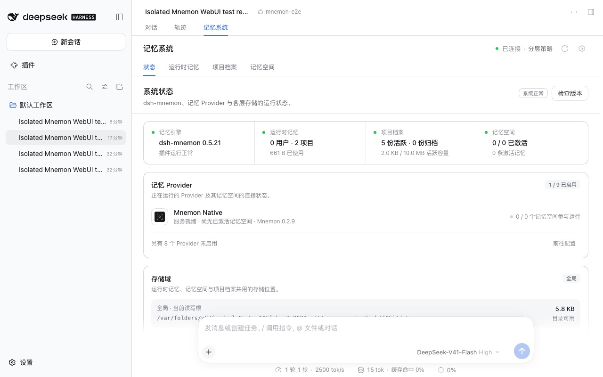
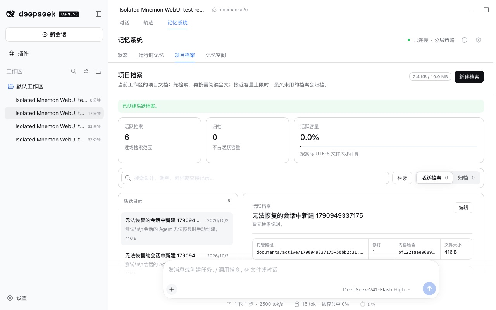

# Memory System in a conversation tab without a loaded Agent

[简体中文](./README.zh-CN.md) | [Verification data](./verification.json)

With **Memory System opens in → Conversation tab**, Project Documents could fail with `memory Source is unavailable in the requested management scope: source:include:mnemon-source-documents`. Status meanwhile read "Waiting for workspace". The Host found a conversation's workspace only through that conversation's loaded Agent. DSH shows a conversation before it resumes the Agent, and some conversations it shows but cannot resume at all, for example one whose Agent preset is no longer in the profile. Until then, the Memory System had no workspace.

Baseline: `main` `06182f4d`, the published dsh-mnemon 0.5.21. Fix: `e0f43ab186a84b586e28ba1644d75daa963daee5`. The runs took place on 2026-10-02 (Asia/Shanghai):
- macOS 15.6 arm64 and Node 24.19.0;
- headless Chrome 154 at 1280×800, zh-CN, light;
- the repository's disposable WebUI fixture with its loopback model stub, on DSH 0.2.0-rc.2 and on 0.1.7-rc.2.

No model is called, and all memories are synthetic.

## Reproduction

The fixture creates two conversations under the test preset. Renaming that preset in the disposable profile and restarting DSH leaves the conversations listed and readable, but DSH cannot resume their Agents. Opening one, the Memory System tab, then Status and Project Documents gives the reported state on both hosts:

| Before: Status | Before: Project Documents |
|---|---|
|  |  |

**New Document** then failed with `current DSH agent is not live; reopen or resume the conversation and try again`. In the sidebar Memory System, Documents loaded through the selected workspace, but creating a Document failed the same way.

## Fix

- **Workspace from DSH's registry.** DSH's workspace registry lists every session, loaded or not (`Workspace.sessionIds`, identical in DSH 0.1.7-rc.2 and 0.2). When a request names a session whose Agent is not loaded, the Host takes that session's workspace from the registry. The request is then aligned with the conversation, as it would be with a loaded Agent.
- **Writes without the conversation Agent.** A new Document and Remember used the conversation's Agent whenever the page was aligned with it. They now do so only when that Agent is loaded; otherwise they write to the Source in the conversation's workspace, as a page without a session does.
- **Task Agents where an Agent is needed.** When Documents are full, a task Agent in the conversation's workspace archives the least recently used Document and then writes, as the conversation's Agent does. A task Agent also chooses a new Memory Space's Provider. Asking an Agent in Memory Spaces and tidying their names and descriptions already worked this way.
- **The right root in workspace storage.** With workspace or centralized storage, such a tab used to read and write Runtime memory and Memory Spaces in the directory DSH was started from. It now uses the conversation's workspace. Entries saved the old way stay in that directory.

| After: Status | After: a Document created there |
|---|---|
|  |  |

On both hosts, the same conversation:
- shows Status with the Documents count;
- loads Project Documents and creates a Document;
- adds a Runtime memory entry ([Runtime](./after-runtime.jpg));
- opens Memory Spaces.

The sidebar Memory System creates the Document too. None of these runs logged a console error.

## Switching

A scripted matrix ran on each host with the fix, without renaming the preset. It records visible errors and the Status Documents card:

1. every Memory System tab in a loaded conversation;
2. a switch to another conversation, opening Project Documents at once;
3. a switch to a conversation that remembers its Memory System tab, after a DSH restart;
4. six fast switches between two conversations across tabs;
5. a Document created in a conversation just switched to;
6. Conversation tab to Sidebar and back while the Memory System is open, through every tab;
7. Sidebar mode switching conversations after a restart;
8. a new conversation before and after its first message;
9. a DSH restart with Project Documents open.

All nine passed on DSH 0.2.0-rc.2 and on 0.1.7-rc.2, with no visible error and no console error. Without the fix, scenarios 1–3 and 9 also passed on DSH 0.2.0-rc.2, because the fixture's DSH resumes a selected conversation within about a second. The reproduction above covers the state those switches cannot reach.

## Automated checks

- New tests route sessions whose Agents are not loaded, in global, workspace and per-workspace storage, through their registry workspaces:
  - Status and the Documents management read succeed;
  - a manual Document write succeeds;
  - a session no workspace lists keeps no workspace.
- Another test sends Remember and a new Document straight to the Sources when the session's Agent is not loaded.
- Further tests cover the task Agents: a full Documents capacity goes to one, while other failures and a page without a conversation keep the Source's answer; Provider placement goes to one. The dashboard aligns such a session with its registry workspace.
- `pnpm run verify` passes: docs (2,981 local links), typecheck, the deterministic build, build, typecheck and tests for all 17 plugins, root tests (113 files, 1,566 passed, 6 skipped), Headless activation, package contents (1,500,772 unpacked bytes, within the 1,501,000 budget), public entries, publint and attw.

## Limits

- The reproduction reaches the unresumable state by renaming the fixture's preset. Other ways to get there, such as a session DSH has not resumed yet, use the same Host path, which the unit tests cover.
- A session that no workspace lists still has no workspace. Archived sessions keep their place in the registry (DSH 0.1.7-rc.2 and 0.2.0-rc.2), so they route to their workspace too.
- Work that runs inside the conversation's own Agent, such as its idle review, still waits for DSH to resume the Agent.
- The task Agent paths are covered by unit tests; the live runs above did not fill Documents to capacity.
