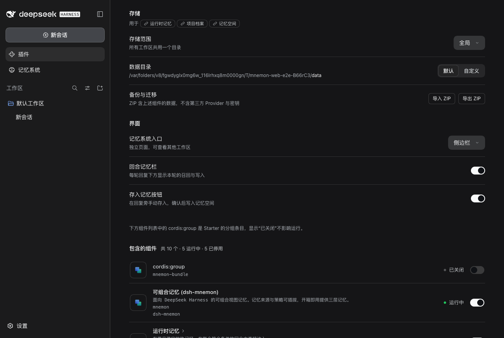
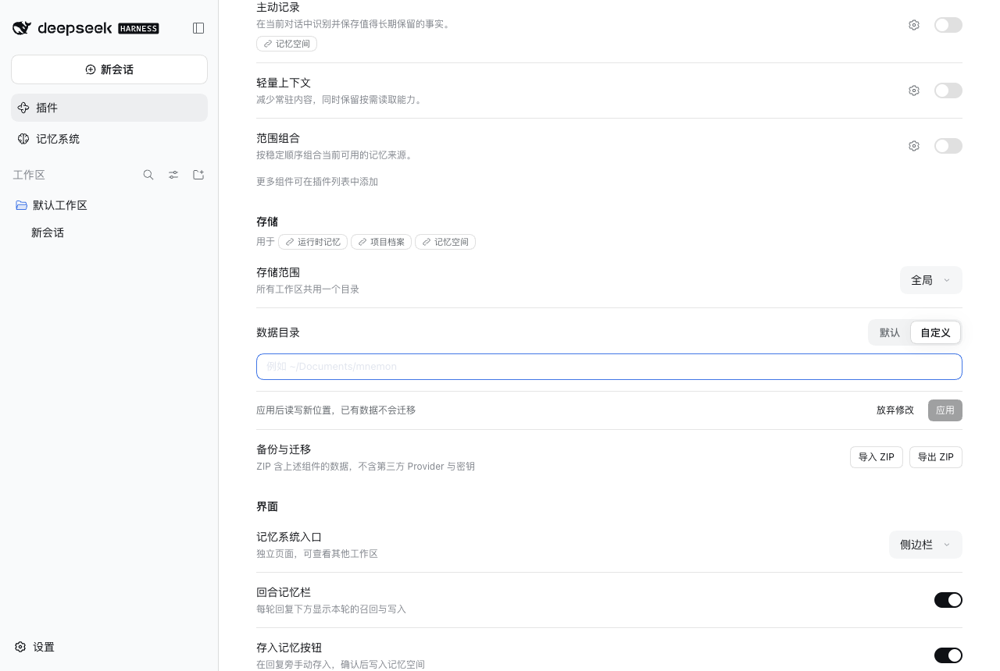
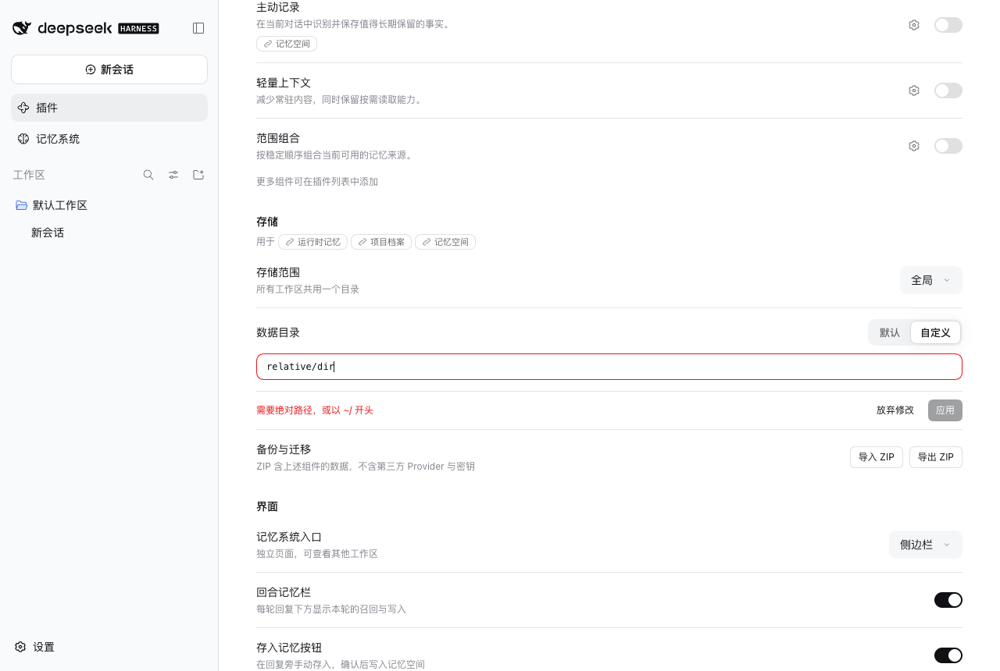
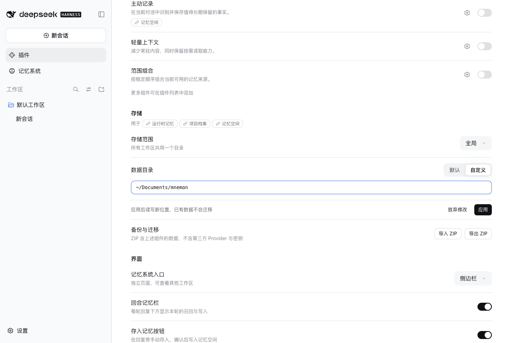
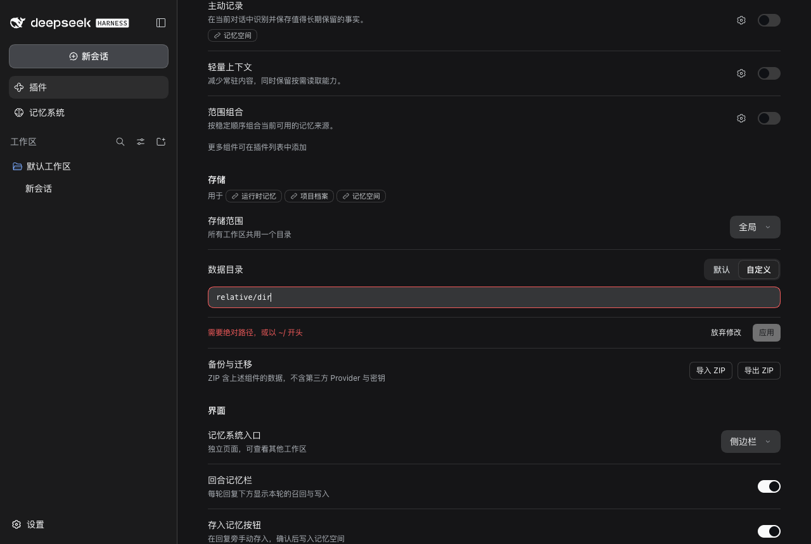
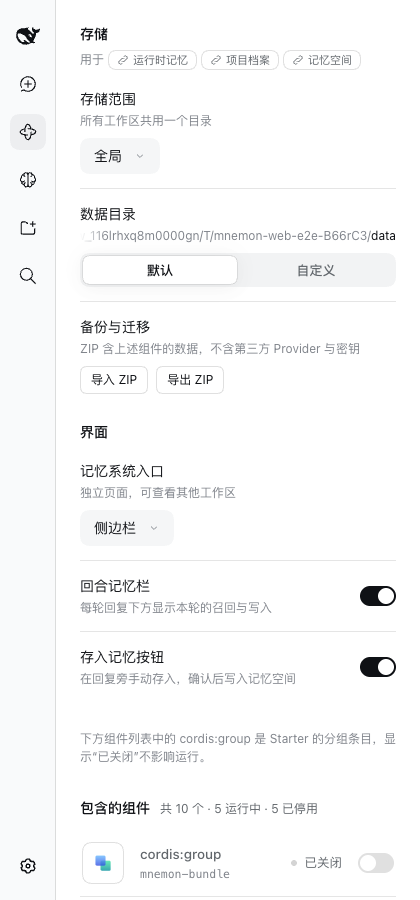
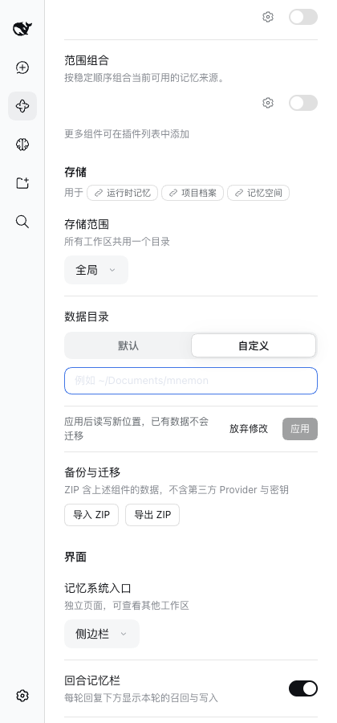

# 数据目录：默认或自定义

[English](./README.md)

实测实现：`edbffc58`，叠加在策略名称之上（[记录](../strategy-names-20260927/README.zh-CN.md)）。macOS 15.6、Node 25.1.0、已发布的 DSH 0.1.7-rc.2、headless Chrome 1280 × 860（以及 420 × 900）。每次运行都从 Starter 默认配置与其测试模型的隔离 WebUI fixture 开始，界面中的路径是该 fixture 的临时数据目录，未使用个人记忆或凭据。

## 这一行只显示一个目录

此前这一行先显示当前位置，下方再给一个留空即默认的输入框。现在“数据目录”在“默认”与“自定义”之间选择，只显示记忆正在使用的目录。默认目录显示在标题下方，较长时保留路径末尾。

| 浅色 | 深色 |
|---|---|
|  |  |

## 自定义需要填写路径

选择“自定义”后出现空输入框，光标已在其中。填写路径前“应用”不可用，但不会把空输入框标成错误；路径填写有误时说明原因。

| 自定义，尚未填写 | 填写有误 |
|---|---|
|  |  |

| 可以应用的路径 | 填写有误（深色） |
|---|---|
|  |  |

## 窄屏

| 默认 | 自定义 |
|---|---|
|  |  |

## 验证

- 单元测试覆盖：标题下方的默认目录、集中存储下本工作区的目录、自定义目录只出现在输入框中、选择“自定义”后聚焦空输入框且“应用”不可用、通过选择“默认”回到默认目录（全局范围取消目录，集中存储置空根目录）、相对路径与 Windows 盘符及 UNC 路径、旧版 Pack 迁移与只读设置；Host 测试覆盖 pack target 返回的默认目录。
- 完整的 `pnpm run verify`、`pnpm run verify:plugins`、`pnpm run verify:docs` 与 `pnpm run release:intent` 均通过。
- WebUI：脚本化走查截取 4 个浅色、2 个深色与 2 个窄屏状态，控制台无错误；同一流程也在应用内浏览器中手动操作过。

## 限制

范围改动应用之前，只有默认目录会显示将使用的位置；“工作区”与“集中存储”由“应用”一行说明应用后的效果。ZIP 区域与状态页仍按各自的措辞显示当前根目录。
