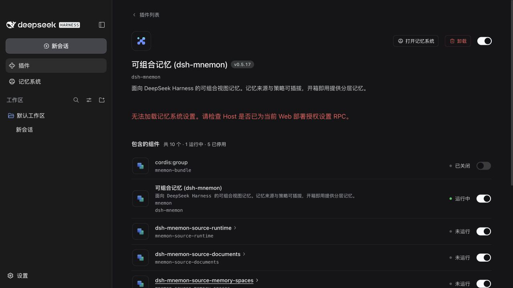
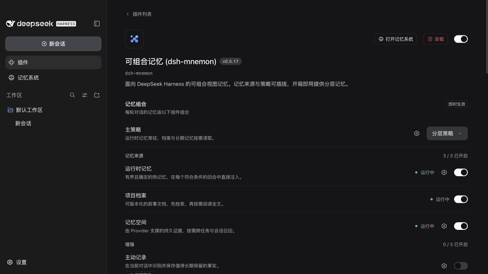
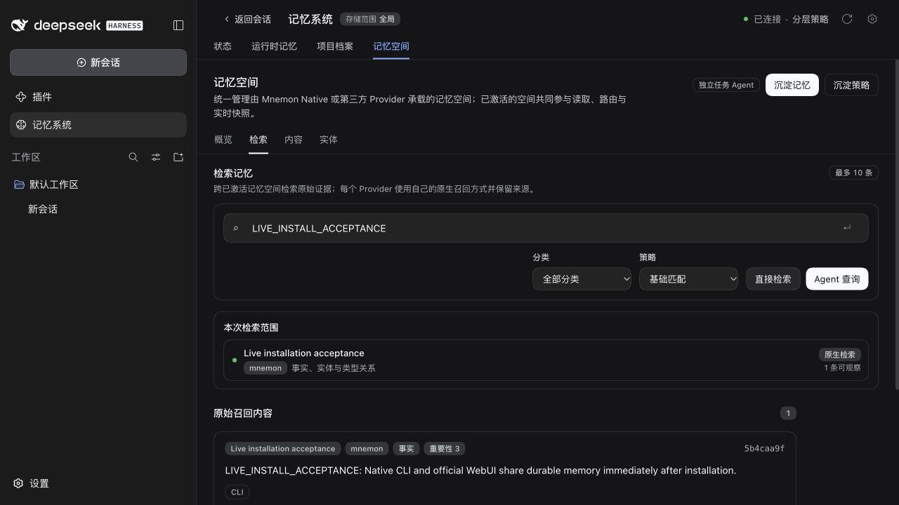

# Desktop 与官方 WebUI 启用验收

[English](README.md)

2026-09-28 使用独立 profile 和测试数据验收。全部修改位于 dsh-mnemon，未修改 DSH 或用户实际的 Desktop 安装。

## 复现与修复

基线为已发布的 dsh-mnemon `0.5.17` 和未修改的 DSH `0.1.7-rc.2`。profile 只暴露根 bundle，17 个组件包实际位于独立安装 generation 中。宿主启动时不选中 Mnemon，再通过官方插件页启用：Runtime、Documents、Memory Spaces 和默认 Strategy 抛出 `ERR_MODULE_NOT_FOUND`，原因是运行中的宿主仍使用启动时的解析表。

候选修复先准备 Starter 的依赖解析，再启用原生分组。同时，Mnemon 自己持有 Web 传输作用域，即使官方 Connection 已运行，也能注册所需 RPC。缺少第二处修复时，官方 WebUI 首次安装后组件虽然启动，但页面 RPC 会返回 HTTP 405。

已有 Entry ID、核心总开关、组件独立选择、原生配置 schema 和私有 Provider 子项均保留。其他启动时已加载的 bundle 即使已停用，其依赖路径也继续保留。更新 Node 已加载的包仍可能需要重启宿主。

| 发布版：组件与设置不可用 | 候选修复：组件运行、设置正常 |
| --- | --- |
|  |  |

## 候选制品与环境

- 基于 `accd87513c6330fbf8af64f4352657dcca390991` 加本 PR 修改。候选包仍标记为 `0.5.17`，尚未发布；changeset 请求补丁版本发布。
- 官方 WebUI：npm DSH `0.1.7-rc.2`、Node `24.20.0`、全新 profile，通过官方“添加插件”流程安装全部 18 个候选 tarball。本地回环 registry 提供候选包，profile 中没有链接源码 checkout。
- Desktop：Desktop `0.10.0` 随附的未修改 DSH `0.1.7-rc.2`，通过仓库 Electron fixture 在真实 Electron `44.0.0` 主进程、Node `24.18.1` 内运行，未设置 `ELECTRON_RUN_AS_NODE`。验收覆盖随附宿主与官方 WebUI，不代表完成 Desktop 安装程序的整体升级测试。
- Native CLI：Mnemon `0.2.9`，数据目录独立。本次启动回归不需要远程模型或第三方 Provider。
- [脱敏验收记录](validation.json)包含候选包摘要、CLI 结果和保持不变的 WebUI 宿主 PID。

## 真实 WebUI 验收

1. 启动未安装 Mnemon 的官方 WebUI。[空白安装基线](web-before-install.png)来自同宿主版本的另一全新 profile。
2. 通过“添加插件”安装候选根 tarball，在[安装结果](web-installed.png)中点击“立即启用”。安装、启用及以下操作期间，宿主始终保持运行。
3. 打开记忆系统：[状态正常](web-status.png)，三个 Source 和默认 Strategy 均可用。
4. 新建并读取 Runtime 条目：[运行时记忆结果](web-runtime.png)。
5. 新建并读取项目档案：[档案结果](web-documents.png)。
6. 在界面中创建、激活 Native 记忆空间。通过 `mnemon remember` 写入测试事实，用 CLI `recall` 确认，再在[官方 WebUI](web-recall.png)的“检索 → 基础匹配”中读取同一条事实。
7. 停用再启用 bundle。侧栏恢复，Runtime 与 Documents 内容保留，[同一个已激活 Native 空间及记忆仍在](web-reenabled.png)。原宿主 PID 仍存活，fixture 仅启动过一次宿主。

实际执行的 CLI 命令如下，`MNEMON_DATA_DIR` 指向独立测试目录：

```bash
mnemon --data-dir "$MNEMON_DATA_DIR" --store default remember \
  'LIVE_INSTALL_ACCEPTANCE: Native CLI and official WebUI share durable memory immediately after installation.' \
  --cat fact --no-diff
mnemon --data-dir "$MNEMON_DATA_DIR" --store default recall LIVE_INSTALL_ACCEPTANCE --basic
```



## Electron 验收

在 Electron 中启动随附 DSH 宿主，初始不选中已安装 bundle，再通过官方 WebUI 启用。[组件列表](after-components.png)、[正常的状态页](electron-status.png)和[新建 Native Store](electron-native.png)证明启用成功，并实际执行了 CLI 子进程。既有的上游 `cordis:group` 显示问题仍记录在[兼容性说明](../../zh-CN/reference/compatibility.md#dsh-017-bundle-组件列表)中，它不代表 Source 或 Strategy 停止运行。

## 自动化验证

```bash
pnpm run verify
pnpm run verify:plugins
```

两项均在 Node `24.20.0` 上通过：

- 根包测试：1,513 项通过，6 项条件集成测试跳过。跳过项需要主动开启 Flash 压力／质量测试或专用 Native 容量 fixture；真实 Native 启用链路已按上文单独验收。
- 构建、类型、文档链接、包内容、公开入口导入、`publint` 和 `attw` 均通过。发布包包含 55 个文件，解包后为 1,471,089 字节。
- Headless 激活暴露 37 个工具，包含 8 个代表性 Mnemon 工具。设置迁移、重启和旧版核心停用开关均通过。
- 17 个独立插件包均通过独立安装／构建／类型及各自测试，环境限定的 Native／Windows／OpenViking 集成项跳过。18 个打包制品通过 SDK／Client 组合、可选 Strategy 组合和只安装根 Starter 的验收。
- 正式宿主生命周期回归覆盖隔离依赖下的后启用、其他启动后已停用 bundle、组件独立选择、原生配置 schema、核心／bundle 开关及重启持久化。官方 Connection 回归确认后启用时注册 RPC，并在 Mnemon 释放时移除路由。
