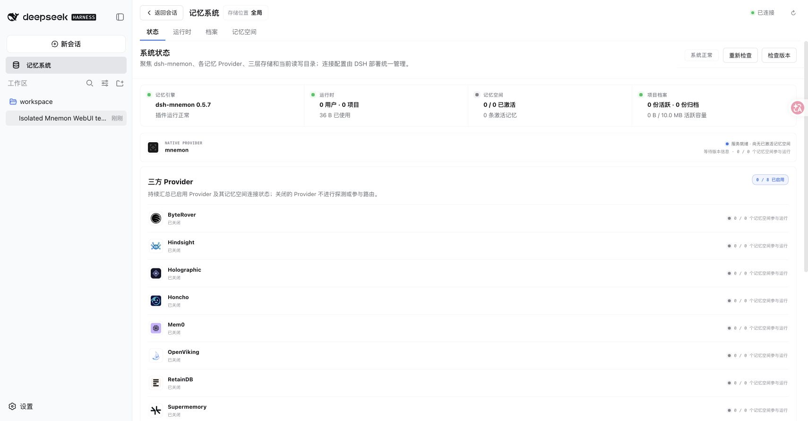
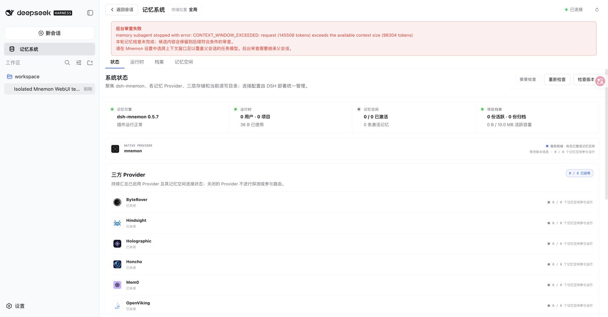
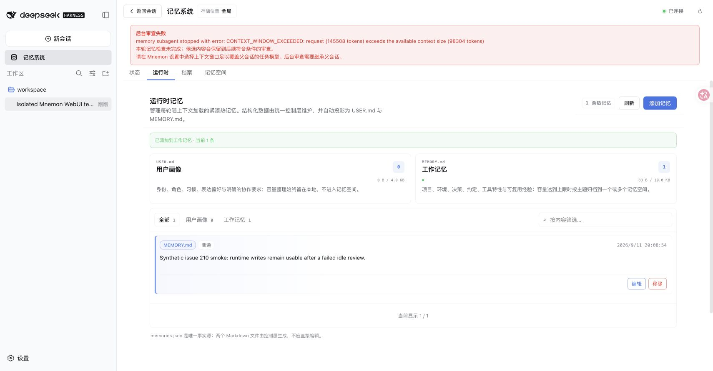

# Idle-review failure visibility — issue #210

English / 中文 · 2026-09-11 · Base `1e19caf` · DSH `0.1.5-rc.1`, Node `25.1.0`, pnpm `11.19.0`, Mnemon CLI `0.2.7`.

The real DSH WebUI ran with disposable Host/data/workspace directories and all three Strategy enhancements enabled. Only the loopback model endpoint was controlled: after two real conversation turns, the inherited fork worker received HTTP 400 with `CONTEXT_WINDOW_EXCEEDED` and synthetic token counts (145508 / 98304). This reproduces the error path; it does not measure a real 145K-token model request or a paid provider.

Before the fix, the new lifecycle/UI regressions failed and the memory page showed “System nominal” after the rejected review. Afterward, the Host logged the bounded error and the workspace showed a warning with task-model context-window guidance. A real UI runtime-memory write succeeded while the warning remained visible. The read-only UI regression also displays the diagnostic. Aborted reviews stay quiet; ordinary turns retain the warning and a successful review clears it. Fork inheritance, dirty candidates, and the existing retry eligibility remain intact. The warning is loaded with workspace status or its Refresh action, not pushed as a toast; it does not wake the parent model.

真实 DSH WebUI 使用临时 Host、数据与工作区目录，并同时启用三个策略增强。仅模型端点受控：两轮真实会话完成后，继承父会话的 fork worker 收到含 `CONTEXT_WINDOW_EXCEEDED` 的 HTTP 400，token 数（145508 / 98304）为合成值。该测试复现错误处理路径，不代表实际发送了 145K token 或调用付费服务。

修复前，新增生命周期与 UI 回归测试失败，审查报错后记忆页仍显示“系统正常”。修复后，Host 记录有界错误，工作区展示警告和任务模型窗口指引；保留警告时，真实 UI 热记忆写入成功。只读 UI 也可查看错误。取消审查不报警，普通轮次保留警告，成功审查后清除。fork 继承、候选内容及原有重试资格规则保持不变。警告随工作区状态加载或刷新显示，不会启动父模型或弹出通知。

## Reproduce / 复现

```sh
pnpm build
pnpm --workspace-concurrency=4 -r build
MNEMON_CLI_PATH=/absolute/path/to/mnemon pnpm e2e:serve --review-failure --strategy-extensions
```

Choose the printed disposable workspace and Mnemon E2E preset. Send a durable “Please remember” architecture rationale longer than 150 characters, then confirm it in a second turn. Wait five seconds and open Memory System. / 选择日志中的临时工作区和 Mnemon E2E 预设，发送超过 150 字符的长期决策与 “Please remember”，第二轮确认，等待五秒后打开记忆系统。

## Verification / 验证

- `pnpm run verify`: passed; 930 root tests, 5 expected skips, full plugin checks, deterministic builds, real isolated Headless activation, package/public-entry validation.
- `pnpm verify:plugins`: passed; 16 independent plugin repositories and 17 tarballs, including isolated Starter activation and all three enhancements.
- `MNEMON_NATIVE_TEST_CLI=/opt/homebrew/bin/mnemon pnpm --filter dsh-mnemon-source-memory-spaces exec vitest run tests/native-integration.spec.ts`: passed; real CLI create/write/recall/forget in a disposable store.
- Bilingual documentation links and `git diff --check`: passed. Upstream missing source-map notices are non-failing.
- Composition follow-up: the real loopback fixture returns HTTP 200 for a parent that advertises the stable result tool, and HTTP 400 only for a child completion persona (stable or legacy tool name). A user message quoting the protocol also stays HTTP 200. / 组合验证：真实本地端点对公开固定结果工具的父任务返回 HTTP 200，仅对子任务完成 persona 返回 HTTP 400（兼容固定和旧工具名）；用户消息引用协议仍返回 HTTP 200。




