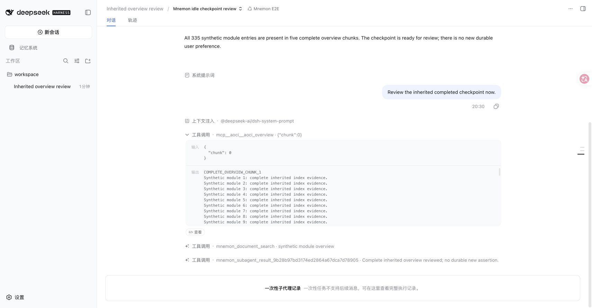
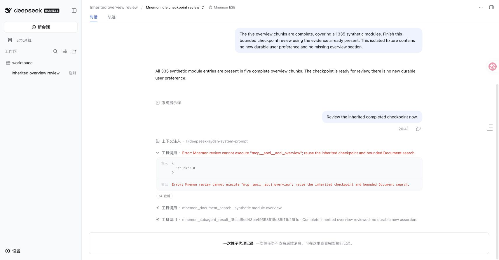
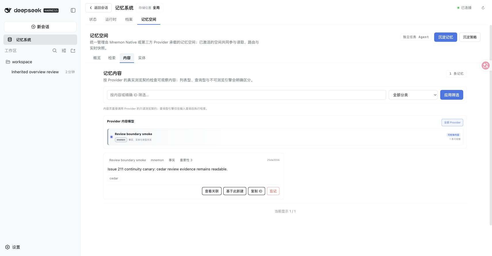

# Idle review evidence reuse and tool composition

**English** | [简体中文](./README.zh-CN.md)

Issue [#211](https://github.com/omdsh-dev/dsh-mnemon/issues/211), verified 2026-09-11 against base `1e19caf40f0bf37edf678c3d829f2398ab28792a` and this PR's Host changes. [verification.json](./verification.json) records the source hashes, environment, measured results, and limits.

The baseline already excludes AOCI from `REVIEW_TOOLS`. The reproduced gap is more specific: DSH's `tools.restrict()` filters inherited tools but preserves tools registered directly on a child Agent. An independently composed plugin that registers an overview tool on every Agent can therefore expose it to an idle reviewer. The real baseline reviewer executed that tool even though all five complete overview chunks were inherited.

The fix attaches DSH's monotonic `tools.guard()` during child publication. An exact asynchronous start identity and `agents.isOwnedBy` keep concurrent and nested reviews separate. The guard stays installed until owned child disposal settles and admits the review allowlist plus the `run_code` transport; each Code Mode subcall is checked again. The persona tells the reviewer to reuse complete inherited evidence and skip candidates that bounded Document search cannot establish. Ordinary parent tools and manual memory actions remain available.

## Reproduction and results

Only model choices and the synthetic overview provider are fixtures. Agent publication, inherited history, tool dispatch, the fork provider, memory composition, persistence, CLI, HTTP transport, and WebUI are real published implementations. The fixture has 335 synthetic entries in five chunks, totaling 19,112 characters. It makes the same attempted child read before and after the fix; it does not choose its behavior based on the new persona.

| Observation | Baseline | Fixed |
|---|---:|---:|
| Complete inherited overview chunks | 5 | 5 |
| Authorized parent overview reads | 5 | 5 |
| Attempted child overview reads | 1 | 1 |
| Executed child overview reads | 1 | 0 |
| Successful bounded Document searches | 1 | 1 |
| Completed review result | skipped | skipped |

Run `pnpm exec vitest run tests/review-evidence-host.spec.ts tests/review-tools.spec.ts tests/subagent.spec.ts`. The real-host test covers native tools and the published worker-thread Code Mode runtime, including a tool attempt before the coordinator receives its run handle. Copy only the new real-host test and browser fixture into a baseline worktree to reproduce the failure; leave baseline Host source unchanged.

For the browser run, build Root and plugins, then use `pnpm e2e:serve --review-evidence --strategy-extensions`. Choose the printed disposable workspace and Mnemon E2E preset. Send these two turns:

1. `Read the complete synthetic overview once, then review the inherited checkpoint.`
2. `The five overview chunks are complete, covering all 335 synthetic modules. Finish this bounded checkpoint review using the evidence already present. This isolated fixture contains no new durable user preference and no missing overview section.`

The normal activity gate is unchanged; the fixture shortens only the idle debounce to five seconds. Open the review child from the conversation's subagent menu. All three optional Strategy extensions were enabled in both browser runs.

## Verification and limits

The Root suite passed 935 tests and the plugin suites passed 323, with seven opt-in skips. The targeted suite passed 94 tests. Type checks, deterministic builds, Headless activation/restart/disable checks, package contents, public entries, and package lint passed. The initial package check measured 1,271,378 unpacked bytes against a 1,270,000-byte cap; the audited Host-only guard raised the cap to 1,275,000, and the package check then passed.

The opt-in real Native Source suite passed 169 tests with one Windows-only skip, using `MNEMON_NATIVE_TEST_CLI=/opt/homebrew/bin/mnemon`. In the real WebUI, a new Native space was created after review, CLI 0.2.7 wrote an exact canary with `--no-diff`, the UI read it, and the normal Forget action returned the list to zero items.

Published DSH 0.1.1-rc.1 and 0.1.2-rc.1 tarballs were inspected for `isOwnedBy`, own-scope filter behavior, and `tools.guard`; the executable host/browser tests use 0.1.5-rc.1 on macOS arm64, Node 25.1.0, and pnpm 11.19.0. Missing guard support fails review explicitly. No persistence format, credentials, RPC authority, or personal memory changed.

This does **not** reproduce the reporter's exact Windows/AOCI profile, six historical reads, or approximately 37K token usage. There was no live model call, AOCI server, or measured token-saving claim. The evidence establishes the current composition gap and its execution-level fix, not model judgment quality. The HTTP fixture and real-host test accept both the legacy unique-result-tool protocol and the stable result tool with a request envelope.
