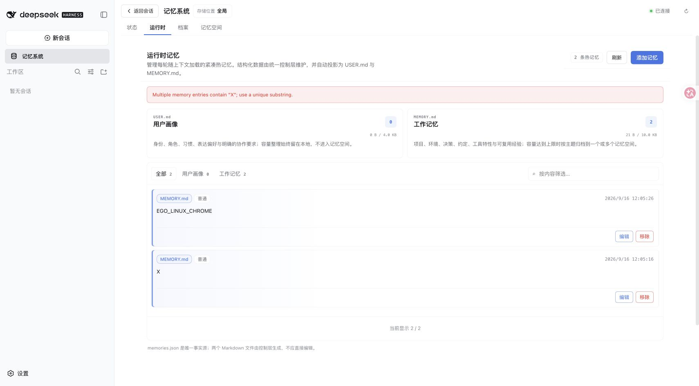
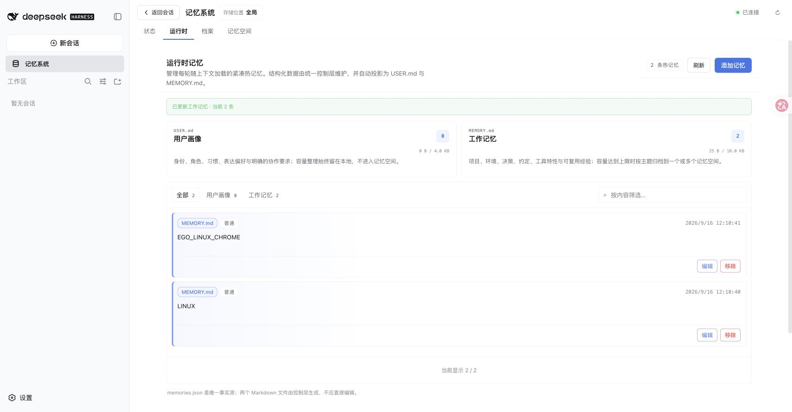
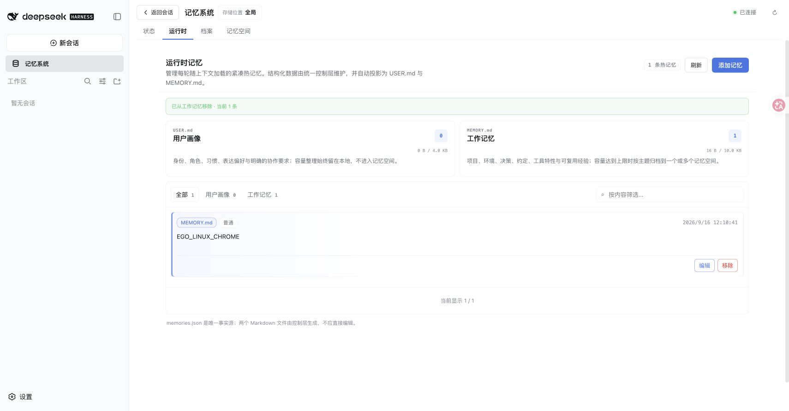

# Runtime exact entry matching — issue #217

[简体中文](./README.zh-CN.md)

On 2026-09-16, the unmodified main revision `1363ebffaf19c9ab4badf0137f6fe87acacaf989` reproduced the reported collision in the actual DSH WebUI. The fixed revision is `098b8127444c67145e77a4e39f6a6f160280f5ed`. Both ran in separate worktrees and disposable profiles on macOS arm64, Node 25.1.0, pnpm 11.19.0, published DSH 0.1.5-rc.1 and the official checksum-verified Mnemon CLI 0.2.8. The Scoped, Light context and Active capture Strategy plugins were enabled together.

## Browser reproduction and verification

Build each revision, then run `MNEMON_CLI_PATH=/path/to/mnemon pnpm e2e:serve --strategy-extensions`. In Chrome, open Memory → Runtime and add two working-memory entries: `X` and `EGO_LINUX_CHROME`. All mutations below were performed through the visible UI, with its ordinary confirmation dialog.

| Operation | Main | Fixed |
| --- | --- | --- |
| Remove `X` | Reports `Multiple memory entries contain "X"; use a unique substring.`; both entries remain | Removes only `X` |
| Edit `X` to `LINUX` | Reports the same ambiguity and retains `X` | Succeeds and retains the containing entry |
| Remove the resulting `LINUX` | Not reachable after the rejected edit | Succeeds even though `LINUX` is part of `EGO_LINUX_CHROME` |

The fixed run additionally added a fresh `X` and removed it directly, repeating the original reported operation. Direct inspection of the disposable `memories.json` and `MEMORY.md` confirmed the final content is exactly `EGO_LINUX_CHROME`, with its original creation/update timestamps unchanged. The baseline files still contained both original entries after its rejected operations.

## Automated checks and limits

Before the production edit, five controller regressions and two Source/client regressions failed on the old implementation. Afterward, all 51 Runtime package tests passed. Coverage includes both targets and actions, duplicate exact rejection, substring fallback, branch projection, byte-preserving refusal, capacity maintenance, management confirmation/revision checks, read-only UI and independent Source instances.

`MNEMON_NATIVE_TEST_CLI=/path/to/mnemon pnpm run verify` passed: all plugin builds/typechecks/tests, 1,128 root tests with five expected opt-in skips, deterministic builds, actual isolated Headless activation, package/export checks and release-intent validation. The real Native integration exercised write, recall and forget; the root suite also ran the actual Native capacity workflow. The Memory Spaces package had one expected opt-in skip. No model API was needed for these direct UI operations; the E2E profile's model endpoint is a deterministic loopback fixture.

The in-app browser failed to load the DSH client bundle before testing began. Chrome loaded the same unchanged Host normally; no browser or Host security setting was changed. This is macOS/Chrome evidence, not a claim of testing the reporter's Windows/WSL browser environment. No persistence format or migration is introduced by this fix.
