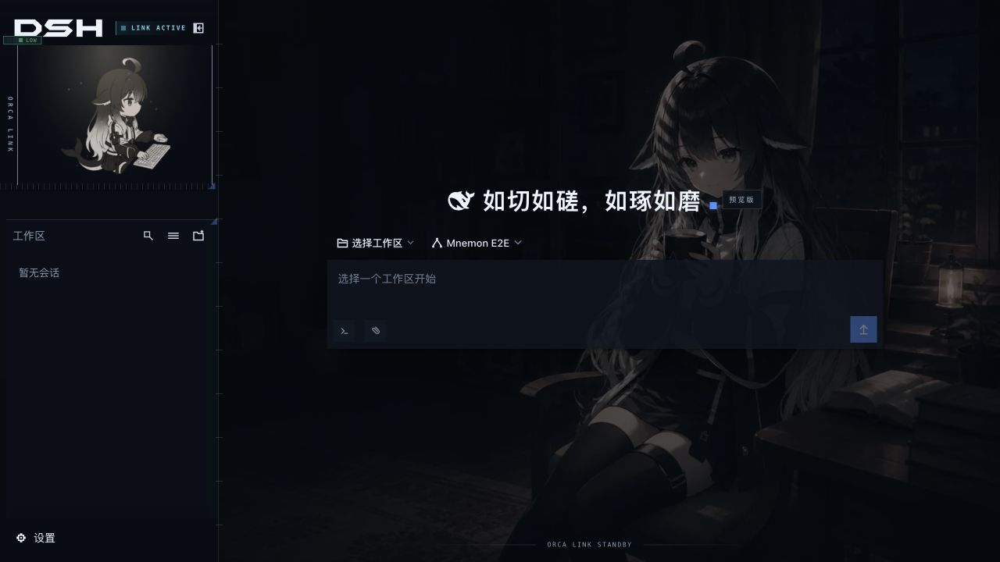
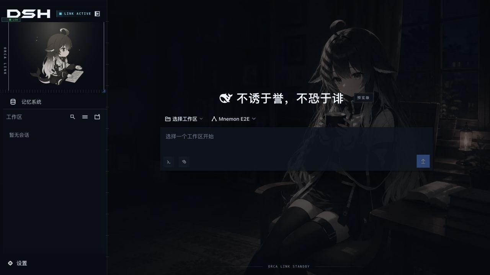

# Issue #232: ORCA LINK sidebar entry

[Issue](https://github.com/omdsh-dev/dsh-mnemon/issues/232) · [Validation data and hashes](./validation.json)

On 2026-09-11, a real DSH 0.1.5-rc.1 WebUI reproduced the invisible Mnemon launcher on main `1e19caf`. The ORCA LINK skin treated the unmarked button as New Session: its text color became transparent and both child spans had opacity 0. Adding the shared `data-dsh-part="sidebar-entry"` and `data-dsh-plugin="dsh-mnemon"` attributes restored the icon, label and skin's z-index 3. No skin-specific CSS override is needed.

2026-09-11 在真实 DSH 0.1.5-rc.1 WebUI 中复现：main `1e19caf` 的入口被 ORCA LINK 当作新建会话按钮，文字透明、两个子元素的 opacity 都为 0。补齐通用语义标记后，图标、文字与皮肤规定的 z-index 3 恢复，无需覆盖皮肤样式。

| Before / 修复前 | After / 修复后 |
|---|---|
|  |  |

The browser clicks exercised the actual built Starter, all three Sources, Native Provider, default Strategy and the scoped/light-context/auto-capture enhancements together. The icon also worked in the collapsed sidebar. From the restored entry, Runtime add and edit persisted, returning to chat worked, and creating/activating a Native space produced a connected status with Mnemon CLI 0.2.7. A restart with the skin disabled retained the data and working default launcher.

浏览器实操使用构建后的 Starter、三个 Source、Native Provider、默认 Strategy，并同时启用 scoped、light-context、auto-capture。窄侧栏入口同样可见且可点击；从入口新增、编辑热记忆并返回会话成功，创建并激活 Native 空间后显示 CLI 0.2.7 已连接。关闭皮肤并重启后，数据与默认入口保持正常。

- [Runtime write / 热记忆写入](../../assets/issues/232/after-orca-runtime-write.png)
- [Collapsed sidebar / 折叠侧栏](../../assets/issues/232/after-orca-collapsed.png)
- [Native CLI status / Native CLI 状态](../../assets/issues/232/after-orca-native-status.png)
- [Default skin after restart / 重启后的默认皮肤](../../assets/issues/232/after-default-status.png)

Reproduction uses the existing disposable WebUI fixture. Its optional extra-package argument is named `--better-sidebar`; here it installs the actual ORCA LINK bundle. Clone the external skin at the recorded revision, then run these commands in the isolated issue worktree:

复现使用现有临时 WebUI 夹具。`--better-sidebar` 参数接收额外插件目录，本次传入真实 ORCA LINK bundle。将皮肤检出到记录中的 revision 后，在独立 worktree 中执行：

```sh
pnpm install --frozen-lockfile
pnpm build
pnpm --workspace-concurrency=2 -r build
MNEMON_CLI_PATH=/absolute/path/to/mnemon node scripts/serve-e2e.mjs --strategy-extensions --better-sidebar=/absolute/path/to/dsh-deep-whale/orca-link
```

Open the printed loopback URL, keep the sidebar wide and the skin's status character enabled. Capture the launcher, apply the two-attribute fix, rebuild and restart the same fixture (`SIGUSR2` to its printed PID), then open the new URL and repeat. The fixture isolates DSH home, memory and workspace. All browser inputs were synthetic. The native integration test additionally verified create → View write → recall → forget with the real CLI. No live model API was needed. Full `pnpm verify` passed, including 926 root tests, all plugin tests, types, deterministic builds, Headless and package checks. Exact check results are in the validation file.

打开夹具给出的本地地址，保持宽侧栏与状态角色开启；截图后应用两个属性的修复，重新构建并通过夹具输出的 PID 发送 `SIGUSR2` 重启，再打开新地址重复操作。夹具隔离 DSH home、记忆与工作区，输入全部为合成测试数据。Native 集成测试还通过真实 CLI 验证了创建 → View 写入 → 召回 → 删除。无需真实模型调用。完整 `pnpm verify` 通过，含 926 个 root 测试、全部 plugin 测试、类型、确定性构建、Headless 与包检查；具体结果见 validation 文件。

This records macOS/Chromium verification, not Windows/Edge certification. The published DSH UI primitive package emitted missing source-map warnings; verification exited successfully.

本记录覆盖 macOS/Chromium，未验证 Windows/Edge。DSH 已发布 UI 包有缺少 source map 的提示，验证命令正常退出。

The ORCA LINK screenshots include third-party artwork: original whale-girl character by [上善](https://www.pixiv.net/users/62155430), derived skin scenes and status artwork by [Small-tailqwq](https://github.com/Small-tailqwq/dsh-deep-whale/tree/a0c9573c508e463441d804f03f116ae606f5f5ea/orca-link). That artwork remains under [CC BY-NC-SA 4.0](https://github.com/Small-tailqwq/dsh-deep-whale/blob/a0c9573c508e463441d804f03f116ae606f5f5ea/orca-link/LICENSE-ARTWORK), with the [upstream attribution notice](https://github.com/Small-tailqwq/dsh-deep-whale/blob/a0c9573c508e463441d804f03f116ae606f5f5ea/orca-link/NOTICE); it is not relicensed under this repository's software license. Screenshots are unretouched technical evidence.

ORCA LINK 截图中的角色原作归属上善，皮肤场景与状态角色衍生设计归属 Small-tailqwq；美术保留上游 CC BY-NC-SA 4.0 授权与完整署名链，不适用本仓库的软件许可。截图为未修饰的技术验证记录。
