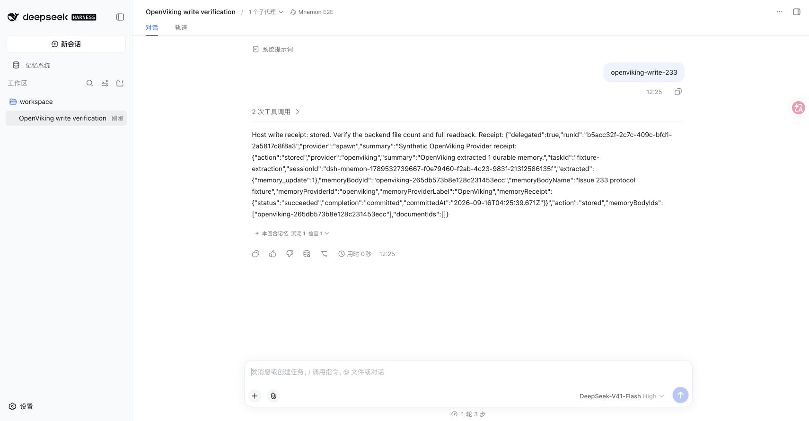
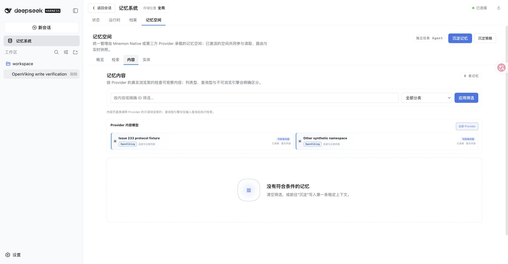
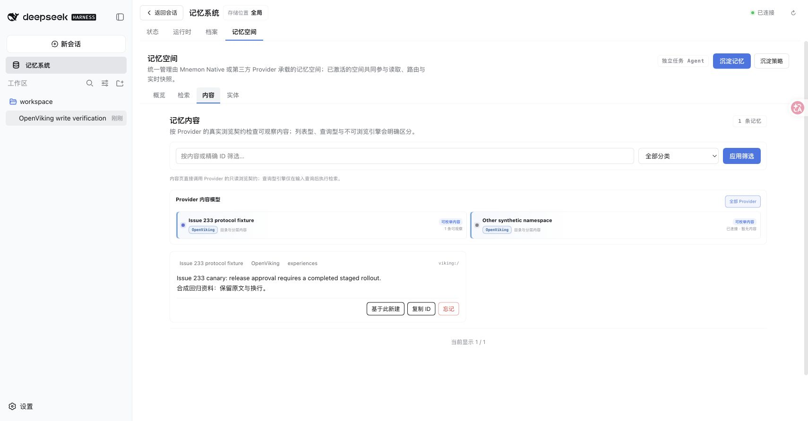
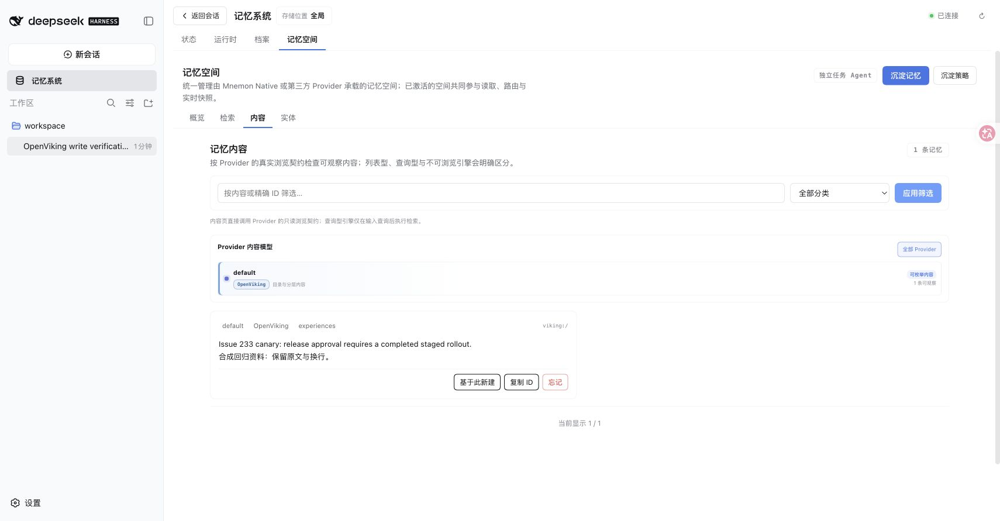
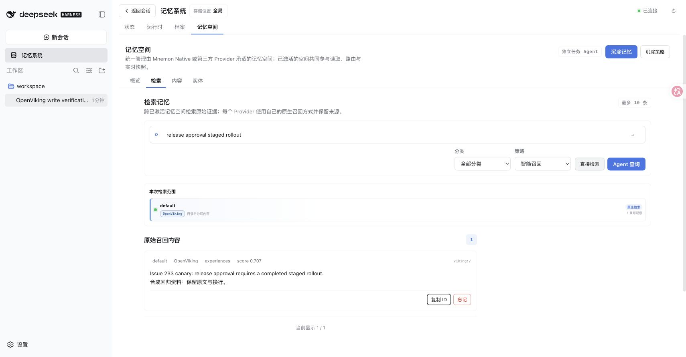
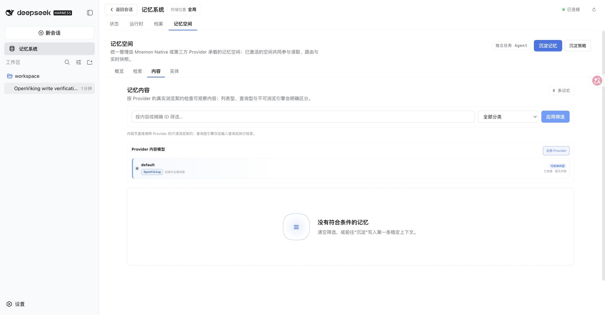

# OpenViking 精确写入 — issue #233

[English](./README.md) | [Issue #233](https://github.com/omdsh-dev/dsh-mnemon/issues/233) | [原始贡献 #234](https://github.com/omdsh-dev/dsh-mnemon/pull/234) | [核验数据](./verification.json)

基线可能在抽取任务没有保存传入正文时仍返回已存储。修复后的 Provider 直接创建原文，确认索引状态并精确回读，最后才返回存储回执。可控 HTTP fixture 通过真实 WebUI 与 Host 复现错误回执；另用官方发布的 OpenViking v0.4.20 服务验证实际存储、检索和删除。

基线为 `1363ebffaf19c9ab4badf0137f6fe87acacaf989`，实测实现与可复用 fixture 为 `11c5534cb916351f6f2ad22cd6d0dc22b8237e1b`。Izgenlre 的原始提交 `bf83a4240f505e22713f20393d9b5cfa97fda05f` 经 merge `2c5de91f0c9864de2d1f1918c4377dba7ea35a80` 保留为祖先，没有改写或 squash。

2026-09-16 的环境为 macOS arm64、Node 25.1.0、pnpm 11.19.0、DSH 0.1.5-rc.1 和官方 Native CLI 0.2.8。浏览器运行使用独立临时 Host 状态和合成资料。模型决策由脚本提供，Host 工具、委派写入 Agent、Source/Provider 组合、传输及 WebUI 均实际执行；没有调用外部模型 API 或使用个人记忆。

## 基线与受控对照

合并贡献者分支前，[回归测试](../../../plugins/dsh-mnemon-provider-openviking/tests/write-regression.spec.ts) 已在 main 上失败：

```text
receipt.action: stored
期望持久化内容：["Release approvals require a completed canary.\n保留原文和换行。"]
实际持久化内容：[]
```

原贡献能够保存正文，但随后仍因回执缺少 Host 建立 lineage 和补偿删除所需的 `id` 而失败。两次失败结果均在完成修复前保存。

浏览器对照分别构建目标产品 revision，运行[协议 fixture](../../../scripts/fixtures/openviking-protocol.mjs)与[模型脚本](../../../scripts/fixtures/openviking-write-model.mjs)：

```sh
node scripts/fixtures/openviking-protocol.mjs
MNEMON_CLI_PATH=/absolute/path/to/mnemon pnpm e2e:serve --openviking-write --strategy-extensions
```

浏览器运行使用官方 Native CLI 0.2.8，同时启用 Scoped、Light context 和 Active capture。将 OpenViking 配为 `http://127.0.0.1:19335`，account/user 均为 `default`，不填 API key，在 Mnemon E2E 会话发送 `openviking-write-233`。基线 checkout 只复制 fixture 代码。模型选择唯一启用的默认 OpenViking 命名空间，经实际委派写入 Agent 执行一次。fixture 刻意返回一次外观性抽取更新但不保存候选正文；这是受控协议复现，不代表实测了在线 LLM 抽取质量。

| 同一运行中的 HTTP fixture | 基线 | 修复后 |
|---|---:|---:|
| Session 创建 / commit | 1 / 1 | 0 / 0 |
| 直接正文写入 | 0 | 1 |
| 已持久化记忆 | 0 | 1 |
| 精确 UTF-8 正文 | 不存在 | 117 字节 |
| 其他 owner 写入 | 0 | 0 |

基线显示 `stored`、一次抽取更新以及已提交 Host 回执，内容页却为空。修复版发送 `mode: create`、`wait: true`，精确回读后显示完整双语正文。修复后计数扣除了同一 fixture 中已有的基线请求。

| 基线已存储回执 | 基线空内容页 |
|---|---|
|  |  |



## 真实后端验收

独立服务 `http://127.0.0.1:19333` 使用正式发布的 `openviking==0.4.20` Python wheel 和 Python 3.12.13。审计源码 tag 对应 `b54001e2e5c974ffd7a09ba543813fa104a99561`。HTTP、存储和向量索引均为真实 OpenViking；本地 128 维 token-hash embedding 服务保证确定性，chat 模型请求明确失败。服务使用隔离的 account-admin key，本记录不保存凭据。

[可选集成测试](../../../plugins/dsh-mnemon-provider-openviking/tests/integration.spec.ts) 在认证服务上通过：创建唯一的 137 字节双语记忆，精确读取原文，经检索和浏览找到同一内容，删除其准确 URI，再确认已不存在。回执包含一致的 `id`/`uri`、`writtenBytes: 137` 和 `vectorStatus: complete`，没有调用 Session 抽取端点。

```sh
# 如服务要求认证，通过环境提供 account-admin key。
MNEMON_OPENVIKING_TEST_ENDPOINT=http://127.0.0.1:19333 \
  pnpm --filter dsh-mnemon-provider-openviking exec vitest run tests/integration.spec.ts
```

必须使用可丢弃后端。测试仅允许 loopback 地址并清理自己的 canary。v0.4.20 的命名空间发现需要显式 account 和 account-admin key；ROOT 初始化 key 不能访问租户内容，免认证 dev 模式不允许 admin discovery。

随后通过正常设置与发现流程，将修复版 WebUI 切换到此真实服务。同一工具命令写入 117 字节浏览器 canary 并返回已提交 Host 回执，独立 HTTP 读取逐字节一致。内容页在 `default` 显示正文，直接检索 `release approval staged rollout` 返回完整原文。0.707 是合成 embedding 的观察分数，仅如实记录。点击忘记并确认后内容消失，独立 HTTP 读取返回 `404 NOT_FOUND`。[WebUI 回读记录](./real-webui-readback.json) 保留精确回执和删除结果。

| 真实 OpenViking 内容 | 真实 OpenViking 直接检索 |
|---|---|
|  |  |



## 契约与失败处理

实现对照了官方[正文写入器](https://github.com/volcengine/OpenViking/blob/v0.4.20/openviking/storage/content_write.py)、[HTTP 正文路由](https://github.com/volcengine/OpenViking/blob/v0.4.20/openviking/server/routers/content.py)和[命名空间规则](https://github.com/volcengine/OpenViking/blob/v0.4.20/openviking/core/namespace.py)。HTTP 成功本身不足以证明存储成功：回执必须对应请求 URI、mode 和 memory 类型，正文已更新、字节数准确，向量索引已完成，语义状态为完成或跳过，且没有队列错误；随后公共正文读取必须与输入完全一致。检索和浏览也读取完整正文。

新文件采用 UUID 与 `create`，碰撞时不会覆盖已有记忆。Provider 校验 owner 根路径、发现的用户 ID 及精确删除范围。已有简写 `viking://user/memories` 解析为配置或认证 owner，不改写配置。失败、待处理、取消或不确定写入均返回包含候选 URI 的错误，不自动重试或删除。缺少所需写入/读取契约的旧服务明确失败；降级保留既有内容。

[Host 组合测试](../../../tests/openviking-host.spec.mjs) 将独立的 OpenViking 实例与 Native、Holographic、Runtime 和 Documents 一同运行，验证精确回执及原文读取、范围内写入/删除、归档 lineage、本地归档冲突后只补偿删除新建索引，以及索引失败时保留原始档案。

## 验证及限制

- 隔离 worktree 中 `pnpm install --frozen-lockfile` 通过。
- `MNEMON_NATIVE_TEST_CLI=/absolute/path/to/mnemon pnpm run verify` 通过：root 1,134 个测试通过 / 5 个可选跳过；OpenViking 49 / 1 个可选跳过；Memory Spaces 169 / 1 个 Windows 专属跳过。文档、类型、确定性构建、插件测试、真实 Native 集成、真实 Headless 激活与 package 检查均通过。
- `pnpm run verify:plugins` 通过：16 个独立安装的插件、17 个打包制品，包括公共 SDK 组合及实际 DSH 激活。
- 回归覆盖异常回执、缺失/未完成/失败的索引、回读不一致、HTTP 错误、超时/取消、不安全根路径/ID、对象原型属性分类名、账户隔离及回滚。单独的真实 OpenViking 集成测试通过；常规 CI 有意跳过该可选测试。
- Changeset 覆盖聚合 Host、OpenViking Provider 及 Memory Spaces Source，release-intent 检查通过。

确定性模型只验证存储与索引契约，不证明抽取质量或语义召回质量。未执行在线 Flash、Windows 或 Electron 验收。本记录只含合成截图、精简计数和 hash，不含凭据、完整会话或个人数据。
