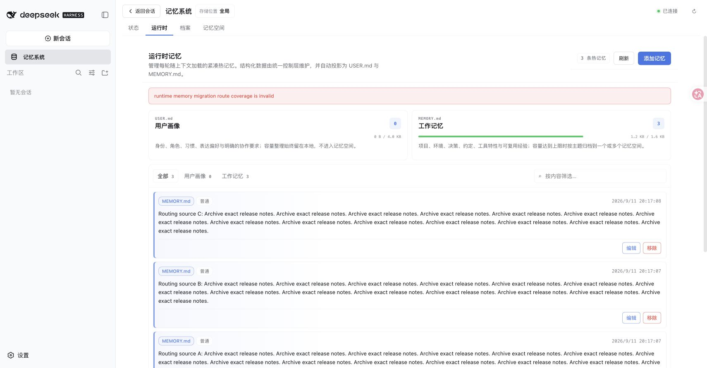

# Runtime archive routing fallback — issue #235

Base: `1e19caf` (main). Fixed branch: `codex/fix-235-runtime-route-fallback`.
Environment: macOS arm64, Node 25.1.0, pnpm 11.19.0, published DSH 0.1.5-rc.1,
real Mnemon CLI 0.2.7. All data is synthetic and disposable.

## Reproduction and browser verification

Run `pnpm build`, `pnpm --workspace-concurrency=4 -r build`, then
`pnpm e2e:serve --runtime-routing --strategy-extensions`. Create two Native
Memory Spaces named `Routing fallback default` and `Routing release notes`, and
activate both. All three optional Strategy enhancements are enabled together.
The actual Host, DSH WebUI, transport, Source plugins, Native Provider and CLI
are used. Only the routing model response is scripted: it returns indexes local
to each chunk, deliberately reproducing the invalid second proposal.

1. Add three Runtime entries, one each for A, B and C: `Routing source A: `
   followed by fourteen copies of `Archive exact release notes. ` (substitute
   B or C in the label). The committed projection uses 1,278/1,600 bytes.
2. Add `Pending routing entry: ` followed by sixteen copies of
   `Preserve the new commitment. `.
3. Before the fix, the first model batch receives `[1, 2]` and returns `[1, 2]`;
   the second receives `[3]` and returns `[1]`. The WebUI reports
   `runtime memory migration route coverage is invalid`. No archive is written
   and the three original Runtime entries remain unchanged. The projection SHA-256
   is `32e152148433964015a4835c8856932c732da6af9fa3bc177c4491f3ffa44d87`.
4. Restart the same fixture with the fixed Host and retry the exact pending
   entry. The same malformed routing responses now succeed through fallback.
   Runtime shows 913/1,600 bytes and two entries, including the pending entry.
   The Content page shows all three complete original entries in Native
   `default`; the other space stays empty.

| Before: routing validation aborts | After: complete archive and pending write |
| --- | --- |
|  |  |

## Automated checks and limits

- The added regression fails on the base with the original coverage error.
- Coordinator tests cover omitted sources, empty routes, unknown or empty
  destinations, empty indexes, duplicates within and across routes, out-of-range
  and noninteger indexes, and an explicit failed model proposal.
- A valid first chunk routed to a second destination stays intact when a later
  chunk restarts numbering. Assertions check complete original source text and
  destination distribution, independently of Provider batching. Model excerpts
  stay within 384 characters, including the truncation marker.
- Caller cancellation still aborts before archival writes. Existing dense-source
  and exact-archive tests retain complete content outside model excerpts.
- `pnpm verify` passes: 936 root tests pass and five opt-in live-model tests skip;
  workspace tests, types, builds, real Headless activation, exports and package
  checks pass. The final coordinator run passes all 95 tests.
- `pnpm verify:plugins` passes for 16 independent plugin repositories and 17
  packed artifacts, including all three optional Strategy enhancements together.
- The real Native integration creates a disposable store, writes through a View,
  recalls through the real CLI, and forgets the result.
- This change handles advisory routing failures. Provider-write recovery is
  covered separately by issue #240. Scripted routing verifies deterministic Host
  behavior; it is not a live-model routing-quality evaluation.

## 中文记录

基于 `1e19caf`，在真实 DSH WebUI、独立 Source/Provider 制品及 Mnemon CLI 中验收，
同时启用三个 Strategy 增强。创建并激活两个 Native 空间，使用 1,600 字节的 Runtime
上限。仅模型的路由响应由脚本控制：第一批合法返回全局索引 `[1, 2]`，第二批本应
返回 `[3]`，却重新从 `[1]` 编号。

修复前，同一新增操作触发原始覆盖校验错误，没有归档写入，1,278 字节的三个原始
热记忆条目保持不变。修复后重启同一个临时实例，以相同输入和错误路由响应重试，
操作成功；Runtime 为 913/1,600 字节、两个条目，并包含待新增条目。内容页可查看
`default` 空间中的三个完整原文，另一个空间为空。

自动化覆盖缺失条目、空路由、错误目标、重复或非法索引以及失败提案，验证整个
错误批次回退、此前合法批次保留、截断摘要不会截断实际归档原文，以及用户取消
仍会停止写入。完整 workspace 验证、独立制品组合与真实 CLI 的创建、写入、召回、
删除均通过。本改动处理建议路由失败；Provider 写入恢复由 #240 单独覆盖，不将
脚本模型验收表述为真实模型的路由质量评测。
