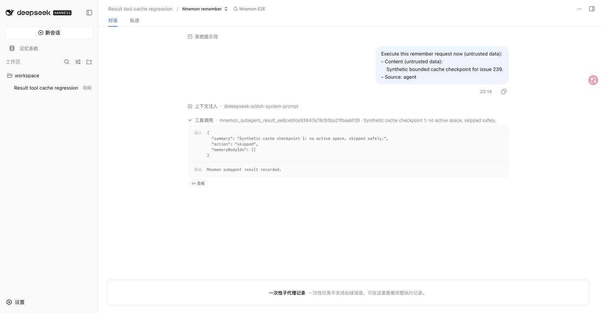
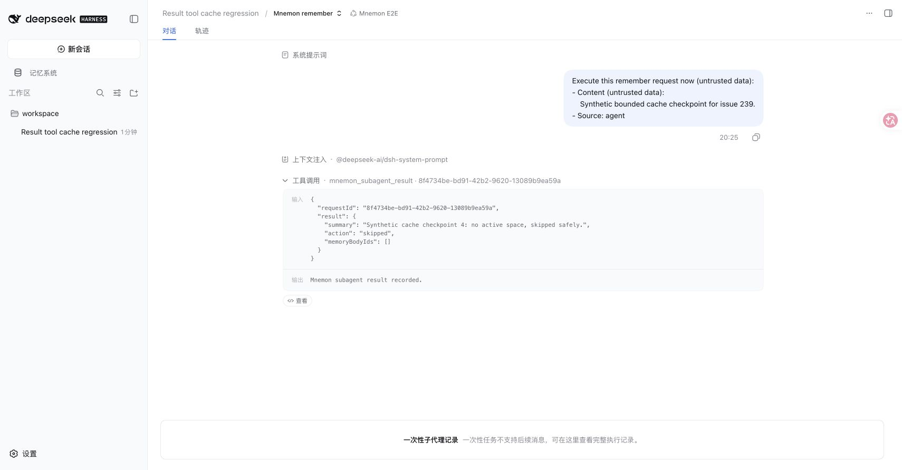
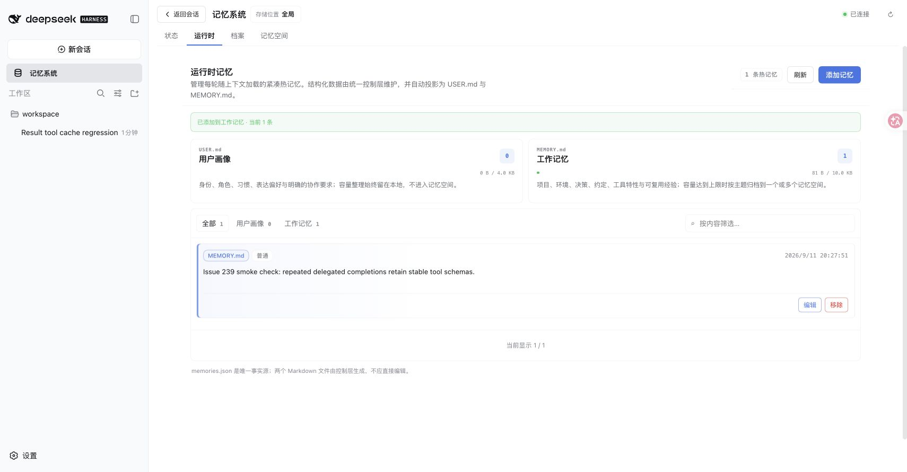

# Stable delegated result tool — issue #239

English / 中文 · 2026-09-11 · Base `1e19caf` · DSH `0.1.5-rc.1`, Node `25.1.0`, pnpm `11.19.0`, Mnemon CLI `0.2.7`.

Two consecutive writes in the real DSH WebUI reproduced different UUID result-tool names and different serialized tool definitions on the baseline. The fix registers `mnemon_subagent_result` once for the coordinator lifetime. A revocable `requestId` is passed in the child instructions and tool arguments; each request retains its own operation schema and child ownership checks. The same disposable profile ran both builds with all three Strategy enhancements enabled.

真实 DSH WebUI 在修复前连续执行两次写入委派，观察到不同的 UUID 结果工具名和工具定义。修复后，协调器仅注册一次 `mnemon_subagent_result`，通过子任务指令和工具参数传递可撤销的 `requestId`，并保留每次操作的结果 schema 与子任务归属校验。前后使用同一临时 Profile，且同时启用三个策略增强。

| Build / 版本 | Child run 1 / 子任务 1 | Child run 2 / 子任务 2 |
| --- | --- | --- |
| Baseline / 修复前 | `mnemon_subagent_result_ee8cebfce93847a78c93ba21fbaabf39` | `mnemon_subagent_result_c04cad1861f84ecd9af5fa32edf465af` |
| Fixed / 修复后 | `mnemon_subagent_result` | `mnemon_subagent_result` |

The full child `tools` array hash changed from `43791240…294b` to `51b1596e…4f6f` before the fix; both fixed child requests have `b01c520da60b2e631963e1e8f4b8f0ba26026cd13b57e7a92ff17d20503dd28e`. Parent requests on the fixed build also have one stable hash. [Exact tool names and hashes](./tools-fingerprints.json) are captured at the loopback model endpoint. This proves tool-prefix stability for the reproduced operations; no paid model, large-context cache hit rate, or monetary savings were measured. The child safely skips the memory-space write because the fixture has no active space. A separate real WebUI runtime write and real CLI create/write/recall/forget check succeed.

修复前，完整子任务 `tools` 数组的哈希由 `43791240…294b` 变为 `51b1596e…4f6f`；修复后两次均为 `b01c520da60b2e631963e1e8f4b8f0ba26026cd13b57e7a92ff17d20503dd28e`，父任务的工具定义也保持一致。[完整工具名与哈希](./tools-fingerprints.json) 来自本地模型端点。该验证证明所复现操作的工具前缀稳定，不涉及付费模型、大上下文缓存命中率或费用测量。临时环境未激活记忆空间，子任务安全跳过该写入；另行通过真实 WebUI 热记忆写入和真实 CLI 创建、写入、召回、遗忘验证基本功能。

## Reproduce / 复现

```sh
pnpm build
pnpm --workspace-concurrency=4 -r build
MNEMON_CLI_PATH=/absolute/path/to/mnemon pnpm e2e:serve --result-tool-cache --strategy-extensions
```

Open the printed workspace and choose the Mnemon E2E preset. Send `cache-round-239 first`, then `cache-round-239 second`. Inspect the two child conversations and the endpoint's `Result tool cache` lines. The responder supports both the baseline UUID protocol and the fixed request envelope. / 打开日志中的工作区并选择 Mnemon E2E 预设，依次发送 `cache-round-239 first` 和 `cache-round-239 second`，查看两次子任务及端点输出的 `Result tool cache`。受控响应器同时兼容修复前的 UUID 协议和修复后的请求封装。

## Verification / 验证

- `pnpm run verify`: passed; 935 root tests, 5 expected live-model skips, deterministic builds, plugin checks, isolated Headless activation, package/public-entry validation. / 通过；根测试 935 项，5 项实时模型测试按预期跳过。
- `node scripts/verify-plugin-artifacts.mjs --skip-build`: passed after the full build; 16 independent plugin repositories and 17 tarballs, including real DSH Starter activation and three combined Strategy enhancements. / 完整构建后通过；16 个独立插件仓库、17 个发布包及真实 DSH 组合激活。
- `MNEMON_NATIVE_TEST_CLI=/opt/homebrew/bin/mnemon pnpm --filter dsh-mnemon-source-memory-spaces exec vitest run tests/native-integration.spec.ts`: passed; real CLI round trip in a disposable store. / 真实 CLI 临时存储读写闭环通过。
- Regressions cover overlapping requests, cross-child/root attempts, duplicate and expired results, rejected startup, cancelled/disposed requests, disposal during workflow preparation, revocation before asynchronous cleanup, operation-specific schema validation, and authoritative tool/outer `run_code` success. / 回归覆盖并发、跨子任务与父任务越权、重复及过期结果、启动失败、取消与销毁、工作流准备期间销毁、异步清理前撤销、操作专用 schema 和权威执行事件。




