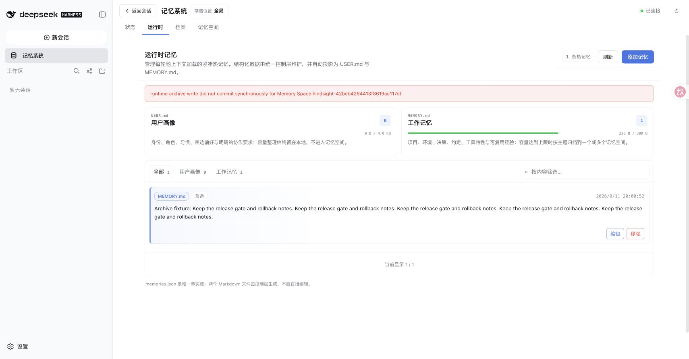
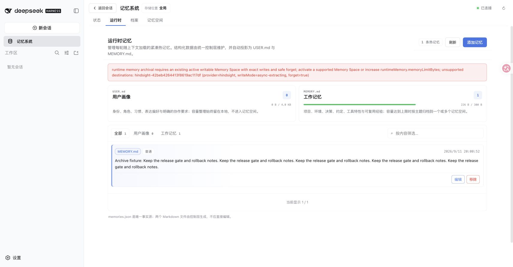
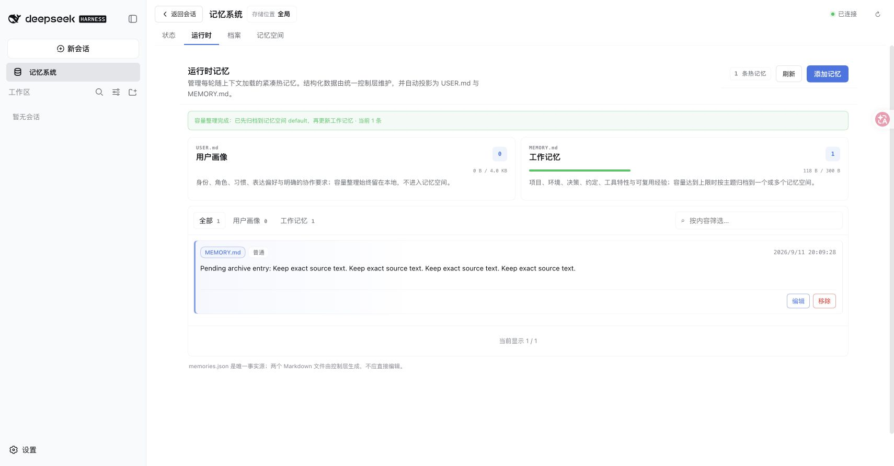

# Runtime archive destination safety — issue #240

Base: `1e19caf` (main). Environment: macOS arm64, Node 25.1.0, pnpm 11.19.0,
published DSH 0.1.5-rc.1, real Mnemon CLI 0.2.7. All data is synthetic and disposable.

## Reproduction and browser verification

Run `pnpm build`, `pnpm --workspace-concurrency=4 -r build`, then
`pnpm e2e:serve --runtime-archive --strategy-extensions`. The harness prints a
loopback Hindsight endpoint. Enable Hindsight with that endpoint in Settings,
then open Runtime. All three optional Strategy enhancements are enabled together.
The actual Hindsight plugin, Source plugins, Host, transport, WebUI and storage
are used; the Hindsight HTTP service is controlled and records accepted writes.
No live model or external service is needed for the one-safe-destination path.

1. Add `Archive fixture: ` followed by five copies of
   `Keep the release gate and rollback notes. `: Runtime uses 226/300 bytes.
2. Add `Pending archive entry: ` followed by four copies of
   `Keep exact source text. `.
3. Before the fix, the exact synchronous-commit error appears, the source remains
   at 226 bytes, and Hindsight accepts one write.
4. Restart the same fixture with the fixed Host and retry twice: an actionable
   preflight error appears, Runtime stays at 226 bytes, and the accepted-write
   counter remains one (zero new writes).
5. In Memory Spaces, create and activate a Native space named `Safe runtime archive`
   while keeping Hindsight active. Retry the pending entry: Native archives the
   exact original and Runtime commits the pending entry at 118/300 bytes.
   The Content page shows the original in Native. Hindsight still has no new writes.

| Before | After preflight | After activating Native |
| --- | --- | --- |
|  |  |  |

## Automated checks and limits

- The new unsafe-provider regression fails on the base with the original
  `runtime archive write did not commit synchronously` error.
- Coordinator coverage includes async and no-forget preflight, mixed providers,
  destination removal before writing, receipt failure, a later Provider failure,
  cancellation, skipped-entry preservation, failed cleanup, and uncertain local commits.
- A composed Runtime + Holographic test verifies the original Runtime revision
  survives a local commit failure and newly created cold content is removed.
- The real Native integration creates a disposable store, writes through a View,
  recalls through the real CLI and forgets the result.
- Complete workspace verification and the standalone 16-plugin / 17-artifact
  suite cover the published package composition and simultaneous enhancements.
- The Host package remains bounded at 1.28 MB unpacked (the recovery code exceeded
  the previous 1.27 MB limit by approximately 1.8 KB).
- This does not promise a distributed transaction. Provider failures without
  receipts can have unknown remote effects. Cleanup only owns proven-new ids;
  skipped entries and possibly committed archives are retained. No live Hindsight
  server, Windows build, or model-routing quality claim is made.

## 中文记录

基于 `1e19caf`，使用真实 DSH WebUI、独立 Source/Provider 制品和 Mnemon CLI，
同时启用三个 Strategy 增强。Hindsight 使用记录写入次数的本地 HTTP 测试服务，
所有内容均为临时合成数据。

修复前，226/300 字节的热记忆在新增时触发原始同步提交错误，Hindsight 已接收一条
写入，热记忆未变。修复后在相同数据上重试两次，前置校验拒绝异步目标，写入计数
仍为一。保留 Hindsight 激活状态并新增、激活 Native 空间后，同一次操作成功归档
完整原文，热记忆降至 118/300 字节；内容页可读取 Native 中的原文。

自动化覆盖异步与不可删除目标、混合 Provider、目标消失、回执错误、后续 Provider
失败、取消、既有条目保留、清理失败及本地提交结果不确定。真实 Runtime 与
Holographic 组合验证本地提交失败后热记忆修订不变，新增冷条目被补偿清理。
完整 workspace 验证、独立制品组合和真实 CLI 的创建、写入、召回、删除均有检查。
远端请求未返回回执时不能承诺分布式原子性；既有条目和可能已提交的归档会被保留。
