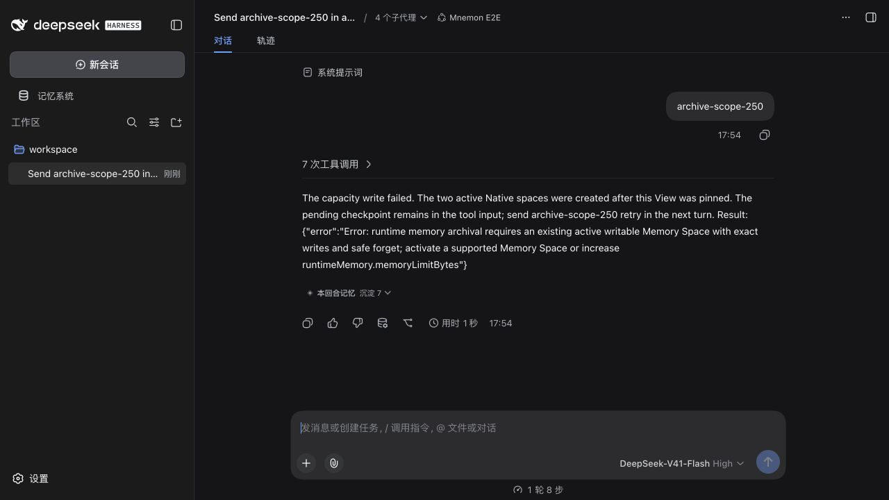
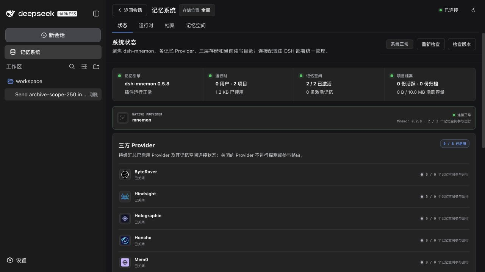
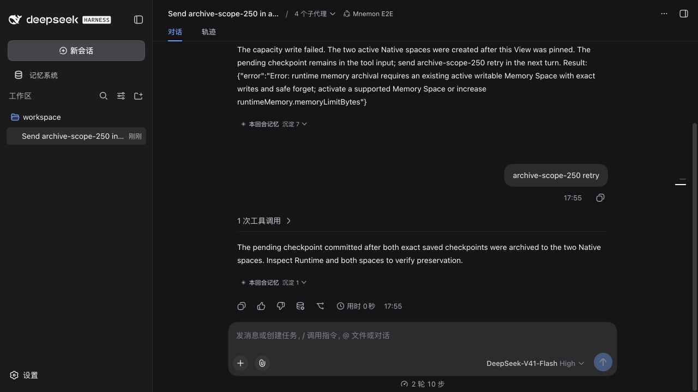
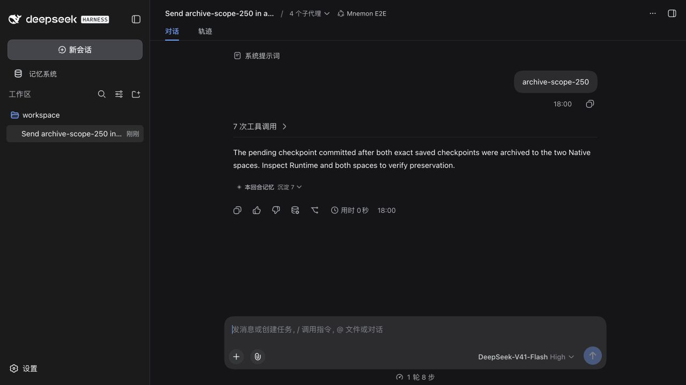
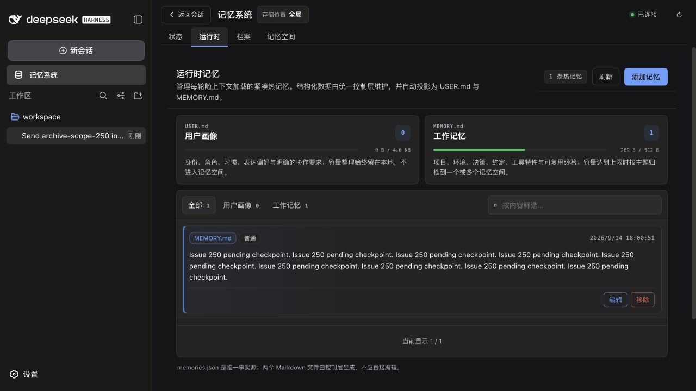
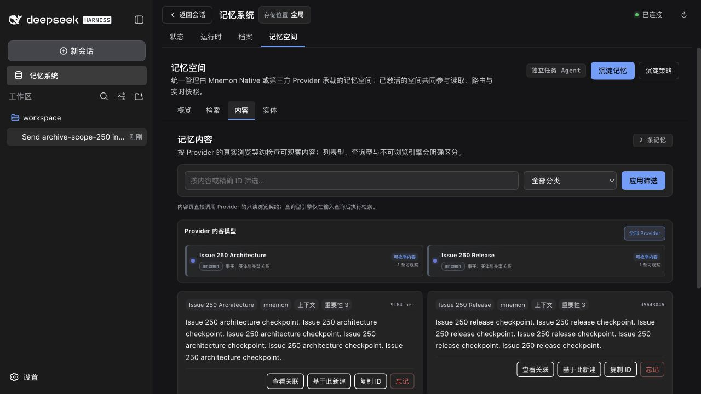

# Runtime archive write authority — issue #250

[简体中文](./README.zh-CN.md) | [Issue #250](https://github.com/omdsh-dev/dsh-mnemon/issues/250) | [Verification data](./verification.json)

The baseline reproduces the reported sequence: an overflowing add fails while two eligible Native spaces are active, and retrying the same input in the next turn succeeds. The fixed build succeeds on the first turn, with both archived originals and the pending Runtime entry verified byte-for-byte. Product baseline: `6ad99cc1890714355e1bb0e9230f3fce674bfb73`. The implementation and reusable fixture are at `246a50e2ae3cd63ef2fa05354c1297c7c8de5d57`; only fixture code was copied into the baseline checkout.

The 2026-09-14 environment uses macOS arm64, Node 25.1.0, pnpm 11.19.0, published DSH 0.1.5-rc.1 packages and the checksum-verified official Mnemon CLI 0.2.8. The Native release archive SHA-256 is `96159ad2fe8f0531b5a00ab009849614c234032146b95fa2db5aa726a8922e2d`. Each browser run owns disposable `DSH_HOME`, `MNEMON_DATA_DIR`, workspace and loopback model endpoint. All three optional Strategy plugins are enabled together: Scoped, Light context and Active capture. The script supplies model decisions; the actual View, tools, Source/Provider plugins, Native CLI, transport and WebUI execute normally. The displayed model selector does not imply a live model API call.

## Reproduction

Build the selected revision and run:

```sh
pnpm build
pnpm --workspace-concurrency=4 -r build
MNEMON_CLI_PATH=/absolute/path/to/mnemon pnpm e2e:serve --runtime-write-scope --strategy-extensions
```

In a fresh Mnemon E2E conversation, send `archive-scope-250`. The [fixture](../../../scripts/fixtures/runtime-write-scope-model.mjs) performs seven real root tool calls: two Runtime adds, two delegated Native space creations, two delegated activations, and the overflowing pending add. Delegated tools inherit the initiating View. The fixture uses a 512-byte Working Memory projection limit and synthetic checkpoints; it never loads personal memory. Child requests complete only after the actual Source receipt, with a bounded request count.

The first six calls succeed on the baseline. The seventh returns the exact reported error, without an unsupported-destinations suffix:

```text
runtime memory archival requires an existing active writable Memory Space with exact writes and safe forget; activate a supported Memory Space or increase runtimeMemory.memoryLimitBytes
```

The status page confirms two Runtime entries, two of two Native spaces active, and zero archived memories. The pending add has not committed; both original Runtime entries remain. Sending `archive-scope-250 retry` in the next turn commits the pending checkpoint after archival. No space or Provider configuration changes between these attempts.

| Failed first-turn add | Two active Native spaces, no archived memories |
|---|---|
|  |  |



## Cause and implementation

The baseline Host filters archive destinations using `memoryBodyIds` from the View's recall grant. These active namespace pins are empty when the two spaces are created later in the same View. The owning Memory Spaces Source already permits `remember` into known namespaces and namespaces created by that View, so the Host's archive filter rejects otherwise authorized writes.

The fix lets `body-directory` return an optional Source-owned write scope bound to the exact View and Source. It shares the Source's existing `remember` authority, validates the returned identity and namespace array, and rechecks authority and live capabilities before archive writes. An empty scope remains deny-all. Foreign-created namespaces are excluded until a new turn. Older Sources that omit the response retain the narrower pinned-read fallback. Error messages distinguish an empty directory, an empty or excluding write scope, and unsupported capabilities, report scope/counts, and explain that the pending input must be retried.

There is no persistence-format, credential or storage-path change. Rollback retains all stored entries. Only the aggregate Host and Memory Spaces Source need patch releases; the changeset names both packages.

## Fixed-side verification

The same fixture on the fixed build succeeds in its first turn: seven root tool calls, four delegated children, one turn and eight steps. It needs no second-turn retry. The status page reports one Runtime entry, two active Native spaces and two archived memories. Runtime shows only the pending checkpoint at 269/512 projection bytes; the Content page shows one original checkpoint in each Native space.

| First-turn success | Two archived memories in two active spaces |
|---|---|
|  |  |

| Only the pending checkpoint remains in Runtime | Both exact originals are visible in Native |
|---|---|
|  |  |

Readback with Native CLI 0.2.8 in `--readonly` mode returns exactly one item from each of the two stores. Their UTF-8 content bytes match the fixture's two `archiveScopeSaved` strings. Runtime contains exactly one entry whose UTF-8 bytes match `archiveScopePending`. The [verification data](./verification.json) records the aggregate counts, equality checks and hashes of the checked content and screenshots. This confirms the persisted result separately from the scripted model's success message.

Automated verification on the implementation passes:

- `MNEMON_NATIVE_TEST_CLI=/absolute/path/to/mnemon pnpm run verify`: Root 1,003 passed / 5 opt-in skips; Memory Spaces 169 passed / 1 Windows-only skip. Workspace types, deterministic builds, plugin suites, real Headless activation and package validation pass.
- `pnpm run verify:plugins`: 16 independent plugin repositories and 17 packed artifacts pass standalone checks, public SDK composition, real packed-Starter activation and simultaneous activation of the three enhancements.
- The Native 0.2.8 Host test archives two exact checkpoints to two same-View-created spaces and commits the pending add. No external model API is used.
- Regression cases cover known spaces activated after pinning, same-View creations, foreign creations and next-turn retry, explicit empty attenuation, malformed or foreign returned scopes, scope revocation, exact Source instance selection, cancellation, ended turns, unload with an existing lease, and conservative older-Source fallback.
- Four fixture tests prevent repeated child writes after a successful receipt, complete failed calls, bound missing-receipt attempts and use returned namespace ids for activation.

The initial full verification reached the package-size guard after all earlier checks passed. The final artifact is 1,281,433 unpacked bytes versus 1,279,223 on the baseline, a 2,210-byte increase. The guard remains enabled at 1,284,000 bytes. The subsequent complete `verify` run passes.

## Limits

This proves a deterministic temporal authority mismatch and the baseline's next-turn recovery. It does not establish the exact timing of the original Windows report or prove a transient directory-read race. Model decisions are scripted, so these checks do not evaluate routing quality. No Windows, Electron or live third-party service is claimed. The record includes only synthetic screenshots and compact verification data; no full sessions, credentials or personal memories are copied.
