# Issue #251：显式恢复旧会话

[English](./README.md) | [Issue #251](https://github.com/omdsh-dev/dsh-mnemon/issues/251) | [恢复流程](../../zh-CN/guides/operations.md#dsh-015-兼容与旧会话恢复)

2026-09-14 从 main `6ad99cc1890714355e1bb0e9230f3fce674bfb73` 复现，环境为 macOS arm64、Node 25.1.0、pnpm 11.19.0 和已发布 DSH 0.1.5-rc.1。仅使用合成会话日志、一次性 Profile、工作区与记忆目录。修复位于 Starter 的显式维护 CLI，不改变 Core/Source/Provider 的职责，不拦截历史加载，不修改 DSH 冻结校验器。

## 真实 WebUI 前后验证

[Runtime 夹具](../../../tests/fixtures/issue-251-legacy-v0.jsonl) 在 0.1.2 生成的合成历史上增加遗漏的旧 Runtime summary 和另一插件的 snapshot。为一次性 `scripts/serve-e2e.mjs` 环境调整 session id、工作区、preset、模型路由，再将每行编码为带校验和的 Zstandard 帧。

旧 CLI 报告修复两条消息，但实际 WebUI 打开其副本仍报 `user/message 7 source summary requires notice form`，因为 `Runtime memory snapshot` 未被移除。仓库提交 `000ecc1568899a794ecb5f8ccf6f28a90c13894e` 的 `memorySnapshotMessage()` 确认该字符串曾以 `dsh-mnemon` / `recall` 写出。

新 CLI 报告修复三条消息，原始用户请求与助手回复正常加载。通过实际 WebUI 完成新的 canary 对话，重启 Host 并冷打开后两轮均保留。选择配置好的回环响应服务路由，未调用外部模型 API。原始压缩备份 SHA-256 始终为 `415d0a9470f9eb7301bcd02333d8be428b29082fe7b0ae74e43da43336022d3e`；修复副本为 `2e69362ea5284683b933ef6b8f2e480486a723930a0fa262b657b80c63fa87e0`。

| 修复前：旧工具遗漏 Runtime summary | 修复后：续写、重启、冷打开 |
|---|---|
| 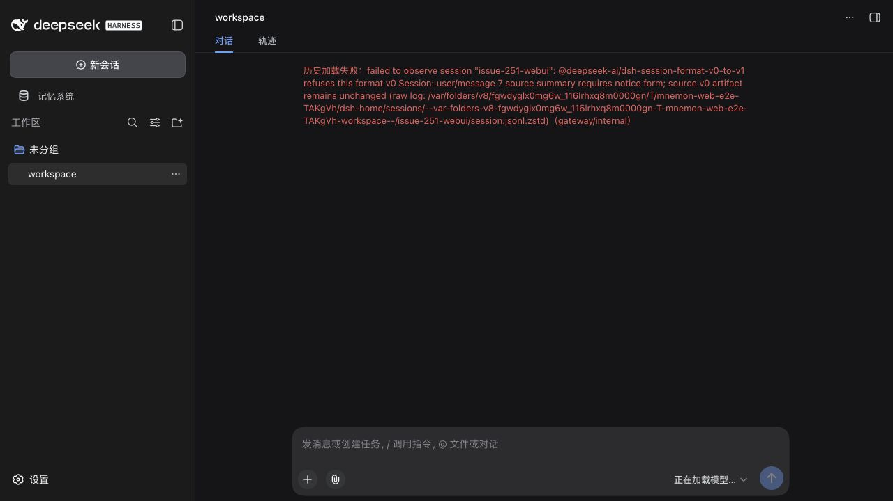 | 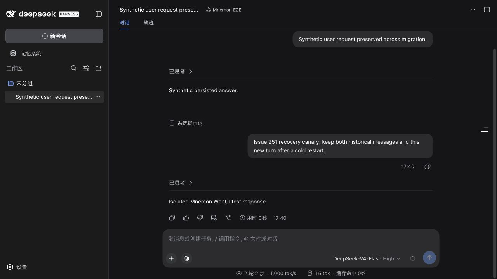 |

第二个 WebUI 制品使用[组合夹具](../../../tests/fixtures/issue-251-repairable-v0.jsonl)，包含全部三个 summary、兼容 v2 descriptor，以及 ID/name 为空字符串的 packed 行。旧工具仍在 Runtime summary 7 处失败；新 CLI 报告修复三个 summary、提升一个 descriptor、将一条 packed 行展开为三个 chunk，无 blocker。真实 DSH 加载器迁移副本后，界面显示历史用户请求、助手回复，以及展开的 `synthetic_lookup {}` 与 `Synthetic tool response.`。选择配置好的回环 `DeepSeek-V4-Flash` 路由后恢复可交互输入框。原件 hash 保持为 `94f7da957d213c896c4794603580c9e982670bcd725ecffeee241eab3ad709e5`；修复副本为 `07db52eaacf6d45fc2d4c0a2e8931604674ce332c3a0f823aeed4d4aacaeed3b`。

| 组合制品修复前 | 迁移并渲染工具历史后 |
|---|---|
|  |  |

组合会话也通过真实 WebUI 完成 canary 续写。Host 经 `SIGUSR2` 重启后冷打开，历史消息、展开的工具结果与新对话均保留。物理 v3 日志包含 43 行；结构比较确认五条历史 user/plugin 消息仅删除三个 summary 字段，两条历史 assistant 消息、持久 tool/call 与 tool/result、展开后的 stream 均一致。原始及修复 v0 的 hash 均未改变，外部模型调用为零。

| 冷打开后的历史消息和工具输出 | 冷打开后保留的 canary 对话 |
|---|---|
|  |  |

另两个夹具单独复现流式 null name：[raw delta](../../../tests/fixtures/issue-251-null-name-v0.jsonl) 与 [packed delta](../../../tests/fixtures/issue-251-null-name-packed-v0.jsonl)。两者保留有效持久工具身份，并以空参数片段开始。真实 WebUI 分别在 v1→v2 accumulator 与 packed decoder 拒绝原件；前一 CLI 版本 `83d0c40` 同样拒绝发布副本。新 CLI 各规范化三个逻辑 name，仅展开 packed 行。两段历史均正常加载，显示原始用户/助手消息与工具结果，并通过回环路由完成新 canary 对话。各 v3 日志有 42 个物理行；结构比较确认历史消息、持久调用/结果及按预期规范化后的精确带时间回放均保留。原始与修复 v0 的 hash 未变，详见[机器可读记录](./verification.json)。

| null-name 制品修复前 | 迁移并渲染历史后 |
|---|---|
| 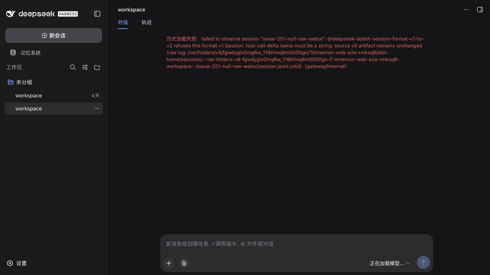 | 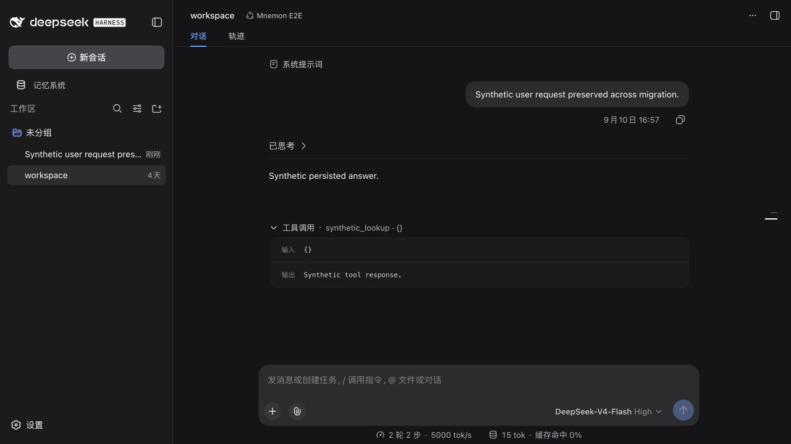 |
| 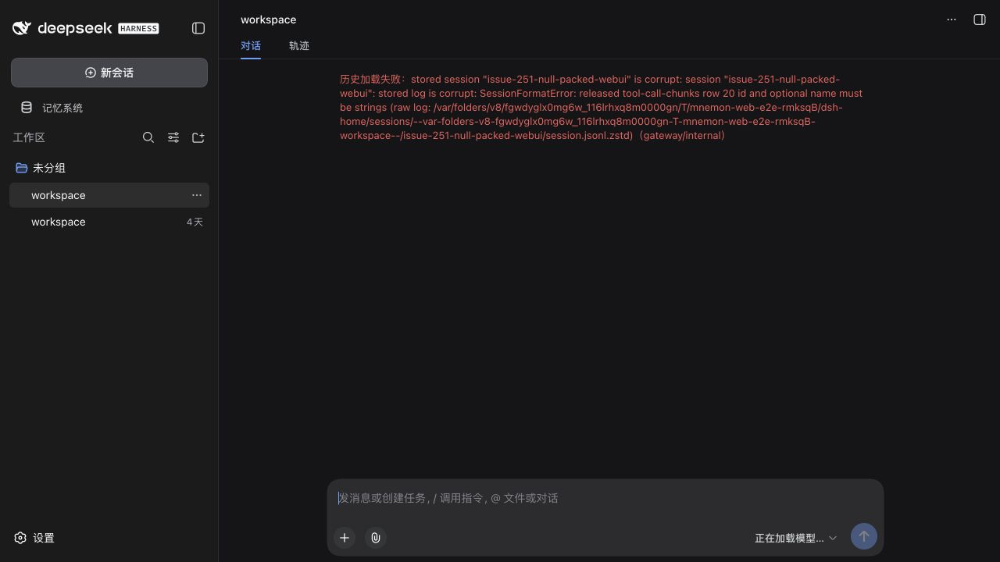 | 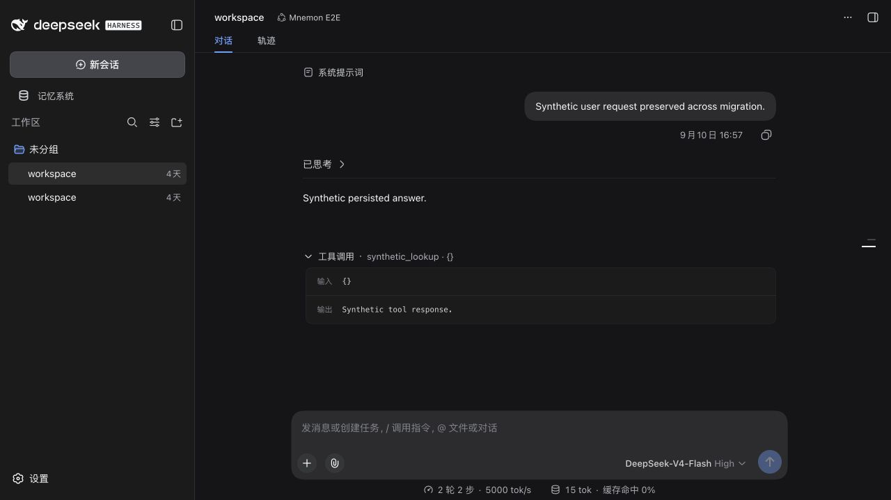 |

Host 重启后，独立 Chrome 测试窗口通过同一个一次性 Profile 冷打开了两段会话，历史工具输出与此前的 canary 对话均保留。内置浏览器在选择会话之前遇到 client bundle 加载错误；该 bundle 返回 HTTP 200，语法检查通过。Chrome 正常加载同一个 Host，未改动 Host 或浏览器安全配置。

| raw null-name 历史冷打开后 | packed null-name 历史冷打开后 |
|---|---|
| 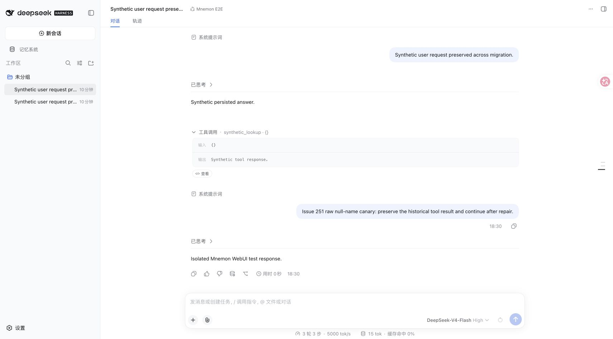 | 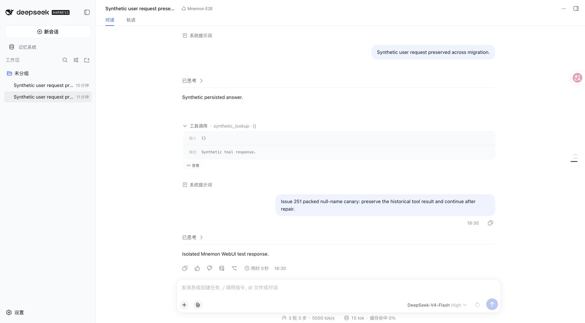 |

最后两个夹具覆盖完成后的空 ID 链：[已有 ID 链](../../../tests/fixtures/issue-251-existing-id-v0.jsonl)与[四类旧格式组合](../../../tests/fixtures/issue-251-all-legacy-v0.jsonl)。它们使用一致的 `deepseek-official` 写入器元数据、完整 usage 记录与另一插件的 snapshot。仅 ID 故障的 WebUI 输入将 packed 占位值等价展开为 raw delta，以单独复现持久 ID 错误；完整组合保留 packed null-name 占位值、全部三个 summary 和 descriptor v2。为一次性 Profile 调整 session id、工作区和 preset，原始输入另行保留。

CLI 版本 `2612856` 对两份输入均拒绝发布副本。真实 WebUI 在仅 ID 样本中报 `assistant/message 27 ... id must be a non-empty string`，完整组合则在 summary 5 处失败。更新后的 CLI 各恢复一条调用链、七个身份字段；组合样本还修复三个 summary、一个 descriptor，将一条 packed 行展开为两个 chunk，并规范化两个 name。Chrome 中两段历史均显示原始用户/助手消息与展开的工具结果。

| 已有 ID 恢复前 | 历史和工具输出恢复后 |
|---|---|
| 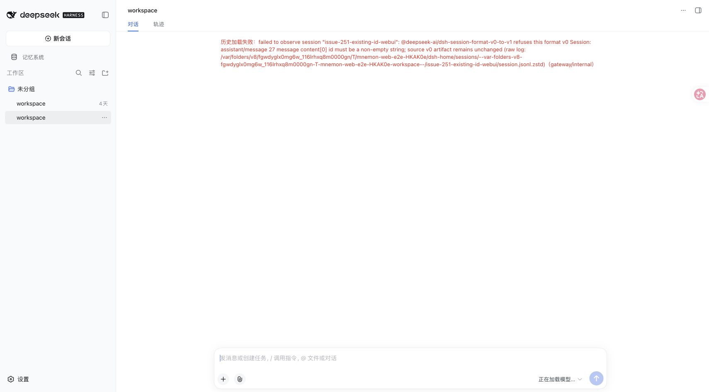 | 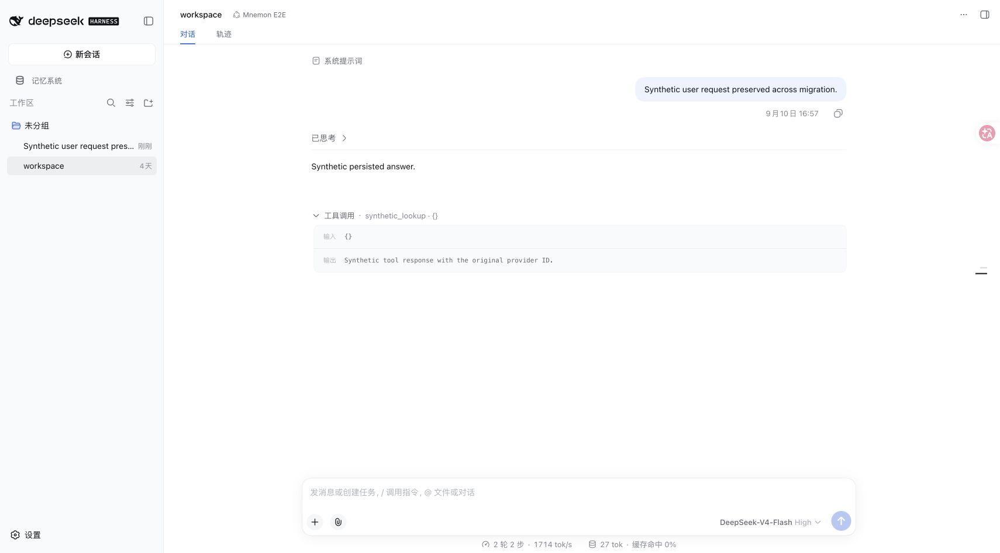 |
|  | 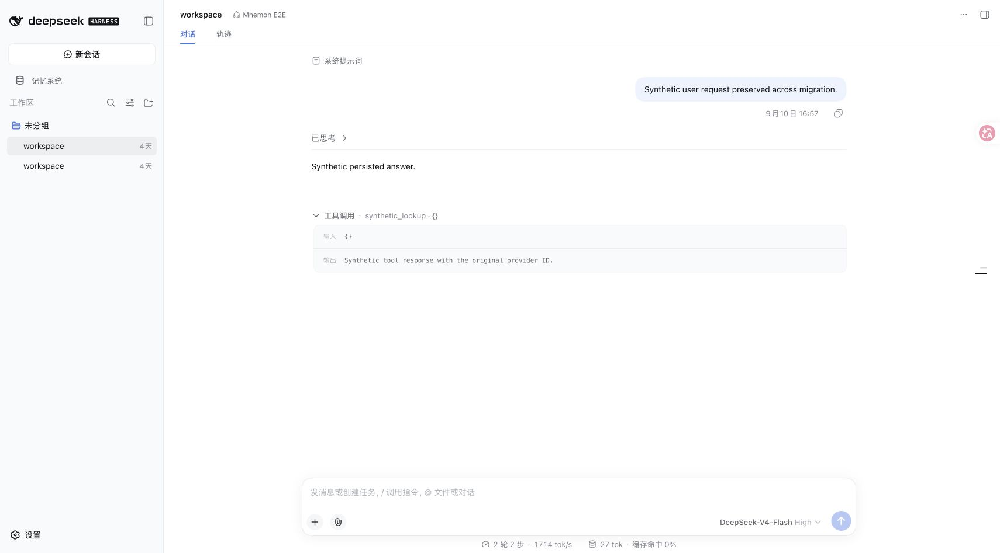 |

随后在真实 WebUI 选择已配置的回环 Flash 路由，分别发送 `legacy-replay-251` canary。[测试模型](../../../scripts/fixtures/legacy-session-replay-model.mjs)核对实际 HTTP 请求：历史 `tool_calls[].id` 和 `tool_call_id` 必须等于原有 `provider-existing-id-251`，工具名与参数必须保持 `synthetic_lookup` / `{}`，输出必须保持 `Synthetic tool response with the original provider ID.`。身份缺失、冲突或临时生成时，测试不会返回成功响应。

两次 canary 均完成。重启 Host 后，历史消息、展开的工具结果和新对话都能重新打开。重启前的 42 个物理 v3 行逐结构保持相同；DSH 正常追加一条 `session/end-seed` 边界，因此冷打开后共 43 行。原始与修复 v0 的 hash 均未改变。四类组合的原始 SHA-256 为 `02918e5bf3ddc83a1c7087fce7622ad46b91bd8c1987ffb423d2669ce276b281`，修复副本为 `1e30311e7422a4eb6c6b3f5c679901b8dfe902205e6b287f9a7a49ab885ad7f6`；[机器可读记录](./verification.json)包含两个样本、冷打开制品与请求 payload 的 hash。

| 重启后的 ID 样本与 canary | 重启后的四类组合与 canary |
|---|---|
| 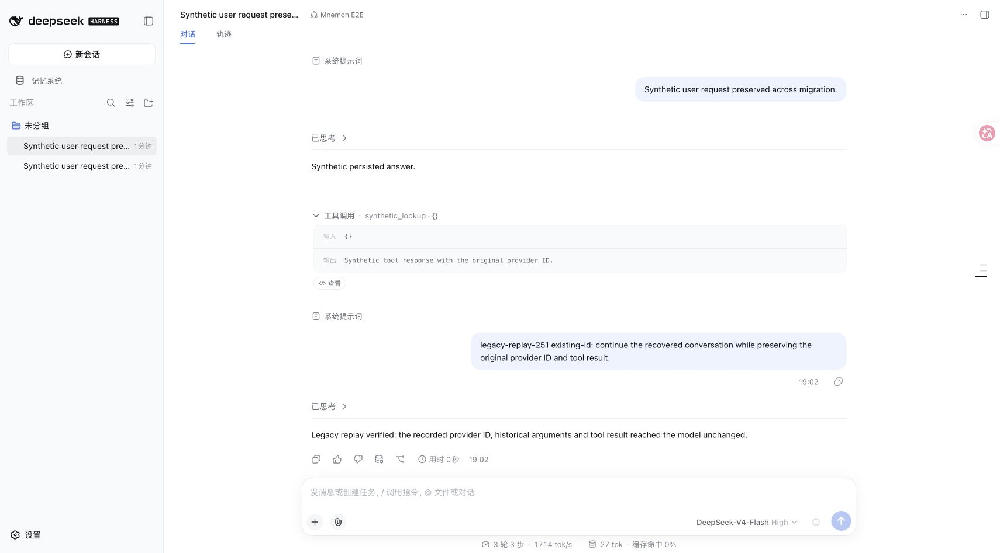 |  |

共享 Starter 基线还启用了三个可选 Strategy 扩展，实际状态页显示已安装 Native CLI 0.2.8。一次性真实 CLI 的创建、写入、关键词召回与删除冒烟通过。[Native 状态截图](./baseline-native-status.jpg)。这些检查不表示此补丁修改了 Native 存储。

## 契约审计与修复边界

| 形状 | 已验证行为 |
|---|---|
| 三个历史 Mnemon summary 字符串 | 仅删除匹配的 summary 成员；保留正文和其他插件 source。 |
| 兼容的 descriptor v2 | 检查严格的旧版字段集合及全部适用冻结 v3 约束后，仅将版本值由 2 改为 3。 |
| ID 或 name 为空字符串的 packed 工具 delta | 展开为原有 raw delta 事件，保留逻辑序号、时间、name 和参数。 |
| 不属于已证明身份恢复链的 raw 空字符串 delta | 保持字节不变；实际已发布迁移支持此形状。 |
| 严格 raw 或 packed 工具 delta 中自有的 null name | 保留字段为 `name:""`，维持组装和 token 计时；展开 packed 行时不改 ID、逻辑坐标或参数。 |
| 完整流中仍保留唯一原始 provider ID 的持久空身份链 | 验证流、广告调用、执行、结果和关联引用后，仅恢复该已有身份。 |
| 原始身份缺失或冲突、owner 引用未闭合、不兼容 descriptor、待修 delta 的未知结构或不安全坐标 | 输出有数量上限的行号/事件/字段路径诊断，退出码 1，不发布输出。 |

已发布 `dsh-subagent@0.1.1-rc.2` 使用 descriptor v2；审计的 `0.1.2-alpha.2` 与 `0.1.2-rc.1` 已使用 v3。比较 `lib/types/descriptor.js` 和 `continuation.js` 的冷恢复代码可见，v3 增加可选 `agentReasoningEffort`；保持其缺省即可保留旧版声明的组合参数。One-shot 只允许 version/mode/provider 和可选 label；continuable 允许 label、成对 agentProvider/agentModel、persona 以及封闭 allow/deny toolFilter。不裁剪、生成或丢弃字段；不承诺不同 DSH 版本的运行时默认值相同。

旧版 `dsh-session@0.1.2-rc.1/lib/types/chunk-rows.js` 接受字符串占位值，并定义无损展开。当前物理解码器拒绝 packed 空 ID；packed 空 name 可能通过迁移却在 `expandAssistantStream` 回放时报错。实际 v0→v3 流程则通过 `AssistantStreamAccumulator` 保留 raw 空字符串 delta，因此测试同时检查完整迁移和带时间戳的 stream 回放，而不是仅调用独立 payload 校验函数。

官方 `dsh-llm-deepseek@0.1.2-rc.1` emitter 会直接复制非 undefined 的 transport name，未要求字符串。旧版与当前 `BlockAssembler` 均仅在 name 为真值时赋值，因此 null→空字符串在每个前缀上保持相同状态转换。两版均在参数非空或 name 属性存在时计入 token；保留属性可维持 TTFT，包括首个空参数片段。当前 accumulator 会将空字符串 name 保留为 raw 记录。独立审计执行了已发布新旧 assembler 的五种变体、36 个前缀，比较真实新旧会话统计，并验证 v3 发布、冷打开以及 durable/owner metadata 保留。旧 codec 本身拒绝 packed null name，但规范化后再展开的结果与旧 codec 对规范化行的解码完全相同。修复仅使用封闭字段集合、安全坐标与重复键检查，不关联后续调用或推测工具名。

已发布的 `dsh-llm-deepseek@0.1.2-rc.1` adapter 在后续片段显式提供空或 null ID 时，会清空此前的非空 provider ID；当前 adapter 将这类后续值视为不更新。独立探针将相同合成 SSE 帧送入两版正式 adapter，恢复此前记录的 ID 后，旧 chunk 与当前输出完全一致。旧官方 Session 的热写入路径也接受了这条损坏持久链，而冷 seed 会拒绝它。旧 agent loop 会用 `tool/result.sourceEventSeqs` 指向对应 `tool/call` 事件。

恢复通过有序 provenance 选择精确的助手流，核对块顺序、完成状态、usage、工具名和参数组装，并逐一对应广告调用、执行与结果。结果 provenance 缺省时，可用完整的唯一工具调用证明关联；已有但冲突的 provenance 则拒绝。允许 text/reasoning 与多条分别可证明的调用。Approval、PTC、复制消息、替换以及插件中的身份引用必须明确归属，否则整份副本拒绝输出；同一步内的非空调用链也检查内部一致性。不会生成 ID，首次有效候选出现前的空 delta 仍保持原值。

删除 delta 会丢失时间、参数和 provenance；删除 null name 属性可能改变 token 计时，将其值改为空字符串则不会。日志若未保留 provider 原始身份，或关联本身存在歧义，无法用新造 ID 还原，因此仍拒绝输出。这些限制与迁移及 WebUI 正例已覆盖的四类报告形状分别记录。

已发布 0.1.5-rc.1 与 0.1.5-rc.2 的 v0→v1 迁移 `lib/index.js` 字节一致，SHA-256 为 `15ae26b90310d83b1b90a5e7cad9e2f34282fddaba2f19f2fd2232382065603d`。完整执行环境使用 rc.1。注册表未找到已发布的 `dsh@0.1.2-rc.2`；报告中的 source build 仍需其提交号才能确定。

## 回归与复现

[修复测试](../../../tests/legacy-session-repair.spec.ts)覆盖已发布 JSONL 持久层、v3 发布、冷打开与精确的带时间 stream 回放、严格 descriptor 条件、组合修复、null name 各前缀组装与 token 计时、其他插件保留、普通/压缩幂等、独占输出、诊断与拒绝、重复字段、损坏帧、不安全坐标及展开大小上限。[组合夹具](../../../tests/fixtures/issue-251-repairable-v0.jsonl)覆盖 summary、descriptor 和字符串占位值；独立 raw/packed null-name 夹具单独复现该错误。[机器可读验证记录](./verification.json)。

最终 `pnpm verify` 通过：root 1,104 项与独立插件 323 项通过，七项 opt-in 测试跳过。修复专项有 132 项；另有十项夹具测试，确保错误的续写身份或被改动的工具正文不会得到虚假成功响应。确定性构建、类型、文档、公开入口、publint/attw 与真实 Headless 激活均通过。包包含 47 个文件，压缩大小 293,317 字节、展开大小 1,313,898 字节，位于 1,318,000 字节上限内。本兼容性修复未改动 Host 或 Client bundle 代码。

独立复审检查了 144 组 descriptor、125 组 packed 坐标边界、五种 null-name 变体的 36 个前缀，以及 28 组已有 ID 边界用例。八个被接受的身份正例又全部通过独立的真实迁移、冷打开与嵌入 stream 比对。另一次 300 调用链 preview 冒烟恢复了 2,100 个身份字段，最终产物 hash 稳定；这项规模 preview 不代表另一次迁移验证。

```sh
pnpm install --frozen-lockfile
pnpm exec vitest run tests/legacy-session-repair.spec.ts tests/lifecycle.spec.ts
pnpm run verify
node bin/repair-legacy-session.mjs --input tests/fixtures/issue-251-repairable-v0.jsonl
node bin/repair-legacy-session.mjs --input tests/fixtures/issue-251-null-name-v0.jsonl
node bin/repair-legacy-session.mjs --input tests/fixtures/issue-251-all-legacy-v0.jsonl
MNEMON_CLI_PATH=/absolute/path/to/mnemon pnpm e2e:serve --strategy-extensions --legacy-session-replay
```

WebUI 截图覆盖 Runtime summary 恢复、summary/descriptor/packed 字符串组合、两种 null-name 形状、已有持久 ID 与全部四类形状的组合；精确的 delta 时间保留另由真实已发布加载器与 stream 回放测试验证。未测试 Windows source build、外部真实 Provider 或生产会话。
