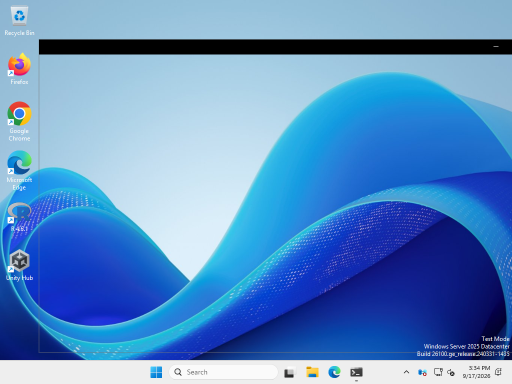
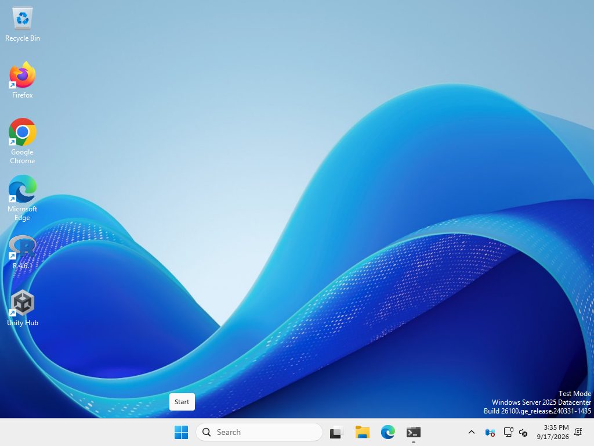
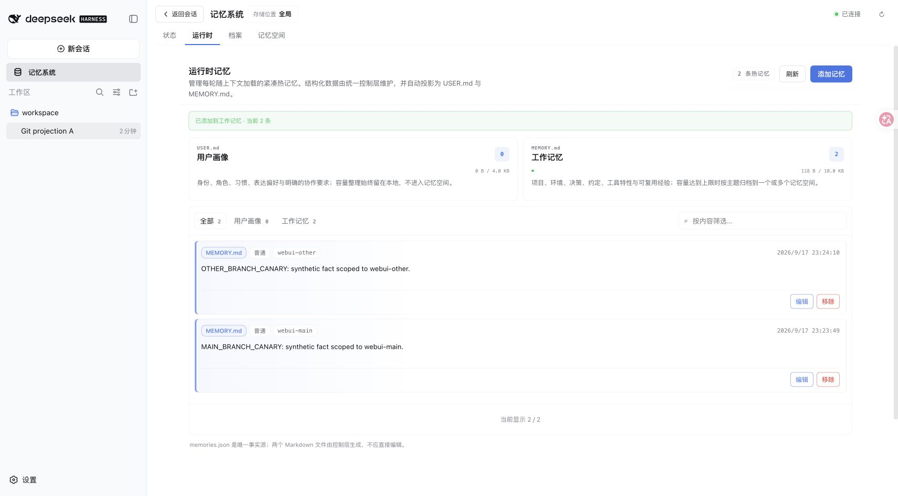
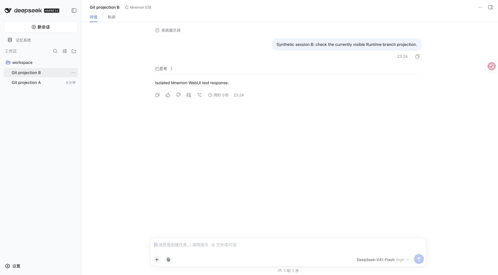
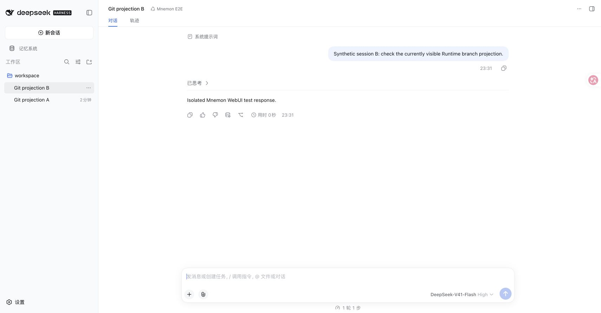

# Windows Git 查询窗口 — Issue #259

[English](./README.md) | [Issue #259](https://github.com/omdsh-dev/dsh-mnemon/issues/259) | [验证数据](./verification.json) | [Windows 观测数据](./windows-results.json)

2026-09-17 实测：无控制台的 Windows Node 进程执行原版 Runtime Git 查询时，会产生可见控制台窗口；添加 `windowsHide: true` 后，四轮观测均为零。命令、超时、分支结果与失败回退保持不变。基线为 `6da061e8fa51a30ed50c6fff2a4cadcddf7a4a6a`，修复实现为 `1a9d455004c9204a74b87c920d81b67b3f7b954f`。

## Windows 复现

环境为 Windows Server 2025 build 26100、Node 22.19.0 / libuv 1.51.0、Git 2.55.0.windows.5。GUI 观测程序以 `DETACHED_PROCESS` 启动 Node；每个 A/B 父进程的 `AttachConsole` 均返回错误 6，确认未继承控制台。阳性对照显式创建可见窗口。持续 `EnumWindows` 枚举只统计可见、未最小化、未被 DWM 隐藏且尺寸非零的新增控制台类窗口。

| 实验 | 阳性对照 | 修复前第 1 / 2 轮 | 修复后第 1 / 2 轮 |
|---|---:|---:|---:|
| [主观测](https://github.com/omdsh-dev/dsh-mnemon/actions/runs/35240525857) | 1 | 105 / 104 | 0 / 0 |
| [截图复验](https://github.com/omdsh-dev/dsh-mnemon/actions/runs/35241111560) | 1 | 105 / 105 | 0 / 0 |

每轮执行 100 次正常分支查询，以及带空白的路径、分离 HEAD、非仓库目录、不存在目录共 4 次 Git 调用。所有返回值断言通过；空值与空白路径继续直接回退，不启动进程。计数是不同的可见窗口数，不是进程数：每轮基线都有 104 个 Terminal 窗口，其中三轮还捕获到 1 个传统控制台窗口。

| 修复前：真实窗口打开帧 | 修复后：Git 查询进行中 |
|---|---|
|  |  |

未人为延长 Git 执行时间。修复前截图捕获的是 Terminal 尚未绘制完成的打开帧。截图复验临时最小化了一个既有 runner 控制台，完成后恢复。截图时设置了焦点，因此图片不能独立证明抢焦点；零窗口结论来自修复后整个阶段的持续枚举，而非单张截图。

[固定版本的工作流与验证脚本](https://github.com/omdsh-dev/dsh-mnemon/tree/b81ccd541e93644d3ae2106a8163acdce654534c/scripts/issue-259-windows)保存在独立验证分支。工作流提供 PowerShell 7、Node 22.19.0、Git、完整 Git 历史及 `RUNNER_TEMP`。手动运行还需要交互式 Windows 桌面，以及脚本使用的 Framework64 .NET C# 编译器。检出该版本并保留基线历史，在 checkout 根目录打开 PowerShell 7，指定全新的临时目录后运行：

```powershell
$env:RUNNER_TEMP = Join-Path $env:TEMP ("mnemon-259-" + [guid]::NewGuid())
New-Item -ItemType Directory -Path $env:RUNNER_TEMP | Out-Null
./scripts/issue-259-windows/run.ps1
```

归档同时保留可复用的观测器、worker、runner 和工作流。两次实验都根据下载的源码字节校验了 Git blob：基线 `eca1a05ed7fc1b382ed31ccdcbadfbc800afba64`，修复后 `340e4817a695d4807142e12d09bd70e792cec847`。

[可下载证据归档](./windows-evidence.tar.gz)随 PR 保留两次成功实验，不依赖 Actions 的保留期限。SHA-256 为 `f976d55ec68f6b18322e2c9e7b391f3a9d4ab4c965f15db9da6a60ff3a996dea`；[44 个文件的清单](./windows-archive-manifest.json)逐项列出归档成员。内容为合成观测数据、源码、截图与验证脚本，不包含完整 Actions 日志或早期未成功的验证环境尝试。

## 真实 WebUI 与 CLI

两个干净的独立 worktree 分别运行基线和修复版本，环境为 macOS arm64、Node 25.1.0、pnpm 11.19.0、正式发布的 DSH 0.1.5-rc.1。使用官方 Mnemon CLI 0.2.8，其可执行文件 SHA-256 记录在验证数据中。Scoped、Light context、Active capture 三个可选 Strategy 同时开启；DSH home、数据目录和 Git 工作区均为一次性目录。回环模型端点返回确定性内容，Host、插件、传输、Git、CLI 和 WebUI 均真实执行。界面中的 Flash 模型名称不代表调用了外部模型 API。

分别构建两个版本，使用现有服务器和[透传记录脚本](./trace-git-probe.mjs)：

```sh
pnpm build
pnpm --workspace-concurrency=4 -r build
MNEMON_CLI_PATH=/absolute/path/to/mnemon \
MNEMON_GIT_PROBE_TRACE=/tmp/git-probes.jsonl \
MNEMON_GIT_PROBE_PHASE=before \
NODE_OPTIONS=--import=/absolute/path/to/trace-git-probe.mjs \
node scripts/serve-e2e.mjs --strategy-extensions
```

修复后改用 `after`。将服务器输出的一次性 workspace 初始化为 Git 仓库，在 `webui-main` 建立空提交，再创建 `webui-other`。通过 WebUI 执行：

1. 选择该工作区，发送合成内容，将会话命名为 `Git projection A`。
2. 添加下图中的两条 Runtime 记忆，分别指定 `webui-main` 和 `webui-other` 分支。
3. 创建 `Git projection B`，发送一轮内容，执行 B → A → B 切换并刷新浏览器。
4. 在修复版本中检出 `webui-other` 后发送一轮，再分离 HEAD 并发送一轮；恢复 `webui-main`、刷新，通过“记忆系统 → 状态”检查 CLI 版本。

两版均成功写入记忆、完成对话、切换会话，并在刷新后恢复所选会话。修复版还完成了其他分支及分离 HEAD 下的对话。版本弹窗返回真实 CLI 版本 0.2.8，没有执行更新安装。

| 修复前 Runtime 写入 | 修复后 Runtime 写入 |
|---|---|
|  |  |

| 修复前会话切换 | 修复后会话切换 |
|---|---|
|  |  |

[分离 HEAD 对话刷新后仍保留](./after-detached-reload.png) · [真实 CLI 版本检查](./after-cli-version.png)

[查询记录](./webui-git-probes.json)包含基线两次未设置 `windowsHide` 的调用，以及修复后四次 `windowsHide: true` 的调用，覆盖 `webui-other` 与分离 HEAD。记录脚本透传原始参数、选项、返回值和错误。在该 DSH/macOS 环境中，实际查询发生于对话回合；热切换 A/B 和浏览器刷新未增加查询次数。Runtime 截图证明分支标签已持久化，不用于证明模型上下文过滤；该行为由已有投影测试覆盖。

## 检查与范围

- 新增启动选项回归测试先在未改动的基线源码上失败：1 项失败、11 项通过。修改后 12 项专项测试及 59 项完整 Runtime 测试全部通过。
- `MNEMON_NATIVE_TEST_CLI=/absolute/path/to/mnemon pnpm run verify` 通过：根目录 1,162 项测试、所有插件测试、确定性构建、类型检查、真实 CLI/Native 容量检查、Headless 启动及重启、包检查。跳过 5 项需要显式开启的真实 Flash 测试、1 项真实 OpenViking 测试及 1 项不适用于 macOS 的 Windows 测试。
- `MNEMON_PLUGIN_VERIFY_CONCURRENCY=4 pnpm run verify:plugins --skip-build` 通过：16 个独立插件仓库、17 个制品、仅使用公开 SDK 的消费者、真实 Starter 制品激活及三个可选 Strategy 同时激活。
- 文档和 changeset 覆盖检查通过。Runtime 的 patch changeset 会通过精确依赖联动 Starter patch。Host 与 Memory Spaces 的进程 runner 原本已隐藏 Windows 控制台。

生产代码仅改变 Runtime 的启动选项，不涉及 DSH 源码、协议、Provider、存储、凭据或迁移。本记录证明真实 Windows 进程行为与 macOS WebUI 兼容性，不声称已完整重放报告者的 Windows 11 Electron 会话切换环境。未使用外部模型 API 或个人数据。
