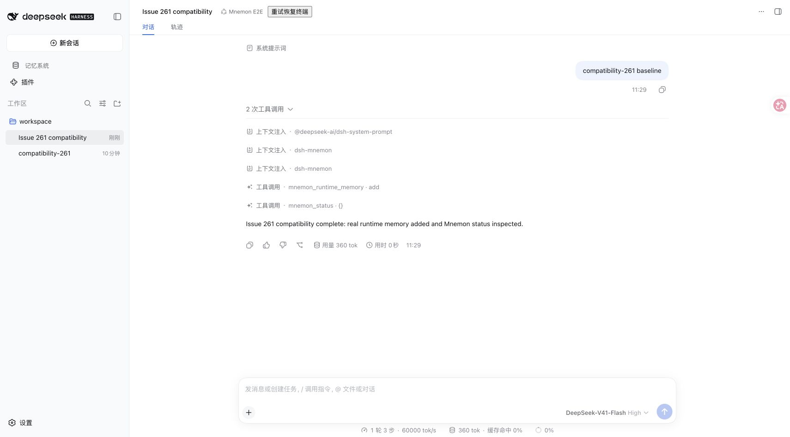
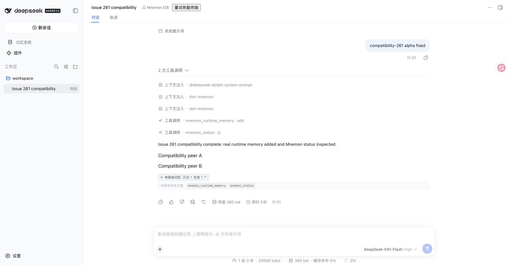

# Issue 261：正式发布的 DSH RC 与 alpha 兼容验证

**简体中文** | [English](./README.md) | [证据索引](../README.md)

采集日期：2026-09-18。环境：macOS arm64、Node 25.1.0、Mnemon Native CLI 0.2.8。关联 [Issue #261](https://github.com/omdsh-dev/dsh-mnemon/issues/261)。

基线为 v0.5.11 发布树 `02ce994c8f05b6bf83a6b5872bd018bbfc8970ce`，对应 main 合并提交 `245c9e2f6a50e6a77e7ba3c679ce07ba80458925`。修复从该 main 创建独立 worktree。本记录实测生产代码为 `2a593c9a6f6510afc0e12704ff2103abc1a1f597`（包含 `60a481f`）。修复制品的开发版本仍为 0.5.11，以完整性哈希区分，不能将其视为新 npm 发布；下一次发布由仅涉及 Root 的 patch changeset 控制。

## 复现与修复

在正式 npm 的 DSH `0.1.6-alpha.2` 上，基线能够完成真实 Runtime 写入和状态工具，但浏览器报出 `list slot "conversation.chat.turnTail" requires options.id`；记忆条与随后注册的存入记忆入口均不出现。保留了[原始错误摘要](./baseline-browser-error.json)与下方对比截图。

修复为插槽增加稳定 ID `dsh-mnemon/turn-tail`，保留 RC 的 chain selector，并在组件内限制仅已完成回合读取、显示记忆活动。完整生产类型检查还发现三处旧 `SessionListState.current` 访问，因此 Sidebar 与响应式设置页改用公开的默认／主 UI Session binding；Builtin 和 Better Sidebar 保留显式所属会话，包括显式无会话状态。Source、Strategy 与 Provider 实现仍由各自独立包拥有。

Root 的两个 DSH peer 范围调整为 `^0.1.5-rc.1 || ^0.1.6-alpha.2`。缺少公开 UI Session 服务的旧版 DSH 不在本次支持范围；回滚旧宿主需要同时使用之前验证过的 Mnemon 版本。此修复不迁移配置或已有数据。

## 实测结果

| 检查 | 发布基线 | 修复后 RC `0.1.5-rc.2` | 修复后 alpha `0.1.6-alpha.2` |
|---|---|---|---|
| 完整生产源码公开类型图 | RC：196 文件、0 错误；alpha：196 文件、4 错误 | 198 文件、0 错误 | 198 文件、0 错误 |
| 正常 npm 制品安装与 `npm ls --all` | alpha 需要下文注明的基线专用绕过 | 通过；234 个同版本 DSH 记录 | 通过；251 个同版本 DSH 记录 |
| 真实 WebUI Runtime 写入与状态读取 | alpha 工具成功，但无记忆条／保存入口 | 通过 | 通过 |
| 关闭／恢复／页面重载后的记忆条数 | alpha 缺失 | 0 / 1 / 1 | 0 / 1 / 1 |
| 其他回合组件 | 未加载 peer 夹具 | 按夹具配置，两个 chain selector 均不展示 | Mnemon 关闭时 A、B 仍在；重载后各一份 |
| Sidebar 与 Builtin 工具入口跳转 | 基线不作为通过项 | 正确显示 Runtime 记录 | 正确显示 Runtime 记录 |
| 存入记忆入口 | alpha 缺失 | 候选为完整最终回复，随后取消 | 候选为完整最终回复，随后取消 |
| 制品 Headless 写入／状态、新进程持久化、禁用 Root | 修正夹具协议后 alpha 通过 | 启用 17 工具、数据字节不变、禁用后 0 工具 | 启用 17 工具、数据字节不变、禁用后 0 工具 |

alpha 还进行了真实会话范围切换：设置为工作区存储后，在第二个会话的 `workspace-b` 写入一条记录，切回原会话的 `workspace` 显示零条，未借用 B 的数据。较早的全局记录仍保存在全局存储。新会话起始页面不显示 Builtin 标签。显式会话／无会话、等待 cwd、过期活动响应与歧义／其他会话的 Builtin 挂载点由针对性组件测试覆盖；本记录不声称穷尽了第三方分屏布局。

`pnpm run verify` 通过，包含 Root 1,183 项测试、真实 Native CLI 创建／写入／读取／遗忘、真实 Host 工具在同一 View 向 Native 归档、确定性构建、公开入口及 RC1 Headless。`pnpm run verify:plugins --skip-build` 通过 16 个独立插件、17 个制品、外部消费者、从 0.4.7 升级 Starter 与三个同时启用的 Strategy 扩展。此次 macOS 验证跳过 5 项需显式开启的真实 Flash 测试、1 项真实 OpenViking 集成及 1 项 Windows 专用 smoke。Root 制品为 47 文件、压缩后 299,146 字节、解压后 1,338,363 字节；大小预算为 1,339,000 字节。

## 截图与保留证据

截图均为未经编辑的浏览器原始采集，画面中的记忆均为合成测试数据。

| 修复前：alpha 注册失败 | 修复后：alpha 的两个 peer 与 Mnemon 同时存在 |
|---|---|
|  |  |

补充截图：[Sidebar Runtime 记录](./03-alpha-runtime-navigation.png)、[关闭 Mnemon 后保留 peer](./04-alpha-bar-off-peers-retained.png)、[Builtin 跳转](./05-alpha-builtin-navigation.png)、[工作区 B 记录](./06-alpha-workspace-b-memory.png)、[工作区 A 隔离](./07-alpha-workspace-a-isolated.png)、[RC 完成回合](./08-rc-after-turn-bar.png)。

- [浏览器观测](./browser-results.json)、[类型检查摘要](./typecheck-results.json)、[验证与版本摘要](./verification.json)。
- [制品验证脚本与复现命令](./harness/HARNESS.md)、[制品完整性与版本组合结果](./harness/evidence-summary.json)。
- [生产类型检查脚本](./check-published-types.mjs)：输入正常安装、版本完全一致的公开 SDK，另安装同版本 `dsh-client-store` 与 `dsh-client-ui-slots` 声明；覆盖 Root 和全部插件生产源码，并拒绝混入其他 DSH 声明，不引用 DSH 源码 checkout。

本地模型夹具支持 OpenAI 与 Anthropic 协议，并请求实际安装的 Mnemon 工具；未调用外部模型 API。界面的模型名称来自夹具配置，不代表真实 Flash 推理。Runtime 写入由真实 Runtime Source JSON 存储完成，与另行通过的 Native 记忆空间 CLI 集成有所区别；沉淀 Agent 仅验证确认入口及取消，没有执行模型沉淀。

仅基线 alpha 使用 `--legacy-peer-deps`，因为已发布 0.5.11 的 peer 不包含 alpha；修复版均正常解析 npm peer。最早仅支持 OpenAI 的 alpha 尝试因夹具不支持 Anthropic 而失败，未将其算作产品缺陷。公开 SlotCore、Chat、Renderer 与 Conversation 的字节均验证未改动。测试 Profile 关闭了无关子进程服务，因此 alpha 页头有终端恢复提示。明确排除了浏览器扩展来源的控制台消息；两个修复版本的观测均无应用来源警告或错误。本记录验证兼容机制，不评估模型质量或真实第三方 Provider 账号一致性。
