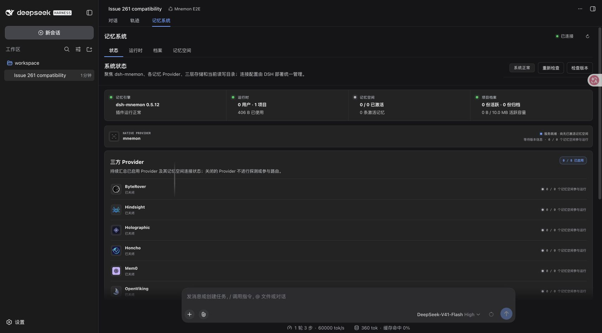
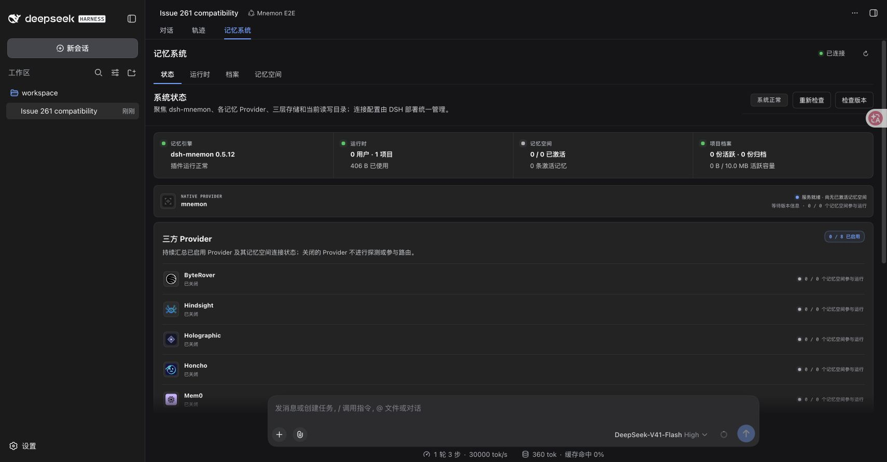

# Issue 265：Builtin 宽度手柄验证

[English](README.md) | [简体中文](README.zh-CN.md)

在 main `65c0e23ba410993e16c00c8b3adf92d59d853425`（Mnemon 0.5.12）上，DSH 的对话宽度手柄仍挂载在 Builtin 记忆页上方。鼠标移到左侧条带时会显示竖线；命中测试落到原生手柄，而不是记忆页。

修复通过 CSS `:has()` 规则匹配直接承载 Mnemon Builtin 的对话，仅给该对话的直接 `data-width-handle` 子元素设置 `visibility: hidden` 和 `pointer-events: none`。Builtin 根节点保持 `position: static; z-index: auto`，常驻输入框仍可使用；返回 Chat 后原生拖动自动恢复。直接归属链还排除了 Sidebar、嵌套或相邻对话以及其他插件视图。曾尝试提升层级，但实际遮挡了输入框，因此已放弃；本文不将该原型运行计入通过证据。

## 实际 WebUI 证据

验证日期为 2026-09-22，环境为 macOS arm64 / Node 25.1.0，使用公开发布的 DSH 包、全部 17 个 Mnemon 打包制品和本机回环模型夹具。最终制品集为 `fixed-scoped`，在上述 main 提交上打包工作区补丁。Root 制品内全部 47 个文件与最终验证构建一致。[verification.json](verification.json) 记录全部 17 个 tarball 哈希、公开模块字节核对、观测值及截图哈希。

| 运行 | 观测结果 | 截图 |
| --- | --- | --- |
| main 基线，DSH 0.1.5-rc.2 | 两侧命中原生手柄；左侧悬停标记透明度为 1。 | [修复前](before-rc2.png) |
| 限定归属的修复，DSH 0.1.5-rc.2 | 两侧手柄隐藏且不接收指针事件；原手柄位置命中 Builtin；输入框可见且直接命中自身。 | [RC2 修复后](after-rc2.png) |
| 限定归属的修复，DSH 0.1.6-alpha.2 | 原生浏览器命中测试结果相同。 | [alpha2 修复后](after-alpha2.png) |
| RC2 Runtime Source | 实际打开挂载于 body 的新增对话框，写入新记忆并显示成功回执。刷新并重新选择会话后，两条记忆仍存在。 | [对话框](runtime-dialog-rc2.png)、[保存结果](runtime-write-rc2.png) |
| RC2 常驻输入框与 Chat | 在 Builtin 打开时发送新消息；Chat 显示新增用户消息与完成的模型回复。原生宽度拖动也正常。 | [Chat](chat-restored-rc2.png) |





两个版本中都实际拖动了 Chat 左边界 60 px，输入框宽度从 943.20 px 缩至 823.20 px。RC2 再次通过真实拖动恢复原宽度。Runtime 写入并刷新浏览器后，原手柄位置仍命中 Builtin，输入框仍命中自身。

## 验证结果

- `npx --yes pnpm@10.13.1 run verify`：通过；Root 测试 1,189 项、插件测试 382 项通过。七项既有按需测试跳过：五项真实模型压力或质量测试、一项 Windows Native 冒烟测试、一项需要指定服务端点的 OpenViking 集成测试。类型、确定性构建、Headless、包内容、`publint` 与 `attw` 均通过。通过 `MNEMON_NATIVE_TEST_CLI` 启用真实 Native 0.2.8，在隔离存储中完成空间创建、View 写入、检索、删除及双命名空间容量工作流。
- `npx --yes pnpm@10.13.1 run verify:plugins --skip-build`：16 个独立插件仓库和 17 个打包制品通过，包括公开 SDK 组合、Client 测试、三个可选策略共同激活，以及仅安装 Root 后激活。
- 六项选择器契约测试全部通过；换成 main 的 CSS 后出现三项失败。测试覆盖归属、输入框、peer/Sidebar 排除、嵌套与相邻对话隔离及自动恢复。JSDOM 适配器读取实际编写的规则；上述真实浏览器运行另行验证原生 CSS 绘制及命中行为。
- 两次最终 Headless 运行都暴露全部 17 个 `mnemon_*` 工具；实际执行 Runtime add/status，数据在新 CLI 进程中保留；启用三个策略扩展；禁用 Root 后 Mnemon 工具数为零。实际 Native Mnemon 0.2.8 已配置并核对版本。
- RC2 包含 234 条严格同版本 DSH 包记录，alpha2 为 251 条。两者都解析全部 17 个 Mnemon 包，通过 51 项解析检查，并将四个已安装公开 UI 模块与官方 tarball 字节核对。未安装测试 Client 包。

## 重复验证

使用[公开发布包验证脚本](../issue-261-dsh-slots/harness/HARNESS.zh-CN.md)。先构建待测源码，设置 `MNEMON_SOURCE`、`NATIVE_CLI` 和空的 `VERIFICATION_ROOT`；将 `RC_FRAMEWORK_ROOT`、`ALPHA_FRAMEWORK_ROOT` 分别设为当前平台上此前验证过、版本精确匹配的公开包安装目录。在仓库根目录运行：

```sh
HARNESS=docs/pr-assets/issue-261-dsh-slots/harness
node "$HARNESS/pack-artifacts.mjs" --source "$MNEMON_SOURCE" --output "$VERIFICATION_ROOT/artifacts/fixed-scoped"
node "$HARNESS/packed-e2e.mjs" --mode fixed --cohort rc --artifacts "$VERIFICATION_ROOT/artifacts/fixed-scoped" --framework-root "$RC_FRAMEWORK_ROOT" --run-root "$VERIFICATION_ROOT/fixed-scoped-rc" --native-cli "$NATIVE_CLI" --serve true
node "$HARNESS/packed-e2e.mjs" --mode fixed --cohort alpha --artifacts "$VERIFICATION_ROOT/artifacts/fixed-scoped" --framework-root "$ALPHA_FRAMEWORK_ROOT" --run-root "$VERIFICATION_ROOT/fixed-scoped-alpha" --native-cli "$NATIVE_CLI" --serve true
node "$HARNESS/headless-check.mjs" --consumer "$VERIFICATION_ROOT/fixed-scoped-rc/dsh-home/profiles/web" --output "$VERIFICATION_ROOT/headless-scoped-rc" --native-cli "$NATIVE_CLI"
node "$HARNESS/headless-check.mjs" --consumer "$VERIFICATION_ROOT/fixed-scoped-alpha/dsh-home/profiles/web" --output "$VERIFICATION_ROOT/headless-scoped-alpha" --native-cli "$NATIVE_CLI"
```

服务命令持续运行，请使用独立终端。复现基线时，构建并打包干净的 main 提交，以不同制品目录、运行目录执行同一 RC2 命令。三次首次安装均采用正常 npm peer 解析。精确框架固定值避免 RC2 的传递版本范围解析到不完整的上游 RC3 发布；未改写 DSH 字节或元数据，也未绕过 peer 检查。

截图保留了复用夹具的会话标题“Issue 261 compatibility”。alpha 的终端恢复提示来自刻意禁用的终端夹具。这些运行验证所示公开 WebUI 行为，不证明终端运行、Windows、原生桌面可执行程序或 Native 记忆空间后端写入。peer 隔离由契约测试覆盖；最终浏览器运行未加载可选 peer 夹具。本次 CSS 修改不涉及持久化、配置、RPC 或凭据。
