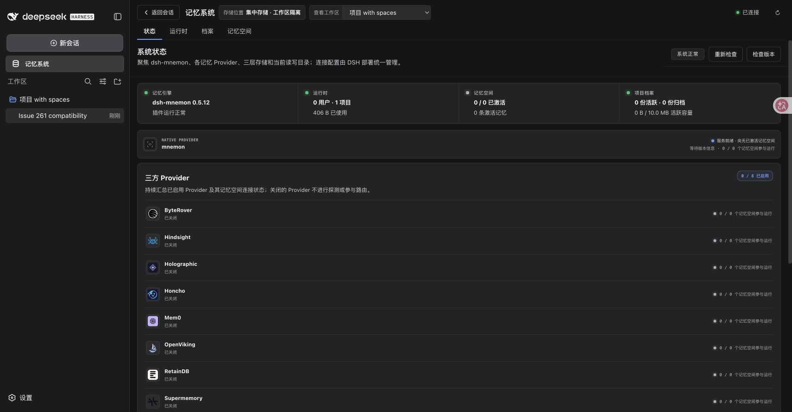
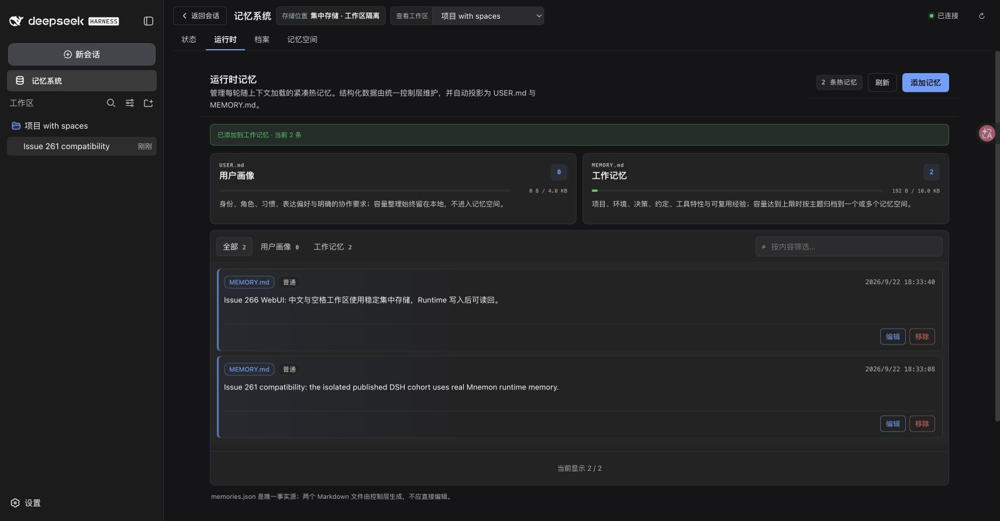

# Windows 工作区祖先路径 — issue #266

[English](./README.md) | [Issue #266](https://github.com/omdsh-dev/dsh-mnemon/issues/266) | [Windows 观测](./windows-results.json) | [WebUI 观测](./webui-verification.json) | [验证记录](./verification.json)

2026-09-22，真实 Windows runner 复现了 #266 报告的无效工作区身份。基线会为普通文件下的路径返回存储哈希；修复后，直接子路径与更深后代均以 `ENOTDIR` 拒绝。基线：`65c0e23ba410993e16c00c8b3adf92d59d853425`（v0.5.12）。实现：`1750e497e58c24406c0092e4fc1549996283aab8`。

## 真实 Windows 前后对比

runner 使用 Windows build 26100、Node 22.19.0 / libuv 1.51.0，以及 Node 24.20.0 / libuv 1.52.1。每次运行都创建临时普通文件、目录与 junction，然后直接导入仓库的 TypeScript 模块。原生探针观测到 `realpathSync.native(file/child)` 抛出 `ENOENT`（errno `-4058`），而 `realpathSync.native(file)` 成功。该观测没有 mock 文件系统调用。

| 运行 | 每个 Node 版本的原生契约用例 | 每个 Node 版本的报告所涉测试文件 |
|---|---|---|
| [基线](https://github.com/omdsh-dev/dsh-mnemon/actions/runs/35715519552) | 10 通过、2 失败：文件子路径及更深后代返回哈希 | 26 通过、3 失败 |
| [修复](https://github.com/omdsh-dev/dsh-mnemon/actions/runs/35715781789) | 12 通过；两种文件后代均抛出 `ENOTDIR` | 31 通过、0 失败 |

基线 workflow 特意断言报告中的失败出现；其成功状态代表复现成功。前后两次都保留现存文件身份、尚未创建的目录后代、Unicode 名称、现存根目录以及 junction 的相同身份。相对路径、空字符串和含 NUL 输入仍被拒绝。原文件内容保持不变。

基线的三处测试失败分别是：非目录祖先的实际断言、Client 导入边界硬编码 POSIX 分隔符，以及委派工作区范围硬编码 POSIX 身份。后两处修正仅提高测试路径的跨平台兼容性。正式 CI 新增 Windows 矩阵，在 Node 22.19 和 24 上持续运行这三个文件。

验证专用分支保留了[基线 workflow 与脚本](https://github.com/omdsh-dev/dsh-mnemon/tree/22690919434d18d8537ef74e08a4d200282a199e/scripts/issue-266-windows)和[修复 workflow 与脚本](https://github.com/omdsh-dev/dsh-mnemon/tree/fde19025ff6452fcfd0643f377593b83279ca232/scripts/issue-266-windows)。在 Windows 上检出相应 revision 后运行：

```powershell
node --experimental-strip-types scripts/issue-266-windows/observe.mjs baseline
# 在修复后的验证 revision 上，将 baseline 替换为 fixed。
pnpm install --frozen-lockfile
pnpm exec vitest run tests/workspace-storage.spec.ts tests/client-platform-boundary.spec.ts tests/async-subagent-memory.spec.ts
```

JSON 证据保留所有原生用例观测及精简测试结果。SHA-256 字段核对实际导入源码与标注的产品 revision，包括 runner 检出时从 LF 到 CRLF 的转换。完整的常规 Vitest 输出保留为 Actions artifact。

## 跨平台回归与集成检查

修改产品代码前，新增跨平台回归在基线上失败：`workspace-storage.spec.ts` 为 1 失败、5 通过。它仅将第一次原生 `realpath` 调用替换为 Windows 的 `ENOENT`；现存文件的后续解析及文件系统类型检查仍使用真实文件。该用例在 POSIX 上覆盖缺失分支，与上述真实 Windows 证据相互独立。修复后，macOS 上全部 31 项定向测试也通过。

本地验证使用 macOS arm64、Node 25.1.0、pnpm 10.13.1、正式 DSH 0.1.5-rc.1 与官方 Mnemon CLI 0.2.8。设置 `MNEMON_NATIVE_TEST_CLI` 后，`pnpm run verify` 通过 1,185 项根测试、382 项插件测试、确定性构建、类型检查、真实 Native 集成与容量流程、隔离 Headless 激活/重启，以及制品校验。跳过 5 项需要真实 Flash 的根测试、1 项真实 OpenViking 测试，以及 1 项不适用于 macOS 的 Windows Native 冒烟。

随后，`MNEMON_PLUGIN_VERIFY_CONCURRENCY=4 pnpm run verify:plugins --skip-build` 通过 16 个独立插件仓库、17 个制品、只用公开 SDK 的外部消费者、打包 Starter 激活，以及三个可选 Strategy 同时启用验证。构建与制品消费者顺序执行。另从干净的实现 revision 打包全部 17 个已验证制品，供下面独立的 macOS WebUI 冒烟使用。

## 正式 RC2 与真实 CLI 的 macOS WebUI

macOS 上的 Chrome 加载了实现 `1750e497` 的全部 17 个制品，使用正式 DSH 0.1.5-rc.2 与真实 Mnemon CLI 0.2.8。Scoped、Light context 和 Active capture 同时启用。隔离 profile 包含 234 个 DSH 包，全部精确为 RC2；51 项已检查的 peer 解析都位于该 profile 的 `node_modules` 内，4 个 Client 入口文件与公开制品字节一致。Root tarball 的 SHA-256 为 `3d5259f8a995a662ecf3e015282f42490a4be13e006e4672715aa05a8f6c353b`；[WebUI 记录](./webui-verification.json)保留全部 17 个制品哈希与 CLI 哈希。

在 UI 选择集中工作区，并选中现存的 `项目 with spaces` 目录。发送 `compatibility-261` 后，本地确定性模型调用真实的 `mnemon_runtime_memory` add 与 `mnemon_status` 工具。状态页显示系统正常、Runtime 一条。随后点击 Runtime → 添加记忆，保存 `Issue 266 WebUI: 中文与空格工作区使用稳定集中存储，Runtime 写入后可读回。`；页面显示两条记录及成功提示。

| 集中工作区状态 | Runtime 写入与读回 |
|---|---|
|  |  |

只读检查确认规范工作区哈希为 `b541b67e760240d3e9cf9985777163114eb92d9dad1ce95546b73fd0e04c4c12`，`<集中根>/workspaces/<哈希>/runtime/memories.json` 恰有两条记录，其 `MEMORY.md` 投影也包含精确新增文本。全局 Runtime 仍为空，工作区内没有新增 `.mnemon` 目录。WebUI 记录保留 JSON 与投影哈希。截图中的 “Issue 261” 会话标题和第一条记录是复用兼容性夹具时有意保留的标记。

本任务中未固定依赖的安装遇到了不完整的公开 RC3 传递依赖发布。因此，冒烟使用全新的消费者，将依赖固定为此前验证 profile 的精确正式 RC2 图谱，未使用 `--legacy-peer-deps`。[已有安装脚本](../issue-261-dsh-slots/harness/packed-e2e.mjs)的外部副本仅调整为在 fixed 模式也使用 `--framework-root`；已保留该[小范围安装差异](./webui-rc2-pins.patch)，副本 SHA-256 为 `9de47863b19cae46122ab030675879c11b6e598bd46f31c302bd9eeb59b598d2`。没有修改 DSH 包源码或发布 manifest。

该冒烟验证 macOS 上有效集中工作区的操作，与 Windows 原生拒绝证据独立。浏览器流程检查了 Native CLI 版本，但未创建 Native Memory Space；真实 Native 写入、召回、遗忘和容量流程由上面的完整验证覆盖。模型响应与存储内容均为合成数据，未使用外部模型 API 或个人凭据。

## 兼容与数据

新增目录检查仅在祖先解析成功、且存在已剥离的缺失后缀时执行。没有后代的现存文件路径保留原有身份行为。有效工作区 ID、别名、Unicode 名称和尚未创建的目录后代保持不变。身份解析仍不写入任何内容。

Windows 上位于普通文件下的路径现在会在哈希前被拒绝。任何旧集中目录仍保留在磁盘上；没有格式变更、迁移、合并或删除。回滚恢复原有接受行为，无需转换数据。patch changeset 仅覆盖 `dsh-mnemon`；不修改 DSH 源码、公开契约、Provider 凭据或外部服务行为。已检查其他存储模式与 UI 操作说明，无需修改。
