# DSH Settings 兼容与恢复 — Issue #267

[English](./README.md)

## 基线复现

2026-09-22，未修改的 main `65c0e23ba410993e16c00c8b3adf92d59d853425` 在临时 Web Profile 中，使用公开发布的 DSH `0.1.7-alpha.1` 复现了激活失败。Mnemon 根插件报错：

```text
mnemon (dsh-mnemon): TypeError: ctx.settings.register is not a function
```

插件页面显示根插件异常，依赖它的 Source 和 Strategy 等待依赖。本地激活记录将结果标记为 `reproduced`；选定的 DSH 安装文件已与经过完整性校验的公开 npm tarball 比对。

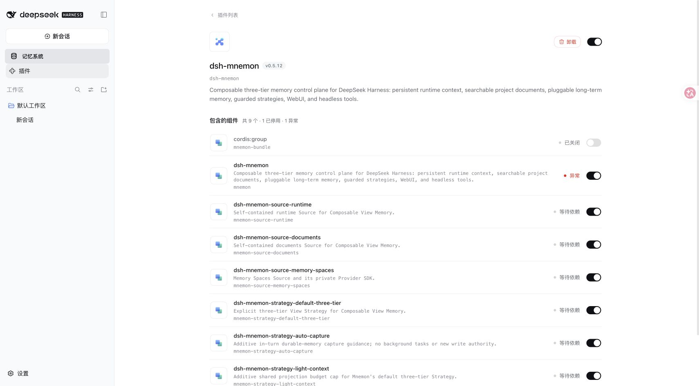

准备和启动方法见[打包制品验证夹具](./harness/HARNESS.md)。基线与修复制品使用独立的临时 Profile。仅基线需要 `--legacy-peer-deps`，用于越过其过时的 peer 范围并暴露运行时故障；修复制品使用正常的 peer 解析。

## 实现与公开契约

DSH `0.1.7-alpha.1` 将动态 Settings 注册改为从各插件的静态 `Config` 生成表单。实现使用公开发布的 `SettingsForms.configure/describe/mutate`、`ConfigEditor.edit`、Cordis 的 `internal/config` waterfall，以及 Loader 的 `loader/volatile-update` 事件。官方 DSH 包、manifest 和源码均未修改；制品夹具不使用 DSH 源码 checkout、工作区 alias 或替代 Settings 服务。

- [Live Config](../../../src/host/live-config.ts) 使用公开 DeepSeek Schemastery/Cosmokit 包提供的真实 volatile 引用，保留原生表单可识别的对象 schema，并执行纯跨字段校验。`remoteAccess` 保持普通字段，沿用 Host 正常的重挂载行为。
- 私有静态 ESM 桥通过 npm alias `schemastery-live` 导入未修改的公开 fork，以窄类型声明阻止其新增全局泛型合并进旧 schema builder。canonical 开发依赖固定为 `3.18.2`，保留 RC.1 类型组合，并满足一处遗漏运行时依赖的上游声明。Mnemon 输出的公开类型不包含 alias；consumer 的 Host 保持自身框架依赖版本。没有修改官方包、TypeScript 源码路径或导入顺序。
- [Settings 适配器](../../../src/host/settings-service.ts) 保留 Mnemon 客户端命名空间，将读取、校验和写入绑定到所属 Entry/Fiber。仍提供 `settings.register` 的旧 Host 继续使用原服务。Profile 写入经过 DSH 加锁的编辑器；所属实例的 preflight 在持久化前校验候选运行图，提交后的 volatile 更新负责刷新运行时。
- Core、UI 和 View 共用一个原生 revision。仅当该命名空间未脱敏的生效值、继承值和显式覆盖仍与已观察快照一致时，才允许有限重试。同命名空间冲突、缺少历史快照、只读状态、实例销毁和 Entry 替换均会拒绝写入；远程描述仍保持脱敏。
- [插件管理](../../../src/host/plugin-management.ts) 在整个 Profile 被重新协调后重放已选择的 Entry 状态，校验最终组合，并对失败事务执行补偿。
- [客户端图标别名](../../../src/client/ui-icons.ts) 同时支持旧版按尺寸命名的导出和 alpha7 按字重命名的导出。设置页双语说明改为由 DSH 保存并实时生效，不再硬编码已移除的设置文件。

- [Session 消息](../../../src/host/lifecycle.ts) 使用 alpha7 V4 codec 要求的生产者来源类型 `dsh-mnemon`。读取和去重仍识别历史 wrapper 与官方迁移后的 `plugin:dsh-mnemon`；修复激活后，真实 WebUI 对话继续复现了这一兼容故障。

## 保留设置与现有 Profile 选择

恢复过程只读 `settings.yaml.imported`，保持其字节不变，并仅通过 `ConfigEditor.edit` 写入。[纯迁移规划器](../../../src/host/legacy-settings-import.ts) 将规范根插件的保留分区映射如下：

| 保留分区 | Profile Config 目标 |
| --- | --- |
| `mnemon` | 当前显式覆盖中缺失的根配置字段 |
| `mnemon-ui` | `conversationInteraction` |
| 精确匹配的 `mnemon-view[-hash]` | `memoryView` |
| 精确匹配的 `mnemon-plugins[-hash]` | `memoryView.entries` 中的 Source 启用状态，仅接受已确认的 Source Entry |

当前显式根配置和 UI 选择优先。已显式设置的 `memoryView` 字段会保留，包括将 `entries` 重置为空的选择。现有 Strategy 行优先于更早保存的启用状态和配置；Source 配置仍由原生 Entry 保存。Profile 的局部 patch ID 会匹配到无歧义的完整 Loader ID，其他行不会被替换。规划器在编辑器回调内重新读取状态，使期间发生的显式编辑优先；`legacySettingsImported` 标记防止后续重置又恢复旧偏好。

原生 `!!js` 表达式以表达式数据保留，恢复过程不会执行它们，也不会把它们转成普通字符串。若某个 Entry 的启用状态或 Strategy 配置由表达式控制，将跳过该 Entry 的旧 View 覆盖。Source 配置表达式和无关表达式行继续保留在原生行中。相关旧备份分区中的表达式、损坏数据和不支持的 YAML 会被拒绝，不会完成恢复或修改备份。

## 迁移与回滚边界

- 若启动时仍有原始 `settings.yaml`，DSH 会自行异步重命名和导入。Mnemon 的补充恢复延后到下一次 Host 冷启动；刷新页面或重挂插件不会解除该限制。
- 自动恢复仅接受规范根 Entry `mnemon`，以及所属 Profile 精确匹配的历史命名空间后缀。不猜测自定义根归属、其他 Profile 的 hash 或无后缀回退。歧义和被拒绝的数据仍保留在备份中，供人工核对。
- 升级前备份 DSH Profile 配置、旧设置和相关 Mnemon 数据。新 Profile 设置不会反向同步到 `settings.yaml`；降级需要相应的配置备份，并人工核对升级后的新增修改，没有自动逆向导出。
- 此变更涉及偏好存储和恢复，不改变 Runtime、Documents 或 Memory Spaces 的数据格式。

## 验证范围

定向回归覆盖 [schema 与引用行为](../../../tests/live-config.spec.ts)、[所属实例隔离与脱敏](../../../tests/profile-settings.spec.ts)、[revision 冲突与已退役实例](../../../tests/profile-settings-revisions.spec.ts)、[纯迁移规划](../../../tests/legacy-settings-import.spec.ts)、[保留文件恢复与表达式](../../../tests/profile-settings-import.spec.ts)，以及[两代客户端图标](../../../tests/client-primitives-compat.spec.tsx)。

制品夹具使用隔离测试数据，确定性模型端点仅绑定 `127.0.0.1`，不需要外部模型 API Key，也不会调用外部模型服务。启动认证 URL、`server.json`、原始 `web.log` 和模型请求日志均留在仓库外；公开证据不得包含凭据或私人数据。

## 设置与迁移实测结果

提交 `407eac75ee46e677f694e6c318ca9380357fae27` 的 17 件 Mnemon 打包制品通过以下浏览器操作。随后补充的 Session 来源格式修复单独记录；本轮记录验证设置实现。机器可读哈希与结果见 [settings-verification.json](./settings-verification.json)。

| 公开 DSH 版本 | 同版本 DSH 包数量 | 核对的官方安装文件 | 实际 WebUI 操作 |
| --- | ---: | ---: | --- |
| `0.1.5-rc.2` | 234 | 8 | 打开工作台；关闭 Light 并保留 Auto Capture/Scoped；保存核心/UI 设置；刷新页面 |
| `0.1.6-alpha.2` | 251 | 8 | 使用该版本 Settings 服务完成相同操作 |
| `0.1.7-alpha.1` | 267 | 10 | Root 与全部 Source/Strategy 激活；核心/UI 连续保存；独立 UI 保存；页面刷新及完整 Host 重启 |

alpha7 重启后间隔仍为 `310000`，Light 保持关闭，Auto Capture/Scoped 保持开启，两个 UI 开关保持关闭。RC.2、alpha.2 保存的间隔分别为 `320000`、`330000`；Light/回合记忆条关闭，其他开关保持开启。没有出现虚假的 revision 冲突。

旧备份夹具恢复召回上限 `7`、回合记忆条开启/存入按钮关闭，以及主动记录开启。当前 Light 启用和配置（`1200`）、档案启用优先于旧值；外部 profile 的 Scoped 偏好被忽略。完整 Host 重启后，profile patch、根 Config、全部 21 个非 root 行和原始备份哈希均不变。重启前，20 个初始非 root 行与夹具初始化语义相同；新增行来自浏览器确认内测声明。

真实 Mnemon CLI `0.2.8` 还完成了 WebUI 状态调用，并创建、启用存储正常的原生记忆空间。可选的默认 Ollama 嵌入端点未运行；未使用外部嵌入或模型密钥。

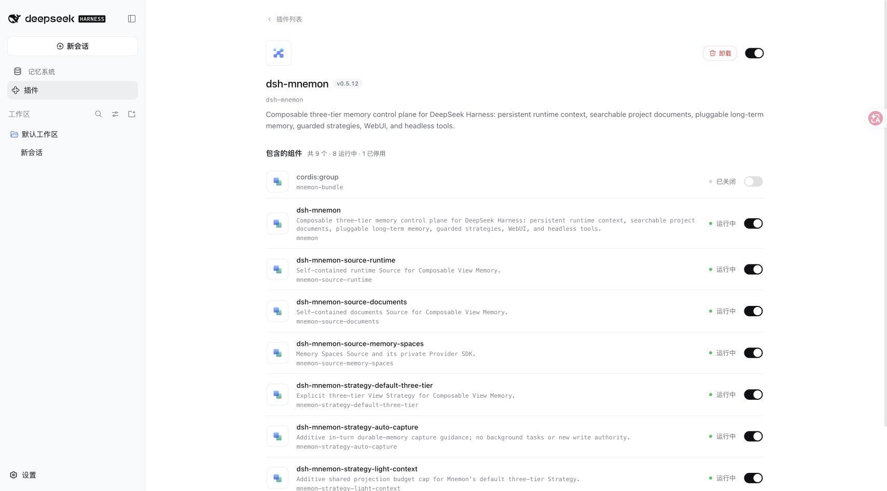
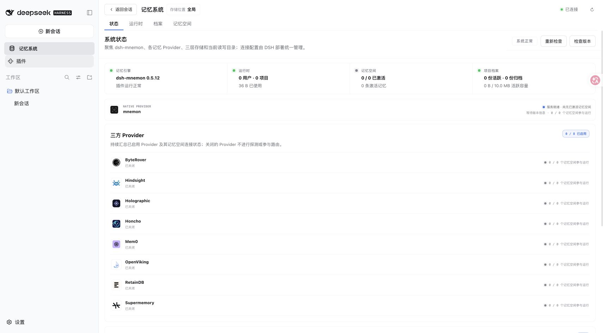
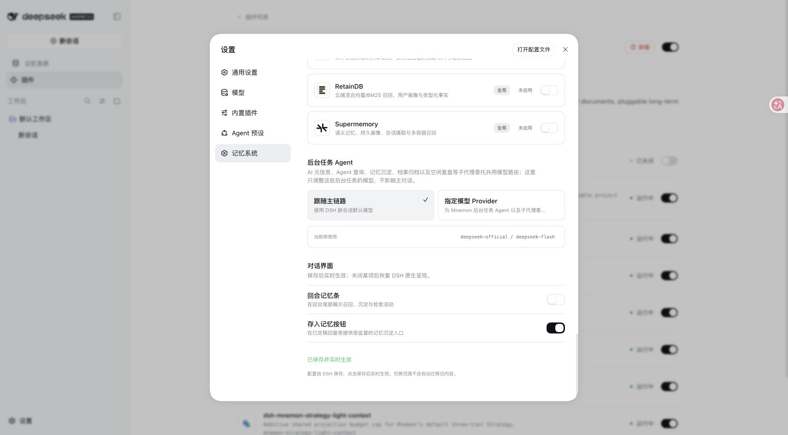
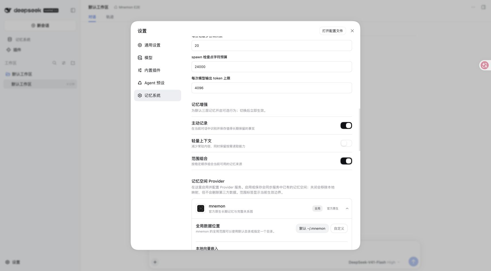
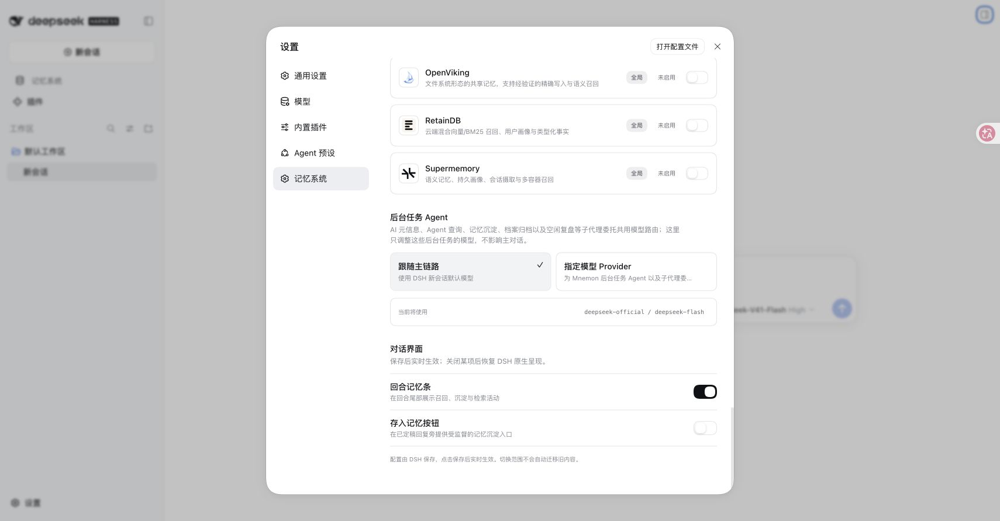
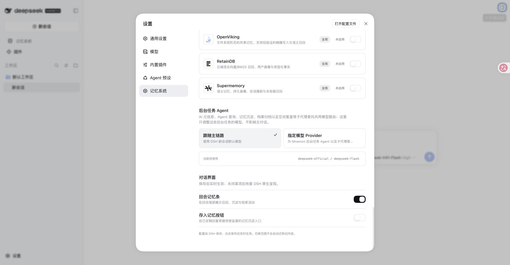
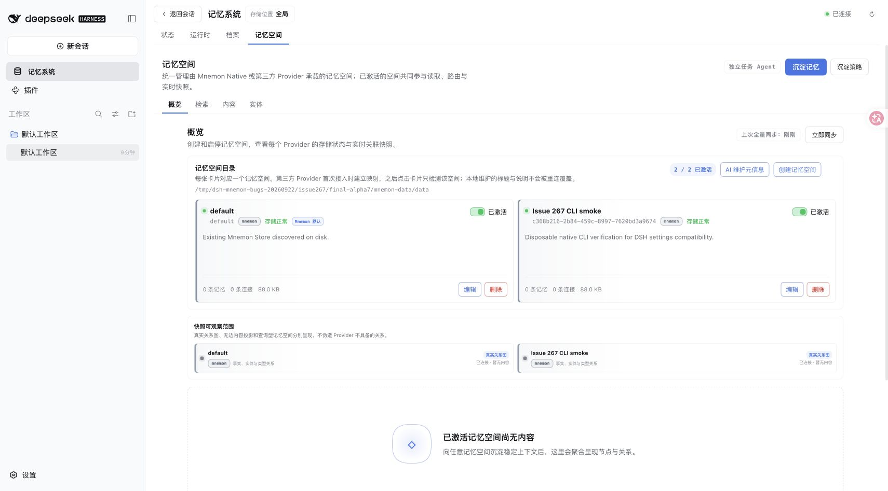
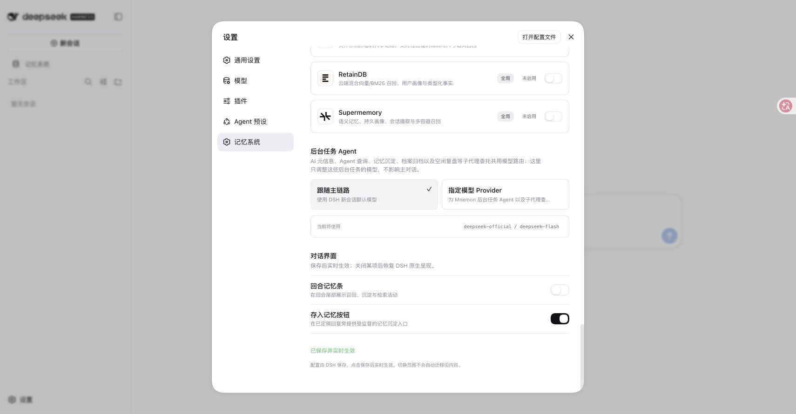
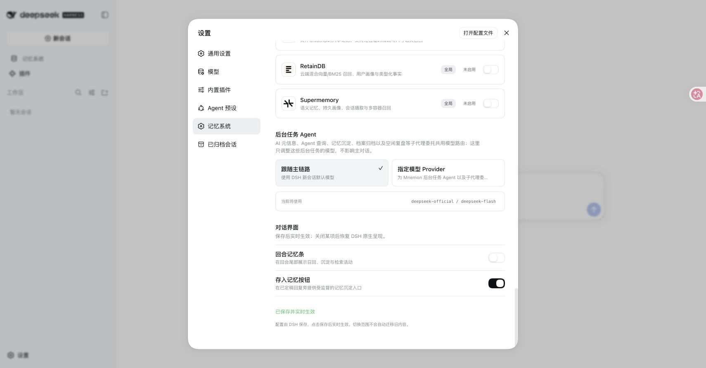

## 类型隔离前的 Session 制品验证

Session 修复 `dc10b5b6a2b39bd3093823741e286592dc640cd6` 从干净 checkout 打包，在三个全新 consumer 中使用正常 npm peer 解析安装。三组使用相同的 17 件 Mnemon 制品；根包 SHA-256 为 `b2204a284db063a128dce845cd115ecac33b5c91e91071d050d2a9d5daf1db16`。[final-verification.json](./final-verification.json) 记录这一阶段的制品哈希、公开包校验、持久化工具回执及测试结果。最终类型隔离制品的验证见下文。

`0.1.5-rc.2`、`0.1.6-alpha.2`、`0.1.7-alpha.1` 的实际 WebUI 回合均调用 `mnemon_runtime_memory` 的 `action: add`，随后调用 `mnemon_status`。每组恰好写入一条夹具记忆，状态回执均为健康、原生 CLI 可用、允许写入。每份压缩 Session 均完整解码，保留两条来源为 `dsh-mnemon` 的消息。RC.2、alpha.2 使用 Session V3，alpha.7 使用 V4。提示词和标题仍为 `compatibility-261` / `Issue 261 compatibility`，因为复用了确定性模型夹具；本目录的制品、Profile 与截图属于 Issue 267。

Session 修复前，alpha.7 的真实回合报错 `format v4 message requires a producer-owned source kind`。回归测试使用公开 alpha.7 制品的真实 `encodeEvent`、`restoreReleasedV4Artifact` 契约，并验证旧包装会被拒绝。完整 lifecycle 测试 56 项通过。

这组 alpha.7 制品中，通过浏览器选择 Builtin 显示模式、关闭 Light、保存间隔 `340000`、关闭回合记忆条并保留存入按钮。完整重启 Host 进程后，浏览器确认全部设置、恢复的对话及其一条 Runtime 记忆均保留。Auto Capture、Scoped 仍通过原生 Entry 启用，没有多余的 View 覆盖。

原始文件夹具也通过了两个迁移阶段：DSH 先重命名、导入 `settings.yaml`，此时 Mnemon 补充标记和 View 尚不存在；完整重启一次 Host 后，预期 UI/View 偏好恢复，迁移标记写入。保留备份字节始终不变。这轮仅设置验证使用 `407eac75`；最终 Session 提交没有改动其设置实现。

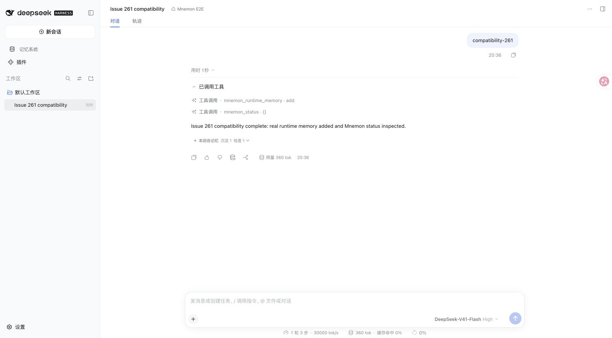
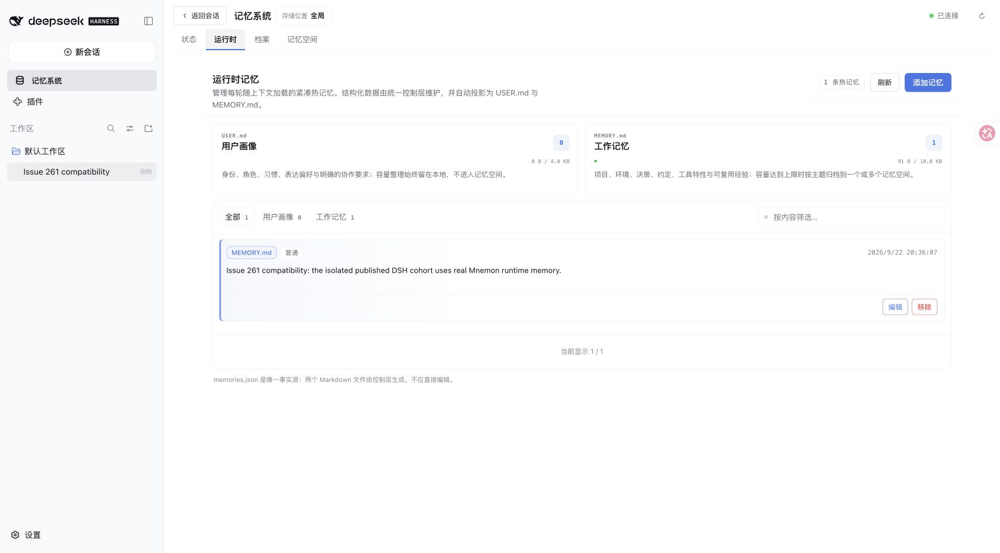
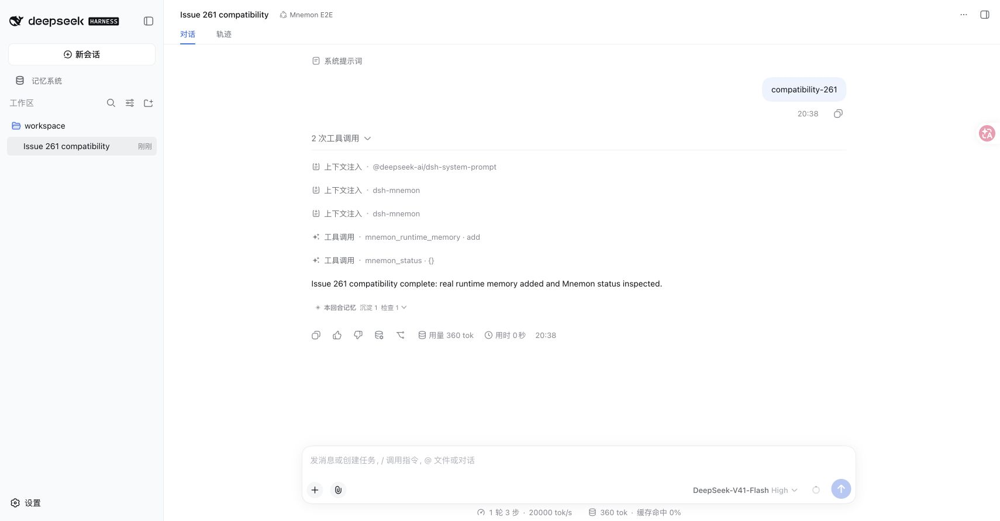
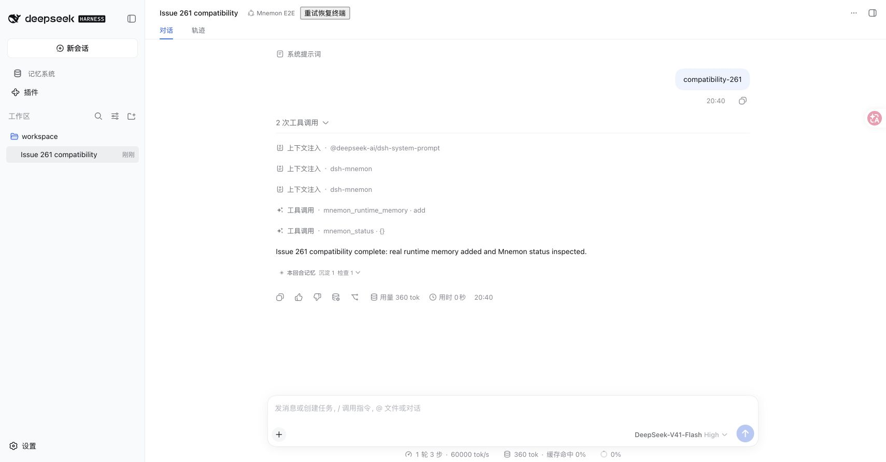
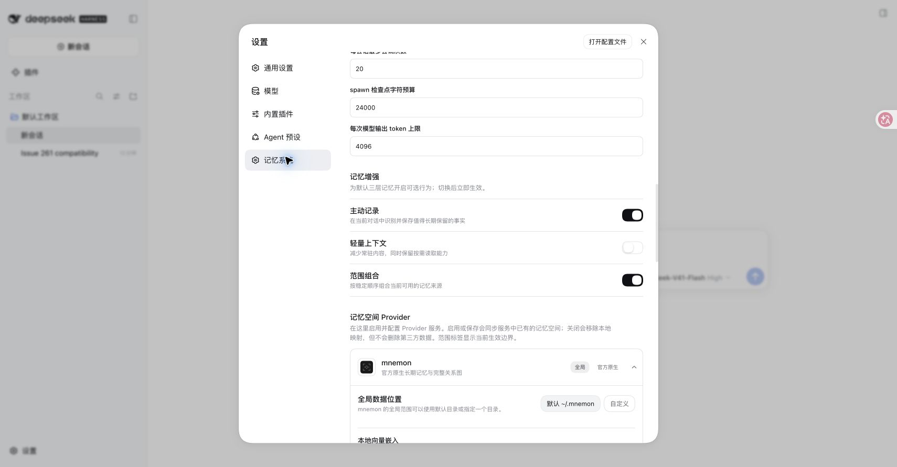
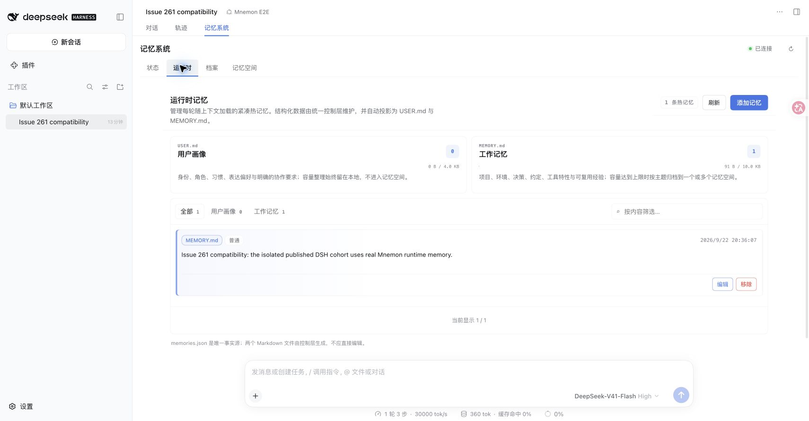


## 最终类型隔离制品与 WebUI 验证

干净 CI 暴露了旧 Schemastery 与新版 live fork 的全局泛型声明冲突。前述私有桥隔离运行时导入，并保留 main 已有锁文件的 package/snapshot 值。实现提交 `d57e14054a4c523097b382ff36ca6bd3a993ff03` 从干净 checkout 打包，再通过正常 peer 解析安装到三个全新 consumer。最终根包 SHA-256 为 `552eb9c23846e23e958100974888351a74666c471d614d2f098f2426d5a81cb3`；全部 17 件制品哈希和安装校验见 [type-isolation-verification.json](./type-isolation-verification.json)。

三组公开 DSH 均重新完成真实 WebUI Runtime 写入与原生 CLI 状态调用。每个已安装的 `schemastery-live` 包全部八个文件均与未修改的官方 `@deepseek-ai/schemastery@3.18.3` 制品一致。RC.2、alpha.2、alpha.7 的同版本 DSH 包数量/选定官方文件校验仍分别为 234/8、251/8、267/10。

alpha.7 中，浏览器先准备核心/UI 草稿，再通过独立的即时插件写入关闭 Light，最后保存剩余草稿，没有虚假冲突。完整重启 Host 后，Builtin、间隔 `350000`、回合记忆条关闭/存入按钮开启，以及 Light 关闭/Auto Capture 和 Scoped 开启均保留。原对话完整加载，Builtin 工作台显示一条 Runtime 记忆。Profile 与压缩 Session 的核对记录与浏览器证据一并保留。

该实现提交的 [Node 22.19 源码检查](https://github.com/omdsh-dev/dsh-mnemon/actions/runs/35733033143/job/106763140386)和 [Node 24 独立插件制品检查](https://github.com/omdsh-dev/dsh-mnemon/actions/runs/35733033143/job/106763140029)均通过。


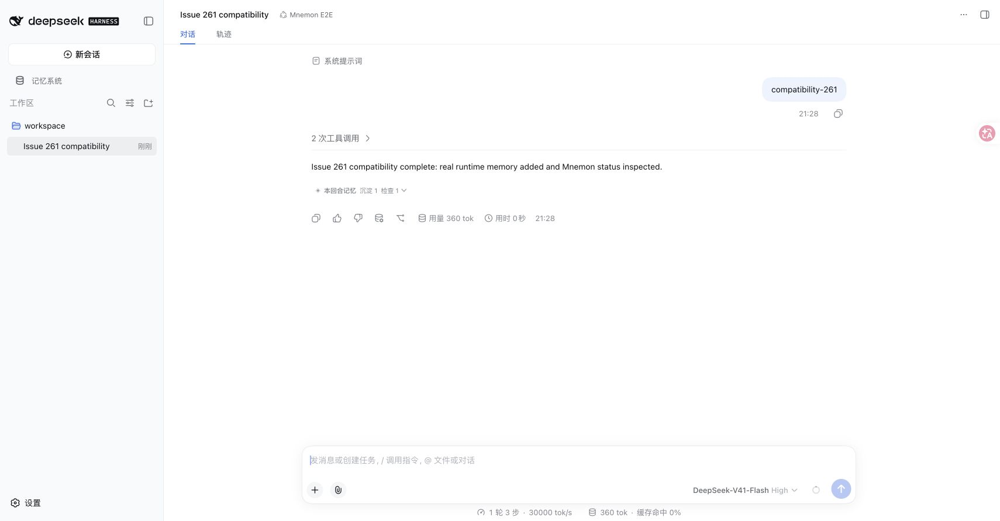

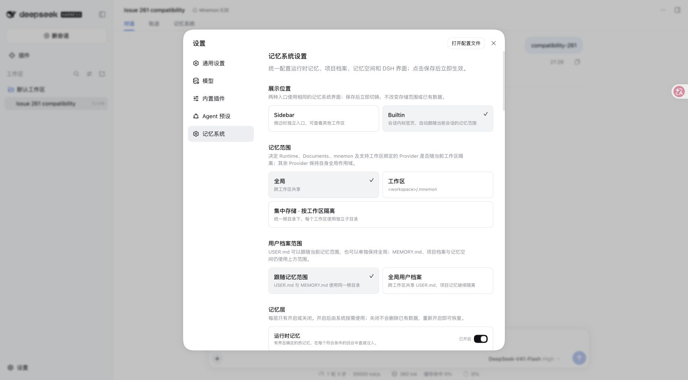
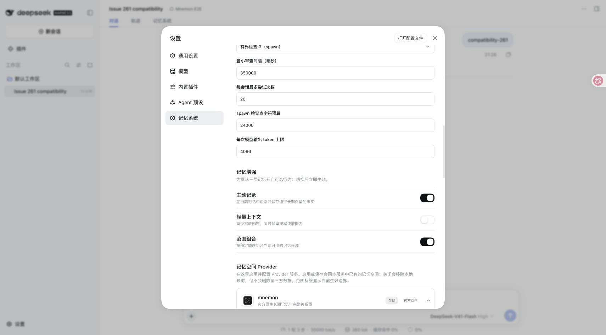
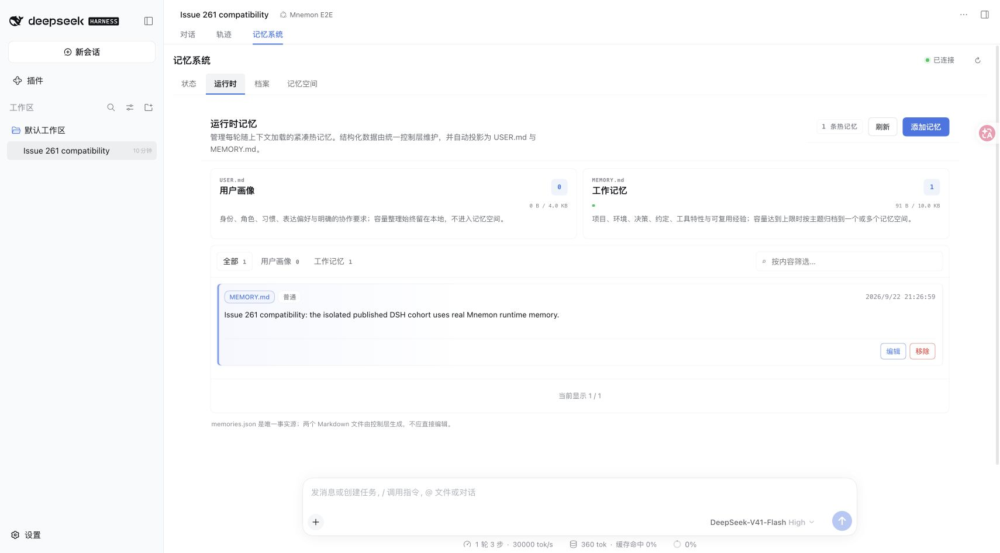

## 完整本地检查与范围

以下命令通过，插件检查在 `verify` 完成后顺序执行：

```sh
MNEMON_NATIVE_TEST_CLI=/path/to/mnemon \
MNEMON_DSH_V4_CONTRACT_ROOT=/path/to/alpha7-consumer/node_modules \
  npx --yes --package=node@22.19.0 --package=pnpm@10.13.1 pnpm run verify
npx --yes --package=node@24.20.0 --package=pnpm@10.13.1 pnpm run verify:plugins --skip-build
```

- Root 测试 1,342 项通过、5 项跳过；插件测试 382 项通过、2 项跳过。跳过项依赖外部 Flash 模型、Windows 或真实 OpenViking 服务。真实原生 CLI、公开 V4 codec 用例均已启用。
- 文档、类型、确定性构建、包体预算、公开入口导入、声明依赖、`publint`、`attw` 全部通过。最终根包包含 49 个文件、解包后 1,370,296 字节；验证了 12 个 Node 兼容入口、28 个公开类型依赖和修复 CLI 帮助。
- Headless 检查通过，包含 39 个工具和 8 个代表性 Mnemon 工具。16 个独立插件仓库、17 个 tarball 的 consumer 检查通过，包括仅依赖 SDK 的外部 consumer、三个可选 Strategy 同时启用及仅 Starter 激活。
- 浏览器夹具运行于 macOS、Node `25.1.0`，最终源码与制品检查分别运行于 Node `22.19.0`、`24.20.0`。这是 Mnemon 兼容证据，未覆盖 DSH 全部功能。精简夹具省略 terminal/deliverables/workspace-change 服务；对应等待项、通用 permission-preset 请求失败和 alpha.2 的终端重试按钮不属于 Mnemon 故障。本轮未验证外部模型质量、外部 Provider 或嵌入服务。
- 多次本地夹具运行后，最终重启复核曾遇到浏览器 HTTP 431。使用合成的 14 KB Cookie 独立复现了短请求成功、较长插件资源请求失败。将同一运行中监听器的浏览地址改用 `localhost` 后完成复核；没有修改 Profile/数据、官方文件、服务端限制或已有浏览器 Cookie。重复执行时可参考夹具说明。
