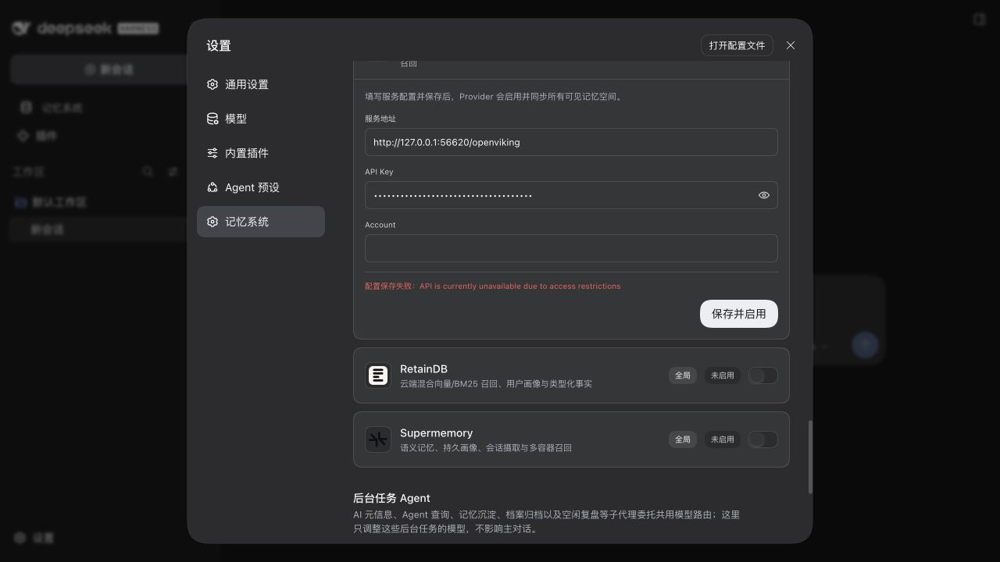
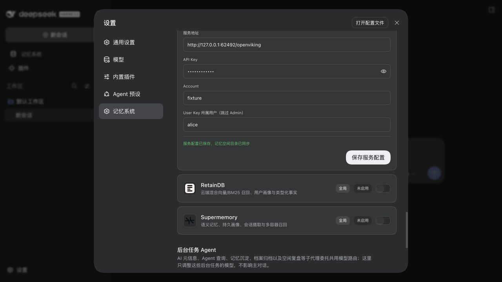
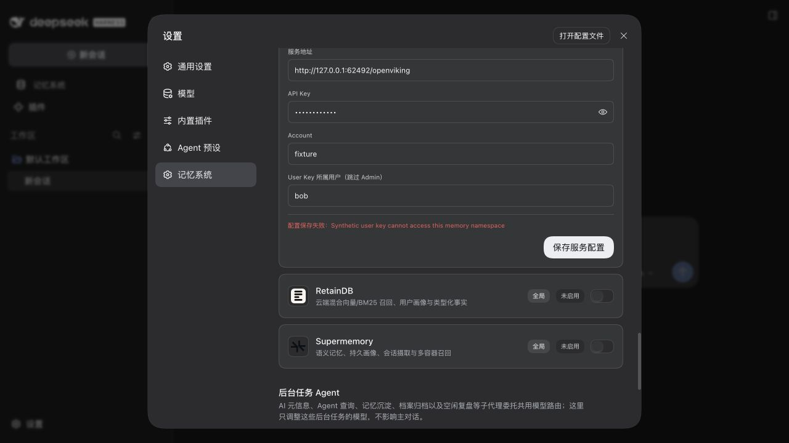
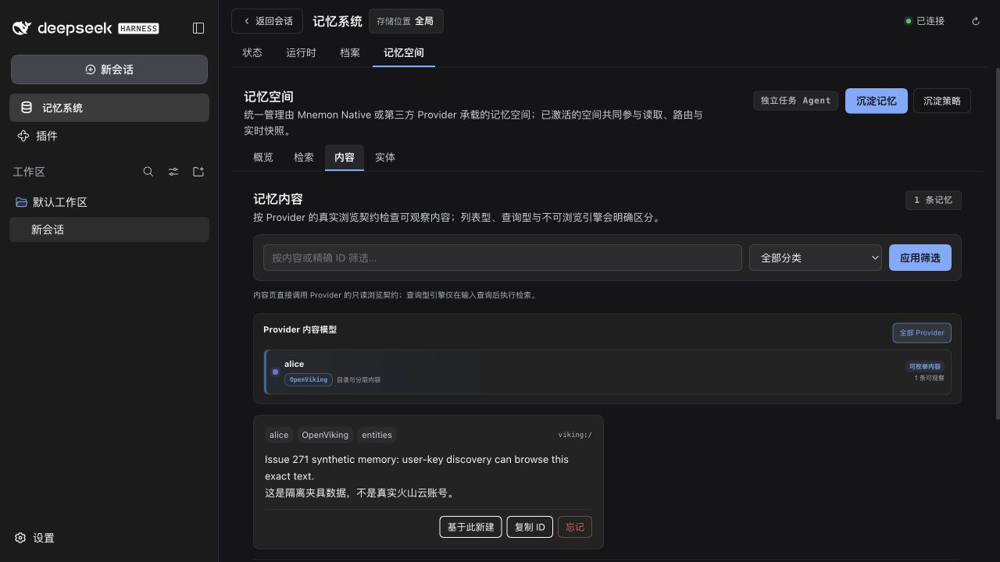
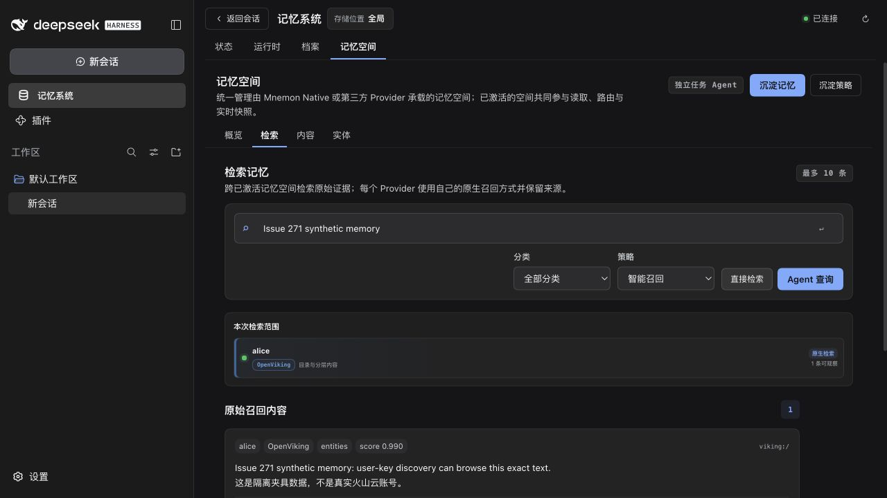
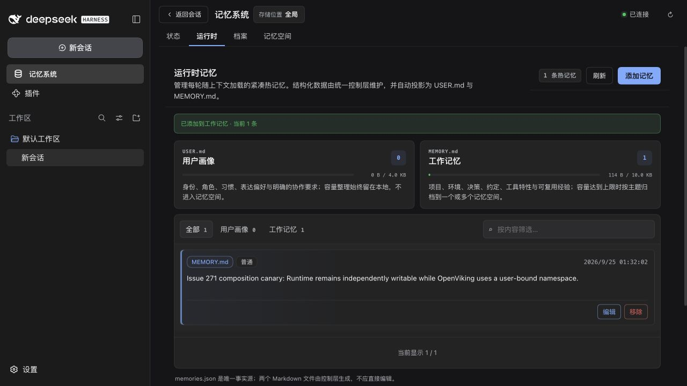

# OpenViking user-key 发现 — issue 271

[English](./README.md)

基线为 `84d469ffa838a36fa579295d94029fcac8ac058e`。user key 可访问 OpenViking 数据 API，但全部 `/api/v1/admin/*` 路由被拒绝。基线即使配置账号仍会枚举 admin users，因此单独填写 Account 无法保存服务。

回归先在基线驱动上以 `API is currently unavailable due to access restrictions` 失败。修复仅在 `discoveryUser` 非空时显式采用单用户数据面发现，要求账号与 API key，通过只读 `fs/ls` 校验所选根，失败时保留原配置。后续读取、精确写入和删除不发送 trusted account/user 身份请求头，并拒绝不匹配的空间用户。默认仍为原有 admin 发现。

## 公开契约

核对的上游版本为 [OpenViking `4edc30b0`](https://github.com/volcengine/OpenViking/tree/4edc30b068934893bc94a4e1b8e87bab2100bce5)。其[身份验证指南](https://github.com/volcengine/OpenViking/blob/4edc30b068934893bc94a4e1b8e87bab2100bce5/docs/en/guides/04-authentication.md)明确说明 `api_key` 模式从 key 解析租户身份，并拒绝 account/user 身份请求头；[文件系统路由](https://github.com/volcengine/OpenViking/blob/4edc30b068934893bc94a4e1b8e87bab2100bce5/openviking/server/routers/filesystem.py)提供带请求身份的 `fs/ls`。配置的 account 标识本地映射，不证明或覆盖 key 所属账号。

## 自动验证

- 独立 Provider 回归覆盖 admin 拒绝、不完整或危险配置、无效发现响应、数据访问拒绝、取消、超时、后续操作作用域、用户不匹配和原有默认枚举。
- 真实 Host 组合回归将两个 OpenViking 插件实例与 Native、Holographic、Runtime、Documents 同时挂载，核验凭据脱敏、不同账号同名用户隔离、精确写入/检索/删除，以及更换用户被拒时的原子保留。独立的真实 CLI 检查覆盖 Native Source 创建、写入、召回、删除，以及同一 View 内两个 Native 命名空间的精确归档，详见 [CLI 组合记录](./cli-composition.json)。
- 实际通用设置表单向所属实例提交新字段，分别显示成功和拒绝反馈；双语文案指纹记录每种语言各新增的一个字段标签。
- 完整 `verify` 已通过，使用 Node 24.20.0、pnpm 10.13.1 与官方 Mnemon CLI 0.2.9 操作临时空间：根测试 1,352 项、插件测试 402 项通过，8 项按已有平台/显式启用条件跳过。OpenViking 69 项通过，其中 20 项覆盖新路径，随后以单插件并行度运行的 `verify:plugins --skip-build` 已通过全部 16 个独立插件、17 个制品、外部 SDK 消费者及真实 DSH 组合，详见[汇总验证记录](./verification.json)。

最初并发验证时触发了既有时间预算或超时；在独占窗口中把公开 Vitest worker 上限设为一后，完整原有套件通过，未改任何测试超时或性能预算。[基线](./artifacts-before.json)与[修复](./artifacts-after.json)清单包含全部 17 个 tarball 的 SHA-256，以及改动的生产源码哈希。

```sh
export VITEST_MAX_FORKS=1 VITEST_MIN_FORKS=1
export VITEST_MAX_THREADS=1 VITEST_MIN_THREADS=1
export MNEMON_PLUGIN_VERIFY_CONCURRENCY=1
export MNEMON_NATIVE_TEST_CLI=/absolute/path/to/mnemon
pnpm run verify
pnpm run verify:plugins --skip-build
```

## 复现浏览器对比

[本次脚本](./harness/serve.mjs)将确定性 loopback OpenViking 夹具与已有[打包 DSH 脚本](../issue-267-settings-migration/harness/packed-e2e.mjs)组合。先用 [pack-artifacts.mjs](../issue-261-dsh-slots/harness/pack-artifacts.mjs)分别打包基线与修复代码，每组制品使用独立临时运行目录：

```sh
node docs/pr-assets/issue-271-user-key/harness/serve.mjs \
  --artifacts /tmp/issue271/artifacts \
  --run-root /tmp/issue271/browser \
  --framework-root /tmp/issue271/public-dsh \
  --native-cli /tmp/issue271/mnemon
```

framework 必须是未修改、正常 peer 安装的正式 DSH `0.1.7-alpha.1`。脚本在另一隔离 profile 正常安装全部 17 个 Mnemon tarball，并使用所提供的真实 CLI。前后两个全新 profile 均通过 267 个 DSH 同版本依赖与 10 个选定官方文件的字节核验，详见[运行环境证明](./browser-runtime.json)。bootstrap URL 与随机生成的夹具凭据只写入本地 `0600` JSON 文件，不应提交或截图；`provider-evidence.json` 仅记录合成数据与脱敏请求元信息。

1. 在基线的**设置 → 记忆系统 → OpenViking**，使用夹具 endpoint/key，先留空 account 保存，再填写账号保存；两次均在 admin 路由失败。
2. 在修复 profile 填写账号与夹具提供的 **User Key 所属用户（跳过 Admin）**，保存成功并生成一个已启用映射；在记忆空间浏览和检索合成 canary。
3. 将用户改为 `bob`，保存被拒，原 `alice` 映射保留；继续浏览和检索 canary，再独立创建一条 Runtime 记忆。

复用脚本的 `fixed` 模式为两组制品都选择正常 peer 安装，不改动任何制品。修复后的验收使用实现提交 `4ed532540a6353e87be08f744934d9c51f829c5b` 对应的生产源码。

真实应用内浏览器已使用官方 DSH `0.1.7-alpha.1`、17 个基线 tarball 与 Mnemon CLI `0.2.9` 复现两次失败。[浏览器记录](./browser-before.json)与[脱敏 Provider 请求记录](./provider-before.json)区分了 account 留空时的 `GET /api/v1/admin/accounts`，以及填写账号后的 `GET /api/v1/admin/accounts/fixture/users`，均收到受控 access restrictions 错误。请求记录的 `account`/`user` 描述随机 key 对应的夹具身份，`accountField` 才是实际表单输入。截图保留密码掩码，不包含 bootstrap URL。




修复后 GUI 成功保存 `alice`；随后保存 `bob` 被拒，但浏览与直接检索仍返回原 `alice` 的精确 canary，Runtime 也独立写入一条组合 canary。[浏览器验收记录](./browser-after.json)仅用布尔值核验持久化的原 key、endpoint、account、启用状态与唯一活动 `alice` 映射均保留，`bob` 未持久化，注册表权限仍为 `0600`。[Provider 请求记录](./provider-after.json)包含 10 次 `alice` 请求与 1 次被拒的 `bob` 探测，Admin 调用与 account/user 身份请求头均为零，远端合成正文保持不变。验收后已停止全部临时 WebUI/夹具进程。











## 限制与数据影响

这是确定性 Provider 协议夹具，不代表真实火山云账号、外部模型、embedding 或在线云服务可用性验证。现有根可读不证明写权限；根不存在或数据 API 不可用仍拒绝，不在发现时创建远端命名空间。持久化格式和 RPC 权限不变。降级前禁用/移除新字段并恢复兼容的 admin 配置；发现或降级不会删除远端内容。已审阅通用 getting-started 文档，继续通过原有链接引用更新后的 Provider 配置指南。
