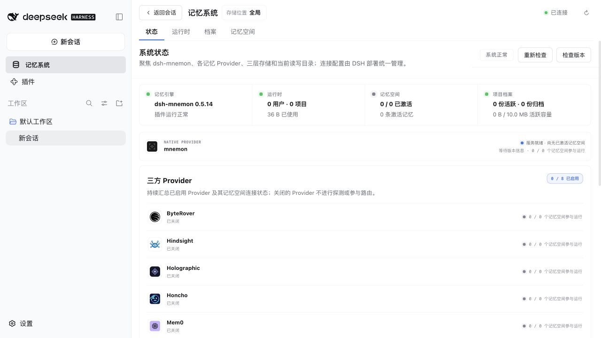
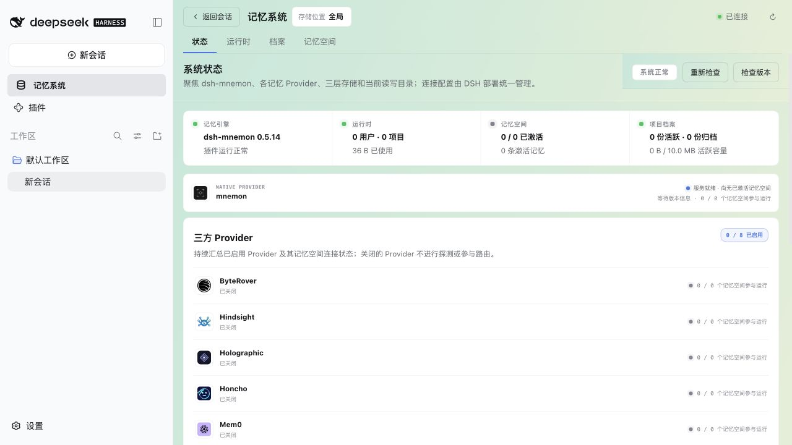
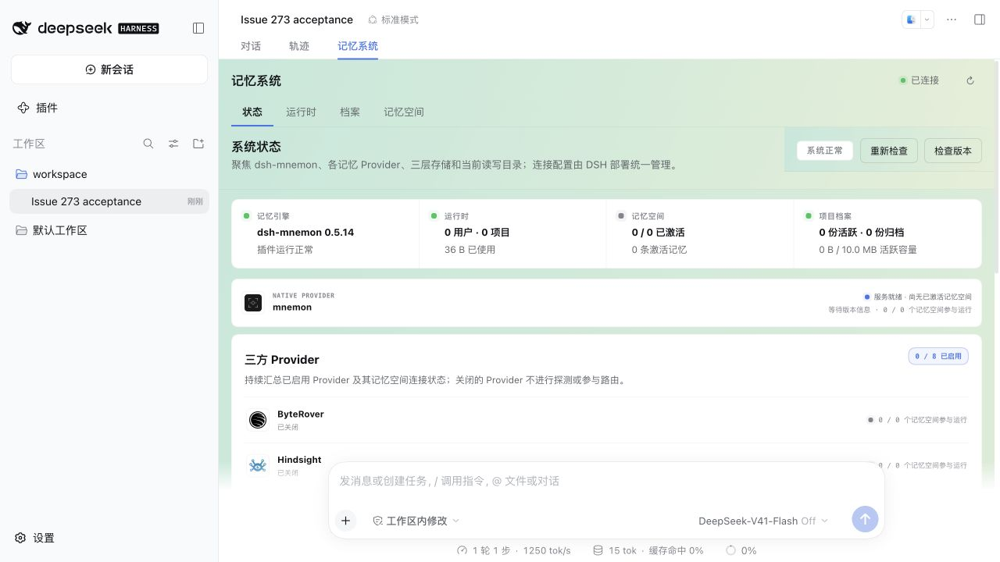

# Stable Mnemon skin hooks — issue 273

[简体中文](./README.zh-CN.md)

Baseline: `6dc4e4201585223f7f1da371256da11deee34d6c` (v0.5.14); production change: `fb584052`. Tested on macOS arm64 with Node 24.20.0, pnpm 10.13.1, published DSH 0.1.7-rc.2 and official Mnemon CLI 0.2.9. Each profile installs all seventeen Mnemon tarballs and enables Scoped, Light Context and Auto Capture.

The workbench now exposes `[data-dsh-plugin="dsh-mnemon"][data-dsh-part="mnemon-view"]` in Sidebar and Builtin modes. Skins can override `--mn-bg`, `--mn-backdrop` and `--mn-surface` through this stable selector. Production CSS and the default opaque surface are unchanged. Body-portaled dialogs are outside this hook.

## Browser evidence

The fixture packs and installs a small Client skin through the public DSH plugin command. It uses only the paired selector and three declared tokens, without hashed selectors, `!important` or browser-injected CSS.

- [Baseline](./before-browser.json): the skin is installed before Mnemon's stylesheet, but no root matches the hook; the official white surface remains.
- [Fixed Sidebar](./after-before-order-browser.json): one root matches, and the real computed background uses the mint skin even though its stylesheet comes first.
- [Fixed Builtin](./after-builtin-browser.json): the same skin applies, the composer remains visible, all three enhancements are enabled, settings save succeeds and the conversation replies.
- [Runtime edit dialog](./dialog-browser.json): the portal has no workbench hook and retains its default surface. A synthetic Runtime fact was added, edited to use SQLite WAL and retained after browser reload; Builtin mode also persisted.

Fresh Chrome runs checked the remaining cascade controls. With the [skin loaded after Mnemon](./after-order-browser.json), root, header and canvas all used the mint surface ([screenshot](./after-order-sidebar.png)); with [no skin installed](./default-browser.json), all three retained the original opaque white surface and two gradients ([screenshot](./default-sidebar.png)). Runtime, Documents and Memory Spaces navigation worked in both. These two runs inspected Sidebar surfaces without starting sessions or writing memory.

| Baseline Sidebar | Fixed Sidebar |
| --- | --- |
|  |  |



## Verification

The two hook regressions fail on the baseline; the focused Client checks pass **67 tests** after the fix. `pnpm verify` passed: **1,364 Root tests / 7 skips**, **402 plugin tests / 2 skips**, with type, deterministic-build, Headless and package checks. Root unpacked size is **1,374,875 bytes**, below the unchanged 1,376,000-byte limit. `verify:plugins --skip-build` passed all **16 independent plugin repositories and 17 artifacts**.

Optional Native integration tests ran with the verified CLI 0.2.9. An independent isolated-store smoke also wrote, recalled and soft-deleted a synthetic fact. Baseline artifact checksums exactly match the saved `6dc4e4` artifacts; fixed artifacts were packed afresh. Generated Client comments contain build locations, so unrelated tarball hash differences are not treated as production-code changes.

Machine-readable summaries: [verification and artifact hashes](./verification.json) and [isolated CLI smoke](./cli-smoke.json).

## Reproduce

Copy [rc2-profile.json](./rc2-profile.json) to `package.json` in an empty temporary profile and run `npm install --ignore-scripts --registry https://registry.npmjs.org` there with Node 24. In each baseline/fixed checkout, build Root and the plugins, then pack all seventeen packages into a separate empty directory:

```sh
pnpm build
pnpm --workspace-concurrency=1 -r build
node --input-type=module - /absolute/empty-artifacts <<'JS'
import { readReleasePackages, createReleasePlan, packRelease } from './scripts/release.mjs'
await packRelease(createReleasePlan(await readReleasePackages(), { baseVersions: new Map() }), process.argv[2])
JS
MNEMON_CLI_PATH=/absolute/verified/mnemon node scripts/fixtures/serve-skin-hook.mjs \
  --profile /absolute/rc2-profile --artifacts /absolute/packed-artifacts \
  --state /absolute/empty-state --skin-order before
```

Run the final fixture command from this PR checkout for both comparisons; only change `--artifacts` to the baseline or fixed tarball directory and choose a fresh `--state`. The baseline checkout does not contain these new fixture scripts.

The [scenario](../../../scripts/fixtures/serve-skin-hook.mjs) uses the shared [packed-profile helper](../../../scripts/fixtures/packed-web-fixture.mjs). Open the private URL recorded in the state's `private.json`, select its `workspace` directory and the official Coding preset, then open Mnemon. Use fresh states with `--skin-order after` or `none` to inspect the later stylesheet order or the unskinned default. The installed skin can also be disabled through DSH's plugin settings.

In this browser environment, the printed `127.0.0.1` URL returned `ERR_BLOCKED_BY_CLIENT`; changing only its hostname to `localhost` reached the same loopback host through the normal token-to-cookie redirect. Authentication and browser protections were unchanged. Keep authentication URLs and raw logs private. `SIGTERM` stops the fixture; optional `--port` selects a stable port.

Only temporary synthetic data was used. The published adapter, tools, transport, storage and browser were real; the loopback model only supplied deterministic replies. This is not a live-model quality or Windows result. Optional Flash, Teams, lifecycle, OpenViking-service and Windows checks retain their reported skips.
