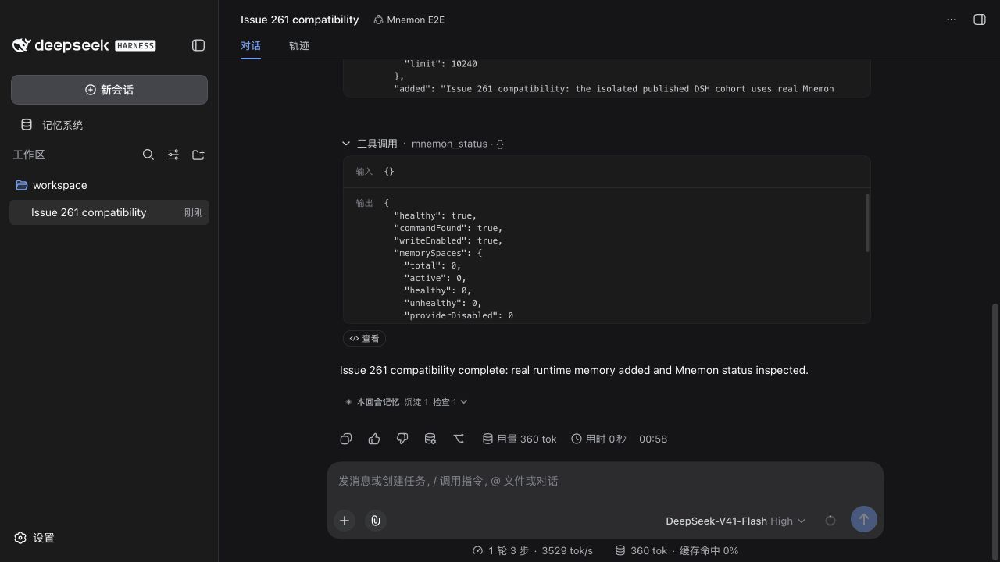
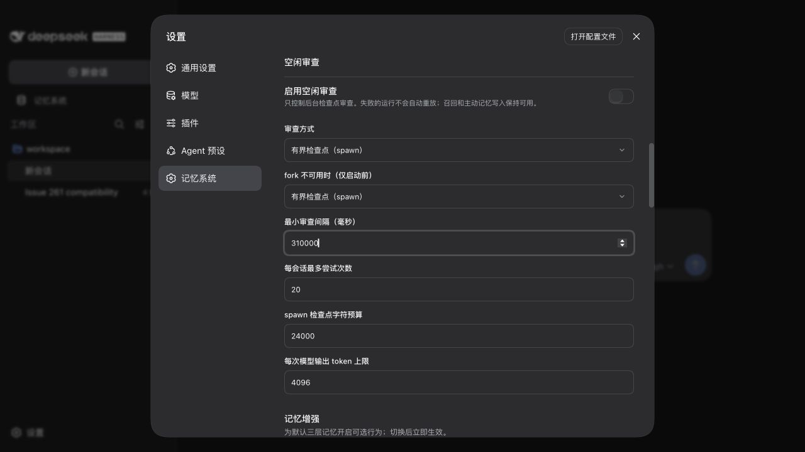
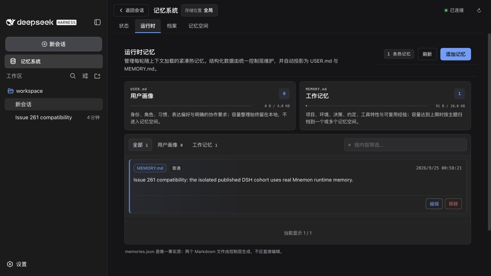

# Desktop profile generation — issue #274

[English](./README.md) · [Issue](https://github.com/omdsh-dev/dsh-mnemon/issues/274) · [兼容性](../../zh-CN/reference/compatibility.md)

记录日期为 2026-09-25，基于 main `84d469ffa838a36fa579295d94029fcac8ac058e` 加本修复。根因是框架能力不匹配，并非 group 改变了解析基准。生产代码保留原 bundle，在尝试导入动态 schema 之前为旧宿主选择普通 schema。

## 原版运行时与失败

夹具使用未经修改的 [Desktop v0.9.2 macOS arm64 release](https://github.com/dataelement/dsh-desktop/releases/tag/v0.9.2)，其中包含 DSH `0.1.5-rc.2`、Cosmokit `1.8.3`、市场安装器和 Desktop 自带的 Cordis loader。ZIP 为 212,666,216 字节，SHA-256 与 release asset digest 一致：

```text
7832934f5c1c6606826791c625db5eaf5db4ab2e20bd72b2a3585d7d486dfa4c
```

调用原版 `installGeneration`、`writeDesired` 和 `projectGenerations`，以 `autoInstallPeers: false` 安装正式 `dsh-mnemon@0.5.13`，得到与报告完全相同的 generation：`dsh-mnemon+0.5.13+5b2e12f917e4`。官方安装器删除 generation 内的框架单例，因此别名包 `schemastery-live` 实际导入宿主的 Cosmokit `1.8.3`，后者不提供 `createVolatile` 和 `isVolatile`。

旧 root 无条件导入该 schema，直接导入时出现 `SyntaxError: ... does not provide an export named 'createVolatile'`。Desktop loader 的真实回退路径先从应用目录裸导入，再通过 profile 解析 root；第二次导入的错误被 catch 吞掉，最后重抛第一次的 `ERR_MODULE_NOT_FOUND`。Group 与父级共享 EntryTree，移除 Group 后错误相同。

| 检查 | 修复前 | 修复后 |
|---|---|---|
| 完整构建 root；正式 Cosmokit 1.8.3 | 缺少 `createVolatile`，回归失败 | 普通 Config，通过 |
| 完整构建 root；正式 Cosmokit 1.8.4 | 通过 | 动态 Config，通过 |
| 原版 Desktop 回退，不加载 native addon | `ERR_MODULE_NOT_FOUND` | 完整 root 以 PlainConfig 成功导入 |
| grouped / flat 回退诊断 | 两者均在 root 导入失败 | 保留 grouped bundle |
| 启用 native addon 的正常 Web 启动 | 原始 SyntaxError，退出 1，无 URL | 真实 WebUI 启动 |
| 自带 Electron Node 24.18.1 直接 / 回退导入 | 分别出现上述两种错误 | 均通过 |

回退探针通过 `--no-addons` 让原版 loader 选择已有回退分支，不改 loader 字段、不伪造导出、不替换解析。完整 WebUI 和 Headless 保留 native addon。WebUI 在 Node `24.20.0` 下运行 release 自带的 `harness-node-entry.mjs` 和模块；补充导入检查以 `ELECTRON_RUN_AS_NODE=1` 运行 release 自带的 Electron。未修改 DSH 源码或资源文件。[运行时文件哈希](./logs/desktop-file-hashes.json)记录了受检文件。

完整脱敏日志：[直接导入](./logs/before-direct.log)、[回退导入](./logs/before-fallback.log)、[grouped](./logs/before-grouped.log)、[flat](./logs/before-flat.log)、[正常 Web 启动](./logs/before-web.log)、[修复后回退](./logs/after-fallback.log)、[Electron 修复前](./logs/electron-before-import.log)、[Electron 修复后](./logs/electron-after-import.log)。本地夹具与 checkout 路径已替换为占位符。修复前没有产生 HTTP URL，因此没有伪造 before WebUI 截图。

## 验证

回归测试将完整构建包放入真实 profile/generation 符号链接结构，使用正式 Cosmokit 包，没有 mock。原 main 构建在 1.8.3 下失败、1.8.4 下通过；修复后两个 generation 测试和已有七个 live-config 测试均通过：[修复前](./logs/regression-before.log)、[修复后](./logs/regression-after.log)。

- [旧 Settings](./logs/legacy-settings.json)：真实 Desktop profile 激活、普通 Config、原 `mnemon` / `mnemon-ui` 命名空间、校验后保存、重启后保存字节不变、三个 Strategy 扩展同时启用、根开关释放全部八个入口。
- [DSH 0.1.7-rc.1](./logs/live-rc1.json)：使用正式 npm profile runner；旧 root/UI/View/Source 设置按原命名空间恢复；动态更新保留同一 fiber；拒绝过期 revision；Source 可独立重新启用；`!!js 15 * 1000` 表达式与备份字节在保存、重启后保留；根开关仍关闭全部八个入口。
- [Desktop Headless](./logs/after-checks.json)：真实 generation 暴露完整代表性 Mnemon 工具，scoped/light-context/auto-capture 同时贡献；关闭 root 后不残留 Mnemon 工具或 pending 依赖，宿主仍正常完成回合。
- 每个隔离宿主都显式选择真实 Mnemon native CLI `0.2.9`，制品已核对官方 digest。WebUI 的真实 `mnemon_status` 返回 `healthy: true`、`commandFound: true`。
- `pnpm run verify` 在 Node 24.20.0 / pnpm 10.13.1 下通过：Root 98 个文件通过，1,351 项测试通过 / 6 项跳过；16 个插件合计 382 项通过 / 2 项跳过；确定性构建、真实 Headless 与包/导出检查全部通过。
- 串行 `pnpm run verify:plugins --skip-build` 通过：16 个独立插件仓库、17 个 tarball，独立安装/类型/测试/构建、外部 SDK/Client 消费者、打包 Starter Headless 及三种可选 Strategy 同时启用均通过。四个 Vitest worker 环境变量和 `MNEMON_PLUGIN_VERIFY_CONCURRENCY` 均为 `1`，没有调整测试超时。[验证汇总与完整日志哈希](./logs/verification-summary.json)。

跳过项为五个需显式启用的真实模型压力/质量测试、一个需要单独提供 V4 codec 的检查、一个 Windows 专用 smoke 测试和一个未配置服务的真实 OpenViking 测试；Native Mnemon 集成已启用并通过。

受检修复版 root tarball SHA-256 为 `13ce7382311342126dc0089e05dfbd841aaf4ac79ae0b0110978967a6b620b02`。子包使用 Starter 固定的正式发布版本。第三方 Provider 以私有子项安装，但未连接远端服务，本次不声称其远端可用性。存储格式、RPC 权限、client/host scope、bundle ID 与命名空间保持不变。

一次性 profile 停用无关的 shell/PTY 工具，新版设置探针同时停用其 PTC/workflow 依赖方。完整 WebUI 运行保留原生附件服务。

## 真实 WebUI 验收

只有模型决策是确定性夹具；浏览器、DSH 工具、Runtime 存储、CLI 发现、设置写入与重启均为真实路径。复用的 [Issue 261 模型夹具](../issue-261-dsh-slots/harness/compatibility-model.mjs)保留 `compatibility-261` 触发词和可见的 “Issue 261” 测试文本，以下截图均来自本次 Issue 274 Desktop generation 环境。

对话成功调用 Runtime add 和 status：



GUI 保存 `idleReview.minIntervalMs = 310000`。新的 Host 进程打开同一 profile 后，设置仍可见，设置文件逐字节相同：



一条合成的工作记忆仍可见，`runtime/memories.json` 逐字节相同：



## 复现

使用解压的官方 Desktop release、Node 24、pnpm 10.13.1、已验证的 native Mnemon CLI 和一次性目录，不使用个人 `DSH_HOME`、模型凭据或记忆。以下 `DSH_DESKTOP_RESOURCES`、`MNEMON_CLI`、`PNPM_ENTRY`、`FIXED_PACKAGE` 均指向显式准备的本地文件；`FIXED_PACKAGE` 为 `pnpm build`、`pnpm pack` 之后生成的 root tarball。

```bash
node docs/pr-assets/issue-274-profile-generation/harness/desktop-generation.mjs \
  --resources "$DSH_DESKTOP_RESOURCES" --run-root /tmp/issue274-before \
  --package dsh-mnemon@0.5.13 --pnpm-entry "$PNPM_ENTRY" \
  --native-cli "$MNEMON_CLI" --serve true

node --no-addons docs/pr-assets/issue-274-profile-generation/harness/desktop-import.mjs \
  --state /tmp/issue274-before/server.json --mode grouped
# 再运行 --mode flat、direct 和 import；修复前四者均失败。

node docs/pr-assets/issue-274-profile-generation/harness/desktop-generation.mjs \
  --resources "$DSH_DESKTOP_RESOURCES" --run-root /tmp/issue274-after \
  --package "$FIXED_PACKAGE" --pnpm-entry "$PNPM_ENTRY" \
  --native-cli "$MNEMON_CLI" --serve true
```

在本地读取权限为 0600 的 `server.json` 并打开其中 URL，勿把该文件或 access key 贴入报告。选择夹具 workspace 与 Mnemon E2E，发送 `compatibility-261`。在记忆系统设置页保存间隔，向 JSON 中的 harness PID 发送 `SIGUSR2`，再打开更新后的 URL 检查设置和 Runtime；用 `SIGTERM` 结束服务。重启不会重新安装包或重写设置。

Headless 使用新的 run 目录并追加 `--profile headless`，再以 `--root-disabled true` 重跑。Desktop projector 仅保留其 Web 内置 bundle，因此夹具在投影完成后向一次性 profile 添加官方 Headless bundle；真实模型请求和工具面通过断言后才写入 `headlessVerified`。

`profile-legacy.mjs` 接受相同的 resource/package/runtime 参数，通过原版 CLI 的 profile runner 验证旧 Settings。`profile-live.mjs` 接受 `--desktop-resources`、指向独立正式 npm DSH `0.1.7-rc.1` 安装的 `--framework-modules`，以及相同的 package/pnpm/run-root/native-cli 参数；使用 Desktop 安装器构造 generation，通过未修改的新宿主 profile runner 验证动态设置。原始模型请求、访问 URL 和进程日志只保留本地，仓库仅保存脱敏诊断、汇总断言和三张截图。
