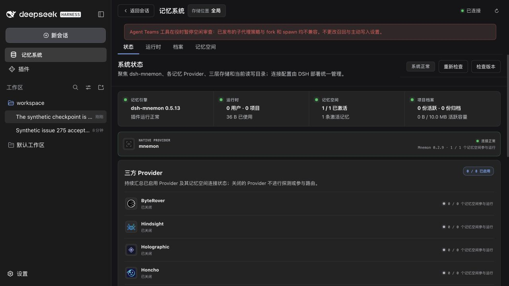
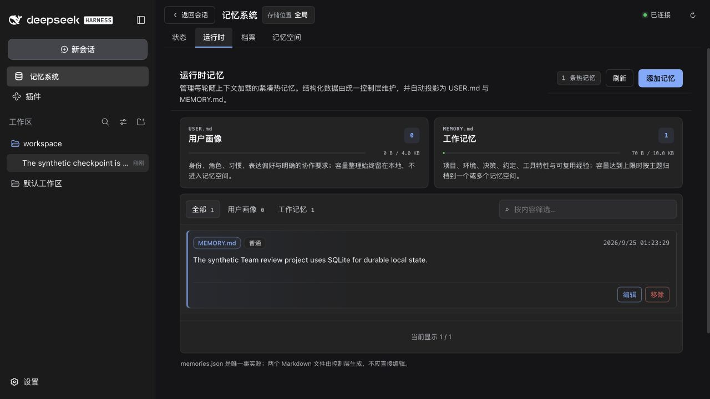

# Agent Teams idle review — issue #275

[简体中文](./README.zh-CN.md)

Test base: `84d469ffa838a36fa579295d94029fcac8ac058e` (Mnemon 0.5.13), macOS, Node 24.20.0 and pnpm 10.13.1. Only published DSH contracts were used. The root development cohort and lockfile remain unchanged.

The original Team gate skipped both fork and spawn before child creation on published DSH/Teams 0.1.7-rc.1; [before-published.json](./before-published.json) records the same controls with no Teams and with TeamService alone. The earlier 0.1.5-rc.2 / Teams 0.1.5-alpha.2 policy is dynamic, while 0.1.7-rc.1's policy is static. The fix keeps default `pause` and adds an explicit `scoped` setting without removing another plugin's policy or weakening publication, ownership, depth or execution restrictions.

Browser acceptance also exposed that bounded checkpoints read a nonexistent user-message wrapper. The public `user/message` payload is flat on both tested DSH generations. The regression test failed before the correction and now checks complete human decisions and English/Chinese no-write instructions, while excluding injected recall, summaries and unknown sources. Current-surface, completed-turn and whole-message budget rules remain in effect.

## Reproduce

Copy [rc1-profile.json](./rc1-profile.json) or [legacy-profile.json](./legacy-profile.json) to `package.json` in an empty temporary directory, then install there using Node 24. For the older exact cohort, use `npm install --ignore-scripts --legacy-peer-deps`; its explicit pins prevent newer prereleases from replacing the historical runtime. No official package is edited.

```sh
MNEMON_TEAM_TEST_PROFILE=/absolute/rc1-profile pnpm exec vitest run tests/agent-team-review-host.spec.ts --maxWorkers=1 --minWorkers=1
MNEMON_TEAM_TEST_PROFILE=/absolute/legacy-profile MNEMON_TEAM_TEST_LEGACY=1 pnpm exec vitest run tests/agent-team-review-host.spec.ts --maxWorkers=1 --minWorkers=1
```

The matrix combines fork/spawn, native/Code Mode, no Teams/TeamService/full Team tools, and pause/scoped modes. Scoped, Light Context and Auto Capture are mounted together, with the compiled View checked on each model call. The only scripted part is model choice: DSH actually publishes children, executes/denies tools, commits Runtime changes, preserves parent Team tasks and disposes completed children. The model must receive the explicit parent-user evidence. A cancellation case runs before mutation.

For WebUI, build and pack Root and all sixteen independent plugins into one artifact directory, preserving the baseline artifacts separately. Start each side with a different empty state directory:

```sh
MNEMON_CLI_PATH=/absolute/verified/mnemon node scripts/fixtures/serve-team-review.mjs \
  --profile /absolute/rc1-profile --artifacts /absolute/packed-artifacts \
  --state /absolute/disposable-state --policy pause
```

The fixture installs the packed root through the public DSH plugin command and resolves all plugin tarballs through a loopback registry. Official Coding, Teams and PTC services stay enabled on both sides. Only the native directory dialog is replaced with the official browser picker. Private connection metadata and raw logs stay in the state directory with restricted permissions. Startup tests both text and tool-use SSE through the actual published DeepSeek adapter.

Select the fixture workspace, then select **Scoped child review** in Mnemon Settings for the fixed side. Send these two separate messages:

```text
Synthetic issue 275 acceptance: for this disposable project we explicitly choose SQLite as the durable local state database. Preserve this project decision for later implementation and use the existing scoped memory workflow; no production data or credentials are involved.
```

```text
Synthetic issue 275 checkpoint: the project decision is final and stable. SQLite remains the durable local state database for all future modules in this disposable workspace. Record this explicit project convention through the bounded idle review after this completed conversation.
```

The child model endpoint rejects the run unless its own request includes both whole user messages. It then attempts forbidden Team delegation, commits one Runtime fact, performs a bounded Document search and completes. Send `TEAM_CHECK` afterward to invoke the real parent `team_task_create`; additional completed turns must respect the one-attempt fixture budget. Disabling Idle review must keep Teams and the existing data usable.

## Results and limits

The [final verification report](./verification.json) records successful `verify` and `verify:plugins --skip-build` exits. Root tests passed 1,354 with eight optional skips; the sixteen plugin packages passed 381 with three optional skips. The published Team cohorts and the real Native Provider integration with CLI 0.2.9 passed separately. Independent artifact verification passed for all sixteen plugin repositories and seventeen tarballs, including the public SDK consumer and real DSH Starter/Strategy composition. All four Vitest worker variables and artifact concurrency were set to one; timeout and performance limits were unchanged. The report lists each default skip explicitly.

The final package contains 49 files and 1,373,650 unpacked bytes, an increase of 2,872 bytes over the baseline. Every published file matches the artifact used for final browser acceptance. The package budget is 1,376,000 bytes, leaving 2,350 bytes of headroom.

The [0.1.7-rc.1 matrix](./after-published.json) passes all sixteen combinations: twelve successful scoped reviews and four pauses with no child creation. Two additional native cancellation attempts make no mutation. The [legacy matrix](./legacy-published.json) also passes its sixteen expected outcomes: eight successful no-Team/service-only controls, four pauses, and four scoped full-Team runs that fail with `TEAM_NOT_MEMBER` after the denied delegation attempt, before a Runtime write. No failed provider is replayed. Both matrices verify all three Strategy contributions and preserve successful parent Team tools.

The [completed browser report](./web-acceptance.json) records two successful baseline turns with zero review children and zero Runtime facts. The fixed run has four successful parent turns, exactly one review child and one Runtime fact, including after the extra budget-check turn. Both original user messages are present in the persisted child checkpoint and all four model requests. The child receives an execution error for `spawn_teammate`, then committed Runtime, successful Document search and completion receipts. The parent creates an official Team task afterward. Mnemon CLI 0.2.9 independently reads the original canary back through a read-only Store snapshot.

| Screenshot | Observed result |
|---|---|
| [Before: Team pause](./before-team-paused.png) | Original warning and no Runtime fact after two eligible turns |
| [Scoped setting](./final-scoped-settings.png) | Explicit compatibility choice saved through the actual settings UI |
| [Child user evidence](./final-child-user-evidence.png) | Whole live-user decisions retained in the bounded checkpoint |
| [Child guard and write](./final-child-guard-and-receipt.png) | Team delegation denied; the allowed Runtime tool succeeds |
| [Parent Team task](./final-parent-team-task.png) | Parent Team tools remain functional |
| [Runtime after the budget check](./final-runtime.png) | One project fact, no duplicate entry |





The compact reports contain only synthetic case metadata and receipts. The deterministic model validates integration and evidence transport; it does not measure live-model memory quality. Disabling review, no-write instructions and startup errors also have automated coverage; they are not additional GUI claims. No production credentials, memories or personal CLI installation are used. Windows was not exercised in this macOS run.
