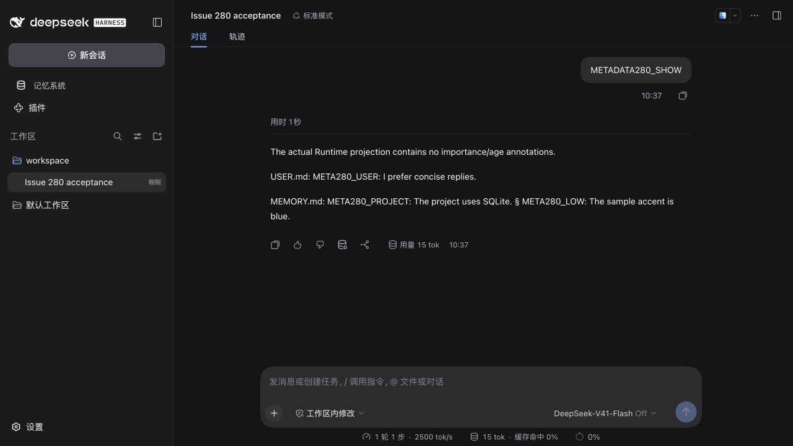
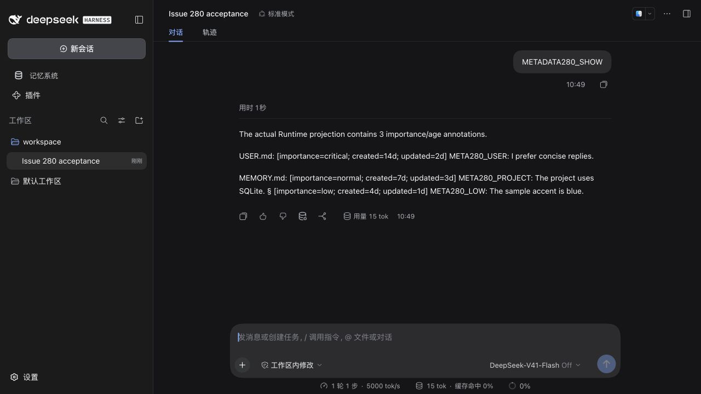
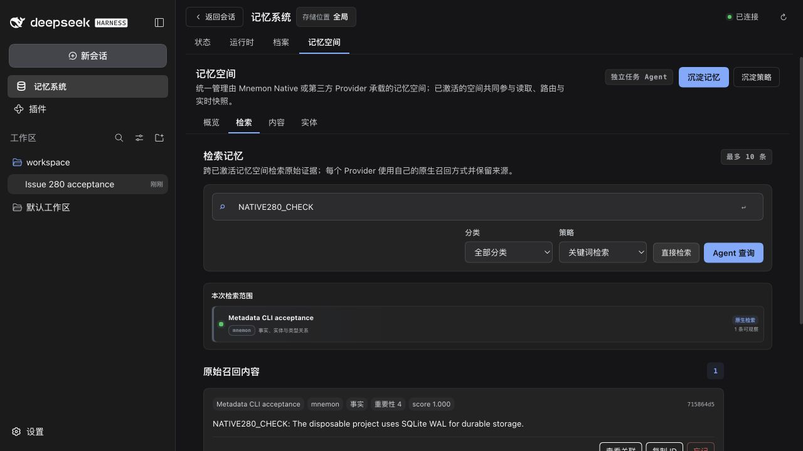

# Runtime projection metadata — issue 280

[简体中文](./README.zh-CN.md)

Baseline: `6dc4e4201585223f7f1da371256da11deee34d6c` (v0.5.14); production changes: `5b8cd640` and `ff66e6ba`. Tested on macOS arm64 with Node 24.20.0, pnpm 10.13.1, published DSH 0.1.7-rc.2 and official Mnemon CLI 0.2.9. Profiles install all seventeen Mnemon tarballs with Scoped, Light Context and Auto Capture enabled.

Runtime model projections now place recorded importance and elapsed whole-day ages above each entry, for example `[importance=critical; created=14d; updated=2d]`. Future timestamps render as `future`, invalid timestamps as `unknown`; one clock value serves the whole projection. Exact content, stored JSON/Markdown, capacity accounting and mutation matching are unchanged. Replacement/removal still uses content alone, and current instructions retain priority.

Annotations count toward the existing projection budget. The default Strategy now describes Runtime as budget limited, avoiding a completeness claim when a dense store is truncated. No migration, new setting or on-demand expansion route was introduced.

## Evidence and verification

The real WebUI baseline received all three synthetic stored entries but **zero metadata annotations** in the actual model wire. The fixed request contains all three: critical USER at **14d/2d**, normal MEMORY at **7d/3d**, and low MEMORY at **4d/1d** (created/updated). `METADATA280_SHOW` extracts that request's Runtime snapshot; its visible response does not assume an expected answer.

| Baseline | Fixed |
| --- | --- |
|  |  |

Real WebUI turns then added, replaced and removed a USER entry, each with a committed tool receipt; the final Runtime store contains the original three seeds. Documents creation and a `DOC280_CHECK` body search returned the one matching document. A Native space was created and activated through the UI, official CLI 0.2.9 wrote `NATIVE280_CHECK: The disposable project uses SQLite WAL for durable storage.`, and the UI keyword search returned that exact text and record ID as its only result.



- Six new metadata regressions failed before the Source fix; an additional dense-store regression failed before the Strategy guidance correction. Fixed targeted checks passed **50 tests**, with **63 Runtime Source** and **17 default Strategy** tests passing.
- `pnpm verify` passed **1,363 Root tests / 7 skips**, **406 plugin tests / 2 skips**, and the type, deterministic-build, Headless and package checks. Root unpacked size: **1,374,802 bytes**, below the unchanged 1,376,000-byte limit.
- `verify:plugins --skip-build` passed **16 independent plugin repositories and 17 artifacts**. Optional Native integration tests used verified CLI 0.2.9; an independent isolated-store smoke also wrote, recalled and soft-deleted a synthetic fact.

Baseline tarball checksums exactly match the saved `6dc4e4` artifacts; fixed artifacts were packed afresh. Generated Client comments contain build locations, so unrelated tarball hash differences are not treated as production-code changes.

Machine-readable evidence: [verification and artifact hashes](./verification.json), [actual Runtime projections and mutation receipts](./wire-evidence.json), [CLI/WebUI workflows](./cli-webui-evidence.json), and [isolated CLI smoke](./cli-smoke.json).

## Reproduce

Copy [rc2-profile.json](./rc2-profile.json) to `package.json` in an empty temporary profile and run `npm install --ignore-scripts --registry https://registry.npmjs.org` there with Node 24. In each baseline/fixed checkout, build Root and plugins, then pack all seventeen packages into a separate empty directory:

```sh
pnpm build
pnpm --workspace-concurrency=1 -r build
node --input-type=module - /absolute/empty-artifacts <<'JS'
import { readReleasePackages, createReleasePlan, packRelease } from './scripts/release.mjs'
await packRelease(createReleasePlan(await readReleasePackages(), { baseVersions: new Map() }), process.argv[2])
JS
MNEMON_CLI_PATH=/absolute/verified/mnemon node scripts/fixtures/serve-runtime-metadata.mjs \
  --profile /absolute/rc2-profile --artifacts /absolute/packed-artifacts \
  --state /absolute/empty-state
```

Run the final fixture command from this PR checkout for both comparisons; only change `--artifacts` to the baseline or fixed tarball directory and choose a fresh `--state`. The baseline checkout does not contain these new fixture scripts.

The [scenario](../../../scripts/fixtures/serve-runtime-metadata.mjs) uses the shared [packed-profile helper](../../../scripts/fixtures/packed-web-fixture.mjs). Before startup it seeds three short USER/MEMORY entries with critical/normal/low importance and distinct created/updated ages, each six hours beyond a whole-day boundary. Real Runtime initialization preserves those values.

Open the private URL in the state's `private.json`, select its `workspace` directory and the official Coding preset. Send `METADATA280_SHOW`, then `METADATA280_ADD`, `METADATA280_REPLACE`, `METADATA280_SHOW`, `METADATA280_REMOVE`, and `METADATA280_SHOW` as separate turns. These mutations use the real `mnemon_runtime_memory` tool, omit USER branches and summarize actual receipts. `observations.json` records the synthetic Runtime wire, advertised tool schema and receipts; it does not dump full system prompts.

If this browser environment returns `ERR_BLOCKED_BY_CLIENT` for the printed `127.0.0.1` URL, changing only its hostname to `localhost` reaches the same loopback host through the normal token-to-cookie redirect. This was the working route here; authentication and browser protections were unchanged. Keep authentication URLs and raw logs private. `SIGTERM` stops the fixture; optional `--port` selects a stable port.

Only temporary synthetic data was used. The published adapter, tools, providers, transport, persistence and browser were real; the deterministic model observed actual wire content. This does not evaluate live Flash quality or Windows behavior. Host restart coverage is from the automated Headless checks; no manual cold-Host browser restart is claimed. Optional Flash, Teams, lifecycle, OpenViking-service and Windows checks retain their reported skips.
