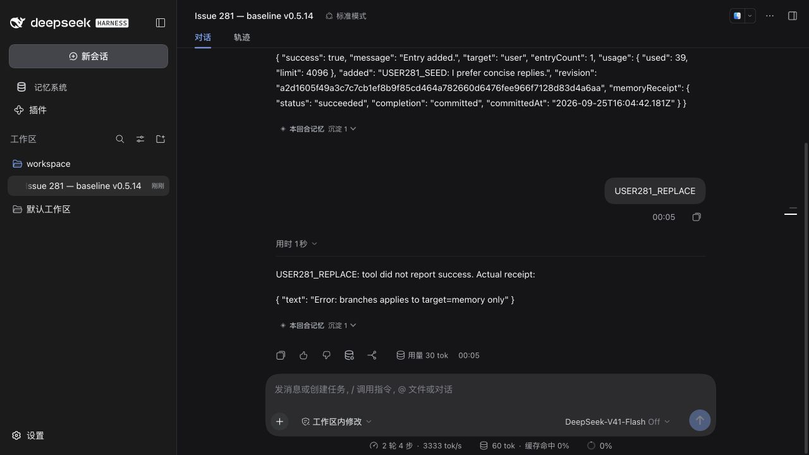
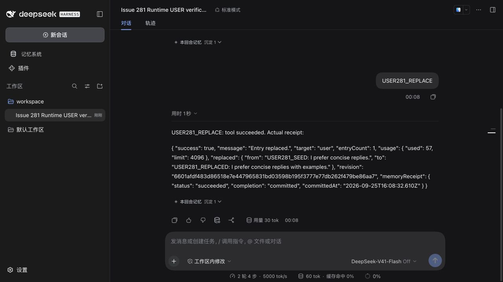
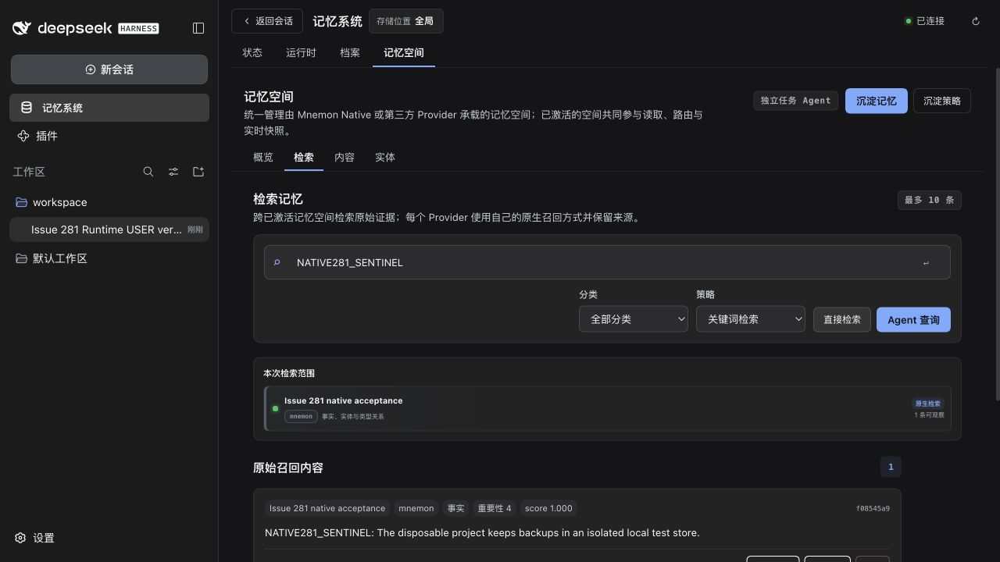

# Runtime USER empty branches — issue 281

[简体中文](./README.zh-CN.md)

Baseline: `6dc4e4201585223f7f1da371256da11deee34d6c` (v0.5.14). Tested on macOS arm64 with Node 24.20.0, pnpm 10.13.1, official Mnemon CLI 0.2.9 and published DSH 0.1.7-rc.2. Both WebUI profiles install all seventeen packed artifacts without workspace links; all three optional Strategy extensions are enabled. Only the Root artifact differs between baseline and fix.

## Reproduction and correction

Through the real WebUI, `USER281_PREPARE` first calls `mnemon_runtime_memory` to add a synthetic USER entry with `branches` omitted. `USER281_REPLACE` then replaces that entry with `branches: []`. The baseline returns `Error: branches applies to target=memory only` and retains the original entry. The fixed artifact commits the replacement, with exactly one USER entry and no duplicate.

The named tool now drops only a literal empty array for `target=user`. Non-empty or malformed USER branch values still fail. Runtime Source, generic View actions and RPC retain their strict contracts; MEMORY replacement still distinguishes omitted scope from an explicit empty scope. No storage migration or Source package release is needed.

The actual advertised schema requires only `action` and `target`. Published rc.2 schema serialization also preserves the parameters. This evidence establishes the failure for caller-supplied `[]`; it does not establish that DSH forces callers to include the field.

| Baseline | Fixed |
| --- | --- |
|  |  |

## Verification

- The new regression file fails on the baseline: **4 failed, 9 passed**. After the fix all **13 pass**, covering root/child agents, default composition and three enhancements with renamed Source entries, USER add/replace/remove and unchanged MEMORY contents, malformed inputs, MEMORY scope preservation/change/clearing, and strict Source/generic action boundaries.
- Focused Runtime, RPC and Strategy checks: **45 passed**.
- `pnpm verify`: **1,373 Root tests passed / 7 skipped**, **402 plugin tests passed / 2 skipped**; types, deterministic builds, real Headless activation/restart, settings persistence, exports and package checks passed. Root unpacked size: **1,374,961 bytes** against the existing 1,376,000-byte limit.
- `MNEMON_PLUGIN_VERIFY_CONCURRENCY=1 pnpm verify:plugins --skip-build`: **16 independent plugin repositories / 17 artifacts passed**, including external SDK/Client consumers and simultaneous activation of all three optional strategies.
- Real CLI tests ran with `MNEMON_NATIVE_TEST_CLI`: Native Source/View write, recall and soft deletion, plus same-View creation and archival to two Native destinations.
- WebUI: USER empty-array add/replace/remove succeeded; non-empty USER branches failed; MEMORY branch assignment/clearing succeeded. Manual USER editing, Documents creation and content search passed. A Native space was created and activated in WebUI; the verified CLI wrote a synthetic record and WebUI keyword search read its exact text.
- Settings saved with a visible success receipt. Runtime and Documents files retained identical SHA-256 hashes through a Host cold restart; the Native CLI still recalled the same ID and content.



[verification.json](./verification.json) contains the minimal actual calls/receipts and content hashes. [Baseline artifacts](./before-artifacts.json) and [fixed artifacts](./after-artifacts.json) record the seventeen tarball hashes and synthetic inputs. Raw Host logs, local authentication URLs, npm installs and full session logs stay outside the repository.

## Repeat the WebUI check

Copy [rc2-profile.json](./rc2-profile.json) to `package.json` in an empty temporary directory and run `npm install --ignore-scripts` using Node 24. Build Root before the independent plugins, then pack all seventeen artifacts with `scripts/release.mjs`'s `readReleasePackages`, `createReleasePlan` and `packRelease` helpers into an empty directory. These local acceptance packs are not published.

```sh
MNEMON_CLI_PATH=/absolute/verified/mnemon node scripts/fixtures/serve-runtime-user-branches.mjs \
  --profile /absolute/rc2-profile --artifacts /absolute/packed-artifacts \
  --state /absolute/empty-disposable-state
```

Open the private URL in `private.json`, select the fixture's `workspace` directory and the official standard preset, then send one command per turn: `USER281_PREPARE`, `USER281_REPLACE`, `USER281_ADD`, `USER281_REMOVE`, `USER281_REJECT`, `MEMORY281_SCOPE`, `MEMORY281_CLEAR`. The loopback model scripts choices and summarizes actual tool receipts; it never invents successful storage. The published adapter, tool execution, persistence, transport and browser are real. `SIGUSR2` restarts the Host while retaining state; inspect the new URL before reconnecting. Optional `--port` keeps a chosen port across restarts (default `0` chooses a free port). `SIGTERM` stops the fixture and its Host.

## Limits and remaining triage

This is not a Windows execution or a real-model quality evaluation. No external API credentials were needed. Optional live Flash, Teams, OpenViking service and standalone lifecycle opt-in tests were not enabled in the default full suite; their skips remain explicit. The optional Source-link WebUI harness was not used: these checks use installed tarballs and official DSH packages.

Fresh WebUI reconnection after the cold restart was blocked by the browser environment (`ERR_BLOCKED_BY_CLIENT`), including a repeat on the original port. The official bootstrap URL still returned the expected authenticated redirect and cookie-backed HTML through HTTP, without changing authentication. Existing UI state was disconnected and is not counted as cold-reopen evidence. Cold-restart claims are limited to file hashes, saved configuration and CLI readback; the screenshots and interactive checks above are from the connected pre-restart Host.

Open bug #251 has no new comments or failing original session. Its existing fix #253 is unchanged in current main. Six fresh preview-only audits preserve original bytes and match the previous migration evidence. No new #251 PR or closure is justified without a sanitized failing full event chain, exact source-build revisions and the current repair/migration failure. Historical UI/migration evidence was reviewed, not presented as a fresh execution.
