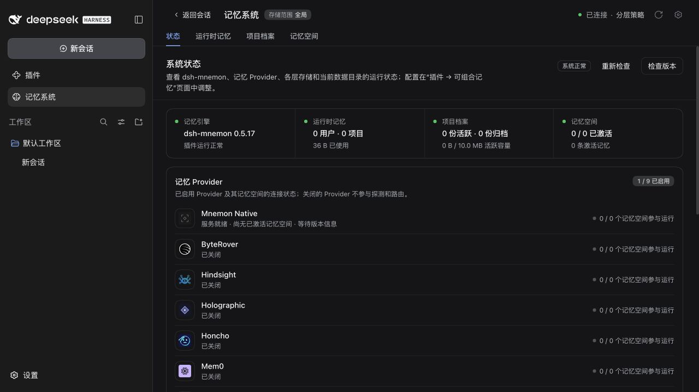
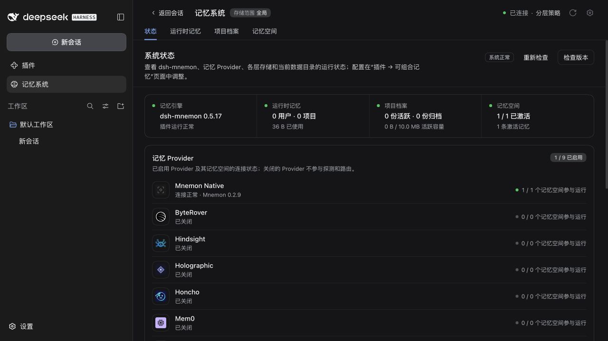
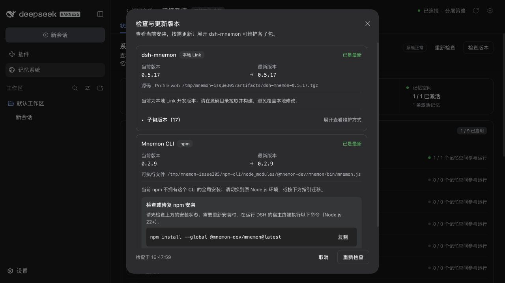
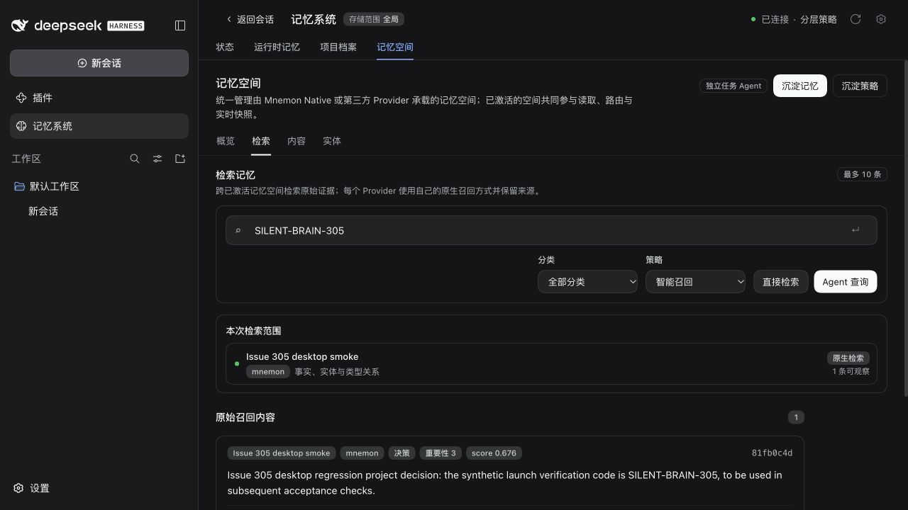

# Issue #305: desktop CLI console windows

## 中文

基线为 `42640337`（v0.5.17），修复为 `809ad5b6`。通过官方 npm 包 `@mnemon-dev/mnemon@0.2.9` 复现调用链：插件启动 Node 时设置了 `windowsHide: true`，但 npm 启动器随后启动原生 Mnemon 时没有此设置。`--version` 和 `status` 都存在这层间接启动。Node 的 [`windowsHide` 选项](https://nodejs.org/api/child_process.html#child_processspawncommand-args-options)默认关闭，不会成为子进程以后创建进程时的默认策略。

修复在 Memory Spaces Source 的公开 `native-cli` 入口中统一解析调用目标，由 Source runner 和 Host 版本检查共用。核对官方包名、当前平台的 optional dependency 和精确版本后，直接执行已安装的原生程序；未知布局、缺失依赖保留原启动器及其诊断。npm 更新继续走原启动器和归属检查，未修改 DSH 或 Mnemon 的发布包。

验证结果：

- 修复前新增回归测试 3 失败、5 通过；修复后 Host/Source 定向回归 70 通过。
- `pnpm run verify` 通过，包含独立插件测试、Headless 激活、构建与包校验；`pnpm run verify:plugins` 验证 17 个独立仓库和 18 个制品。
- Windows CI 在 Node 22.19 和 24 上通过真实原生子进程测试、路径/参数/环境/取消策略及 npm 更新归属测试。环境变量大小写断言已适配 Windows。
- 官方 DSH `0.1.7-rc.2` 在 Electron `44.0.0` 主进程中运行，Host 未设置 `ELECTRON_RUN_AS_NODE`。通过 WebUI 创建并激活原生记忆空间，再用真实 `deepseek-flash` 完成查重、写入与任务结果提交；WebUI 直接检索返回 `SILENT-BRAIN-305` 对应记忆。
- 状态页显示 Mnemon `0.2.9`、空间已连接及 1 条记忆；版本面板仍识别 npm 安装。隔离的本地 npm 前缀不属于系统全局 npm，面板正确拒绝自动更新它。
- Electron 验收的所有已记录原生调用均为直接子进程并带 `windowsHide: true`。脱敏计数、模型请求、写入回执和制品哈希见 [acceptance.json](./acceptance.json)。

截图在 macOS 拍摄，用于证明功能链路，**不是 Windows 弹窗消失的现场录像**。Windows 覆盖来自 CI 的真实进程测试。npm `update` 的下游安装器行为仍保持原样，不在本次状态/记忆调用修复范围内。

| 状态页：修复前 | 状态页：修复后，真实写入完成 |
| --- | --- |
|  |  |

| 版本检查：修复前 | 版本检查：修复后 |
| --- | --- |
|  |  |

## English

The baseline is `42640337` (v0.5.17), with the fix in `809ad5b6`. The official Mnemon npm 0.2.9 launcher starts another native process without `windowsHide`, even when the plugin's own Node child is hidden. Both version and status calls reproduce that launch chain.

The Memory Spaces public `native-cli` entry now resolves the native executable pinned by the recognized official npm installation. Source execution and Host version checks share this policy. Package identity, platform dependency and exact version must match; unknown layouts and missing packages retain the launcher fallback. npm updates retain their original launcher and ownership checks. No DSH or upstream Mnemon package is modified.

The regression initially failed three tests. The completed focused suite passes 70 tests, including real child processes on Windows Node 22.19 and 24. Full repository verification and all 18 packed artifacts pass. A real Electron 44.0.0 main process runs published DSH 0.1.7-rc.2 and the packed fix. WebUI space creation/activation, live Flash deduplication/write/completion, CLI-backed recall, health and version checks succeed. The local npm prefix correctly remains ineligible for a system-global npm update.

Screenshots document macOS functional acceptance, not interactive Windows console visibility. The process trace and Windows CI provide the launch-policy evidence. Candidate packages retain their pre-release version numbers; [artifact hashes and sanitized results](./acceptance.json) distinguish them from the baseline. This change does not alter downstream npm installer behavior during an explicit update.
