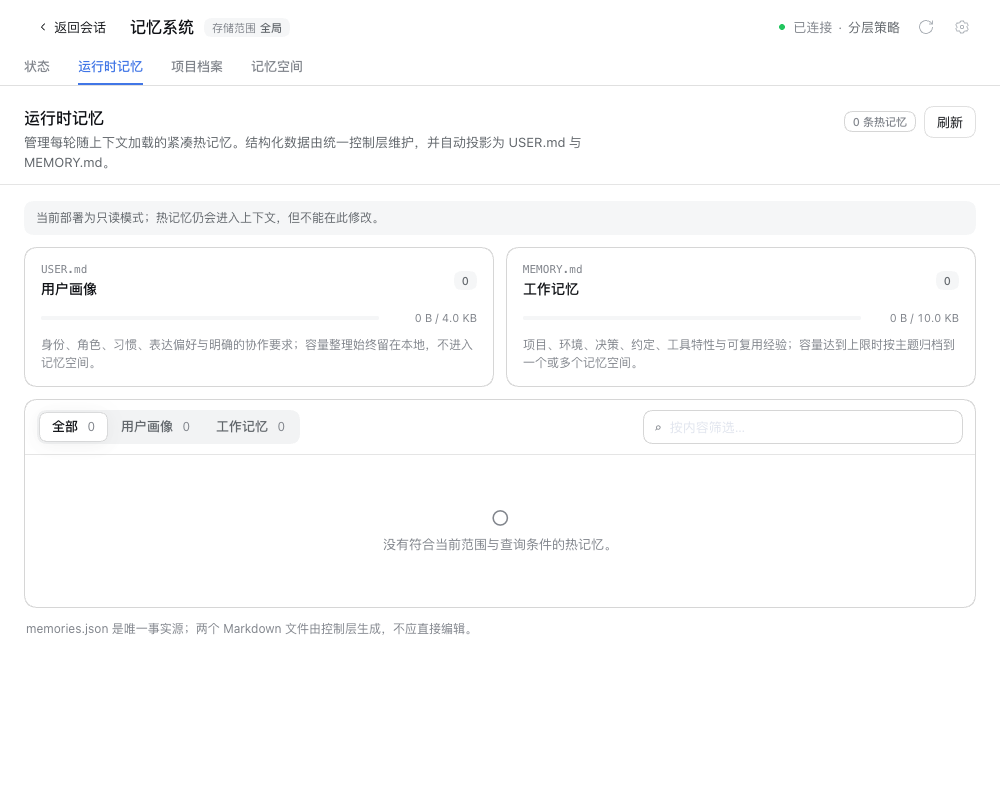
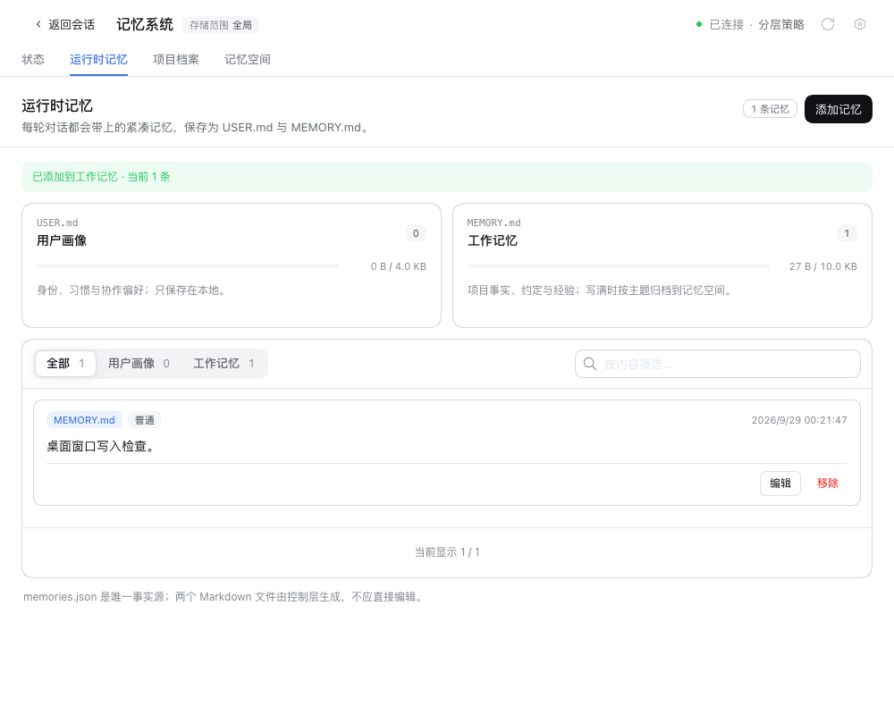
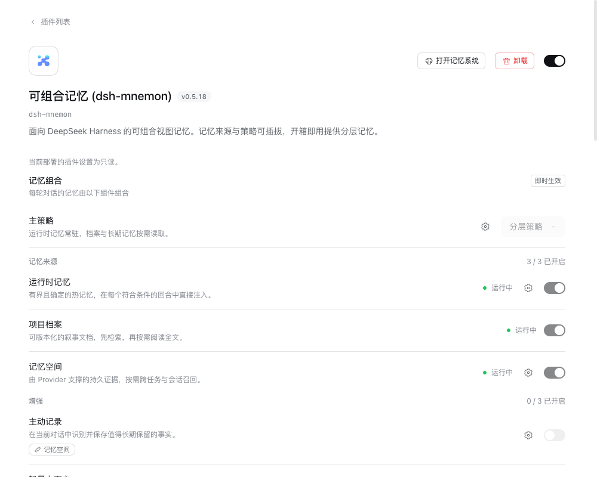
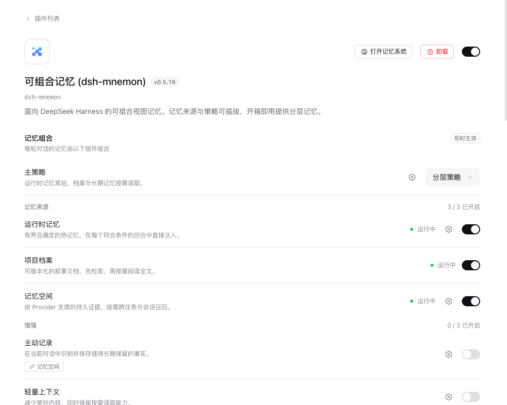

# 桌面版窗口可以管理记忆 — Issue #310

[English](README.md)

于 2026-09-29（Asia/Shanghai）使用隔离的 profile 与合成数据验证，未修改 DSH。

## 问题与修复

DSH 桌面版从应用自己的 `dsh-app://app/` 地址加载窗口，DSH 0.1.7 桌面版也不为页面声明传输方式。dsh-mnemon 0.5.18 把这样的页面当作远程页面，所有 Mnemon 调用都经 API Gateway，默认的 `remoteAccess: read-only` 让运行时记忆、记忆空间与插件设置变为只读，而 Agent 工具仍可写入（[#310](https://github.com/omdsh-dev/dsh-mnemon/issues/310)）。

自 `b5f7914b` 起，应用自己提供的页面使用 Mnemon 的本地通道；只有 DSH 为页面声明了不持有 Host 的传输方式时，才仍按远程页面处理。从其他设备打开的页面继续使用 API Gateway 与默认只读，并会写明需要哪项授权才能管理记忆。

| 已发布的 0.5.18，DSH 0.1.7 桌面窗口 | 同一窗口中的修复 |
| --- | --- |
|  |  |
|  |  |

## 环境

- 窗口：[`scripts/fixtures/electron-desktop-window.mjs`](../../../scripts/fixtures/electron-desktop-window.mjs) 在 Electron 44.3.0 中像官方桌面壳一样把 `dsh-app` 注册为标准、安全、支持 CORS、fetch 与流式传输的协议，并把窗口的请求代理到只监听 127.0.0.1 的 `dsh web`。`DSH_TRANSPORT=owns-host` 还会声明 DSH 0.2 桌面版的传输方式 `{ ownsHost: true, streamBaseUrl }`。
- 宿主：正式发布的 DSH 0.1.7-rc.2 与 0.2.0-rc.1，分别用 npm 安装到隔离目录，每次运行使用全新的 DSH home 与 profile。
- 插件：基线为 npm 上已发布的 dsh-mnemon 0.5.18；候选为 `pnpm release:version` 从 `b5f7914b` 构建的 0.5.19，从打包文件安装。
- 驱动：通过 DevTools 协议打开记忆系统，添加一条运行时记忆，读取记忆空间与插件页，并按路由记录每个 Mnemon 请求的地址。每次运行的结果见 [validation.json](validation.json)。

## 结果

| 窗口 | 插件版本 | 运行时记忆 | 记忆空间 | 插件设置 | Mnemon 请求 |
| --- | --- | --- | --- | --- | --- |
| DSH 0.1.7-rc.2 桌面版 | 0.5.18 | 只读，没有“添加记忆” | 没有“存入记忆”与“创建记忆空间” | 只读 | 13 次全部经 API Gateway |
| DSH 0.1.7-rc.2 桌面版 | 0.5.19 | “添加记忆”写入成功 | “存入记忆”与“创建记忆空间”可用 | 可编辑 | 本地通道；写入为 `POST dsh-app://app/dsh-mnemon-write/…` |
| DSH 0.2.0-rc.1 桌面版，`ownsHost: true` | 0.5.19 | “添加记忆”写入成功（[截图](after-dsh-020-runtime.png)） | 两者可用 | 可编辑 | 本地通道 |
| 通过 `--trusted-host` 打开的远程页面，DSH 0.2.0-rc.1 | 0.5.19 | 只读，并写明原因（[截图](remote-runtime.png)） | “存入记忆”不可用 | 只读，并写明原因（[截图](remote-plugin.png)） | 14 次全部经 API Gateway |

所有运行均无控制台错误。由于 WebSocket 事件流无法通过该协议在此窗口中建立，DSH 会把 0.1.7 窗口显示为“重新连接中”；Mnemon 的请求是普通 HTTP，不受影响，截图已裁到记忆系统区域。

## 限制

这是在页面地址、协议与请求路径上与 DSH 桌面版一致的窗口，并非桌面版安装包本身。Host 对本地通道与 `/api` 使用相同的 Host/Origin 校验与浏览器会话，因此桌面版的结果不依赖任何桌面版专属授权。
