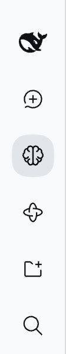
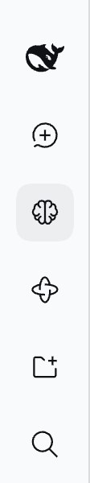

# Fallback sidebar entry as a native row — issue #318

[简体中文](./README.zh-CN.md) | [Issue #318](https://github.com/omdsh-dev/dsh-mnemon/issues/318) | [Measurements](./measurements.json)

In layouts without DSH's native panel seat, Mnemon inserts its own Memory System entry under New Session. On main that entry kept the older plugin-entry style, so it looked smaller, greyer and indented next to DSH's rows. With the fix, it measures the same as DSH's own rows in the expanded sidebar, when open and on the collapsed rail.

Baseline: `dfb3196cbcea58fb9b36b7283ccac4662d366858` (main, as published in 0.5.20). Fix: `1d18173aa88933528860ac6b40b9dcdf001b5726`. The runs use macOS 15.6 arm64, Node 24.19.0 and the repository's DSH 0.1.7-rc.2. DSH 0.2.0-rc.2 ships the same `.panelRow` rules and panel glyph sizes.

## Method

`pnpm e2e:serve` shows the native seat, so Memory System normally appears as DSH's own row. To compare the fallback with that row on the same page, the check builds the element the fallback builds:
- the classes of the Mnemon stylesheet the page loaded (`NS3bAW_entry`, `_entryIcon`, `_entryLabel`);
- the shared brain icon at the size the fallback passes (18 on main, 16 with the fix);
- the placement `placeEntry` uses, directly under New Session.

The values are the browser's computed styles and boxes, measured with every row present, so the fallback can be compared with DSH's own Memory System row. The two never appear together in real use: the fallback is removed as soon as the native seat is available. The screenshots therefore hide DSH's Memory System row, so each shows what a fallback layout shows: the fallback **记忆系统** entry under New Session and DSH's **插件** row.

## Before and after

| | Main | Fix |
|---|---|---|
| Expanded |  |  |
| Open |  |  |
| Collapsed |  |  |

| Expanded row | DSH Plugins row | Fallback on main | Fallback with the fix |
|---|---|---|---|
| Font size | 14px | 13px | 14px |
| Text color | label primary, `rgb(15, 17, 21)` | label secondary, `rgb(97, 102, 107)` | `rgb(15, 17, 21)` |
| Padding / margin | `7px 8px` / `0 2px` | `0 10px` / `0` | `7px 8px` / `0 2px` |
| Size / radius | 252 × 36 / 12px | 256 × 36 / 8px | 252 × 36 / 12px |
| Icon, left edge | 16px at 22px | 18px at 25px | 16px at 22px |
| Label left edge | 46px | 54px | 46px |

When open, DSH marks its row with the hover background `rgba(38, 49, 72, 0.06)` and `aria-current="page"`. On main the fallback turned bold (600) on `rgba(38, 49, 72, 0.1)`; with the fix it matches the native row, including `aria-current`. On the collapsed rail, DSH rows are 36 × 36 rounded squares with 18px glyphs. On main the fallback was a circle with a 20px icon; with the fix it matches.

## Cause and fix

The fallback row copied the plugin-entry style of August 2026 (SSH and task-board entries): 18px icons in a 24px box, `0 10px` padding and a circular rail item. Those entries have since moved to DSH's panel row, while Mnemon's native path already let DSH draw the row. The fallback now copies `dsh-client-ui-sidebar`'s `.panelRow`:
- inherited 14px type, the primary label color and a 22px line height;
- `7px 8px` padding, `0 2px` margins and `--dsw-radius-md` corners;
- 16px glyphs, 18px on the collapsed rail;
- one hover background for hover and the open workspace;
- the native focus ring.

The open entry also sets `aria-current="page"`. Layouts with the native seat are unchanged.

## Automated checks

- `pnpm run verify` passes. It covers docs links, typecheck, the deterministic build, build, typecheck and tests for all 17 plugins, and root tests (113 files, 1,549 passed, 6 skipped). It also covers Headless activation, package contents, public entries, publint and attw.
- `tests/client-sidebar-css.spec.ts` reads the pinned DSH sidebar CSS. It fails if the fallback entry differs from `.panelRow`, its hover or focus rules, or DSH's 16/18px glyph sizes. Changing the fallback padding back to `0 10px` makes it fail.
- `tests/client-sidebar.spec.tsx` checks that the open entry is `aria-current="page"` and loses it when the workspace closes.

## Limits

The fallback element is built on the page from the fallback's own markup and the loaded stylesheet, rather than mounted by a layout without the native seat. Its styles come entirely from the stylesheet, so the comparison holds for any layout whose sidebar column matches DSH's; skins that restyle native rows can target `[data-dsh-plugin="dsh-mnemon"][data-dsh-part="sidebar-entry"]`. Screenshots show DSH's default light theme only.
