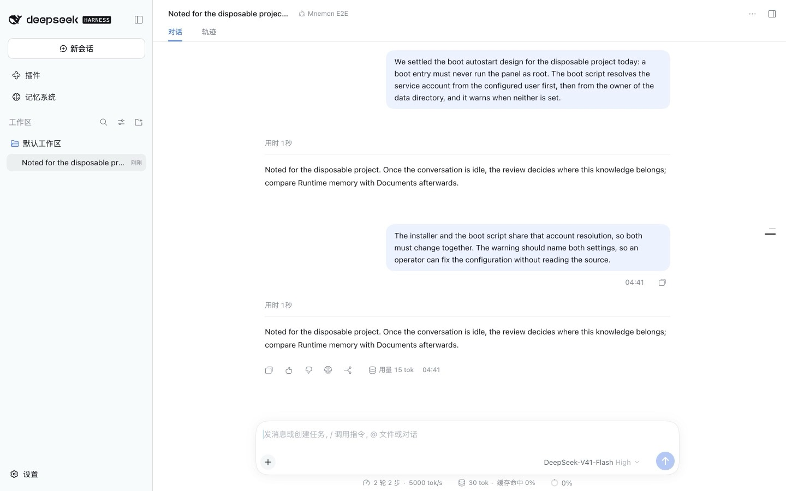
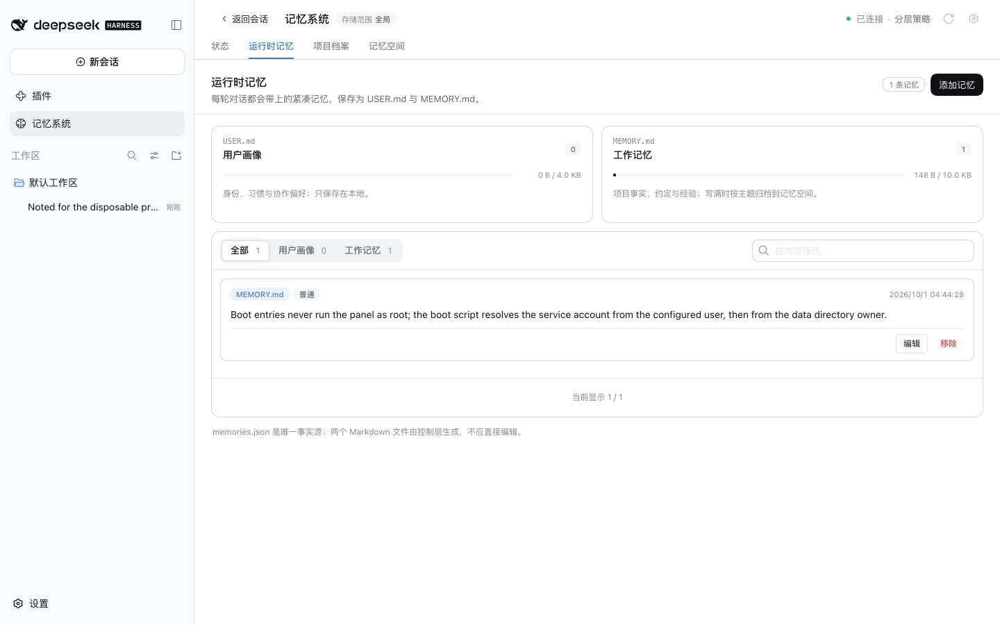
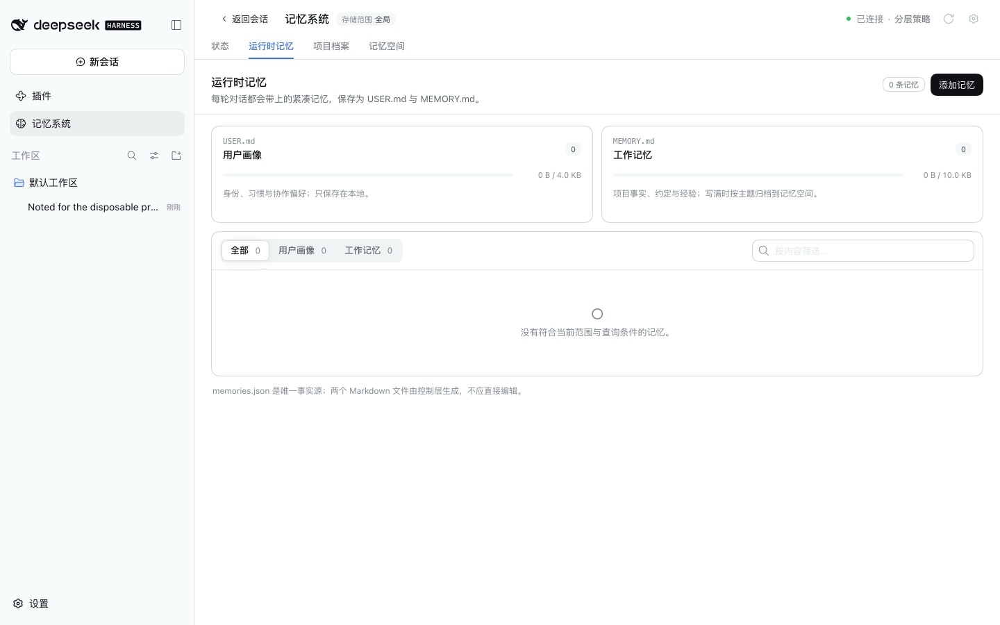
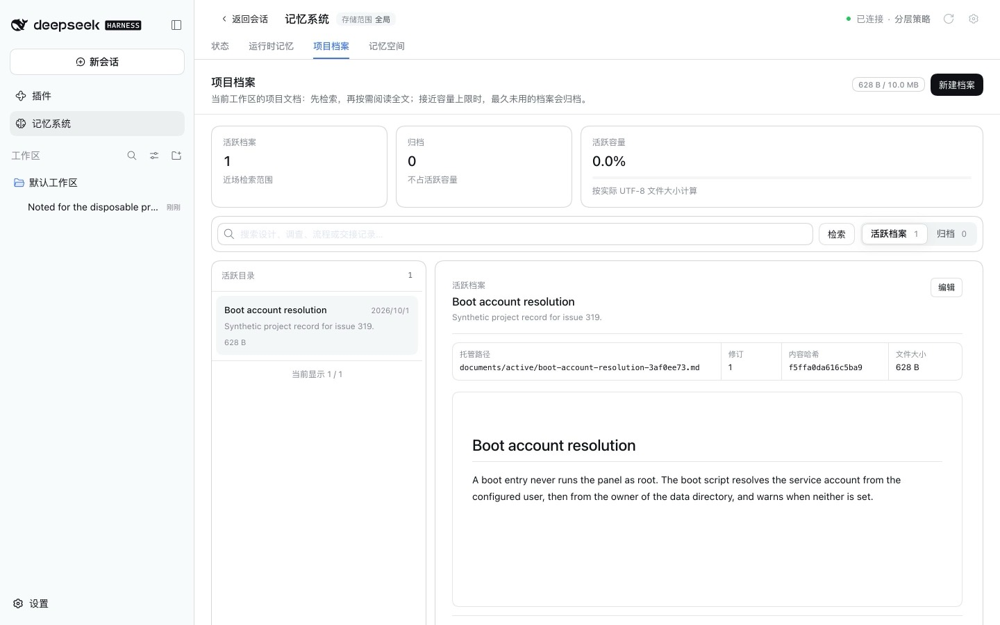
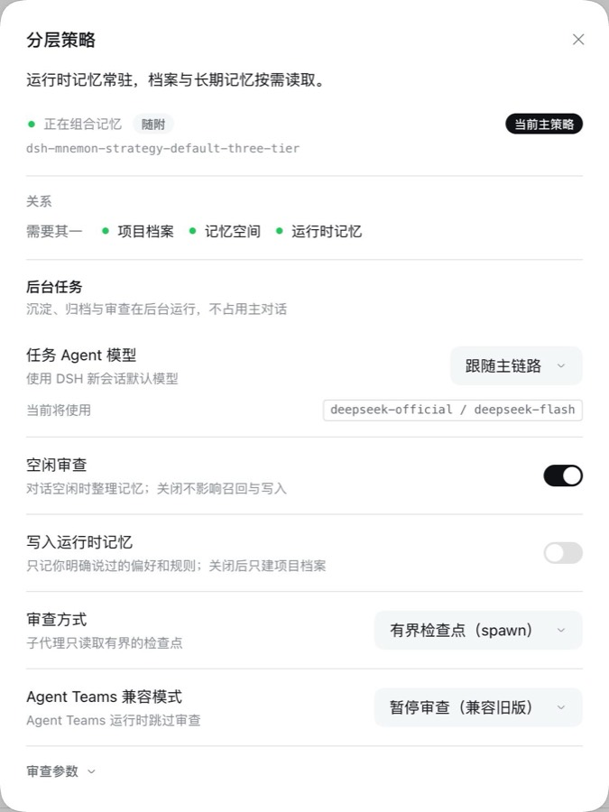

# 空闲审查只写一层 — issue #319

[English](./README.md) | [Issue #319](https://github.com/omdsh-dev/dsh-mnemon/issues/319) | [验证数据](./verification.json)

在 main 上，同一轮空闲审查会把一条项目事实先写成项目档案，再写一遍工作记忆。修复后，同样的脚本化审查建好项目档案，宿主拒绝写入工作记忆的副本，MEMORY.md 保持为空。关闭**写入运行时记忆**后，审查根本拿不到运行时记忆工具。

基线：`dfb3196cbcea58fb9b36b7283ccac4662d366858`（main，根包即 0.5.20 发布的版本）。修复：`3eb6eb7dd30fd47bfcfebb9e361479c1e58653ad`。fixture 与 `--review-layers` 参数来自修复分支，三次运行完全相同。

2026-10-01 的运行环境为 macOS 15.6 arm64、Node 24.19.0、pnpm 11.19.0 与仓库锁定的 DSH 0.1.7-rc.2。每次运行使用一次性的 `DSH_HOME`、数据目录、工作区和本机模型桩，不调用模型，也不读取个人记忆。

## 准备

```sh
pnpm build
pnpm --workspace-concurrency=4 -r build
pnpm e2e:serve --review-layers
```

在新对话中发送[验证数据](./verification.json)里记录的两轮消息，两轮合起来满足审查的准入条件。该参数把空闲等待缩短到 5 秒，每个对话只审查一次。[fixture](../../../scripts/fixtures/review-layers-model.mjs) 只脚本化审查的选择：
1. 检索项目档案；
2. 新建一份项目档案；
3. 有运行时记忆工具时，把同一事实写入工作记忆（`target=memory`）；
4. 结束。

工具调度、审查 guard、各 Source 与 WebUI 都是真实运行的。



## 基线

| 工作记忆 | 项目档案 |
|---|---|
|  |  |

这一轮审查建好 **Boot account resolution** 后，又把同一条规则写入 MEMORY.md（`Entry added.`）。同一项目事实因此同时出现在两层，而每轮都会加载的 MEMORY.md 里多了一条仓库细节。

## 原因与修复

审查 persona 把稳定的项目事实、决定和约定写到 `target=memory`，而路由提示只把用户新提供的事实放进热记忆。项目档案分支会先检索，热记忆分支没有对应检查，因此没有任何机制阻止同一知识落到两层。

- **Persona。**审查先考虑项目档案。MEMORY.md 只收用户明确说过的简短规则，例如约定、纠正、环境事实或工具特性，且项目档案和已有条目都未涵盖。项目记录从不进入，例如设计、实现细节、路径、端口、账号、范围约定或交接说明。
- **Guard。**审查 guard 让每轮只写一层。它放行的第一次新建档案或工作记忆修改决定本轮所写的层，另一层随后被拒绝，即使第一次调用失败也是如此。USER.md 的修改不受影响。
- **开关。**`idleReview.runtimeMemory`（空闲审查中的**写入运行时记忆**，默认开启）会从审查中收回 `mnemon_runtime_memory`。
- **记忆空间。**审查从不直接写入记忆空间。工作记忆在容量整理时归档进去，项目档案在冷归档时建立索引；文档现已写明这一点。

## 修复后

| 工作记忆 | 项目档案 |
|---|---|
|  |  |

同一轮审查建好项目档案后，写入工作记忆的请求返回：

```text
This idle review already created a Document, so it cannot also change working memory (target=memory). Finish with the result tool.
```

MEMORY.md 保持为空，审查以这份项目档案的 id 结束。

## 关闭写入运行时记忆



该开关位于分层策略页面（**插件 → 可组合记忆**）的**空闲审查**之下。关闭后，审查的工具列表中没有 `mnemon_runtime_memory`。fixture 建好项目档案后直接结束，MEMORY.md 保持为空。三次运行都没有控制台错误。

## 自动化检查

- `pnpm run verify` 通过。它覆盖文档链接、类型检查、确定性构建、全部 17 个插件的构建、类型检查与测试，以及根测试（113 个文件，1,559 项通过，6 项跳过）；还覆盖 Headless 激活、包内容、公共入口、publint 与 attw。
- 包大小为 1,498,810 字节，上限调整为 1,501,000。
- 新增测试覆盖：
  - 分层策略：两种顺序、三种操作、独立的 USER.md 修改、同一层内的重试、不带 `target=memory` 的调用、PTC 子调用，以及先检查白名单；
  - 协调器把该策略挂到审查子代理的 guard 上；
  - persona 的规则与顺序；
  - 开关收回工具；
  - 配置默认值与校验；
  - 设置中的开关立即写入 `idleReview.runtimeMemory`，并随审查关闭而隐藏。

## 限制

- 模型选择是脚本化的，这些运行证明的是宿主允许什么，而不是真实模型多常重复写入。persona 约束真实模型，guard 在任何情况下都生效。
- 如果一轮审查同时得到项目档案和一条无关的用户规则，只保留先写的那一层；另一条可由之后的审查记录。
- 运行使用仓库锁定的 DSH 0.1.7-rc.2。guard 依赖审查原本就要求的 `agent.ctx.tools.guard` 能力。
- 截图只包含合成内容。
