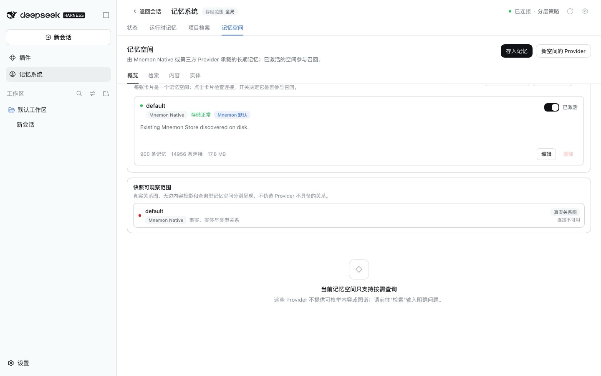
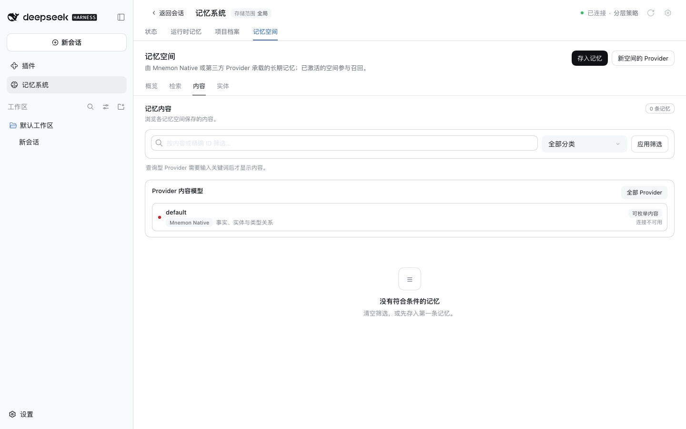
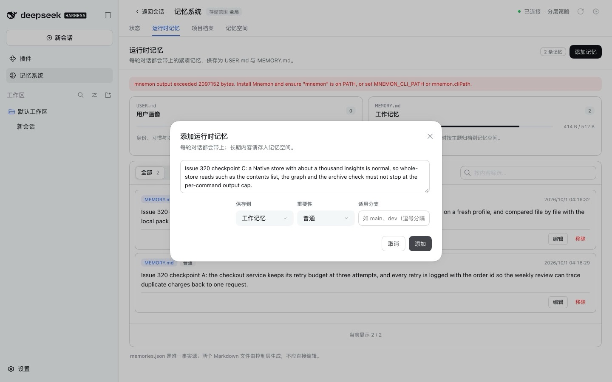
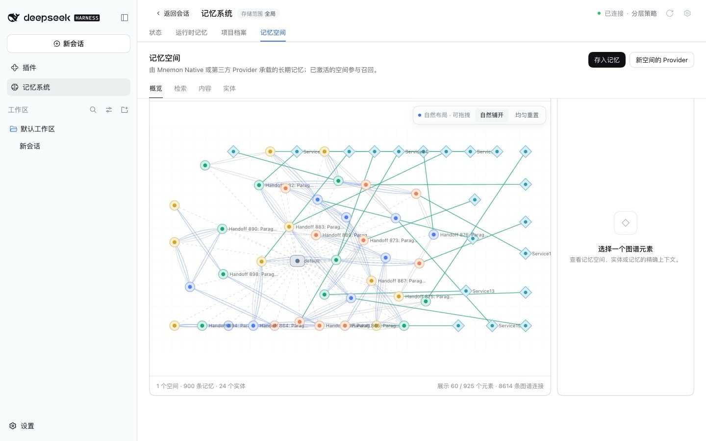
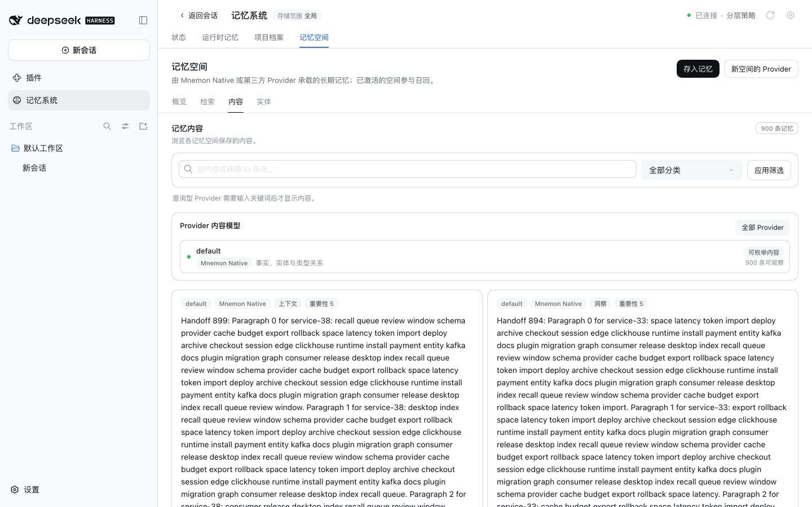
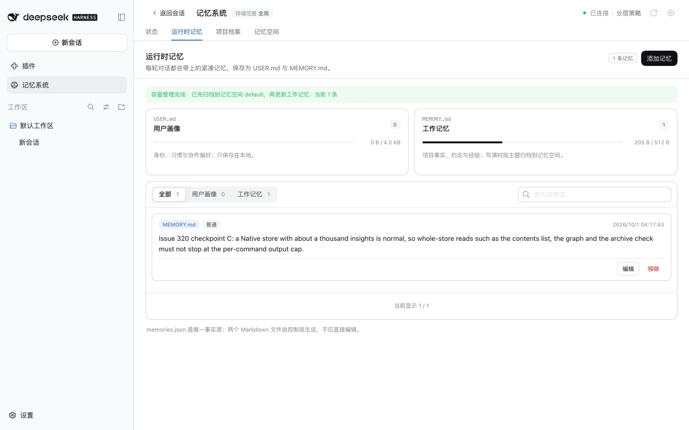

# 大型 Native 记忆空间 — issue #320

[English](./README.md) | [Issue #320](https://github.com/omdsh-dev/dsh-mnemon/issues/320) | [验证数据](./verification.json)

Mnemon Native 库有 900 条记忆时，基线版本无法列出空间内容、无法绘制图谱，运行时记忆写满后也无法归档。这三处都会读取整个库，输出超过了每条 Mnemon 命令 2 MiB 的上限，报错却提示去安装 Mnemon。修复后，空间列出 900 条记忆、图谱正常绘制，工作记忆首次尝试即完成归档，两条归档原文逐字节核对一致。

基线：`dfb3196cbcea58fb9b36b7283ccac4662d366858`（main，其中记忆空间 0.5.13 与 Mnemon Native 0.5.7 即 0.5.20 发布的版本）。修复：`dd7289d57dddec408b60c11ccb3aed1b2409f0f1`。两次运行只有这两个插件不同。

2026-10-01 的运行环境为 macOS 15.6 arm64、Node 24.19.0、pnpm 11.19.0、仓库锁定的 DSH 0.1.7-rc.2 与 Mnemon CLI 0.2.9。每次运行使用一次性的 `DSH_HOME`、数据目录、工作区和本机模型桩，不调用模型，也不读取个人记忆。

## 准备

```sh
pnpm build
pnpm --workspace-concurrency=4 -r build
node docs/pr-assets/issue-320-native-store-dumps/large-store-draft.mjs /tmp/i320-draft.json
mnemon --data-dir /tmp/i320-store --store default import /tmp/i320-draft.json --no-diff
MNEMON_CLI_PATH=/absolute/path/to/mnemon pnpm e2e:serve --runtime-write-scope
```

导入需要几分钟。打开 WebUI 之前，把 `/tmp/i320-store/data/default/mnemon.db` 复制到 `<fixture>/data/data/default/mnemon.db`，`<fixture>` 是服务启动时打印的路径。记忆空间会把它识别为 `default` 空间。`--runtime-write-scope` 把工作记忆上限设为 512 字节，并归档到 Mnemon Native。

[草稿生成脚本](./large-store-draft.mjs)写出 900 条合成记忆，每条约 3.3 KB；导入后的库有 14,956 条连接。读取整个库的命令都超过 2,097,152 字节的上限：

| 命令 | 输出字节 | 用途 |
|---|---:|---|
| `recall "" --basic --limit 100000` | 3,248,516 | 内容列表；归档前的逐字比对 |
| `viz --format html --output -` | 5,687,735 | 图谱 |
| `search <query> --limit 10` | 34,545 | 检索 |
| `status` | 1,652 | 空间卡片与状态页 |

两次运行步骤相同：先看记忆空间的概览和内容，再在 **运行时记忆 → 添加记忆** 中添加三条。A（200 B）和 B（210 B）使工作记忆达到 414 / 512 B，因此 C（205 B）需要容量整理。只有一个可用空间时，Host 直接分配归档目标，不需要模型。

## 基线

| 图谱 | 内容 |
|---|---|
|  |  |

空间卡片显示 900 条记忆，因为 `status` 的输出很小。图谱区域显示“连接不可用”，并称该空间只支持按需查询。内容页显示 0 条记忆，并建议先存入第一条记忆。

添加 C 失败，对话框保持打开：

```text
mnemon output exceeded 2097152 bytes. Install Mnemon and ensure "mnemon" is on PATH, or set MNEMON_CLI_PATH or mnemon.cliPath.
```



没有任何写入：库仍是 900 条，工作记忆仍是 A 和 B。之后每次需要腾出空间的添加都以同样方式失败，工作记忆因此一直是满的。

## 原因与修复

Mnemon Native 在三处读取整个库：内容列表和运行时记忆归档前的逐字比对都执行 `recall "" --basic --limit 100000`，图谱执行 `viz --format html --output -`。记忆空间的进程 runner 在 Mnemon 命令输出超过 2 MiB 时终止它，而且没有转发单次调用的上限；它的错误处理还会给每种失败都加上安装提示。

- 记忆空间把 `maxOutputBytes` 传给进程，Provider SDK 的 `MemorySpaceNativeRunOptions` 提供该字段。此前版本的 Source 宿主会忽略它。
- Mnemon Native 为两次整库读取放宽到 128 MiB（`STORE_DUMP_MAX_OUTPUT_BYTES`），其余命令仍为 2 MiB。
- 进程失败会带上原因。只有启动失败才附加安装提示；输出超限时显示的例如 `mnemon recall stopped: output exceeded 2097152 bytes`。

Issue 中提到的根包 `lib/index.js` 里的 2 MiB 常量属于插件安装和版本检查，从不运行 Mnemon，因此保持不变。

## 修复后

| 图谱 | 内容 |
|---|---|
|  |  |

图谱区域显示 900 条可观察记忆与 14,956 条关系，并绘制实时快照。内容页列出 900 条记忆。

添加 C 首次即成功：“容量整理完成：已先归档到记忆空间 default，再更新工作记忆”。工作记忆只剩 C，为 205 / 512 B；空间显示 902 条记忆与 14,958 条关系。

| 容量整理 | 归档后的空间 |
|---|---|
|  |  |

用 Mnemon CLI 以 `--readonly` 模式读回，库中有 902 条记忆，A 和 B 与添加的内容按 UTF-8 字符串完全一致。`runtime/memories.json` 只保留 C，同样完全一致。两次运行都没有控制台错误。[验证数据](./verification.json)记录了数量、页面文字、条目哈希与截图哈希。

另有一次直接调用 Provider 的真实 CLI 检查，单独覆盖图谱上限：1,000 条短记忆的库，`recall ""` 返回 782,779 字节，图谱 5,148,040 字节。修复后的 Provider 列出 1,000 条记忆，绘制 1,000 个节点和 26,486 条连接，并通过 `rememberMany` 完成归档。

## 自动化检查

- `pnpm run verify` 通过。它覆盖文档链接、类型检查、确定性构建、全部 17 个插件的构建、类型检查与测试，以及根测试（113 个文件，1,549 项通过，6 项跳过）；还覆盖 Headless 激活、包内容、公共入口、publint 与 attw。
- 记忆空间：17 个文件通过，2 个跳过（191 项测试）。新增用例覆盖：
  - 每种失败原因（启动、超时、取消、输出超限）；
  - 高于默认值的单次调用上限；
  - `runJson`、`runText` 与 `runTextBatch` 对上限的转发；
  - 只有启动失败时才附加安装提示。
- Mnemon Native：9 项测试通过。128 MiB 上限只用于 `list`、`graph` 与 `rememberMany` 的快照，不用于导入、检索和状态。

## 限制

- 未在 Windows 上运行。报告者在 Windows 11 上使用同样的 Mnemon 0.2.9 测得数据，而该上限与平台无关。
- 两次运行都使用仓库锁定的 DSH 0.1.7-rc.2。改动只在两个插件内部，不改变任何 DSH 契约。
- 超过 128 MiB 的输出仍会中止，但报错会写明原因。
- 截图只包含合成内容。
