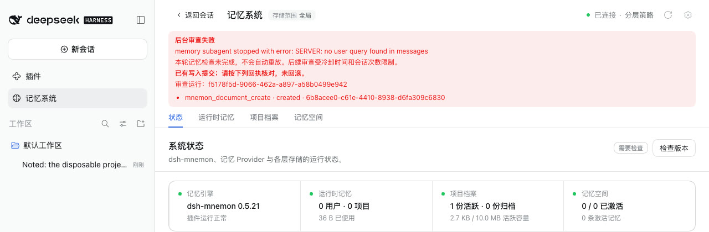

# Memory subagents and chat templates that require a user query — issue #327

[简体中文](./README.zh-CN.md) | [Verification data](./verification.json)

Issue [#327](https://github.com/omdsh-dev/dsh-mnemon/issues/327) reports a local model behind Ollama 0.33 whose chat template requires a user query, as Qwen3.x does. Idle review failed at its fourth request with `500 no user query found in messages`, after it had already created a Document.

Baseline: `main` `06182f4d`, the published dsh-mnemon 0.5.21. Fix: `771d43e2bdc3ffcc06d2fa057ae0e9d913ce884f`. The runs took place on 2026-10-03 (Asia/Shanghai):
- macOS 15.6 arm64 and Node 24.19.0;
- headless Chrome 154 at 1280×800, zh-CN, light;
- DSH 0.1.7-rc.2, the version in the report, and 0.2.0-rc.2.

This machine has no Ollama or Qwen model, so a loopback model stub plays the server. DSH, Mnemon and the browser are real, no model is called, and all memories are synthetic.

## Cause

- A Mnemon memory subagent, such as idle review or remember, has one user turn: its delegated prompt. Each later step adds an assistant tool call and its results.
- Ollama 0.33 renders the system prompt plus the longest suffix of the other messages that fits `num_ctx`, always keeping the last message. Once tool results fill the window, that suffix starts after the prompt.
- A template that requires a user query then fails, and Ollama answers 500 `no user query found in messages` ([ollama/ollama#18303](https://github.com/ollama/ollama/issues/18303)). The truncation fix, [ollama/ollama#18697](https://github.com/ollama/ollama/pull/18697), is not released.
- DSH's own context compaction is not involved: it replaces the range it compacts with a user-role summary.

## The emulation

The stub behaves as Ollama 0.33 does:
- it truncates as above, estimating tokens as the JSON length divided by 4;
- it answers 500 when no user text turn survives.

Its window is sized when the review sends its third request, to hold that request from the delegated prompt on. One more tool round then overflows it at the fourth request, as in the report. Only the model's choices are scripted: search Documents, create a Document, search again, finish.

## Before (main)

On both hosts:
- requests 1 to 3 kept the prompt;
- request 4 kept only tool messages, and the server answered 500. DSH retried it five times and got the same answer each time;
- Status showed 后台审查失败 with `memory subagent stopped with error: SERVER: no user query found in messages`, and the committed `mnemon_document_create · created` receipt. This is the "written, then failed" case in the report.

## Fix

Every delegated child gets two DSH hooks while DSH publishes it. Nothing changes until a server refuses one of its requests with `no user query found in messages`:
- **The refused step.** The `agent/request-error` hook adds a short Mnemon user turn, `Continue from the tool results above.`, to the child's session and retries the step at once, as DSH's own context-overflow recovery does. The refused request ran no inference, and the hook runs ahead of DSH's retry backoff.
- **Later steps of that child.** The `agent/pre-step` hook ends each later tool continuation with the same turn, since the context stays full. The server always keeps the last message, so each request keeps a user query.

A route that never refuses sends exactly what main sends. This matters beyond Ollama: some chat templates, Qwen3's among them, show a model's reasoning only after the last user query, so a user turn after every tool round would drop the earlier steps' reasoning on a server that never truncates, such as vLLM. The main conversation is unchanged.

| After: Status | After: the Document the review created |
|---|---|
|  |  |

On both hosts the fourth request lost the prompt and was refused once. It ran again at once with the continuation turn and succeeded. Status read 系统正常 with no review failure, and Project Documents showed the Document. No run logged a console error.

## Request by request

The in-process composition, for fork and spawn reviews alike:

| Request | Main: last message | Main: user query | Fix: last message | Fix: user query | Prompt kept |
|---|---|---|---|---|---|
| 1 | DSH runtime context (user) | yes | DSH runtime context (user) | yes | yes |
| 2 | tool result | yes | tool result | yes | yes |
| 3 | tool result | yes | tool result | yes | yes |
| 4 | tool result | **no: 500** | tool result | **no: 500** | no |
| 4, again | — | — | continuation turn (user) | yes | no |

With a window that never overflows, the fix sends the same four requests as main. The WebUI runs on both hosts match these rows.

## Design review

The first version of this fix, `b0dc3c7e`, ended every tool continuation of every delegated child with the user turn, on every route. A review found the costs:
- On the DeepSeek route it bought nothing, cost a few tokens per step, and added a "Context injection" row per step to the child's transcript.
- On reasoning models served through OpenAI-compatible routes, it dropped the earlier steps' reasoning from the template, even where nothing was truncated.

The fix now acts only after a refusal. The review also asked the pre-step hook to keep the incoming decision's other fields, and to leave a step alone when another handler emptied it, as DSH's own hooks do. Both are done.

## Automated checks

- `tests/review-user-turn-host.spec.ts` runs a real DSH 0.1.7-rc.2 composition in process with the emulation: agent loop, fork and spawn providers, and Mnemon's lifecycle, coordinator and tools.
  - On main, both reviews fail with the reported error and a partial receipt.
  - With the fix, a truncating window gets one refusal and one retry, and both reviews create the Document.
  - A window that never overflows gets requests identical to main's. The parent conversation gets no continuation turn.
- `tests/continuation-turn.spec.ts` covers the hooks:
  - nothing changes before a refusal;
  - other failures, first steps and aborted steps go to the next handler;
  - a refused step retries once;
  - later continuations keep the incoming decision and leave user text and emptied steps alone;
  - the hooks attach only to the child that their own start creates, even when starts overlap, and are released when the start fails or the run ends.
- `tests/subagent.spec.ts`: a delegated write child gets the same recovery.
- `pnpm run verify` passes: docs (2,979 local links), typecheck and the deterministic build, build, typecheck and tests for all 17 plugins, root tests (115 files, 1,571 passed, 6 skipped), Headless activation, package contents (1,502,943 unpacked bytes, with the budget moved to 1,504,000), public entries, publint and attw.

## Limits

- The server is an emulation of Ollama 0.33, built from its published behavior (ollama/ollama#18303 and #18697), not Ollama with a Qwen model. The token estimate is coarse, and the window is sized during the run so that the overflow lands on the fourth request, as reported.
- The recovery keys on the error text `no user query found in messages`, which Ollama reports and Qwen's own chat template raises. A server that words the same refusal differently is not recovered.
- Truncation still drops older context, including the prompt. A larger Ollama context length (`OLLAMA_CONTEXT_LENGTH` or the model's `num_ctx`) keeps the whole review in view.
- The main conversation belongs to DSH and is unchanged; the report found no failures there.
