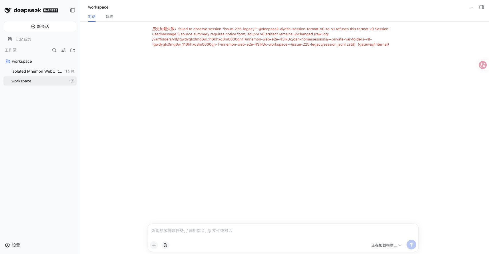
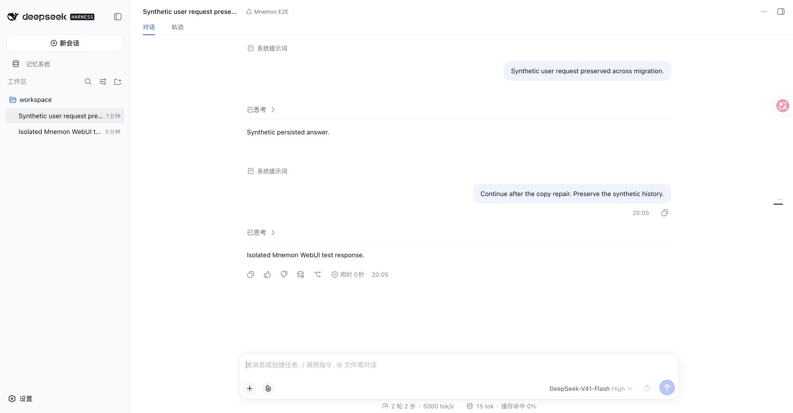
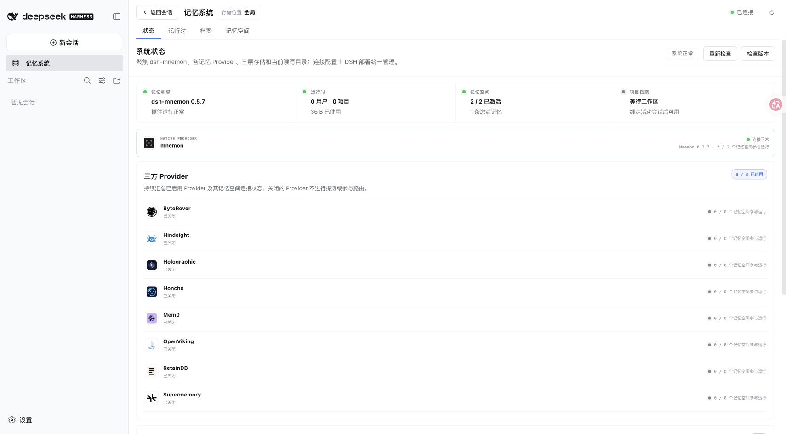
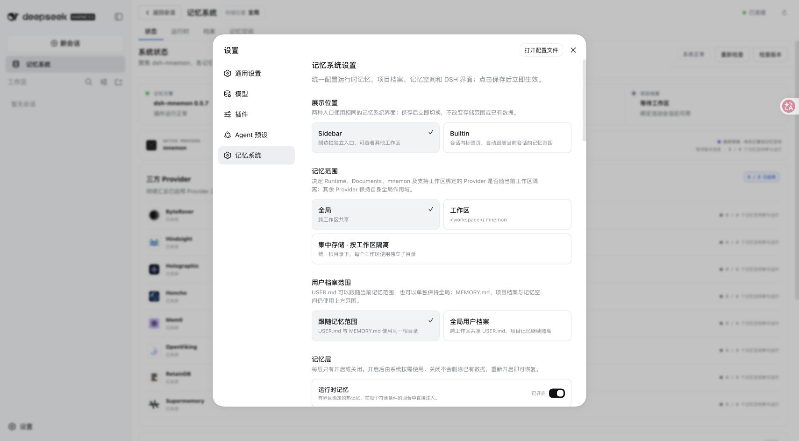
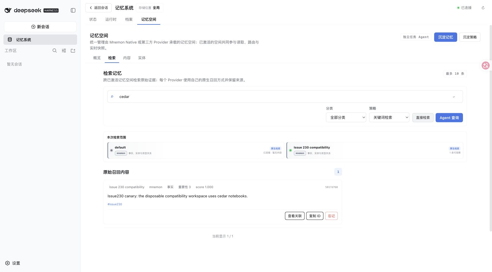
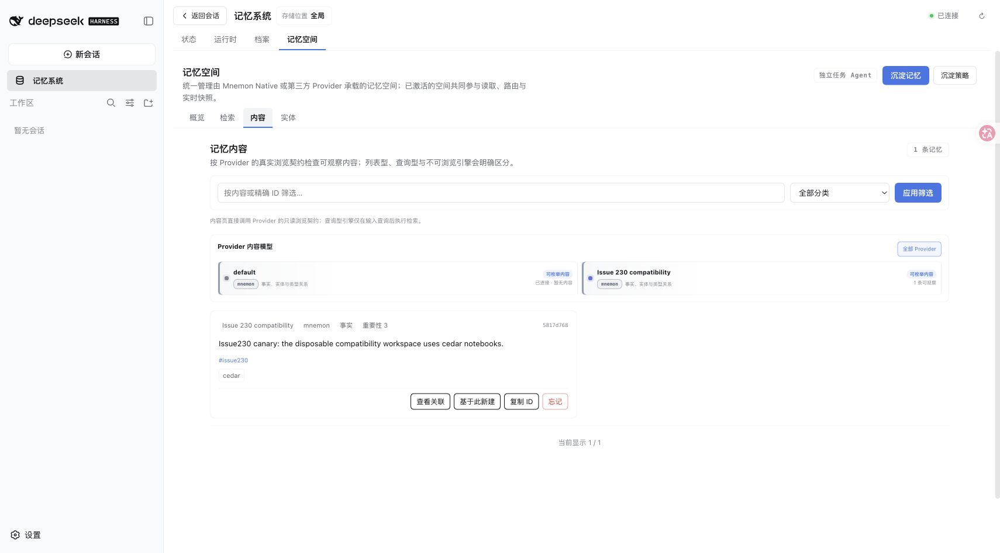

# Issues #225 and #230: verification of the existing v0.5.7 fixes

[简体中文](./README.zh-CN.md) | [Issue #225](https://github.com/omdsh-dev/dsh-mnemon/issues/225) | [Issue #230](https://github.com/omdsh-dev/dsh-mnemon/issues/230)

Both reports are already addressed by [PR #226](https://github.com/omdsh-dev/dsh-mnemon/pull/226), released in v0.5.7 through [PR #228](https://github.com/omdsh-dev/dsh-mnemon/pull/228). This record adds fresh verification from main `1e19caf`; it contains no new implementation or package release. Each issue received a separate worktree from that revision.

The test environment was macOS arm64, Node 25.1.0, pnpm 11.19.0, the published DSH 0.1.5-rc.1 packages, and the installed Mnemon CLI 0.2.7. Each real WebUI harness had its own disposable `DSH_HOME`, `MNEMON_DATA_DIR`, workspace and loopback model endpoint. [Results and screenshot hashes](./verification.json).

## #225: strict migration and explicit copy recovery

The checked-in [v0 fixture](../../../tests/fixtures/issue-223-legacy-v0.jsonl) was emitted by the published DSH 0.1.2 Agent loop. For this browser run only, its session id, workspace, preset and model route were assigned to the disposable harness; its two historical invalid summaries were retained. Each line was encoded as a checksummed Zstandard frame.

Opening that session in the real WebUI failed with `user/message 5 source summary requires notice form; source v0 artifact remains unchanged`. The current plugin therefore does not silently rewrite existing logs.

The existing `dsh-mnemon-repair-session` implementation created a new compressed copy. Comparing decoded bytes confirmed that only the two known `summary` members were removed and all 16 lines were retained. The original backup SHA-256 remained `74ba9572caf1b816b18e39b994a036f70d9a262960b6df423b39cee7dffc9f01`.

After explicitly installing the repaired copy in the disposable session directory and restarting DSH, the original user request and assistant reply became readable. A second turn completed through the real WebUI. Another Host restart and cold reopen retained both turns. DSH published the v3 successor: 29 events, 6 user messages and 2 assistant messages. All 3 Mnemon context records omit `summary`.

| Before repair | After resume and cold reopen |
|---|---|
|  |  |

The existing [repair and lifecycle tests](../../../tests/legacy-session-repair.spec.ts) also pass: plain/compressed strict migration, exclusive copy publication, byte preservation, rejection of malformed input and cold reopen. The lifecycle suite checks newly generated instructions/recall against the released v0 payload validator and preserves other plugins' context messages. Follow the [recovery procedure](../../en/guides/operations.md#dsh-015-compatibility-and-legacy-session-recovery) for an affected installation; plugin upgrade alone cannot repair an existing artifact.

## #230: connected WebUI with the real CLI

The separate issue-230 worktree ran the complete Starter with all three optional strategy contributions enabled using `--strategy-extensions`. Status and Settings loaded successfully. An authenticated POST to `/dsh-mnemon-read/status-summary` returned HTTP 200 with `healthy: true`, `commandFound: true` and `cliPath: /opt/homebrew/bin/mnemon`; the same unauthenticated request returned 401.

A Native memory space was created and activated through the UI. The real CLI stored the synthetic fact “Issue230 canary: the disposable compatibility workspace uses cedar notebooks.” Keyword recall returned that exact fact. After a Host restart, Status reported Mnemon 0.2.7 and the Content page retained the fact. Confirming the UI's soft-delete dialog then removed it from Content.

| Current status after restart | Settings |
|---|---|
|  |  |

| Keyword recall | Content retained after restart |
|---|---|
|  |  |

The original 0.5.5 installation and missing-CLI environment in #230 were not recreated. The earlier HTTP 405 before/after evidence remains attached to its tested revision in [PR #226's record](../issue-223-dsh-015/README.md), including the [original failure screenshot](../issue-223-dsh-015/00-before-http-405.png). This run verifies the fixed current state, including real CLI discovery, without claiming another implementation fix.

## Commands and limits

```sh
pnpm install --frozen-lockfile
pnpm exec vitest run tests/legacy-session-repair.spec.ts tests/lifecycle.spec.ts tests/dsh-connection-compat.spec.ts
pnpm run verify
MNEMON_NATIVE_TEST_CLI=/opt/homebrew/bin/mnemon pnpm --filter dsh-mnemon-source-memory-spaces test -- tests/native-integration.spec.ts
MNEMON_CLI_PATH=/opt/homebrew/bin/mnemon pnpm e2e:serve
MNEMON_CLI_PATH=/opt/homebrew/bin/mnemon pnpm e2e:serve --strategy-extensions
```

Targeted tests: 58 passed. Full verification: 1,249 passed, 7 opt-in skips; types, deterministic builds, docs, package validation and real Headless activation passed. The separately enabled Native Source run passed 169 tests, including real CLI create/write/recall/forget, with its Windows smoke skipped. Headless exposed 38 tools, including all 8 representative Mnemon tools, and passed restart and whole-Starter disable checks.

The browser used fixed loopback model responses; this is not a model-quality test. No Windows, Electron, physical mobile device or live third-party Provider was retested. Independent packed-artifact checks were not repeated for this documentation-only addition; their historical result belongs to PR #226. No user sessions, private memories or credentials are included.
