# “插件”中的 dsh-mnemon 配置页

[English](./README.md)

实测实现：`7e23e37f`，叠加在与 DSH 统一的界面（`74b214eb`）之上。环境为 macOS 15.6、Node 25.1.0、pnpm 11.19.0、正式 DSH 0.1.7-rc.2 与 Mnemon CLI 0.2.7，无头 Chrome 153，除特别说明外为 1280 × 860。WebUI 夹具使用[与 DSH 统一的界面记录](../dsh-style-ui-20260927/README.zh-CN.md)中的 Provider Lab 数据：Mnemon Native，加上 Docker 中的 OpenViking、Honcho、Mem0、Hindsight、RetainDB、Supermemory，以及本地 Holographic。未使用个人记忆或凭据。

“改版前”即与 DSH 统一的界面记录中的 base 版本。

## 配置移到“插件”中

| 改版前：设置 → 记忆系统 | 改版后：插件 → 可组合记忆 |
|---|---|
| 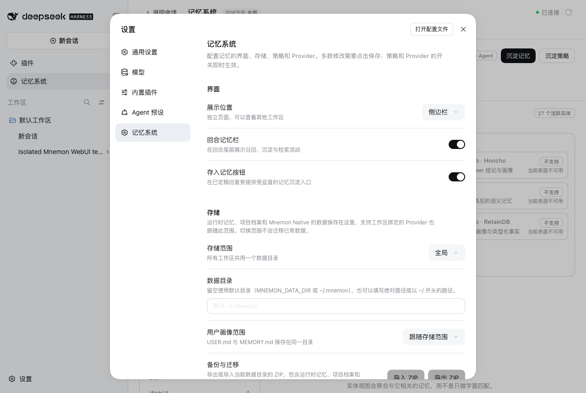 | 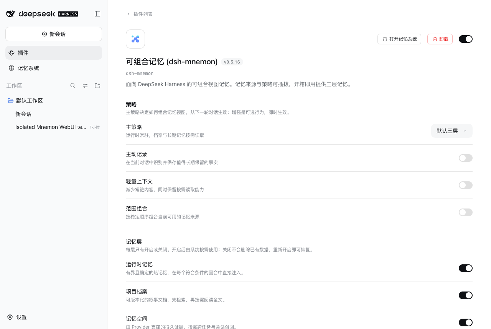 |

DSH 0.1.7 在“插件”中每个插件自己的页面编辑其配置，“设置”只保留 DSH 自身的分组与只读的插件清单。“设置”中已不再有“记忆系统”：

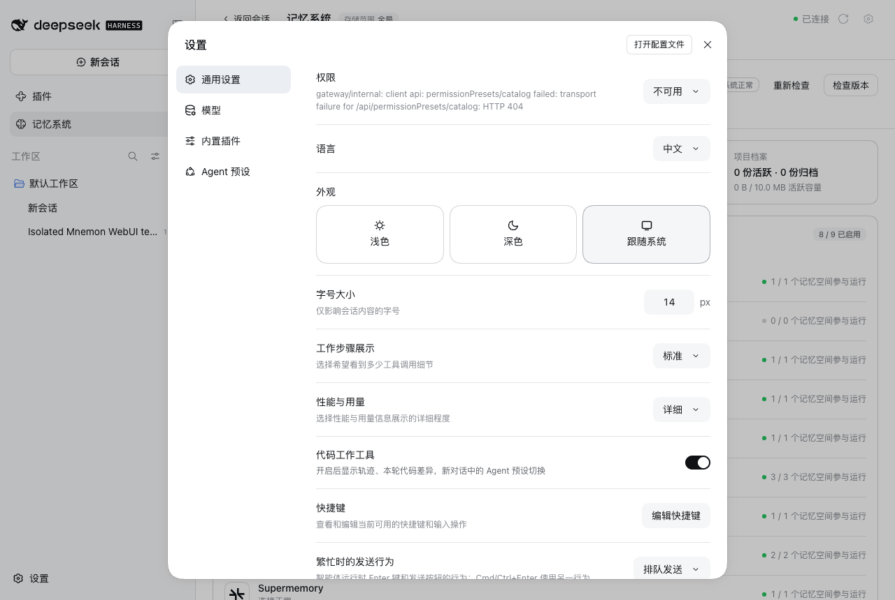

可组合记忆 (dsh-mnemon) 页面依次显示插件的标题与说明、分为六组的配置（策略、记忆层、记忆 Provider、存储、后台任务、界面），以及 Starter 包含的组件。改版前这个页面只有策略行和一句指回“设置”的提示：

| 改版前的插件页 | 改版后的完整页面 |
|---|---|
| 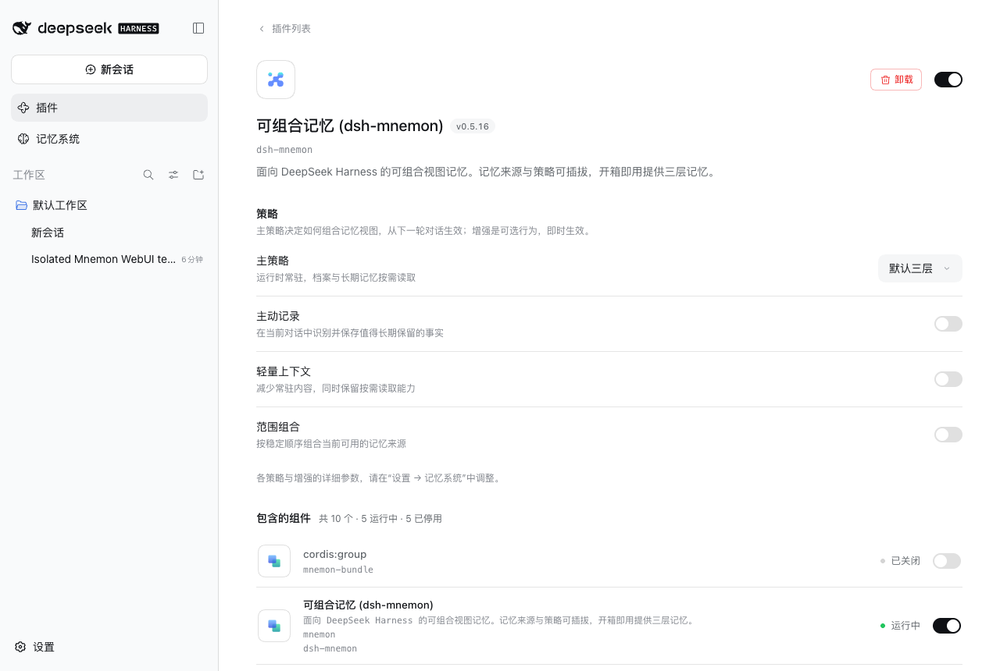 | 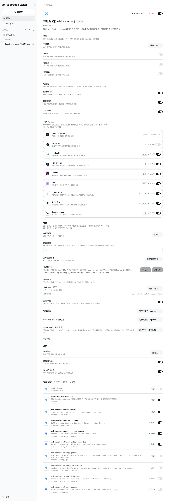 |

## 未保存的修改

需要保存的分组会暂存修改；配置在视口内时，保存栏浮在页面底部上方 16 px，滚过最后一组后停在配置末尾。离开页面即放弃暂存的修改。

| 浮在页面上 | 停在组件列表之前 |
|---|---|
| 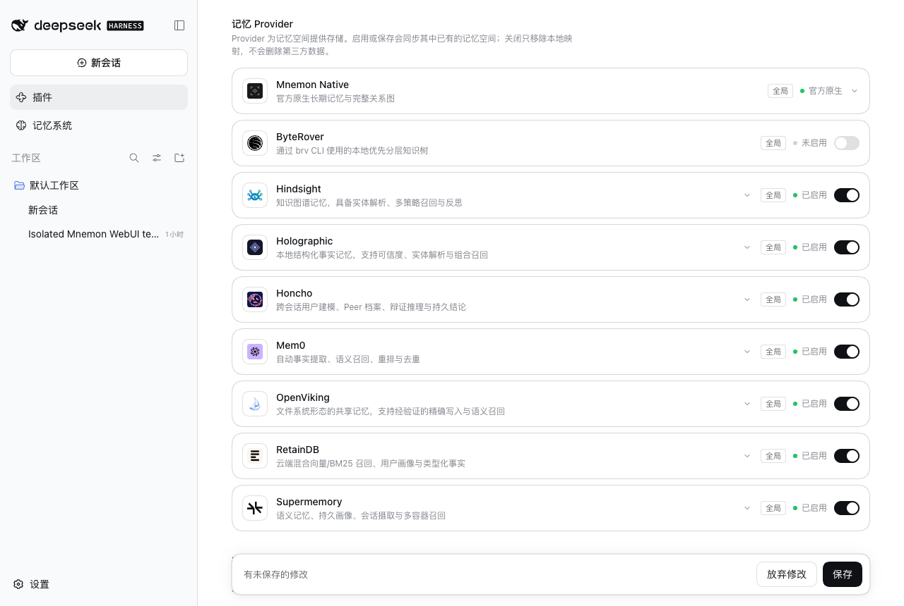 | 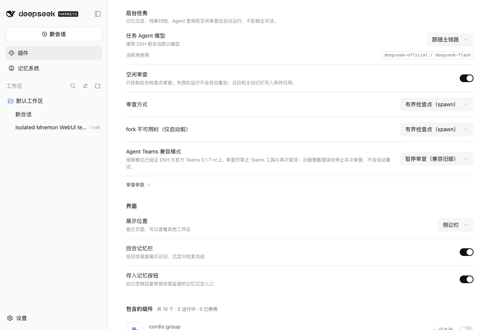 |

## 工作台与配置之间

页首提供**打开记忆系统**（`plugins.detail.actions`），记忆系统顶部在刷新按钮旁提供**配置**（齿轮），通过 `ctx.pluginNavigation.openBundle('dsh-mnemon')` 打开该页面。已关闭的记忆层页面也提供前往配置的入口。

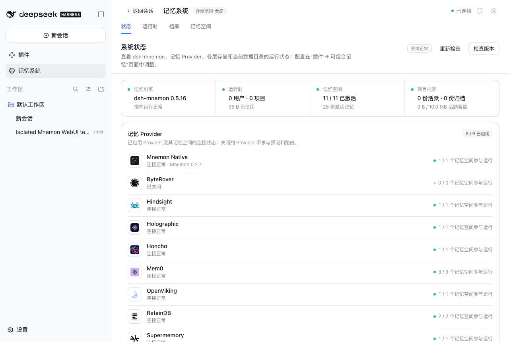

## 主题与窄布局

| 深色主题 | 深色主题，有未保存修改 | 700 × 900 |
|---|---|---|
| 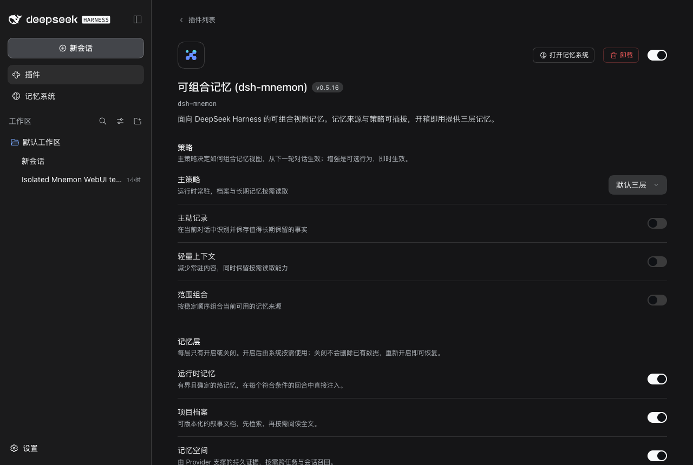 | 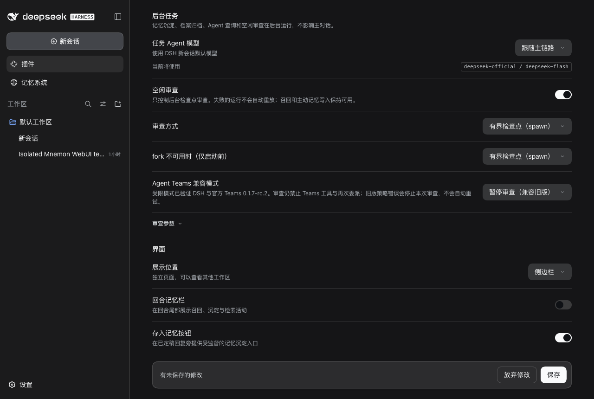 | 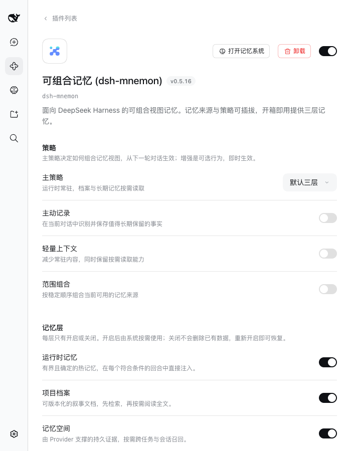 |

## 远程页面

Chrome 把 `memory.test` 解析到 127.0.0.1，夹具以 `pnpm e2e:serve --trusted-host=memory.test:<port>` 运行，因此 DSH 与 Mnemon 都把页面视为远程页面。DSH 插件页、配置与两个入口在远程页面上均可用。

- 默认（`remoteAccess: read-only`）：只读提示位于页面最上方，包括策略行在内的全部控件停用，点击不产生任何修改。
- 加上 `--remote-management`（`remoteAccess: trusted-host`）：保存“存入记忆按钮”开关后，修改经 API Gateway 持久化，整页刷新后仍然保留，随后已恢复原值。

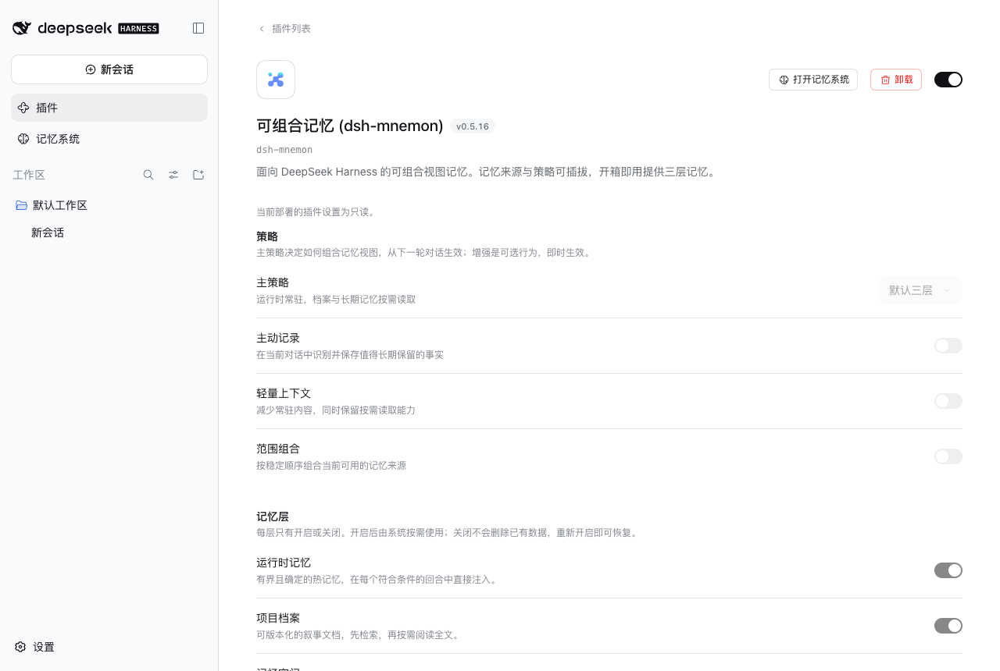

## 实时刷新

同一个回环 WebUI 的两个浏览器标签页都打开 dsh-mnemon 页面。在第二个标签页保存“存入记忆按钮”开关后，第一个标签页无需刷新即更新，依据是 DSH `configForms` 中 `mnemon` 条目的 revision；恢复原值后同样同步回来。

## 验证

- `pnpm run verify`：文档 2,216 个本地链接与 83 个锚点；确定性构建 42 个文件；各 workspace 包的构建、类型检查与测试（记忆空间 174 通过、2 个条件跳过，运行时 61，档案 39）；根测试 1,424 通过、6 个条件跳过；真实 Headless 激活（37 个工具）、旧设置导入与幂等重启、根停用门；打包 52 个文件，publint strict 与 attw 通过。
- `pnpm run verify:plugins --skip-build`：17 个独立插件仓库与 18 个打包制品，包括真实 DSH 激活打包的 Starter 与三个可选 Strategy。
- `pnpm run release:intent`：变更说明覆盖所有改动的包。
- WebUI：回环夹具上浅色 9 个、深色 8 个、窄布局 8 个状态，两个远程夹具各 8 个状态；所有运行均无控制台错误。

## 限制

截图来自一个预置数据的夹具，只说明布局与样式，不代表 Provider 行为。隔离夹具的 profile 未提供 DSH 的权限预设，因此设置中的“通用设置”显示 DSH 自己的不可用提示。Builtin 模式下，只有存在当前会话时才能从插件页打开工作台。Starter 的组件在插件页仍显示包名；按各包的展示元数据显示本地化行标题与图标留作后续工作。
