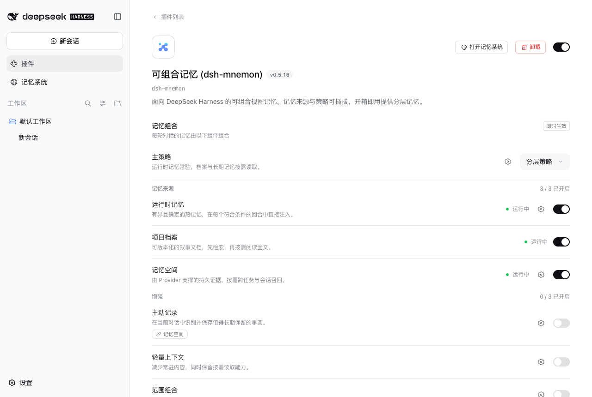

# 插件简介：分层记忆

[English](./README.md)

实测实现：`b65064ea`。macOS 15.6、Node 25.1.0、已发布的 DSH 0.1.7-rc.2、headless Chrome 1280 × 860，从 Starter 默认配置与其测试模型的隔离 WebUI fixture 开始，未使用个人记忆或凭据。

插件页顶部的简介现在写作“分层记忆”，与下方选中的“分层策略”一致。

## 验证

- 完整的 `pnpm run verify` 与 `pnpm run release:intent` 均通过。
- `git check-ignore` 确认新规则：`.env` 与 `.env.*` 文件、`.cache/`、`.claude/worktrees/` 与 `.claude/settings.local.json` 被忽略，`.env.example` 文件与 `.claude/` 下的其他文件仍会显示。
