# 组件停启、依赖与界面联动

[English](./README.md)

实测实现：`3e9f28eb`，叠加在“插件”中的配置页（[记录](../plugin-config-20260927/README.zh-CN.md)）之上。环境为 macOS 15.6、Node 25.1.0、正式 DSH 0.1.7-rc.2，无头 Chrome，1280 × 860。每次运行都从一个全新的隔离 WebUI 夹具开始，使用 Starter 的默认组合与测试模型；组件均在配置下方 DSH 自带的组件列表中切换，与用户操作一致。未使用个人记忆或凭据。

## 主策略的各种状态

改版前：打开第二个主策略时没有任何提示；关闭所选主策略后，要重新打开页面才出现提示；没有主策略运行时，提示却说记忆由另一个主策略组合。现在策略分组无需刷新即跟随 DSH 的列表，并为每种状态给出说明和解决它的开关：

| 第二个主策略空转 | 所选主策略停用，由兜底策略组合 | 没有主策略运行 |
|---|---|---|
| 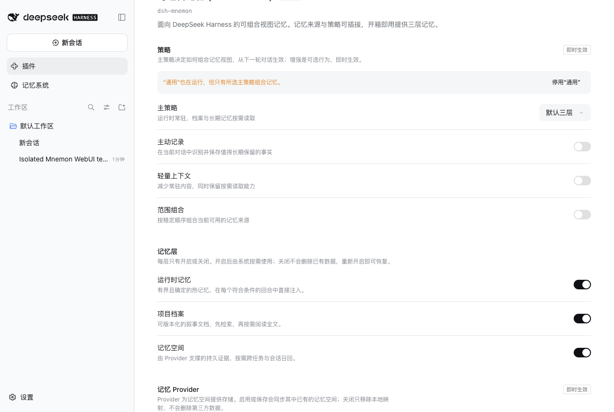 | 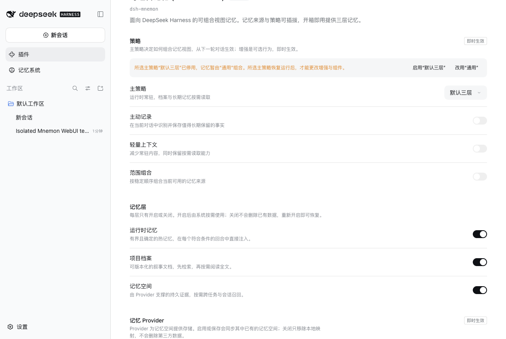 | 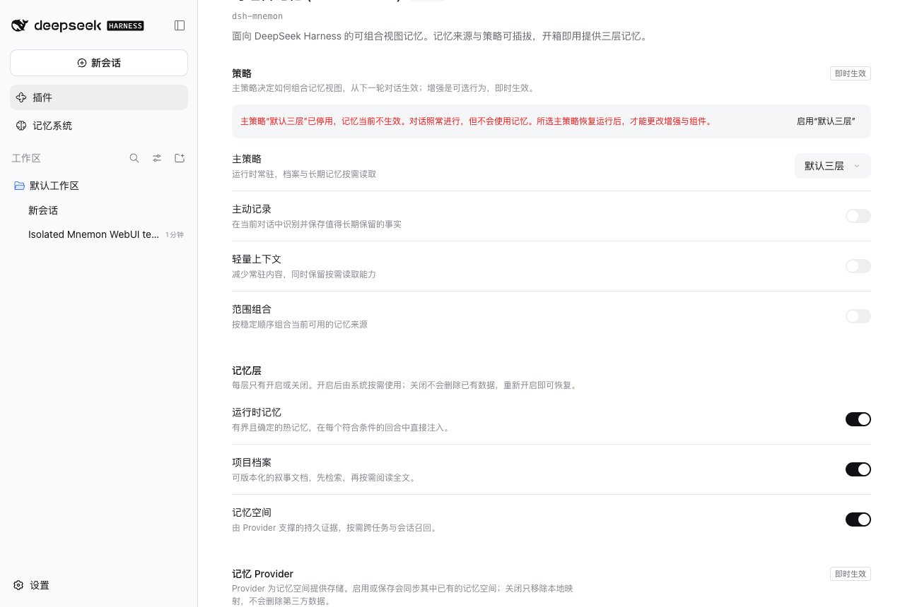 |

选择一个主策略时，其他主策略会被停用。所选主策略没有运行时，增强暂不可改，因为 Host 会按所选主策略校验每次写入。

## 对话照常进行，只是不使用记忆

改版前：两个主策略组件都关闭后，每个新回合都会失败，报错“no Serving memory generation is available: No Memory Strategy contribution is installed.”。现在同一回合正常完成，Host 日志记录一次 `[dsh-mnemon] this turn runs without memory: …`。

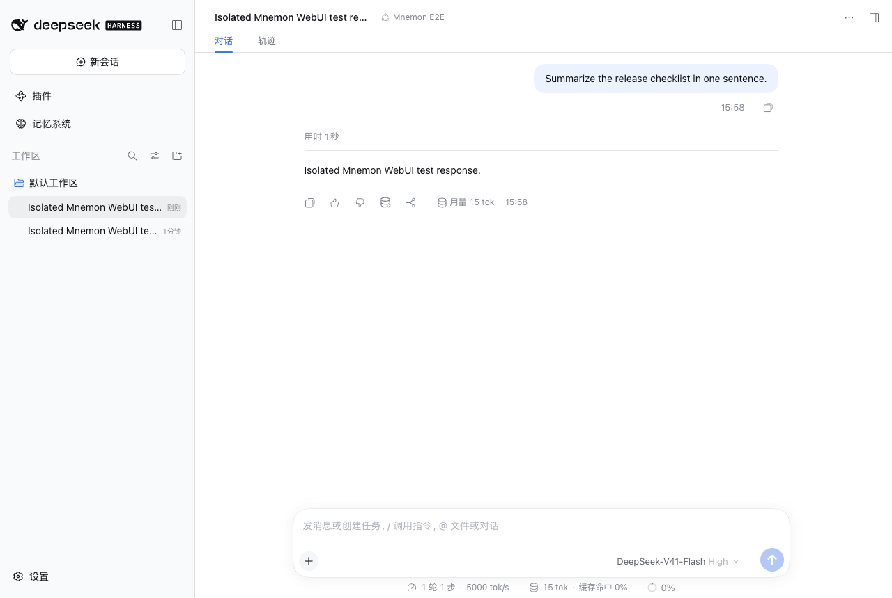

记忆系统在页面上方说明这一点，把各层标记为“未生效”，并提供前往配置；在配置中点击“启用‘默认三层’”即可恢复记忆：

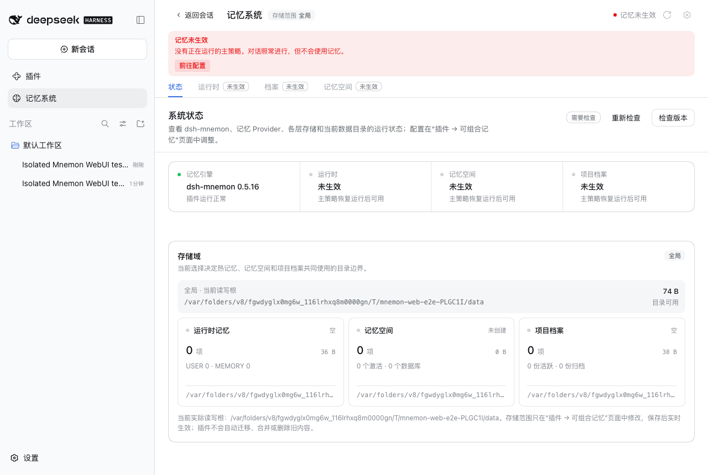

## Source 组件被关闭

在 DSH 的列表中关闭档案与记忆空间后，对应的记忆层行会说明组件已停用并提供“启用组件”。“记忆空间”组件停用时不再读取 Provider，分组说明原因，不再显示 Host 报错“Source memory-spaces is not installed”；Mnemon Native 也不再误报 CLI 缺失：

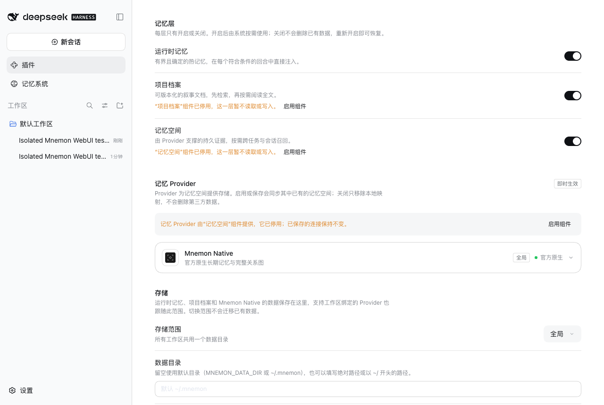

工作台保留记忆空间标签页的原位置并标记“未运行”；状态卡片说明如何恢复，不再显示“等待工作区”或“目录尚未同步”：

| 状态页 | 未运行页面 | 组件恢复运行后 |
|---|---|---|
| 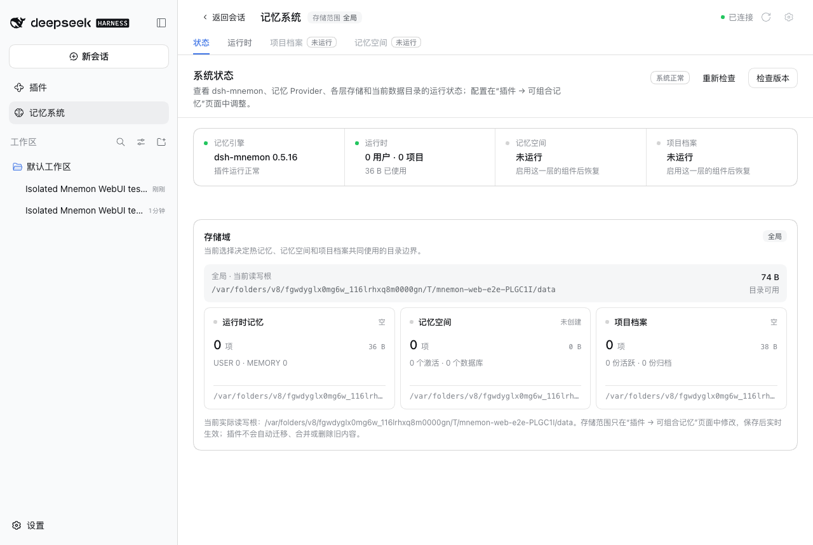 | 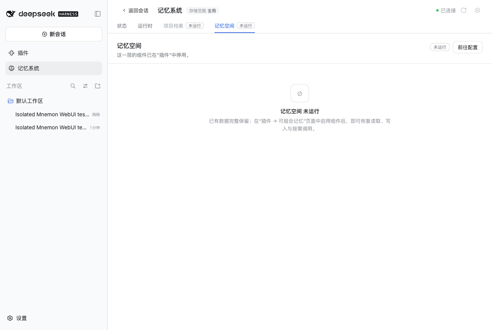 | 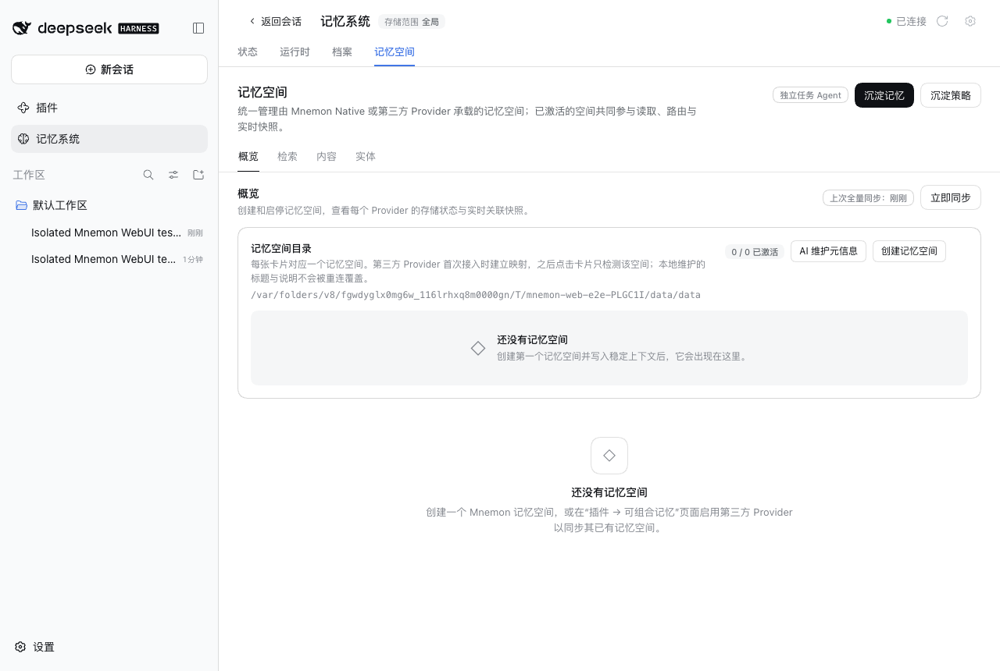 |

停在未运行页面时，Source 恢复运行后会自动切回该层自己的页面。

## 深色主题

| 兜底策略 | 记忆未生效 | 组件说明 | 未运行页面 |
|---|---|---|---|
| 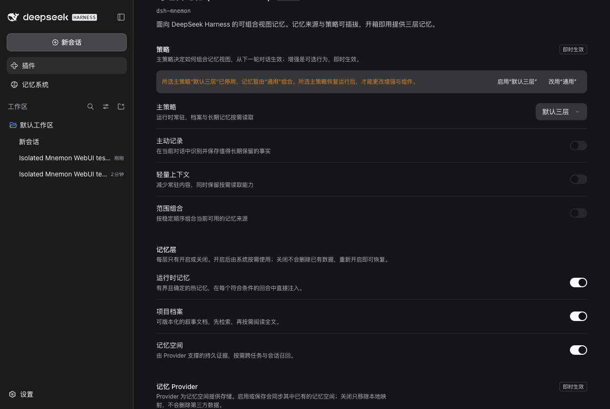 | 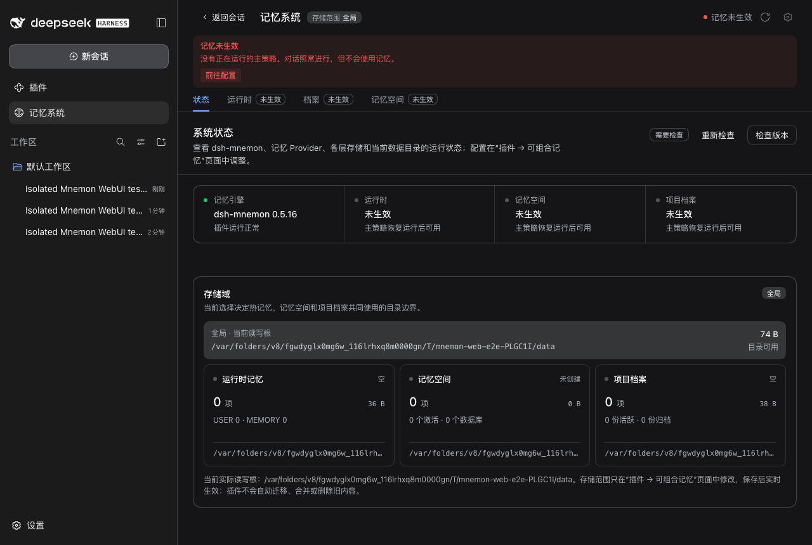 | 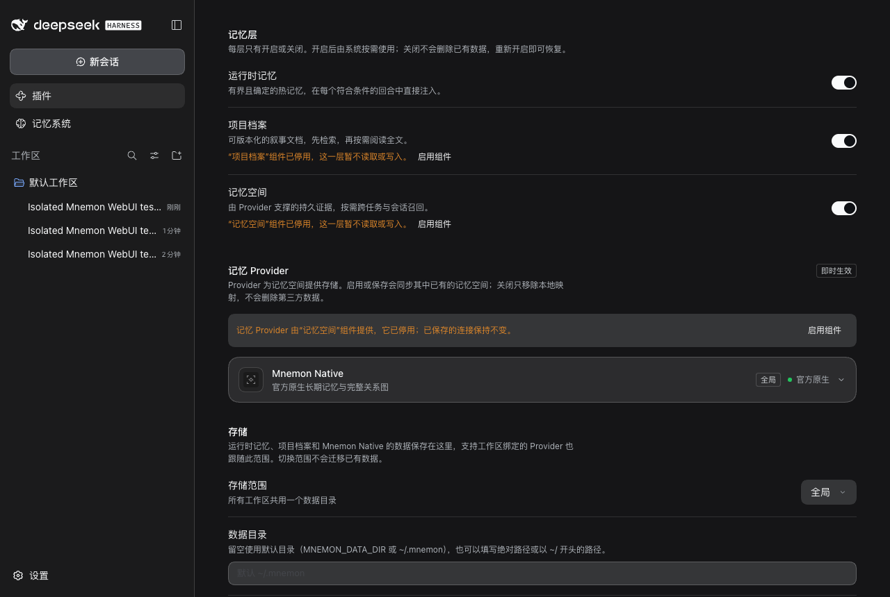 | 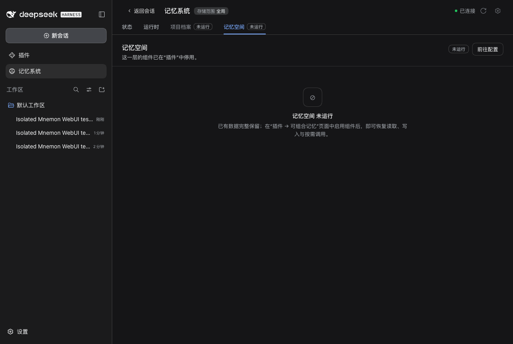 |

## 验证

- `pnpm run verify`：文档 2,216 个本地链接与 83 个锚点；确定性构建 42 个文件；各 workspace 包的构建、类型检查与测试（记忆空间 174 通过、2 个条件跳过，运行时 61，档案 39）；根测试 1,447 通过、6 个条件跳过；真实 Headless 激活（37 个工具）、旧设置导入与幂等重启、根停用门；打包 52 个文件，publint strict 与 attw 通过。
- `pnpm run release:intent`：变更说明覆盖所有改动的包。
- WebUI：在全新夹具上用脚本走查，截取浅色 9 个、深色 4 个状态，无控制台错误。同一流程也在内置浏览器中手动操作过，包括通过配置中的选择器验证主策略互斥。

## 限制

夹具的测试模型对每个回合都给出固定回复，因此截图只说明回合正常完成，不代表记忆带来的内容差异。DSH 组件列表中的 `cordis:group` 行仍显示为“已关闭”且开关无法使用（DSH #649），配置页现在在列表上方注明了这一点。主策略选项编辑器，以及 Starter 各组件的本地化行标题，留作后续工作。
