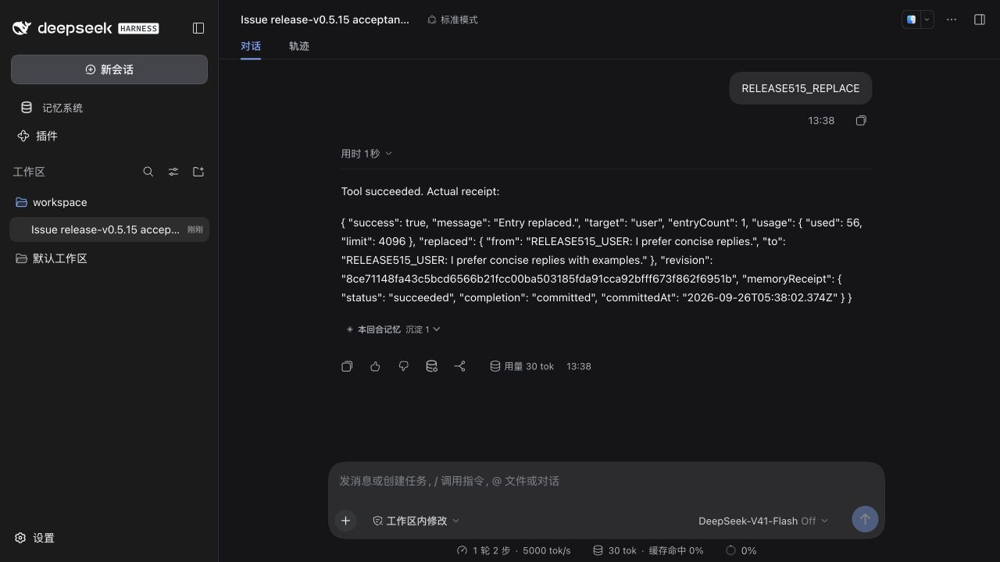
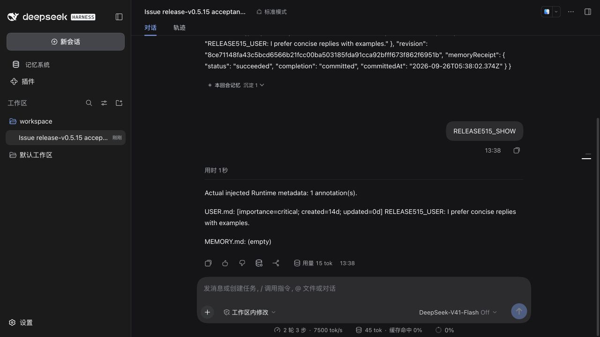
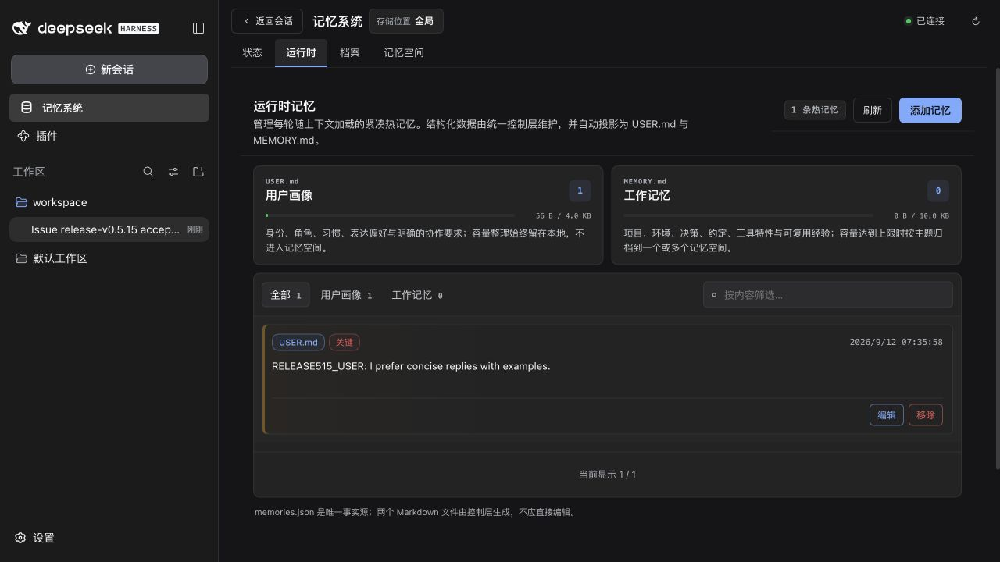

# v0.5.15 发布组合验证

[English](./README.md)

测试版本提交为 `d4dfa3b3`，包含已合并的 #282、#283、#284。环境为 macOS arm64、Node 24.20.0、pnpm 10.13.1、正式 DSH 0.1.7-rc.2 与官方 Mnemon CLI 0.2.9。十七个本地 tarball 安装进全新隔离 Profile，并同时启用 Scoped、Light Context 和 Auto Capture。版本与 SHA-256 见[验证清单](./verification.json)。后续证据提交只增加文档与夹具，不改变发布包内容。

## 真实 WebUI

模型端点为本地确定性夹具；它读取实际入站投影并选择真实 DSH 工具，工具、适配器和存储未被模拟。所有内容为合成数据，没有调用外部模型或使用个人记忆。

1. 在标准模式的临时工作区会话发送 `RELEASE515_REPLACE`。真实 `mnemon_runtime_memory` 收到 `target=user`、`branches: []`，返回 `success: true` 和已提交回执。
2. 发送 `RELEASE515_SHOW`。下一回合实际投影包含替换后的正文及 `[importance=critical; created=14d; updated=0d]`。
3. 打开运行时页面，核对关键 USER 记录；打开编辑弹窗后取消，刷新浏览器，再次打开页面，记录仍在。公开根选择器恰好命中一次，默认背景保持不透明。

[最小调用与回执](./wire.json) · [浏览器观察](./browser.json)







## 检查结果与限制

- 发布组合、已消费 changeset、文档、类型、确定性构建、Headless 启动/重启、包出口及内容检查通过。Root 解包体积为 1,374,746 字节，低于原有 1,376,000 字节上限。
- 本地插件测试 406 通过、2 跳过；Native CLI 集成及同 View 双目标归档实际执行。十六个独立插件仓库、十七个制品与外部 SDK/Client 组合检查通过。
- 本地 Root 测试 1,379 通过、7 跳过、1 失败：默认组合的 wall-time 为 5.24 秒，高于原有 5 秒门槛。单独重测的两种组合也超过 wall-time 门槛，CPU 断言均通过。保留失败记录，没有放宽阈值。
- 同一版本提交的[干净 CI](https://github.com/omdsh-dev/dsh-mnemon/actions/runs/36221228218)全部通过：集成测试 1,784 通过、11 跳过；两项性能测试合计 1.25 秒，并通过原始 CPU 与 wall-time 断言。Windows 路径检查、独立制品检查及 PR 规范检查通过。

可选在线模型、外部服务和 Teams/lifecycle 检查保留其跳过条件。本次 WebUI 是 macOS 验证，不代表 Windows WebUI 或在线模型质量；各缺陷的完整前后对照仍以对应 Issue 报告为准。

## 复现

按[皮肤钩子复现步骤](../issue-273-skin-hooks/README.zh-CN.md#复现)准备正式 rc.2 Profile 与当前版本的十七个 tarball，再启动本目录中的可复用夹具：

```sh
MNEMON_CLI_PATH=/absolute/verified/mnemon node docs/pr-assets/release-v0.5.15/serve-release.mjs \
  --profile /absolute/official-profile --artifacts /absolute/packed-artifacts \
  --state /absolute/empty-disposable-state
```

使用生成的私有连接信息打开 WebUI，按上述步骤操作。不要发布 `private.json` 或原始 Host 日志。使用 Ctrl-C 停止服务。
