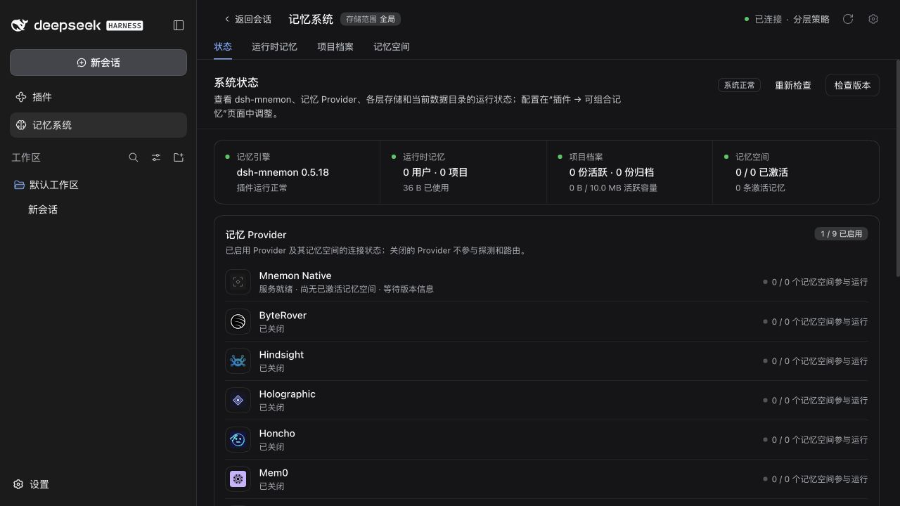
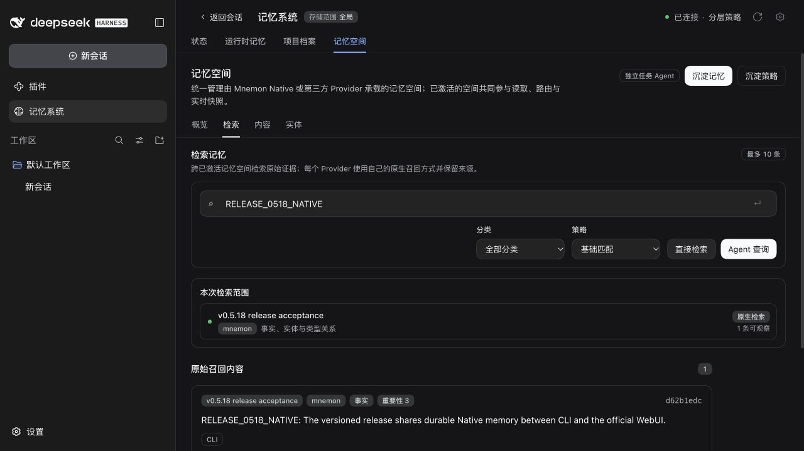

# v0.5.18 发布验收

[English](README.md)

2026-09-28，在 #306 基础上合入 #308 后验收。版本化候选为 `dsh-mnemon@0.5.18` 与 `dsh-mnemon-source-memory-spaces@0.5.12`，其余 16 个组件从 npm 安装 Starter 固定的版本。

## 真实官方 WebUI

使用未修改的 npm DSH `0.1.7-rc.2`、Node `24.20.0` 和全新隔离 profile：

1. 在未安装 Mnemon 时启动宿主。
2. 通过“添加插件”安装版本化候选。本地回环 registry 只提供两个变化的候选 tarball，其余包来自官方 npm registry。
3. 点击“立即启用”，进入记忆系统。页面显示 **dsh-mnemon 0.5.18／系统正常**，宿主未重启。
4. 通过 WebUI 新建并读取 `RELEASE_0518_ACCEPTANCE` Runtime 条目。
5. 通过 WebUI 创建并激活 Native 空间，用 Mnemon CLI `0.2.9` 写入 `RELEASE_0518_NATIVE` 并召回，再在官方 WebUI 中用基础检索读取同一条事实。

[制品摘要、安装版本与未变化的宿主 PID](validation.json)标识本次候选制品。profile、目录和记忆均为测试数据；本次安装验收不需要远程模型或第三方 Provider。

[Runtime 写入与读取](runtime.png)

## 验证与发布边界

`pnpm run release:check` 仅选中 Starter 和 Memory Spaces Source 发布。`pnpm run verify:package` 的包内容、13 个 Node 公开入口导入、类型声明、`publint` 和 `attw` 均通过。

发布 PR 和发布工作流运行完整 workspace 与独立打包插件验证。发布时冻结已合入 main 的 revision，先发布变化的 Source，再发布 Starter；回读 npm 制品，安装完整 18 包组合，验证真实 Registry 升级，最后创建 GitHub Release。这些截图展示版本化本地候选，本身不代表 npm 已发布。

[启用回归记录](../desktop-live-activation/README.zh-CN.md)还覆盖 Documents、停用再启用后的数据保留、Desktop 隔离 generation 依赖和真实 Electron CLI 执行。[Issue #305 验收](../issue-305-desktop-console/README.md)记录 npm Native 启动器与验证范围。
