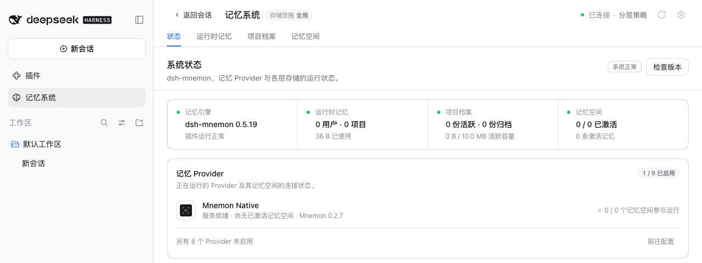
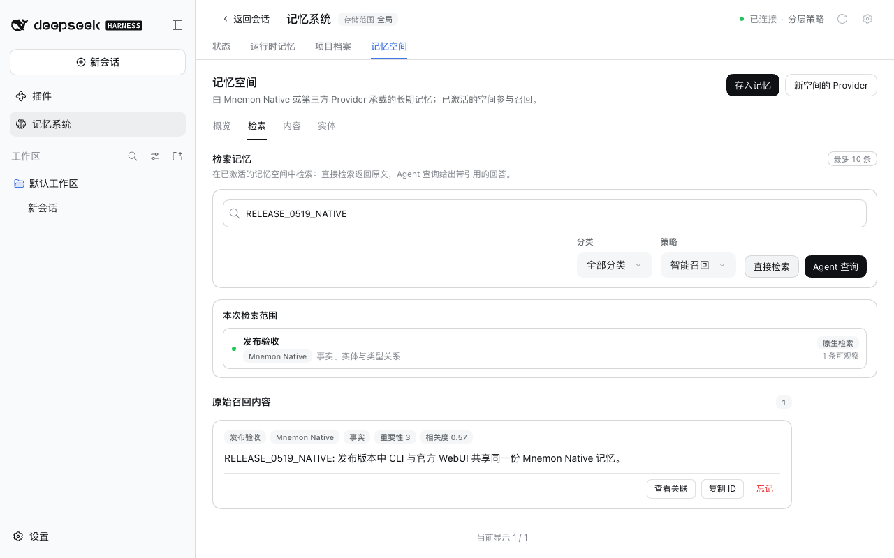

# v0.5.19 release acceptance

[中文](README.zh-CN.md)

Verified on 2026-09-29 (Asia/Shanghai), after merging #311 on top of #307. The versioned candidate is `dsh-mnemon@0.5.19` with `dsh-mnemon-source-runtime@0.5.11`, `dsh-mnemon-source-documents@0.5.8`, `dsh-mnemon-source-memory-spaces@0.5.13` and `dsh-mnemon-provider-mnemon-native@0.5.7`; the other 13 component packages come from npm at the Starter's pinned versions.

## Real official WebUI on both supported hosts

On unmodified npm DSH `0.2.0-rc.1` and `0.1.7-rc.2`, each with Node `24.19.0`, a fresh home and a fresh profile:

1. Started the host without Mnemon installed and opened **Plugins → Add plugin**.
2. Installed `dsh-mnemon`. DSH chose the install source itself (its speed check picked the mainland China mirror). A loopback registry answered with npm's real metadata plus the five changed versions, published a week earlier, so the unchanged packages came from npm's own tarballs.
3. Clicked **Enable now** and opened Memory System. [Status](status.png) reports **dsh-mnemon 0.5.19 / System nominal**, and Mnemon Native names **Mnemon 0.2.7**, without a host restart.
4. Added the `RELEASE_0519_RUNTIME` entry in Runtime memory and read it back after reloading the page: [Runtime](runtime.png).
5. Created the **发布验收** Mnemon Native space in the WebUI and activated it: [Memory Spaces](spaces.png). Wrote `RELEASE_0519_NATIVE` with Mnemon CLI `0.2.7`, recalled it with the CLI, then found the same fact with the WebUI's **Direct recall**: [Recall](recall.png).
6. On a second fresh profile per host, installed from the command line, the live DeepSeek model answered a first message and wrote two runtime entries ([reply](live-reply.png)); **Save to memory** handed the candidate to the task Agent, which saved it into a new memory space and returned a receipt ([receipt](live-receipt.png)).

Both hosts passed every step without a console error, and each host process was started once. [validation.json](validation.json) has the artifact hashes, the installed versions of all 18 packages and each host's results. Profiles and memories are synthetic; the API key reached DSH through the environment only.

## Validation and release boundary

`pnpm run release:check` selects the Starter, the three Sources and Mnemon Native for publication. The three Sources use Source-page SDK exports that first ship in this Starter, so their `dsh-mnemon` peer floor is `^0.5.19`. The lockfile changes only the new version specifiers, and pnpm 10.13.1 accepts it with `--frozen-lockfile`.

The release pull request and the publication workflow run the complete workspace and packed-plugin verification. Publication freezes the merged main revision, publishes the changed plugins before the Starter, reads back the npm artifacts, installs the complete 18-package combination and checks a real Registry upgrade before creating the GitHub release. These screenshots show the versioned local candidate; they do not by themselves certify npm publication.

Related evidence: [desktop windows (#310)](../issue-310-desktop-window/README.md), the [installation gallery](../../assets/install-v0.5.19/README.md) and the [live v0.5.19 gallery](../../assets/webui-v0.5.19/README.md).
