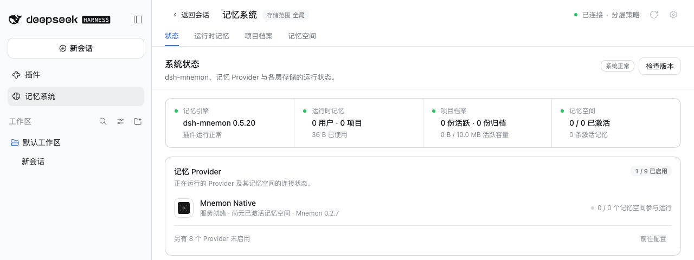
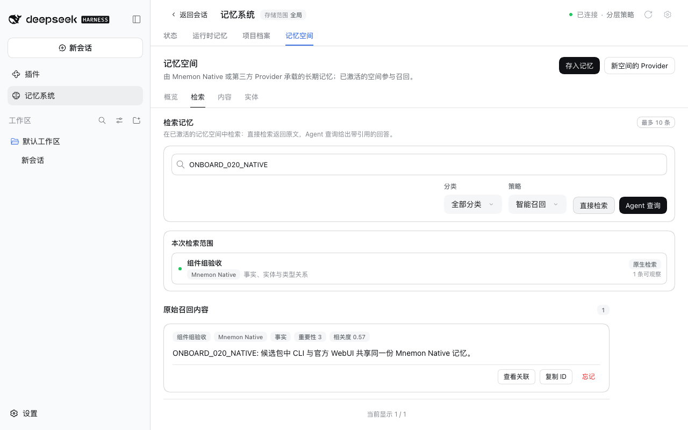

# v0.5.20 发布验收

[English](README.md)

2026-09-29（Asia/Shanghai）验证。被测包是 `pnpm release:version` 构建出的 `dsh-mnemon@0.5.20`；其余 17 个组件包按 Starter 固定的版本来自 npm，0.5.20 没有改变它们。被测包从 `94d1e84f`（#313 与 #314）构建。release PR 从 `4ea87e5b` 构建出同一个包，因为 #315 只改了文档：两个制品的 SHA-256 都是 `c446c553…`。

## 两个受支持宿主上的真实官方 WebUI

在未修改的 npm DSH `0.2.0-rc.1` 与 `0.1.7-rc.2` 上，各自使用 Node `24.19.0` 以及全新的 home、DSH home 与 pnpm store：

1. 在未安装 Mnemon 的情况下启动宿主，打开**插件 → 添加插件**。
2. 安装 `dsh-mnemon`。安装源由 DSH 自己选择（测速选中了中国大陆镜像源）。本地 registry 按发布一天后 npm 的样子返回真实元数据，并加入 0.5.20。从空的 pnpm store 开始，0.2.0-rc.1 安装用时 21.8 秒，0.1.7-rc.2 用时 13.2 秒。
3. 点击**立即启用**，约一秒内出现记忆系统，宿主无需重启。[状态页](status.png)显示 **dsh-mnemon 0.5.20 / 系统正常**，Mnemon Native 写出 **Mnemon 0.2.7**。
4. 在运行时记忆中添加一条记录，刷新页面后读回：[运行时记忆](runtime.png)。
5. 在 WebUI 中创建并激活 Mnemon Native 记忆空间：[记忆空间](spaces.png)。用 Mnemon CLI `0.2.7` 写入一条事实并用 CLI 召回，再用 WebUI 的**直接检索**找到同一条事实：[检索](recall.png)。

两个宿主的每一步都通过，没有宿主警告或控制台错误，每个宿主进程只启动一次。[validation.json](validation.json) 记录了包摘要与各宿主的结果。profile 与记忆均为合成数据。

## 升级与其他接入方式

[冷启动与升级验收](../starter-group-upgrade/README.zh-CN.md)用同一个包检查了命令行、Headless 与桌面版布局。它还检查了从 0.5.16 到 0.5.19 的升级（包括 Starter 行被关闭而卡住的 profile），以及 pnpm 发布当天的回退。[组件组验收记录](../starter-group-readiness/README.zh-CN.md)展示了改动前后的插件页。

## 校验与发布边界

`pnpm run release:check` 只选中 Starter 发布，没有组件包变化。没有插件使用新的 SDK 导出，因此 peer 下限不变，lockfile 也不变。release PR 与发布工作流会执行完整的工作区与打包插件校验。随后，发布流程冻结合并后的 main 修订，发布 Starter 并从 npm 读回，再安装完整的 18 个包组合并检查一次真实的 Registry 升级，最后才创建 GitHub Release。这些截图展示的是版本化的本地包，本身不代表 npm 发布已经完成。
