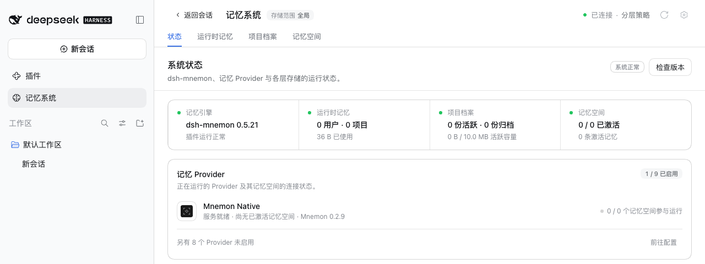
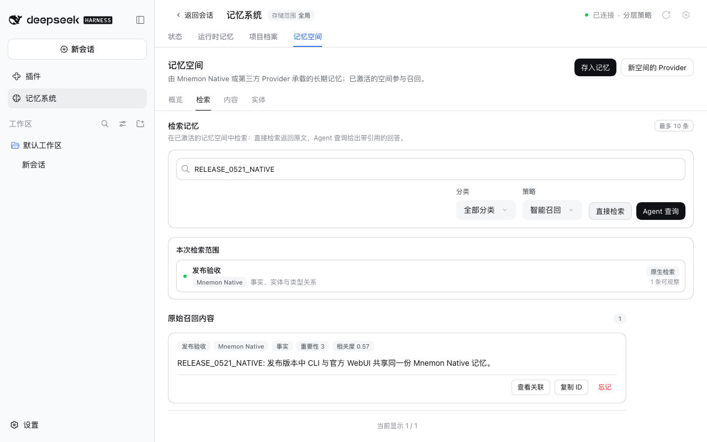

# v0.5.21 release acceptance

[中文](README.zh-CN.md)

Verified on 2026-10-01 (Asia/Shanghai). The packages under test are `dsh-mnemon@0.5.21`, `dsh-mnemon-source-memory-spaces@0.5.14` and `dsh-mnemon-provider-mnemon-native@0.5.8`, as `pnpm release:version` builds them from `main` `73beea9a`, which includes #321, #322 and #323. The other 15 component packages come from npm at the Starter's pinned versions, which 0.5.21 does not change.

## Real official WebUI on both supported hosts

On unmodified npm DSH `0.2.0-rc.2` (npm `latest` and `next`) and `0.1.7-rc.2`, each with Node `24.19.0` and a fresh home, DSH home and pnpm store:

1. Started the host without Mnemon installed and opened **Plugins → Add plugin**.
2. Installed `dsh-mnemon`. DSH chose the install source itself; its speed check picked the mainland China mirror. A loopback registry answered with npm's real metadata plus the three new versions. The profile then held dsh-mnemon 0.5.21, the Memory Spaces Source 0.5.14 and Mnemon Native 0.5.8, with the unchanged components at their pinned npm versions.
3. Clicked **Enable now**; the Memory System appeared without a host restart. [Status](status.png) reports **dsh-mnemon 0.5.21 / System nominal**, and Mnemon Native names **Mnemon 0.2.9**.
4. Added a Runtime memory entry and read it back after reloading the page: [Runtime](runtime.png).
5. Created and activated a Mnemon Native space in the WebUI: [Memory Spaces](spaces.png). Wrote a fact with Mnemon CLI `0.2.9`, recalled it with the CLI, then found the same fact with the WebUI's **Direct recall**: [Recall](recall.png).

Both hosts passed every step without a host warning or console error, and each host process was started once. [validation.json](validation.json) has the package digests and each host's results. Profiles and memories are synthetic.

## The fixes in this release

Each fix has its own before-and-after record on the WebUI:
- [Large Native Memory Spaces](../issue-320-native-store-dumps/README.md): a 900-insight space lists, draws and archives.
- [Idle review writes one layer](../issue-319-review-layers/README.md): a review pass no longer repeats a Document in working memory, and **Write runtime memory** can be switched off.
- [The fallback sidebar entry](../issue-318-sidebar-entry/README.md): it matches DSH's own panel rows.

## Validation and release boundary

`pnpm run release:check` confirms the Starter 0.5.21 on the `latest` tag, with a composition that pins the Memory Spaces Source 0.5.14 and Mnemon Native 0.5.8; publication computes the changed packages from the previous release. No plugin uses a new SDK export from the Starter, so no peer floor moves. The version bump changes only specifier lines in the lockfile, which pnpm 10.13.1, the CI version, accepts with `--frozen-lockfile`.

The release pull request and the publication workflow run the complete workspace and packed-plugin verification. Publication then:
- freezes the merged main revision;
- publishes the changed packages and reads them back from npm;
- installs the complete 18-package combination and checks a real Registry upgrade;
- creates the GitHub release.

These screenshots show the versioned local packages; they do not by themselves certify npm publication.
