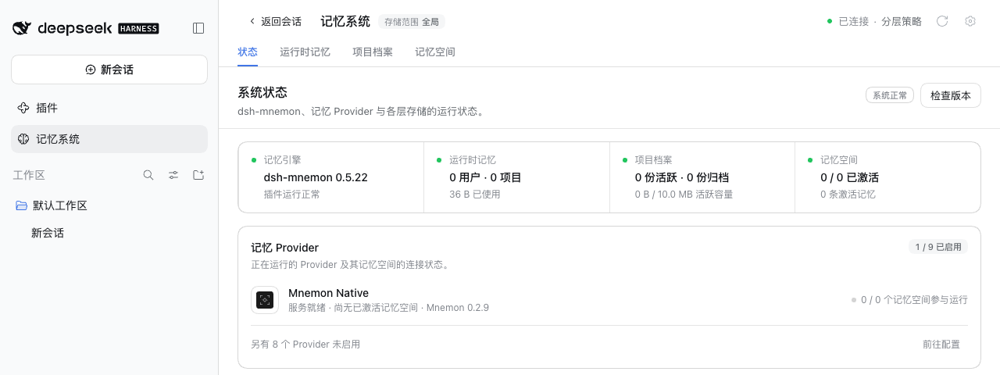
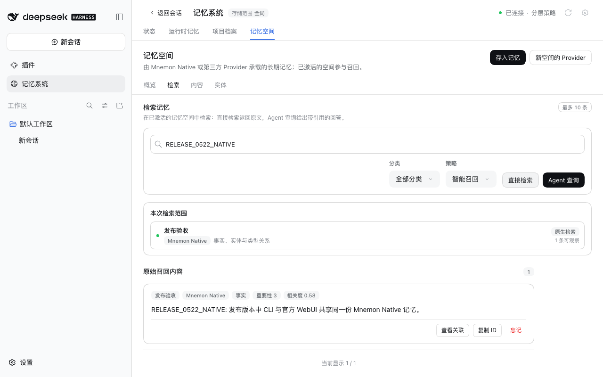

# v0.5.22 发布验收

[English](README.md)

验证日期为 2026-10-03（北京时间）。受测包为 `dsh-mnemon@0.5.22`，由 `pnpm release:version` 基于包含 #325、#326 与 #328 的 `main` `a69d1a51` 构建。17 个组件包按 Starter 锁定的版本来自 npm，0.5.22 未改动它们。

## 两个受支持宿主上的真实官方 WebUI

在未经修改的 npm DSH `0.2.0-rc.2`（npm `latest` 与 `next`）和 `0.1.7-rc.2` 上，分别使用 Node `24.19.0` 以及全新的 home、DSH home 与 pnpm store：

1. 在未安装 Mnemon 的情况下启动宿主，打开**插件 → 添加插件**。
2. 安装 `dsh-mnemon`。安装源由 DSH 自行选择，其测速选中了中国大陆镜像。本机 registry 返回 npm 的真实元数据，并附上新版本。安装后 profile 中为 dsh-mnemon 0.5.22，各组件为 npm 上锁定的版本。
3. 点击**立即启用**，记忆系统无需重启宿主即出现。[状态页](status.png)显示 **dsh-mnemon 0.5.22 / 系统正常**，Mnemon Native 显示 **Mnemon 0.2.9**。
4. 添加一条运行时记忆，刷新页面后读回：[运行时记忆](runtime.png)。
5. 在 WebUI 中创建并激活一个 Mnemon Native 空间：[记忆空间](spaces.png)。用 Mnemon CLI `0.2.9` 写入并召回一条事实，再用 WebUI 的**直接检索**找到同一条事实：[检索](recall.png)。
6. 打开**检查版本**：dsh-mnemon 显示已安装 0.5.22，更新方式为 DSH 自己的插件安装器。发布前 npm 的最新版本仍是 0.5.21，因此面板将 0.5.22 标为本地版本，不提供更新。**立即启用**之后没有出现重启提示，因为正在运行的就是已安装的版本。

两个宿主的每一步均通过，没有宿主警告或控制台错误，每个宿主进程只启动一次。[validation.json](validation.json) 记录了包摘要与各宿主的结果。profile 与记忆均为合成数据。

## 本版本的修复

每项修复另有修复前后记录：
- [通过 DSH 安装器更新](../version-update-through-dsh/README.zh-CN.md)：检查版本在桌面版的 Profile 中更新 dsh-mnemon，DSH 换上新页面后重新打开并显示结果，重启提示写明已安装与正在运行的版本。
- [Agent 未加载的会话标签页](../conversation-tab-workspace/README.zh-CN.md)：在两个宿主上，会话标签页与侧边栏模式下的状态页、项目档案、新建档案与运行时记忆均可使用。
- [要求用户查询的聊天模板与子代理](../issue-327-subagent-user-turn/README.zh-CN.md)：Ollama 0.33 模拟下的后台审查能从拒绝中恢复，正常路由发出的请求与之前相同。

## 验证与发布边界

`pnpm run release:check` 确认 Starter 0.5.22 使用 `latest` 标签，组合不变；发布流程会根据上一版本计算需要发布的包。没有插件使用 Starter 新增的 SDK 导出，因此 peer 下限不变。版本变更没有改动 lockfile，CI 使用的 pnpm 10.13.1 以 `--frozen-lockfile` 接受它。

发布 PR 与发布工作流会运行完整的工作区与打包插件验证。之后发布流程会：
- 冻结合并后的 main 修订；
- 发布变更的包并从 npm 读回；
- 安装完整的 18 包组合并检查真实 Registry 升级；
- 创建 GitHub Release。

这些截图展示的是版本化的本地包，本身不证明 npm 发布结果。
