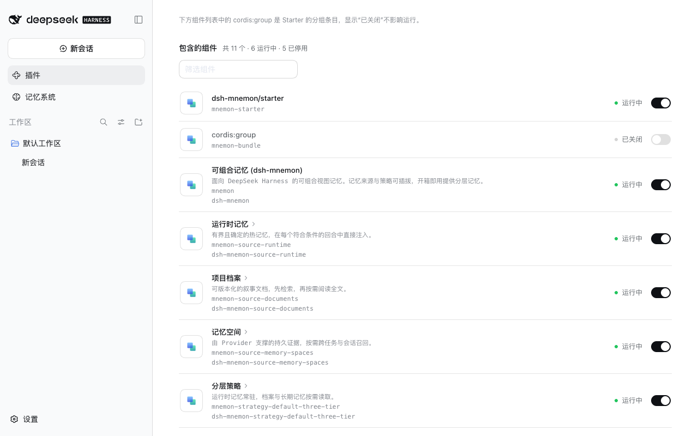
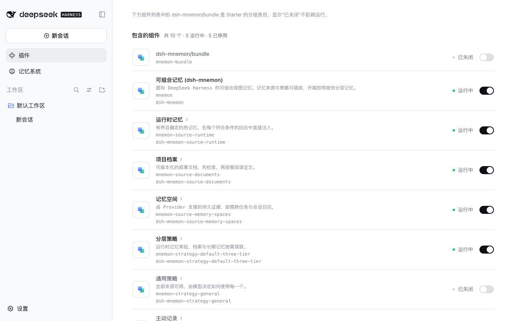
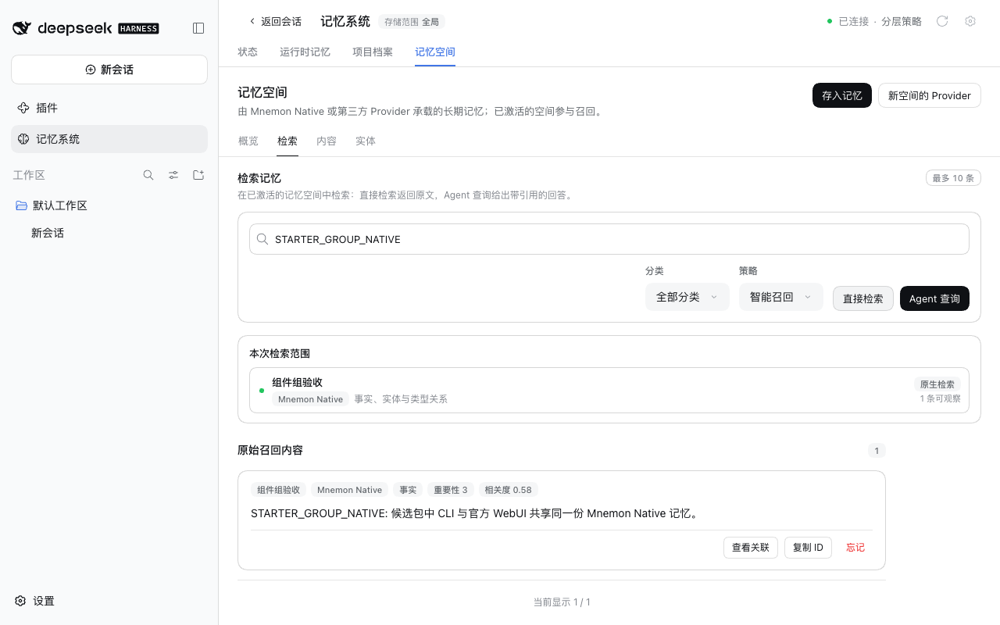

# Starter component group

[中文](README.zh-CN.md)

Verified on 2026-09-29 (Asia/Shanghai) with isolated profiles and synthetic data. All changes are in dsh-mnemon; DSH was not modified.

## Problem

In 0.5.18 and 0.5.19 the Starter had a separate readiness entry, `dsh-mnemon/starter` (`mnemon-starter`), which the Plugins page listed like any component, and the component group waited for its `mnemonStarterReady`. Turning that row off, for example to silence an error after an in-place update on DSH Desktop, left every component waiting: `dsh web` started without the Memory System, and the desktop app failed its start and offered to remove the plugin. The profile patch kept the off switch, so a reinstalled plugin waited again.

## Change

`mnemon-bundle` now names `dsh-mnemon/bundle`. It makes the Starter's dependency closure visible, the same preparation as before, and then mounts the children with the Loader's own `cordis:group`. The readiness row and its wait are gone, and a leftover `mnemon-starter` row in a profile patch matches nothing and is ignored. Entry IDs, the core gate, component choices, configuration targets and memory data are unchanged.

The row could not simply be hidden: DSH lists every entry that a bundle patch inserts with an id and has no hidden flag, and an entry without an id is recreated on every patch reload, which would restart all components.

| Published 0.5.19 on DSH 0.2.0-rc.1: 11 components, `dsh-mnemon/starter` first | Candidate on DSH 0.2.0-rc.1: 10 components, `dsh-mnemon/bundle` first |
| --- | --- |
|  |  |

English interface: [before](before-components-en.png) · [after](after-components-en.png). The container row still reads Off, as `cordis:group` did, because DSH's plugin inventory skips group entries ([upstream #649](https://github.com/dsh-external/issues/issues/649)).

## Acceptance

The candidate root tarball was installed through **Plugins → Add plugin** on fresh profiles of the published DSH 0.2.0-rc.1 and 0.1.7-rc.2, with the other 17 packages at their 0.5.19 pins, followed by **Enable now**:

| Check | DSH 0.2.0-rc.1 | DSH 0.1.7-rc.2 |
| --- | --- | --- |
| Enable now without a restart | The Memory System appears; no host warnings or console errors | Same |
| Component list | 10 total · 5 running · 5 off: the container and the four optional strategies | Same |
| Restart | No warnings | No warnings |
| Leftover `mnemon-starter: disabled: true` in the profile patch | Starts normally with the Memory System | Same |
| General strategy turned on, then off | Only that component changes | Not run |

A functional check on DSH 0.2.0-rc.1 kept one host process from installation to the end. Status reads nominal with Mnemon 0.2.7, and the page is byte-identical to the [v0.5.19 release acceptance](../release-v0.5.19/status.png). A Runtime entry is read back after a reload, a Native memory space is created and activated in the UI, and **Direct recall** finds a fact written by the Mnemon CLI.

`dsh web` profiles link packages with `nodeLinker: hoisted`, so all 18 packages sit in the profile's own `node_modules` and the preparation step finds them already visible. The layout that needs it is the desktop app's plugin generation, where the profile exposes only the root package. The activation fixture (`tests/bundle-activation.spec.mjs`) reproduces that layout with DSH's own boot and plugin manager: with the native group and no preparation, enabling the bundle after a cold start leaves four components failing to import on both hosts; with the component group, every enabled component starts. The fixture's other cases also pass on both hosts: another bundle's retained routes, the legacy `mnemon` gate and component choices, and the manager's component and bundle toggles.

## Trade-off: config schema export

`dsh web --dump-config-schema` walks only native `cordis:group` and `cordis:include` carriers. It now reports `mnemon-bundle` as an unrecognized tree carrier and leaves out Mnemon's component schemas. On stock profiles of both hosts the command already exits 1 with the same error for DSH's own agent presets (`preset-standard`, `preset-ptc`, `preset-minimal`, `preset-cordis`); nothing else changes. Runtime configuration, the Plugins page and profile patches are unaffected. The fixture asserts this exact diagnostic and fails on any other error.

## Updating

As before, an in-place update needs a restart: until then, enabling a component after an update from 0.5.18 or 0.5.19 reports `ERR_PACKAGE_PATH_NOT_EXPORTED` for `./bundle`. `dsh-mnemon/starter` stays exported for compositions that still insert it.

## Record

[validation.json](validation.json) holds the candidate digest, the base commits, the per-host results and the schema export comparison. The candidate keeps the unreleased package version 0.5.19; the changeset requests a patch release.
