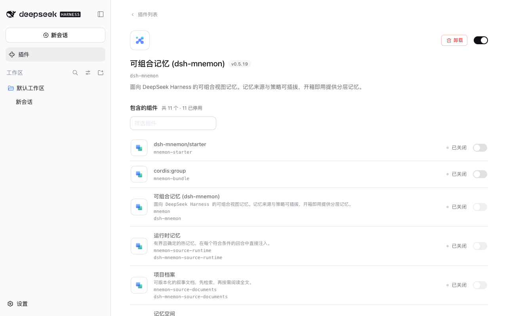
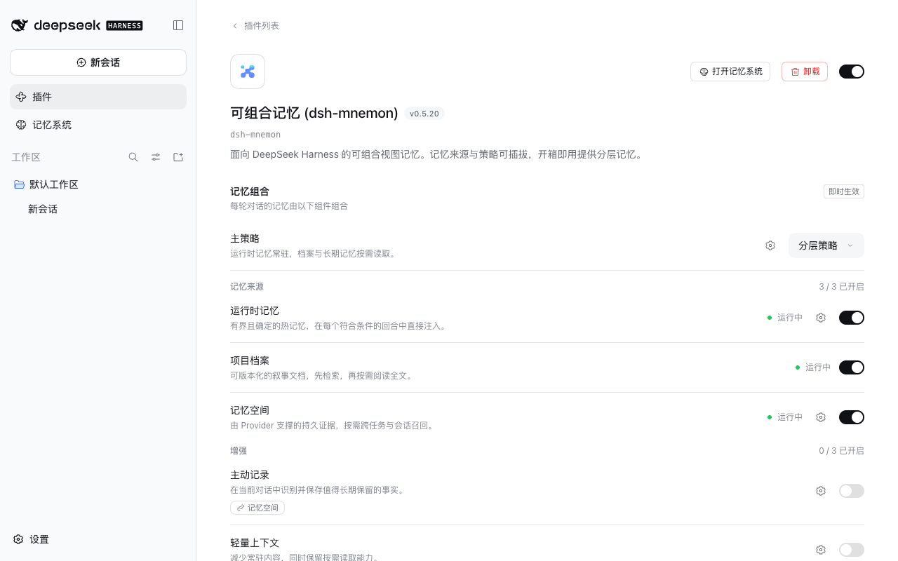
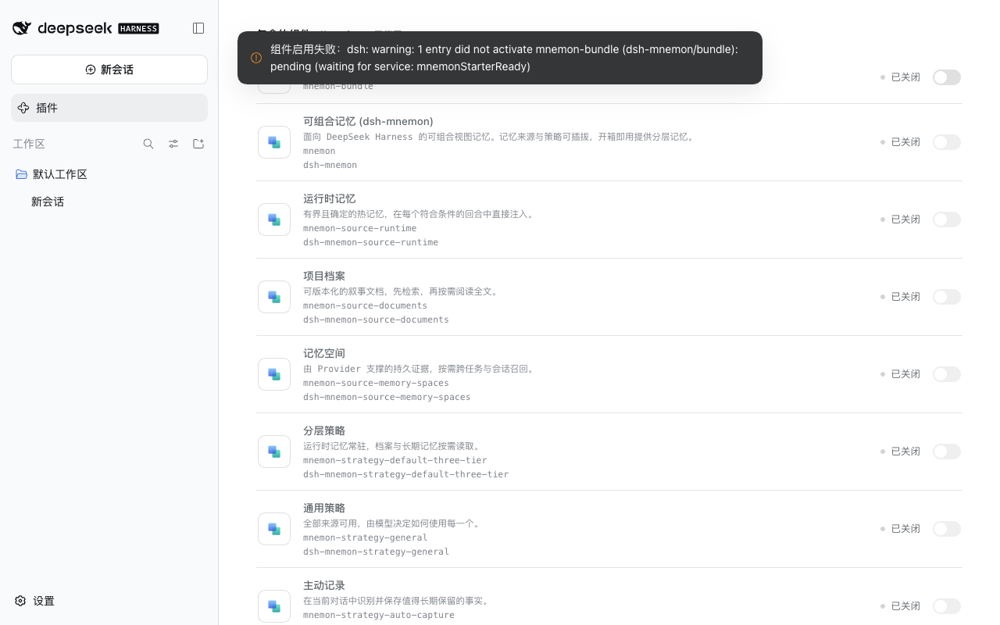

# 组件组的冷启动与升级验收

[English](README.md)

2026-09-29（Asia/Shanghai）针对 `main` 的 `94d1e84f`（#313 与 #314）验证，使用隔离 profile 与合成数据，未修改 DSH。

候选包是 `pnpm release:version` 构建出的 0.5.20，尚未发布。本地 registry 提供 npm 的真实元数据，把所有 dsh-mnemon 包的发布时间整体提前两天，并加入 0.5.20。这相当于发布一天后 npm 的样子：0.5.19 及其组件都已超过 pnpm 默认的一天发布期限。一个 pnpm 包装把 DSH 询问的 npm 与 npmmirror 源转到这个 registry。每次网页与命令行测试都从全新的 `HOME`、DSH home 与 pnpm store 开始。

## 新用户

| 方式 | DSH 0.2.0-rc.1 | DSH 0.1.7-rc.2 |
| --- | --- | --- |
| 网页：**插件 → 添加插件 → dsh-mnemon → 安装 → 立即启用** | 安装 21.8 秒，启用 0.8 秒，只有一个宿主进程 | 13.2 秒与 1.1 秒 |
| 命令行：`dsh plugin --profile web add dsh-mnemon`，再运行 `dsh web` | 安装 9 秒，启动 2 秒 | 8 秒与 1.3 秒 |
| Headless：`scripts/verify-headless-profile.mjs --package dsh-mnemon@0.5.20` | 通过 | 通过 |
| 桌面版布局：装进独立的 generation，profile 只链接根包，在插件列表中打开 | 记忆系统无需重启即出现 | 相同 |

每次测试结束时，状态页都显示 `dsh-mnemon 0.5.20`、系统正常，组件为 10 个、没有 Starter 行；宿主日志没有警告，控制台没有错误。网页测试还在界面中写入运行时记忆并在刷新后读回，创建并激活 Native 记忆空间，并用**直接检索**找到 Mnemon CLI 写入的事实。

**发布当天。** 0.5.20 发布一小时后，两个宿主上的普通安装都选中 0.5.19，可以正常使用。前提是 0.5.19 自身已满一天，也就是 09-29 17:31 UTC 之后。在那之前，由于 0.5.18 与 0.5.19 都在 09-28 发布，npm 给 pnpm 11 的是 0.5.17。09-28 20:12 UTC 对真实 npm 的检查结果：`dsh-mnemon` 与 `dsh-mnemon@latest` 都装到 0.5.17，DSH 0.2 会拒绝它；只有 `dsh-mnemon@0.5.19` 能立即装上。安装指南现在写明普通安装可能退回不止一个版本，并提醒 DSH 0.1.7 会不提示地装上较早的版本。

## 老用户

每个 profile 先运行旧版本，并在界面中写入一条运行时记忆，打开通用策略、关闭项目档案。0.5.18 与 0.5.19 的 profile 还带有 Starter 行，分别为打开或关闭。

| DSH | 旧版本 | 命令（之后重启） | 结果 |
| --- | --- | --- | --- |
| 0.1.7-rc.2 | 0.5.16 | `dsh plugin --profile web update dsh-mnemon` | 0.5.20，选择保留 |
| 0.1.7-rc.2 | 0.5.17 | 同上 | 运行时记忆与选择保留 |
| 0.1.7-rc.2 | 0.5.18，Starter 行打开 | 同上 | 保留；Starter 行消失 |
| 0.1.7-rc.2 | 0.5.19，Starter 行打开 | 同上 | 保留；Starter 行消失 |
| 0.1.7-rc.2 | 固定 0.5.19，Starter 行关闭 | `update --latest` | 从卡住的状态恢复 |
| 0.2.0-rc.1 | 0.5.19，Starter 行打开 | `update` | 保留；Starter 行消失 |
| 0.2.0-rc.1 | 固定 0.5.19，Starter 行关闭 | `update --latest` | 从卡住的状态恢复 |

所有升级都没有宿主警告。Headless 升级检查在 DSH 0.1.7-rc.2 上从 0.5.16、0.5.17、0.5.18、0.5.19 升级，在 0.2.0-rc.1 上从 0.5.19 升级，全部通过，运行时记忆文件逐字节不变。0.5.16 的网页标签页名为“运行时”，其运行时记忆的延续由这项检查覆盖。

**桌面版布局。** 在两个宿主上，关闭了 Starter 行的 0.5.19 generation 都会复现卡住的状态：没有记忆系统，11 个组件全部关闭，`mnemon-bundle` 在等待 `mnemonStarterReady`。把链接改到 0.5.20 的 generation 并重启后恢复。

| 卡在 0.5.19 | 换成 0.5.20 的 generation 并重启后 |
| --- | --- |
|  |  |

**更新后不重启。** DSH 运行期间改了链接，再切换一个组件时，加载器会保留运行中组件组的旧模块。这个组件组等待已被移除的就绪服务，记忆系统因此消失，直到重启 DSH：

安装指南、运维表格与兼容性参考现在都写明这条提示，处理方法是重启，而不是打开 0.5.20 已经没有的 Starter 开关。

[validation.json](validation.json) 记录了候选包摘要、registry 设置与全部结果。
