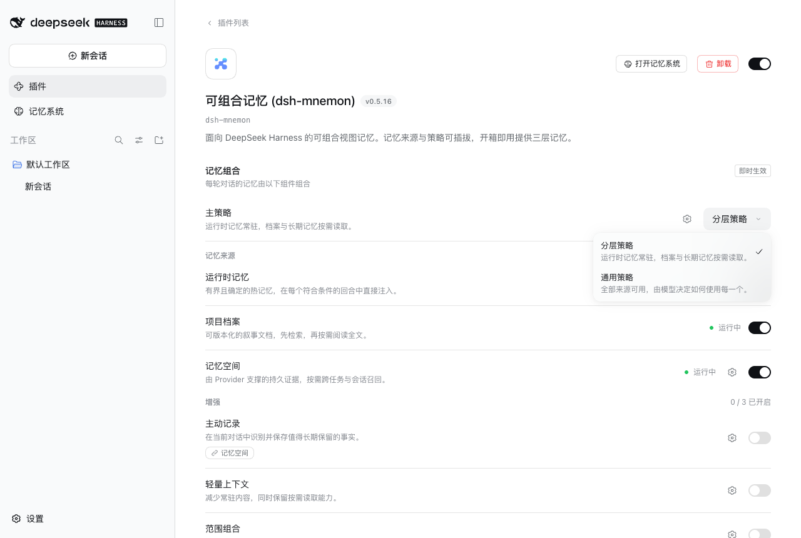
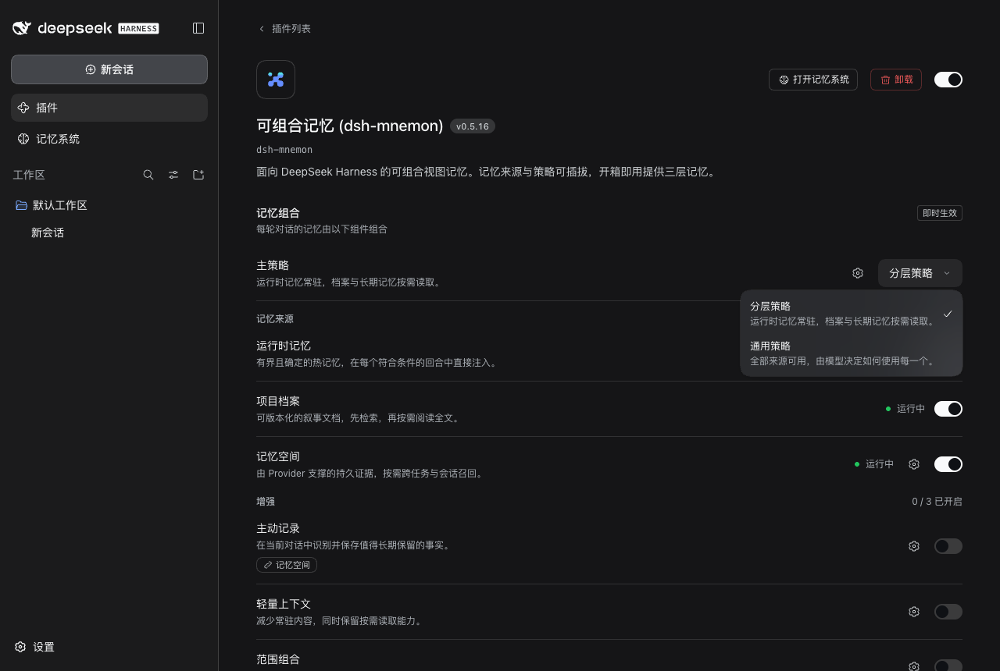
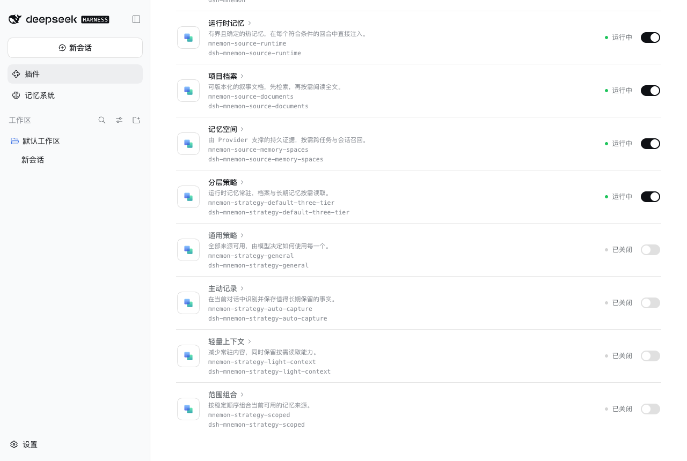

# Strategy names

[简体中文](./README.zh-CN.md)

Tested implementation: `852373e4`, captured with the data directory change stacked on it, which leaves the names unchanged. macOS 15.6, Node 25.1.0, published DSH 0.1.7-rc.2, headless Chrome at 1280 × 860. Each run walks an isolated WebUI fixture from the Starter's defaults with its test model. No personal memory or credentials were used.

## The main Strategy selector

The two main Strategies name what they do: the Layered strategy keeps runtime memory resident and reads Documents and Memory Spaces on demand; the General strategy offers every Source and lets the model decide.

| Light | Dark |
|---|---|
|  |  |

## DSH's component list

DSH names each row from the package's display metadata, so the list reads the same names as the selector.

## Verification

- `tests/plugin-metadata.spec.ts` holds each package's DSH metadata to its declaration; composition, enhancement and page tests use the new names.
- Full `pnpm run verify`, `pnpm run verify:plugins`, `pnpm run verify:docs` and `pnpm run release:intent` passed.
- WebUI: 2 light and 1 dark state captured by a scripted walk with no console errors.

## Limits

Type ids (`default-three-tier`, `general`), package names and configuration keys keep their names, so saved choices and data are unaffected. Published release notes keep the names they shipped with.
