# 桌面版一键更新

[English](./README.md) | [验证数据](./verification.json)

在桌面版中，**状态 → 检查版本**能发现更新的 dsh-mnemon，却无法更新：面板只显示“检测到 DSH Profile 安装，但当前找不到 pnpm 命令。”。原因是版本检查运行 PATH 上的 pnpm，而桌面版的 Host 没有。桌面版自带 pnpm，并把它交给 DSH 的插件管理器。本次改动让 Starter 通过这个插件管理器更新，于是由桌面版自带的 pnpm 完成安装。DSH 换上新页面后，记忆系统会重新打开并显示结果。在 DSH 重启之前，记忆系统每个页面的顶部都会提示已安装的版本与仍在运行的版本。

受测 revision：`b6e463569103c8380d6159ee4108e20d505a8da1`。基线：npm 上的 dsh-mnemon 0.5.20。验证于 2026-10-02（北京时间）：
- macOS 15.6 arm64 与 Node 24.19.0；
- 无头 Chrome 154，1280×800，zh-CN，浅色；
- 每次运行都使用全新的 home、DSH home 与 pnpm store。

profile 与记忆均为合成数据。

## 如何复现桌面版

已安装的 DeepSeek Harness 桌面版（0.2.0-rc.2）以 `runProfile({ packageManager })` 启动 Host。这个 `packageManager` 用应用自己的可执行文件运行 `Contents/Resources/runtime/pnpm/bin/pnpm.mjs`，DSH 的插件管理器会用它代替 PATH 上的 pnpm。

这些运行以同样的方式启动 npm 上的 DSH 0.2.0-rc.2：
- 一个小启动器调用 DSH 导出的 `runCli({ packageManager })`，传入桌面版 pnpm 11.7.0 的副本；
- Host 使用桌面版 Host 自己的 PATH，其中没有 pnpm。

没有直接驱动桌面版本身：它占用固定端口和用户的 profile，测试只读取了它的文件。

## 修复前：已发布的 0.5.20

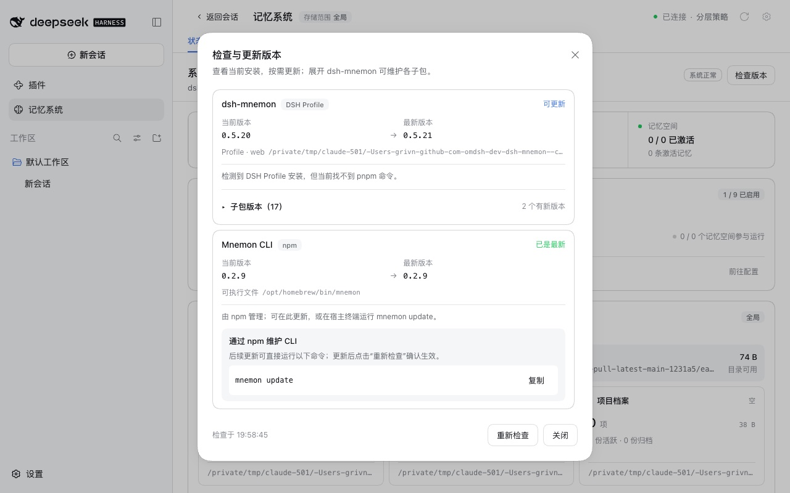

该行显示“可更新 0.5.20 → 0.5.21”与“检测到 DSH Profile 安装，但当前找不到 pnpm 命令。”，没有**更新**按钮，与反馈一致。

## 修复后：更新、重新打开、重启

本机 registry 返回 npm 的真实元数据，并把本 revision 的 Starter 提供两次：
- 作为 `0.5.21-dshupdate.0`，先安装它；
- 作为 `0.5.21`，替代 npm 上的 0.5.21。

版本检查读取的是 npm 自己的 `latest`，即 0.5.21，因此面板提供这次更新。把本 revision 作为 0.5.21 提供，更新后换上的页面就包含本次改动，与今后从本版本更新到更高版本的情形相同。

| 提供更新 | 更新中 |
|---|---|
| 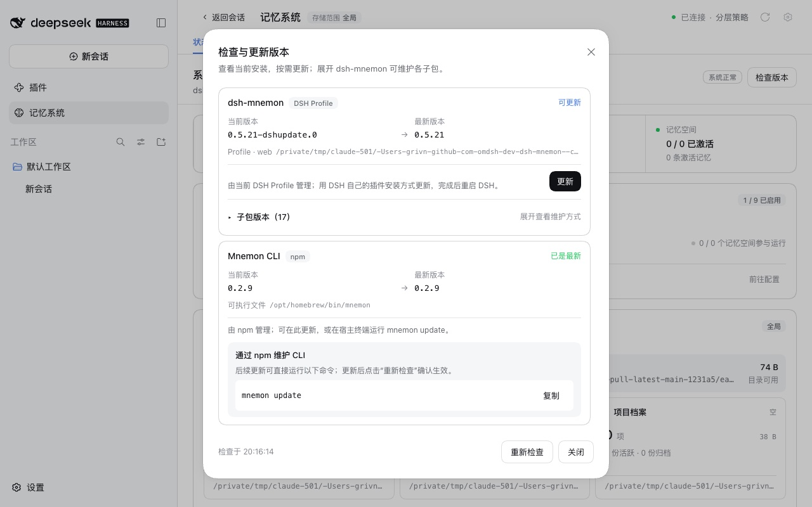 | 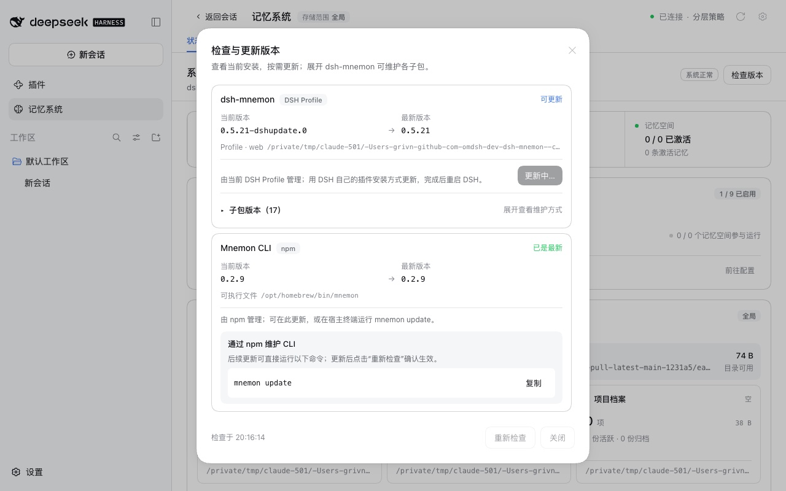 |

| 重新打开并显示结果 | 重启之后 |
|---|---|
|  | 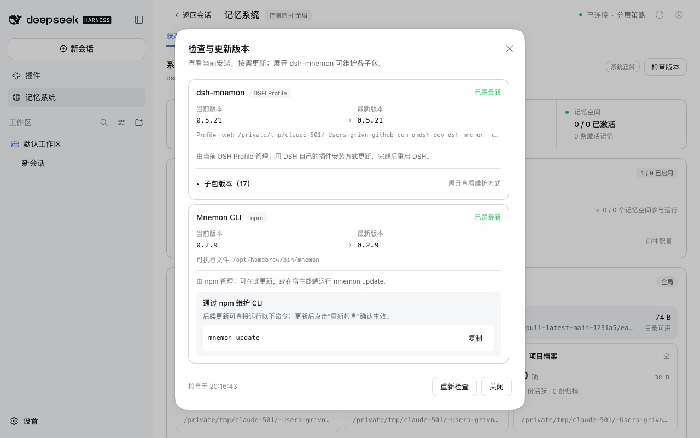 |

1. dsh-mnemon 一行显示“由当前 DSH Profile 管理；用 DSH 自己的插件安装方式更新，完成后重启 DSH。”与**更新**按钮。
2. DSH 的插件管理器用桌面版的 pnpm 运行 `pnpm add dsh-mnemon@0.5.21`，profile 日志结尾为 `Done in 384ms using pnpm v11.7.0`。profile 现在记录 `"dsh-mnemon": "0.5.21"`，node_modules 中为 0.5.21，已启用的 bundle 不变。
3. 更新请求发出 1.64 秒后，页面请求了 dsh-mnemon 新修订的 `client.js`，随后是各组件的客户端：DSH 的客户端 HMR 换上了新页面，而 Host 仍在运行旧代码。
4. 新页面重新打开状态页与**检查版本**。到 3.75 秒时，面板显示 **dsh-mnemon 已更新**与重启提示，该行为“待重启 · 0.5.21”。
5. 停止并重新启动 DSH 后，状态页显示 dsh-mnemon 0.5.21 / 系统正常；面板显示“已是最新”，没有重启提示，也没有**更新**按钮。

## 为什么要重新打开页面

DSH 发行版的 Web 组合（桌面版同样运行它）包含 `dsh-client-hmr`。它会轮询每个插件的 `lib/client.js`，把发生变化的插件换进已打开的页面，插件的 React 状态随之丢失。原地更新会改变 Starter 的文件，因此此前在点击约两秒后，记忆系统与面板就会关闭，往往早于更新报告结果。pnpm 路径同样如此。

以 npm 上真实的 0.5.21 为目标时，它的页面没有本次改动：更新安装了 npm 的 tarball，完整性校验值与 npm 一致；随后在 2.5 秒时页面回到 DSH 首页，记忆系统已关闭。

现在面板会在开始更新前，把 Starter 更新记在页面的 session storage 中：
- DSH 换上的新页面会重新打开记忆系统，状态页再重新打开面板；
- Host 报告该版本需要重启后，面板显示结果；
- Host 的版本检查最多等待 3 秒，让仍在收尾的更新完成，因此重新打开的面板能看到更新的结局。

## DSH 0.1.7-rc.2

DSH 0.1.7-rc.2 的 CLI 入口不接受启动器提供的包管理器，它的插件管理器运行 PATH 上的 pnpm。本次运行使用 `dsh web`，PATH 上为 pnpm 11.19.0：
- 更新经由 DSH 的插件管理器完成（`Done in 562ms using pnpm v11.19.0`）；
- 新页面在请求后 2.42 秒到达，面板在 3.70 秒前重新打开并显示结果；
- 重启后，面板显示“已是最新”。

## 没有任何包管理器时

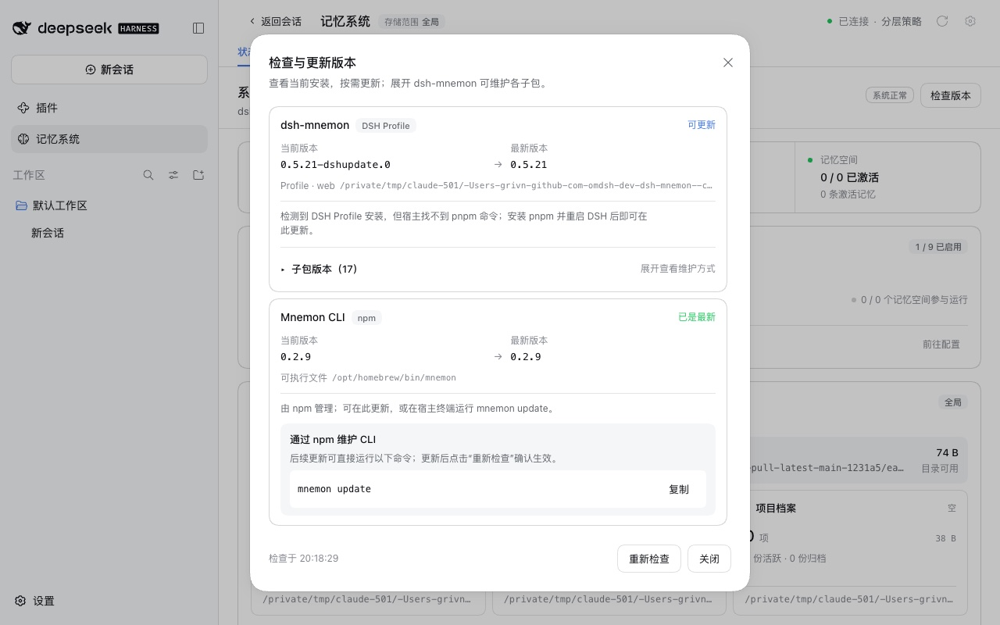

这里直接用 `dsh web` 启动 npm 上的 DSH 0.2.0-rc.2，没有启动器，PATH 上也没有 pnpm，此时 DSH 自己的插件页同样无法安装。该行显示“可更新”与“检测到 DSH Profile 安装，但宿主找不到 pnpm 命令；安装 pnpm 并重启 DSH 后即可在此更新。”，没有**更新**按钮。

## 单独安装的可选 Strategy

| 提供更新 | 已更新 |
|---|---|
| 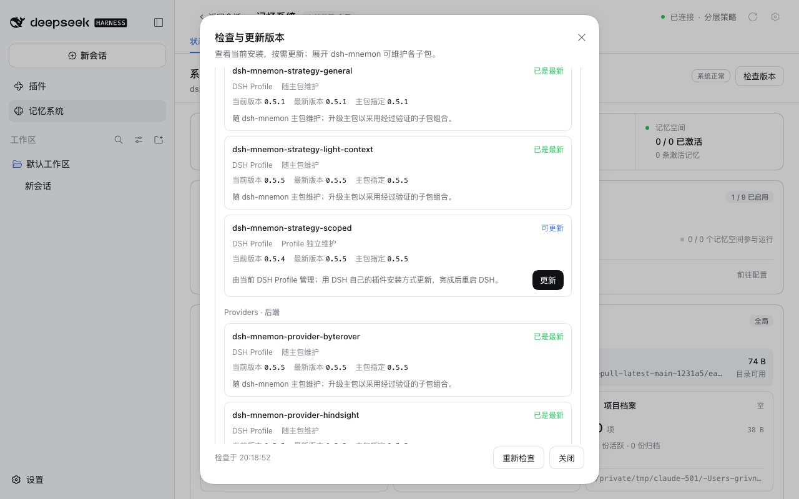 | 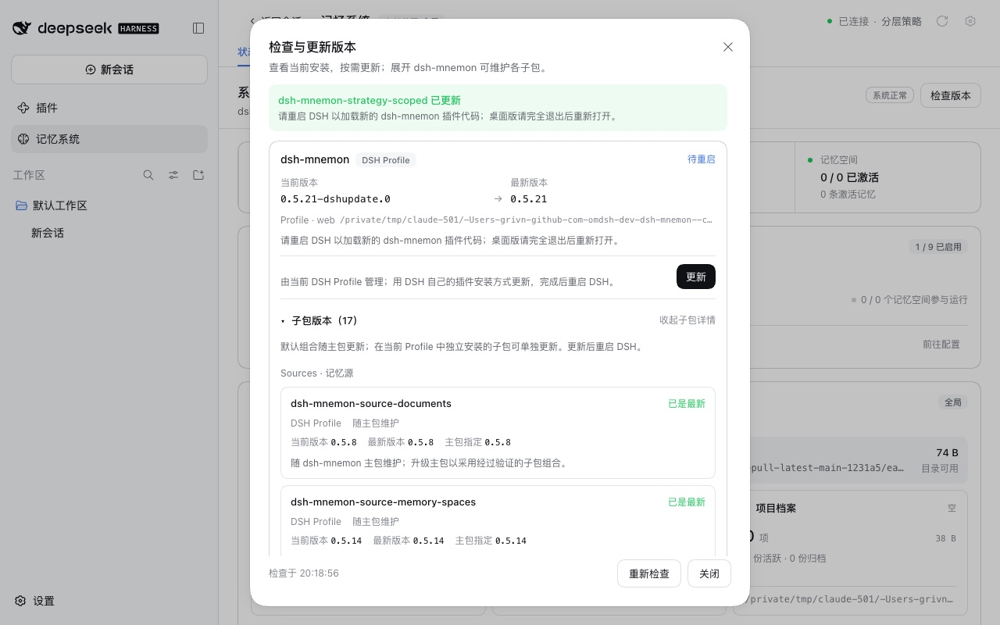 |

来自 npm 的 `dsh-mnemon-strategy-scoped@0.5.4` 通过打包版的 `dsh plugin add` 添加，是由 profile 独立维护的 DSH bundle（Profile 独立维护）。它的**更新**经由 DSH 的插件管理器升到 npm 上的 0.5.5（`Done in 267ms using pnpm v11.7.0`）。只有这个 Strategy 的页面发生变化，所以面板保持打开，已启用的 bundle 不变。

## 重启提醒

更新会替换已安装的文件，但在 DSH 重启之前，Host 仍运行它已加载的代码，而 DSH 已经换上新页面。Revision `375d1ba43fae7de1b82e9717ec69dadd1a8375db` 在记忆系统每个页面的顶部加了一条提示，写明已安装的版本与仍在运行的版本，状态页则显示正在运行的版本：
- Host 记下自己加载的版本，每次读取状态时与磁盘上的 Starter 比较，因此 `dsh plugin` 的更新同样会提示；
- **检查版本**也从磁盘读取已安装的 Starter。

这些运行使用该 revision 的构建，提供方式同上：先安装 `0.5.21-dshupdate.0`，同一构建作为 `0.5.21`。

| 检查版本更新 Starter 之后 | 重启之后 |
|---|---|
| 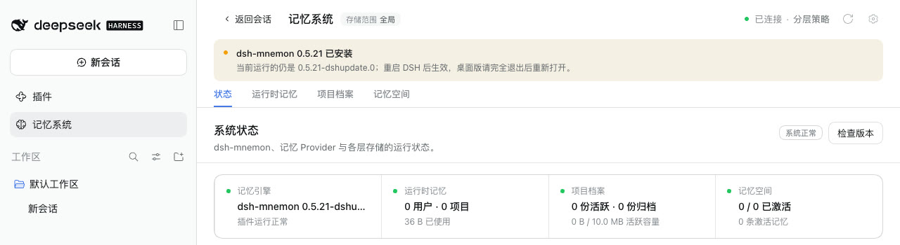 | 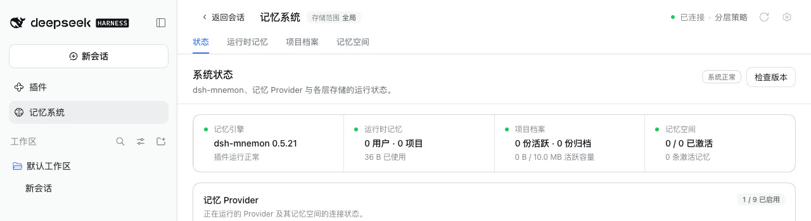 |

**检查版本，DSH 0.2.0-rc.2 加桌面版启动方式：**
- DSH 的插件管理器安装了 0.5.21（`Done in 598ms using pnpm v11.7.0`）。
- 状态页与运行时记忆页都显示 **dsh-mnemon 0.5.21 已安装** 与“当前运行的仍是 0.5.21-dshupdate.0；重启 DSH 后生效，桌面版请完全退出后重新打开。”。
- 记忆引擎卡片仍显示正在运行的 dsh-mnemon 0.5.21-dshupdate.0。检查版本显示“待重启”，当前版本 0.5.21，没有**更新**按钮。
- 重启之后提示消失，记忆引擎卡片显示 dsh-mnemon 0.5.21，面板显示“已是最新”。

**记忆系统打开时运行 `dsh plugin add`：**
- DSH 提供页面期间，在同一 profile 中运行桌面版方式的 `dsh plugin --profile web add dsh-mnemon@0.5.21`（`Done in 419ms using pnpm v11.7.0`）。
- 命令返回约 0.5 秒后，DSH 换上新的客户端，打开着的记忆系统关闭并回到 DSH 首页。这是 DSH 的客户端 HMR；面板的重新打开只覆盖从面板发起的更新。
- 从侧栏重新打开后，状态页与运行时记忆页显示同样的提示。检查版本显示“待重启”、当前版本 0.5.21，没有**更新**按钮，不会再次提供已经安装的版本。

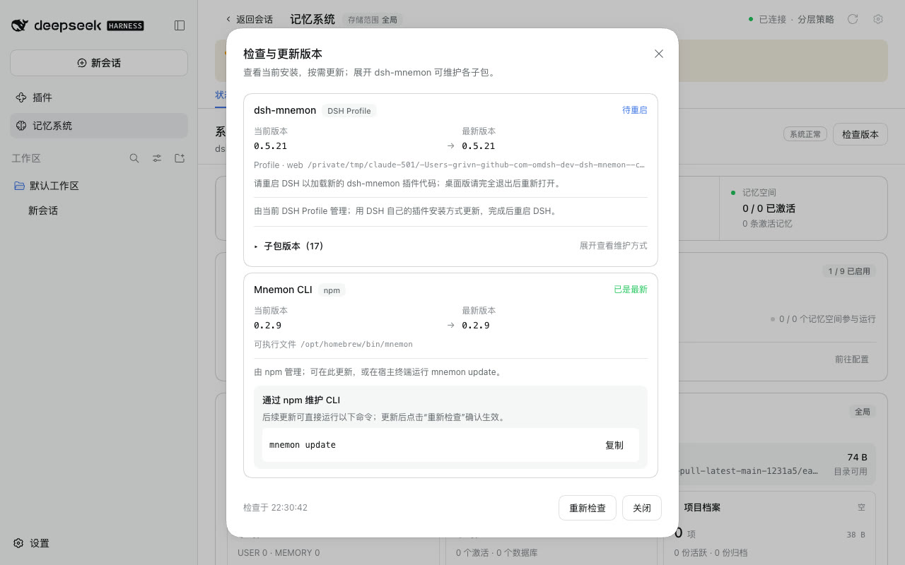

**回到正在运行的版本：**`dsh plugin add dsh-mnemon@0.5.21-dshupdate.0` 同样关闭了记忆系统。重新打开后没有提示，检查版本再次提供 0.5.21-dshupdate.0 → 0.5.21。

**从检查版本更新可选 Strategy：**
- 先单独添加 `dsh-mnemon-strategy-scoped@0.5.4`，再更新到 0.5.5（`Done in 312ms using pnpm v11.7.0`）。
- 状态页与运行时记忆页显示 **dsh-mnemon-strategy-scoped 已更新** 与“重启 DSH 后生效，桌面版请完全退出后重新打开。”。Starter 仍是 0.5.21-dshupdate.0。
- 重启之后提示消失。

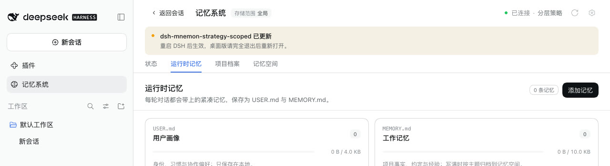

**DSH 0.1.7-rc.2：**`dsh web`，PATH 上有 pnpm 11.19.0。
- 检查版本通过 DSH 的插件管理器更新了 Starter（`Done in 419ms using pnpm v11.19.0`）。
- 状态页与运行时记忆页出现同样的提示。
- 重启之后提示消失，记忆引擎卡片显示 0.5.21。

所有运行都没有控制台错误。

## 设计复核

对本 PR 的独立复核没有发现破坏现有设计或契约的地方，但指出了五处值得修正的行为，都已在 `f395626a87bbbc5fea8baef4252f7bf369880084` 中修正：
- **失败信息。** 安装失败时，面板显示的是 pnpm 输出的第一行，往往是重试警告，真正的 `ERR_PNPM_*` 行被藏起来了。现在面板显示错误行、DSH 判断出的失败类别和 DSH 的日志路径。
- **安装失败留下的文件。** 安装失败时，DSH 会恢复 Profile 的 `package.json` 与锁文件，但已下载的文件可能留下。“检查版本”此前读取 `node_modules`，失败的更新可能看起来已安装、待重启。现在 Starter 和 Profile 单独添加的包，都以 Profile 记录的精确版本为当前版本，`node_modules` 作为后备。
- **重新打开的面板。** DSH 换上的新页面此前也依据上述状态判断成败。现在 Host 记住上一次更新的结果，并随每次检查返回，重新打开的面板显示这次的成功或错误。
- **退回原版本的包。** 在面板中更新的 Strategy，之后用 `dsh plugin` 退回原版本，重启前提示仍会列出它。现在每次更新都会记住被替换的版本。
- **重启后刷新。** 面板一直开着、DSH 重启后，10 分钟内刷新页面会再次打开面板。现在状态页先等待 Host 的回答；DSH 已运行更新后的版本且没有待重启的内容时，丢弃这条记录。

上述实测在该 revision 上以相同环境重跑：
- DSH 0.2.0-rc.2 与 0.1.7-rc.2 上从检查版本更新：重启前显示提示和“待重启 · 0.5.21”，重启后没有提示、显示“已是最新”。
- `dsh plugin add` 以及退回原版本：结果与此前相同。
- 更新单独添加的 Strategy 并重启：结果与此前相同。
- **真实的失败。** Profile 的安装源没有 0.5.21，而 npm 列出了它。点击“更新”失败，面板显示：

  `DSH could not install dsh-mnemon@0.5.21: operation-error (no-matching-version: [ERR_PNPM_NO_MATCHING_VERSION] No matching version found for dsh-mnemon@0.5.21 while fetching it from http://127.0.0.1:<端口>/); log: <profile>/.plugin-manager/logs/<operation>/pnpm.log`

  之后没有提示，“检查版本”仍显示“可更新 · 0.5.21-dshupdate.0”并提供**更新**。

所有运行都没有控制台错误。

## 自动检查

`pnpm run verify` 在受测 revision 上通过，覆盖：
- 文档（2,965 个本地链接）、类型检查与确定性构建；
- 全部 17 个插件的构建、类型检查与测试；
- 根测试：113 个文件，1,578 通过，6 跳过；
- Headless 激活与公开入口、publint 和 attw；
- 包内容为 1,506,720 字节（解压后），预算调整为 1,509,000。

在提醒所在的 revision 上，`pnpm run verify` 再次通过：文档 2,997 个本地链接，根测试 113 个文件、1,584 通过、6 跳过，包内容为 1,511,189 字节（解压后），预算调整为 1,515,000。

在设计复核后的 revision `f395626a` 上同样通过：根测试 113 个文件、1,592 通过、6 跳过，文档 2,997 个本地链接，包内容为 1,514,466 字节（解压后），预算调整为 1,517,000。新增测试覆盖：失败时的错误行与日志；安装失败留下文件时仍以 Profile 记录的版本为准，并报告失败；向换上的页面报告已完成的更新；退回被替换版本的包；重新打开的面板显示 Host 报告的结果并忽略更早的结果；DSH 已重启到更新后的版本时，状态页不再打开面板。

新增的 Host 测试覆盖：
- PATH 上没有 pnpm 时走 DSH 路径，且 PATH 上有 pnpm 时仍优先走 DSH；
- 精确版本与 `enabled: false`；
- 从不写入其他 profile；
- 没有插件管理器时走 pnpm，没有任何包管理器时不提供更新；
- 启动器不提供包管理器而 PATH 上有 pnpm 时走 DSH 路径；
- 失败原因：诊断的第一行、不兼容版本所需的 DSH，以及安装器直接抛错；
- 版本不一致，以及等待更新收尾的检查；
- Strategy bundle 走 DSH，而不是 bundle 的包仍走 pnpm。

新增的 Client 测试覆盖：
- 记录：Starter 更新时写入、成功后保留、关闭或失败时清除，CLI 更新不写入；
- 重新打开的面板只显示 Host 报告的结果，不额外声称更新；
- 仅在记录较新时重新打开工作台；
- 工作台中状态页重新打开面板。

新增的提醒测试覆盖：
- 重启状态：无论以何种方式安装的 Starter，以及检查版本单独更新的包；
- `dsh plugin` 安装的 Starter：检查版本显示为已安装、待重启，不再提供更新；
- 磁盘上的 Starter 回到正在运行的版本后不再提示；
- 每个页面读取的状态带有正在运行的版本与已安装的更新；
- 每个页面都显示提示，分别针对 Starter 与子包，其余情况不显示。

## 限制

- 桌面版通过相同的 `packageManager` 约定、用 npm DSH 0.2.0-rc.2 与桌面版 pnpm 的副本复现，没有直接驱动打包后的应用。
- 0.2.0-rc.2 与 0.1.7-rc.2 上的 Starter 更新安装的是作为 0.5.21 提供的本 revision，以便在没有更新版本的情况下展示页面替换；另一次运行安装的是 npm 上真实的 0.5.21，其页面没有重新打开的逻辑。
- 重新打开从包含本次改动的版本起才生效。0.5.21 及更早的版本在桌面版中仍需在插件页移除并重新安装一次，指南中已说明。
- 实测使用默认的侧栏布局。内置布局通过同一个工作台入口重新打开，由单元测试覆盖。
- 没有 session storage 时更新照常进行，只是不会重新打开。
- `dsh plugin` 安装更新后，DSH 的客户端 HMR 会关闭打开着的记忆系统，再次打开后才显示提示。
- DSH 插件页只能先移除再重新安装，这条路径没有实测。
- 只有 Starter 会与正在运行的版本比较。在检查版本之外更新的其他包不会列出。
